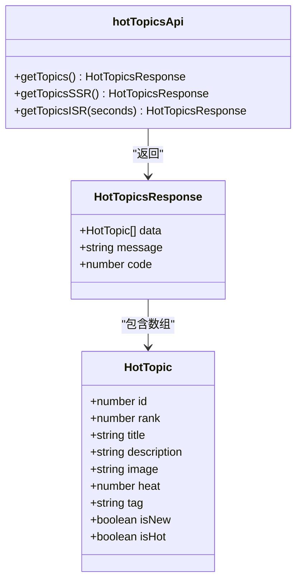
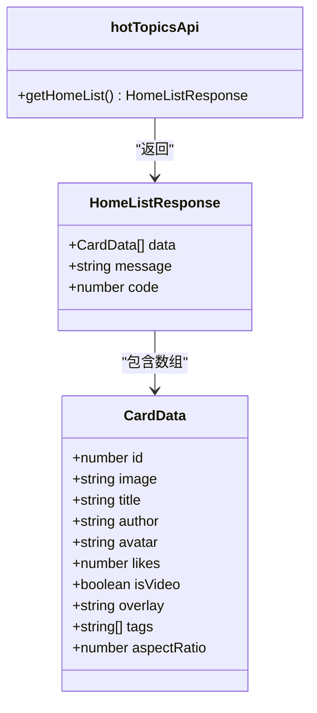
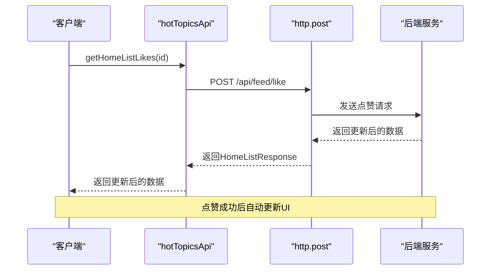
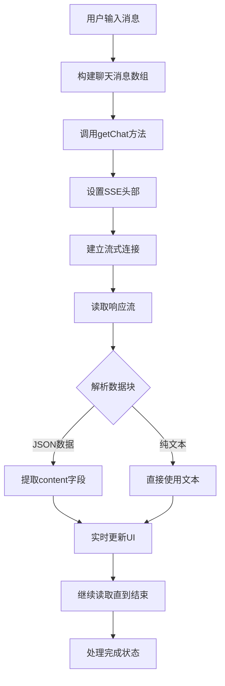
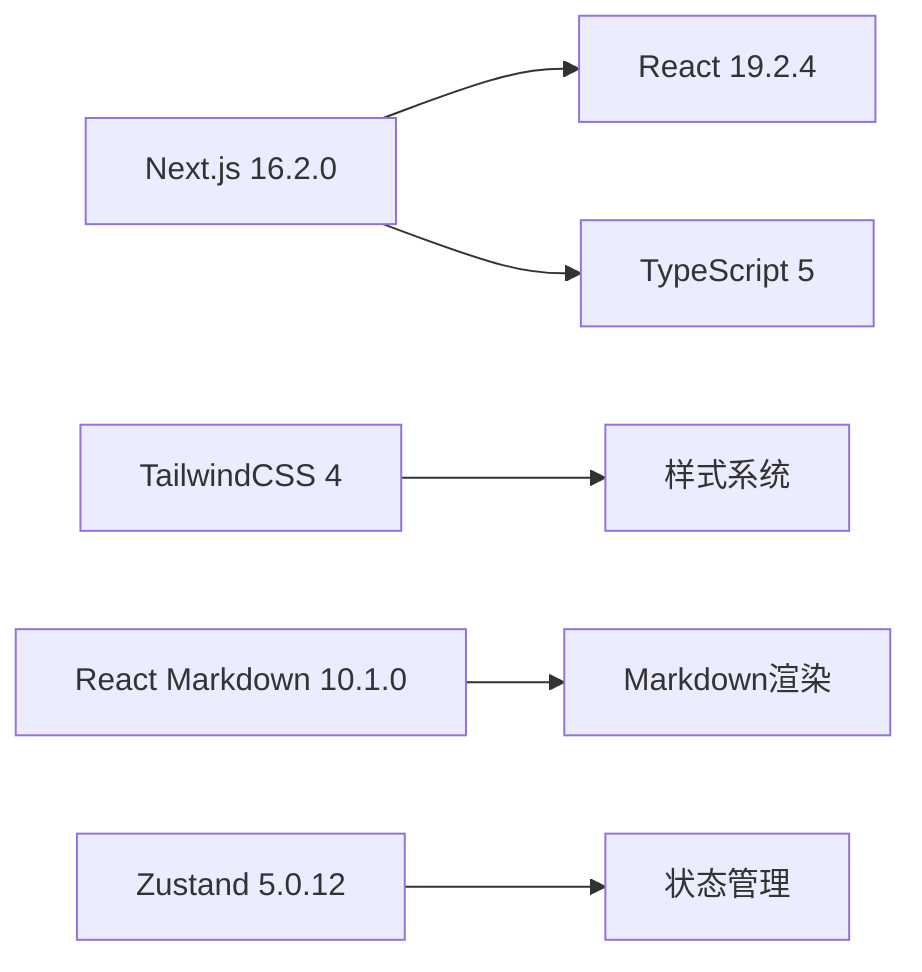
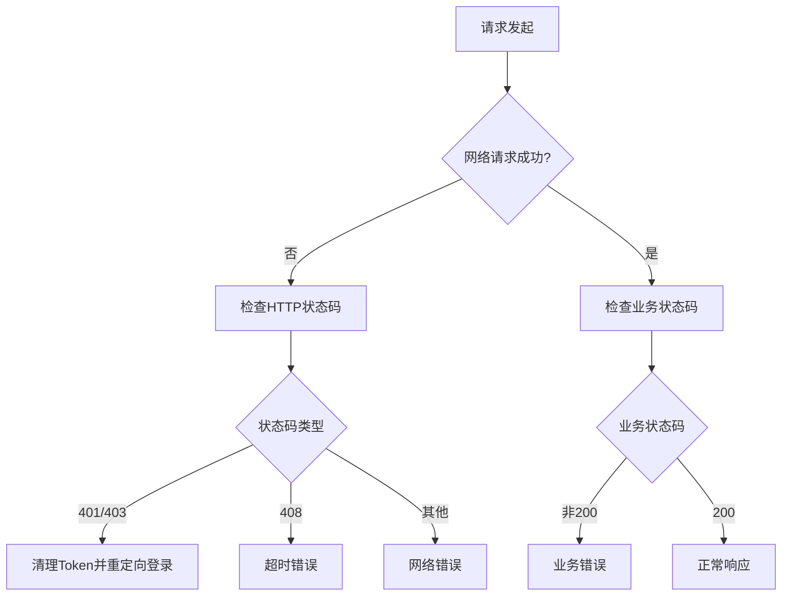

# API接口定义

<cite>
**本文档引用的文件**
- [api.ts](file://src/api/api.ts)
- [request.ts](file://src/api/request.ts)
- [feed.action.ts](file://src/actions/feed.action.ts)
- [page.tsx](file://src/app/aichat/page.tsx)
- [page.tsx](file://src/app/discover/page.tsx)
- [page.tsx](file://src/app/discover-csr/page.tsx)
- [WaterfallCard.tsx](file://src/components/WaterfallCard.tsx)
- [next.config.ts](file://next.config.ts)
- [package.json](file://package.json)
</cite>

## 目录
1. [简介](#简介)
2. [项目结构](#项目结构)
3. [核心组件](#核心组件)
4. [架构概览](#架构概览)
5. [详细组件分析](#详细组件分析)
6. [依赖关系分析](#依赖关系分析)
7. [性能考虑](#性能考虑)
8. [故障排除指南](#故障排除指南)
9. [结论](#结论)

## 简介

本项目是一个基于Next.js 16.2.0的现代化Web应用，实现了完整的API接口体系。本文档详细说明了所有已实现的API端点，包括热搜列表、首页数据流、点赞功能和聊天接口。项目采用统一的API封装层，支持客户端渲染(CSR)和服务器端渲染(SSR)，并提供了完整的TypeScript类型定义和错误处理机制。

## 项目结构

项目采用模块化的文件组织方式，主要API相关文件分布如下：

```mermaid
graph TB
subgraph "API层"
A[api.ts<br/>接口定义]
B[request.ts<br/>请求封装]
end
subgraph "页面层"
C[discover/page.tsx<br/>热搜页面(SSR)]
D[discover-csr/page.tsx<br/>热搜页面(CSR)]
E[aichat/page.tsx<br/>聊天页面]
F[WaterfallCard.tsx<br/>瀑布流卡片]
end
subgraph "动作层"
G[feed.action.ts<br/>Server Actions]
end
subgraph "配置层"
H[next.config.ts<br/>Next.js配置]
I[package.json<br/>项目依赖]
end
A --> B
C --> A
D --> A
E --> A
F --> A
G --> B
H --> A
I --> A
```

**图表来源**
- [api.ts:1-128](file://src/api/api.ts#L1-L128)
- [request.ts:1-455](file://src/api/request.ts#L1-L455)
- [page.tsx:1-183](file://src/app/discover/page.tsx#L1-L183)

**章节来源**
- [api.ts:1-128](file://src/api/api.ts#L1-L128)
- [request.ts:1-455](file://src/api/request.ts#L1-L455)
- [next.config.ts:1-76](file://next.config.ts#L1-L76)

## 核心组件

### API接口定义模块

项目的核心API接口定义集中在`src/api/api.ts`文件中，提供了统一的接口封装和类型定义。

### 请求封装模块

`src/api/request.ts`文件实现了完整的HTTP请求封装，支持以下特性：
- 统一的错误处理机制
- 超时控制和中断处理
- 请求/响应拦截器
- 客户端和服务器端适配
- 流式响应处理

### 类型定义系统

项目定义了完整的TypeScript类型系统，确保类型安全和开发体验：

**章节来源**
- [api.ts:10-39](file://src/api/api.ts#L10-L39)
- [request.ts:11-31](file://src/api/request.ts#L11-L31)

## 架构概览

项目采用分层架构设计，各层职责明确：

```mermaid
graph TB
subgraph "表现层"
A[Discover Page(SSR)]
B[Discover CSR(Page)]
C[AI Chat Page]
D[Waterfall Card]
end
subgraph "接口层"
E[hotTopicsApi]
F[userApi - 示例]
G[externalApi - 示例]
end
subgraph "请求层"
H[http.get/post/put/patch/delete]
I[http.ssrGet]
J[http.stream]
end
subgraph "网络层"
K[Next.js Rewrites]
L[Backend API]
end
A --> E
B --> E
C --> E
D --> E
E --> H
F --> H
G --> H
H --> I
H --> J
I --> K
J --> K
K --> L
```

**图表来源**
- [api.ts:44-81](file://src/api/api.ts#L44-L81)
- [request.ts:265-346](file://src/api/request.ts#L265-L346)
- [next.config.ts:30-44](file://next.config.ts#L30-L44)

## 详细组件分析

### 热搜列表接口

#### 接口定义



**图表来源**
- [api.ts:10-26](file://src/api/api.ts#L10-L26)
- [api.ts:44-62](file://src/api/api.ts#L44-L62)

#### 接口规范

| 接口名称 | 方法 | URL路径 | 描述 |
|---------|------|---------|------|
| 获取热搜列表(CSR) | GET | `/api/discover/crs/list` | 客户端渲染获取热搜列表 |
| 获取热搜列表(SSR) | GET | `/api/discover/list` | 服务器端渲染获取热搜列表 |
| 获取热搜列表(ISR) | GET | `/api/hot-topics` | 增量静态再生获取热搜列表 |

#### 请求参数

**getTopics()**
- 无请求参数
- 返回格式：`HotTopicsResponse`

**getTopicsSSR()**
- 无请求参数
- 返回格式：`HotTopicsResponse`
- 缓存策略：`no-store`（每次请求都获取最新数据）

**getTopicsISR()**
- 参数：`seconds`（默认60秒）
- 返回格式：`HotTopicsResponse`
- 缓存策略：增量静态再生

#### 响应数据结构

```typescript
interface HotTopicsResponse {
  data: HotTopic[];
  message: string;
  code: number;
}

interface HotTopic {
  id: number;
  rank: number;
  title: string;
  description: string;
  image: string;
  heat: number;
  tag?: string;
  isNew?: boolean;
  isHot?: boolean;
}
```

**章节来源**
- [api.ts:10-26](file://src/api/api.ts#L10-L26)
- [api.ts:44-62](file://src/api/api.ts#L44-L62)

### 首页数据流接口

#### 接口定义



**图表来源**
- [api.ts:28-32](file://src/api/api.ts#L28-L32)
- [api.ts:7-18](file://src/api/api.ts#L7-L18)

#### 接口规范

| 接口名称 | 方法 | URL路径 | 描述 |
|---------|------|---------|------|
| 获取首页列表 | GET | `/api/feedData` | 获取首页瀑布流数据 |

#### 请求参数

**getHomeList()**
- 无请求参数
- 返回格式：`HomeListResponse`

#### 响应数据结构

```typescript
interface HomeListResponse {
  data: CardData[];
  message: string;
  code: number;
}

interface CardData {
  id: number;
  image: string;
  title: string;
  author: string;
  avatar: string;
  likes: number;
  isVideo?: boolean;
  overlay?: string;
  tags?: string[];
  aspectRatio: number;
}
```

**章节来源**
- [api.ts:28-32](file://src/api/api.ts#L28-L32)
- [api.ts:7-18](file://src/api/api.ts#L7-L18)

### 点赞功能接口

#### 接口定义



**图表来源**
- [api.ts:69-71](file://src/api/api.ts#L69-L71)
- [WaterfallCard.tsx:30-41](file://src/components/WaterfallCard.tsx#L30-L41)

#### 接口规范

| 接口名称 | 方法 | URL路径 | 描述 |
|---------|------|---------|------|
| 点赞接口 | POST | `/api/feed/like` | 对指定内容进行点赞操作 |

#### 请求参数

**getHomeListLikes(id)**
- 参数：`id`（内容ID）
- 请求体：`{ id: number }`
- 返回格式：`HomeListResponse`

#### 响应数据结构

```typescript
interface HomeListResponse {
  data: CardData[];
  message: string;
  code: number;
}
```

#### 服务器端动作封装

项目还提供了Server Actions形式的点赞实现：

```typescript
export async function likeTopicAction(topicId: number) {
  try {
    // 服务器端执行点赞逻辑
    // ...
    return { success: true, message: "点赞已记录到服务器！" };
  } catch (error) {
    return { success: false, error: "系统开小差了，稍后再试吧" };
  }
}
```

**章节来源**
- [api.ts:69-71](file://src/api/api.ts#L69-L71)
- [WaterfallCard.tsx:30-41](file://src/components/WaterfallCard.tsx#L30-L41)
- [feed.action.ts:14-30](file://src/actions/feed.action.ts#L14-L30)

### 聊天接口

#### 接口定义



**图表来源**
- [api.ts:73-79](file://src/api/api.ts#L73-L79)
- [page.tsx:217-409](file://src/app/aichat/page.tsx#L217-L409)

#### 接口规范

| 接口名称 | 方法 | URL路径 | 描述 |
|---------|------|---------|------|
| 聊天接口 | POST | `/api/chat` | 实时聊天对话接口 |

#### 请求参数

**getChat(message, options?)**
- 参数：`message`（用户消息字符串）
- 可选参数：`options`（RequestInit配置）
- 返回：`Response`（原生响应对象，用于流式读取）

#### 响应处理

聊天接口采用SSE（Server-Sent Events）流式传输：

```typescript
// 设置SSE头部
headers: {
  'Accept': 'text/event-stream',
  ...config?.headers,
}

// 流式数据解析
const reader = response.body?.getReader();
while (true) {
  const { done, value } = await reader.read();
  if (done) break;
  
  buffer += decoder.decode(value, { stream: true });
  // 解析SSE格式: data: ...
  // 支持多种AI模型的响应格式
}
```

#### 错误处理

```typescript
if (!response.ok) {
  const errorText = await response.text().catch(() => "请求失败");
  // 处理不同HTTP状态码
  switch(response.status) {
    case 401:
      // 未授权处理
      break;
    case 408:
      // 超时处理
      break;
    default:
      // 其他错误
  }
}
```

**章节来源**
- [api.ts:73-79](file://src/api/api.ts#L73-L79)
- [page.tsx:217-409](file://src/app/aichat/page.tsx#L217-L409)
- [request.ts:157-187](file://src/api/request.ts#L157-L187)

## 依赖关系分析

### 外部依赖

项目的主要依赖包括：



**图表来源**
- [package.json:11-25](file://package.json#L11-L25)

### API代理配置

项目配置了灵活的API代理机制：

```typescript
// Next.js重写规则
{
  source: '/api/:path*',
  destination: `${process.env.BACKEND_URL || 'https://aiballs.cn/'}/api/:path*`,
}
```

这使得前端可以通过统一的`/api/`前缀访问后端服务，而无需关心实际的后端地址。

**章节来源**
- [next.config.ts:30-44](file://next.config.ts#L30-L44)
- [package.json:11-25](file://package.json#L11-L25)

## 性能考虑

### 缓存策略

项目实现了多层次的缓存策略：

1. **SSR缓存** (`getTopicsSSR`)
   - `cache: 'no-store'` - 每次请求都获取最新数据
   - 适用于需要实时性的场景

2. **ISR缓存** (`getTopicsISR`)
   - 可配置的缓存刷新间隔
   - 默认60秒，平衡性能和实时性

3. **静态缓存** (`ssrGet`)
   - `cache: 'force-cache'` - 构建时获取，永不更新
   - 最大化性能优化

### 错误处理机制

项目实现了完善的错误处理：



**图表来源**
- [request.ts:157-234](file://src/api/request.ts#L157-L234)

## 故障排除指南

### 常见问题及解决方案

#### 1. API代理配置问题

**症状**：前端请求无法到达后端服务
**解决方案**：
- 检查`next.config.ts`中的重写配置
- 确认`BACKEND_URL`环境变量设置正确
- 验证网络连通性和防火墙设置

#### 2. Token认证问题

**症状**：401未授权错误
**解决方案**：
- 检查localStorage中的token存储
- 验证token格式和有效期
- 确认服务端的认证中间件配置

#### 3. 流式响应处理问题

**症状**：聊天接口无法正常接收流式数据
**解决方案**：
- 确认SSE头部设置正确
- 检查后端服务的流式响应格式
- 验证浏览器对ReadableStream的支持

#### 4. 缓存相关问题

**症状**：数据更新不及时或缓存异常
**解决方案**：
- 检查缓存配置参数
- 使用`revalidatePath`手动清除缓存
- 验证CDN缓存设置

**章节来源**
- [request.ts:157-234](file://src/api/request.ts#L157-L234)
- [next.config.ts:30-44](file://next.config.ts#L30-L44)

## 结论

本项目实现了完整的API接口体系，具有以下特点：

1. **统一的接口封装**：通过`hotTopicsApi`模块提供一致的API调用体验
2. **完整的类型系统**：基于TypeScript的强类型定义，确保开发安全性
3. **灵活的缓存策略**：支持SSR、ISR和静态缓存等多种模式
4. **强大的错误处理**：完善的HTTP状态码和业务错误处理机制
5. **流式数据处理**：支持SSE流式传输，提供实时交互体验
6. **灵活的部署配置**：支持API代理和多环境部署

项目架构清晰，代码结构合理，为后续的功能扩展和维护奠定了良好的基础。通过合理的缓存策略和错误处理机制，确保了应用的性能和稳定性。