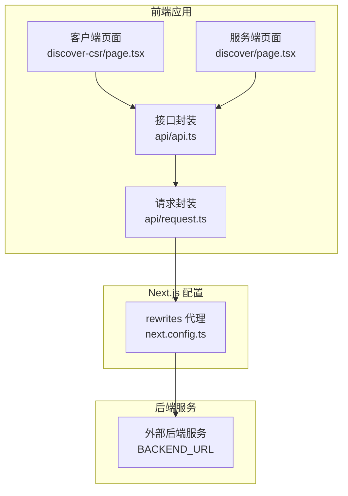
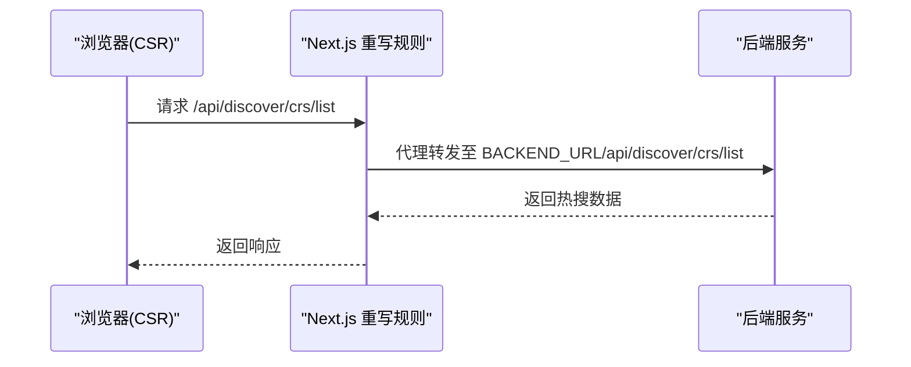
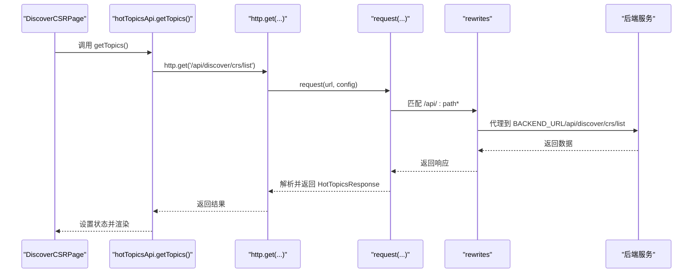
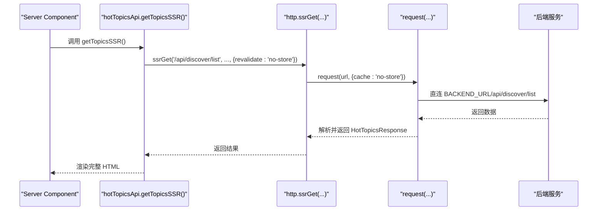
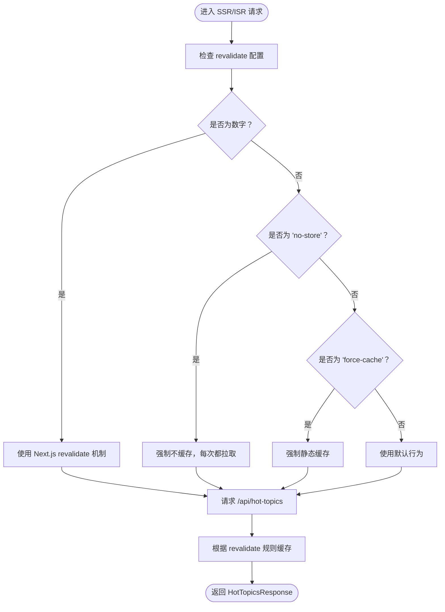
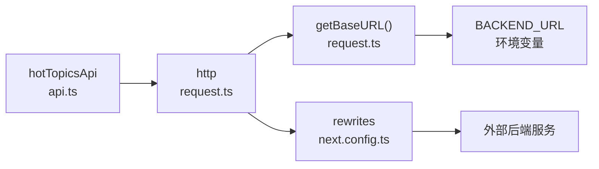

# 热搜接口

<cite>
**本文引用的文件**
- [src/api/api.ts](file://src/api/api.ts)
- [src/api/request.ts](file://src/api/request.ts)
- [src/app/discover/page.tsx](file://src/app/discover/page.tsx)
- [src/app/discover-csr/page.tsx](file://src/app/discover-csr/page.tsx)
- [next.config.ts](file://next.config.ts)
- [doc/对话问题.md](file://doc/对话问题.md)
</cite>

## 目录
1. [简介](#简介)
2. [项目结构](#项目结构)
3. [核心组件](#核心组件)
4. [架构总览](#架构总览)
5. [详细组件分析](#详细组件分析)
6. [依赖关系分析](#依赖关系分析)
7. [性能考量](#性能考量)
8. [故障排查指南](#故障排查指南)
9. [结论](#结论)
10. [附录](#附录)

## 简介
本文档系统化说明热搜接口的设计与使用，涵盖以下三种调用模式：
- 客户端调用：getTopics()
- 服务端 SSR 模式：getTopicsSSR()
- 增量静态再生 ISR 模式：getTopicsISR()

同时给出 TypeScript 类型定义 HotTopicsResponse 与 HotTopic 的详细说明，并提供调用示例、错误处理策略与性能优化建议，帮助开发者在不同场景下选择合适的渲染与缓存策略。

## 项目结构
热搜接口相关代码分布于以下模块：
- 类型与接口定义：src/api/api.ts
- 请求封装与 SSR/ISR 支持：src/api/request.ts
- SSR 页面（服务端渲染）：src/app/discover/page.tsx
- CSR 页面（客户端渲染）：src/app/discover-csr/page.tsx
- API 代理配置：next.config.ts
- 环境变量与代理说明：doc/对话问题.md

图表来源
- [src/app/discover-csr/page.tsx:16-79](file://src/app/discover-csr/page.tsx#L16-L79)
- [src/app/discover/page.tsx:13-50](file://src/app/discover/page.tsx#L13-L50)
- [src/api/api.ts:44-81](file://src/api/api.ts#L44-L81)
- [src/api/request.ts:309-333](file://src/api/request.ts#L309-L333)
- [next.config.ts:30-45](file://next.config.ts#L30-L45)

章节来源
- [src/api/api.ts:1-128](file://src/api/api.ts#L1-L128)
- [src/api/request.ts:1-455](file://src/api/request.ts#L1-L455)
- [src/app/discover/page.tsx:1-183](file://src/app/discover/page.tsx#L1-L183)
- [src/app/discover-csr/page.tsx:1-252](file://src/app/discover-csr/page.tsx#L1-L252)
- [next.config.ts:1-76](file://next.config.ts#L1-L76)
- [doc/对话问题.md:189-344](file://doc/对话问题.md#L189-L344)

## 核心组件
- 热搜接口集合 hotTopicsApi：提供三类调用方法
  - getTopics()：客户端调用，返回 Promise<HotTopicsResponse>
  - getTopicsSSR()：服务端 SSR 调用，每次请求动态获取
  - getTopicsISR(seconds?)：服务端 ISR 调用，支持自定义刷新间隔（秒）
- 请求封装 http：统一处理 baseURL、认证、超时、拦截器与 SSR/ISR 缓存控制
- 页面组件：CSR 与 SSR 两种渲染模式的对比演示

章节来源
- [src/api/api.ts:44-81](file://src/api/api.ts#L44-L81)
- [src/api/request.ts:265-348](file://src/api/request.ts#L265-L348)

## 架构总览
CSR 与 SSR 在“基础路径”和“代理方式”上存在本质差异：
- 客户端（CSR）：使用相对路径，通过 rewrites 代理到后端
- 服务端（SSR）：使用完整 URL（BACKEND_URL），直接连接后端

图表来源
- [src/app/discover-csr/page.tsx:42-47](file://src/app/discover-csr/page.tsx#L42-L47)
- [next.config.ts:30-45](file://next.config.ts#L30-L45)
- [doc/对话问题.md:198-210](file://doc/对话问题.md#L198-L210)

章节来源
- [src/app/discover-csr/page.tsx:1-252](file://src/app/discover-csr/page.tsx#L1-L252)
- [next.config.ts:27-45](file://next.config.ts#L27-L45)
- [doc/对话问题.md:189-344](file://doc/对话问题.md#L189-L344)

## 详细组件分析

### 接口定义与类型
- HotTopic：单条热搜项的数据结构
  - 字段：id、rank、title、description、image、heat、tag、isNew、isHot
- HotTopicsResponse：统一响应结构
  - 字段：data（HotTopic[]）、message、code

章节来源
- [src/api/api.ts:10-26](file://src/api/api.ts#L10-L26)

### 客户端调用 getTopics()
- 调用方式：hotTopicsApi.getTopics()
- 请求路径：/api/discover/crs/list
- 执行环境：浏览器（客户端）
- 基础路径：''（相对路径），通过 rewrites 代理到后端
- 返回类型：Promise<HotTopicsResponse>
- 典型流程：组件挂载时发起请求，加载期间展示骨架屏，成功后渲染列表

图表来源
- [src/api/api.ts:44-48](file://src/api/api.ts#L44-L48)
- [src/api/request.ts:265-269](file://src/api/request.ts#L265-L269)
- [src/api/request.ts:57-235](file://src/api/request.ts#L57-L235)
- [next.config.ts:30-45](file://next.config.ts#L30-L45)

章节来源
- [src/api/api.ts:44-48](file://src/api/api.ts#L44-L48)
- [src/app/discover-csr/page.tsx:23-75](file://src/app/discover-csr/page.tsx#L23-L75)

### 服务端 SSR 模式 getTopicsSSR()
- 调用方式：hotTopicsApi.getTopicsSSR()
- 请求路径：/api/discover/list
- 执行环境：Node.js（服务端）
- 基础路径：BACKEND_URL（完整 URL）
- 缓存策略：revalidate='no-store'，每次请求动态获取最新数据
- 典型流程：服务端渲染页面时直接拉取数据，将完整 HTML 返回给浏览器

图表来源
- [src/api/api.ts:50-55](file://src/api/api.ts#L50-L55)
- [src/api/request.ts:309-333](file://src/api/request.ts#L309-L333)
- [src/api/request.ts:57-235](file://src/api/request.ts#L57-L235)
- [src/app/discover/page.tsx:25-39](file://src/app/discover/page.tsx#L25-L39)

章节来源
- [src/api/api.ts:50-55](file://src/api/api.ts#L50-L55)
- [src/app/discover/page.tsx:13-50](file://src/app/discover/page.tsx#L13-L50)

### ISR 模式 getTopicsISR(seconds?)
- 调用方式：hotTopicsApi.getTopicsISR(seconds=60)
- 请求路径：/api/hot-topics
- 执行环境：Node.js（服务端）
- 基础路径：BACKEND_URL（完整 URL）
- 缓存策略：revalidate=seconds（数字），按秒数进行增量静态再生
- 典型流程：首次请求拉取数据并缓存，随后在指定周期内复用缓存；到期后重新拉取并更新缓存

图表来源
- [src/api/api.ts:57-62](file://src/api/api.ts#L57-L62)
- [src/api/request.ts:309-333](file://src/api/request.ts#L309-L333)

章节来源
- [src/api/api.ts:57-62](file://src/api/api.ts#L57-L62)
- [src/api/request.ts:309-333](file://src/api/request.ts#L309-L333)

### 页面渲染对比
- CSR 页面（discover-csr/page.tsx）
  - 特征：先显示骨架屏，请求完成后渲染内容；Network 面板可见 /api/discover/crs/list 请求
- SSR 页面（discover/page.tsx）
  - 特征：服务端渲染完整 HTML，浏览器收到时内容已就绪；Network 面板不可见 /api/discover/list 请求

章节来源
- [src/app/discover-csr/page.tsx:97-133](file://src/app/discover-csr/page.tsx#L97-L133)
- [src/app/discover/page.tsx:69-96](file://src/app/discover/page.tsx#L69-L96)

## 依赖关系分析
- hotTopicsApi 依赖 http（src/api/request.ts）
- http 在 SSR 环境下使用完整 URL（BACKEND_URL），在 CSR 环境下使用相对路径并通过 rewrites 代理
- next.config.ts 的 rewrites 将 /api/:path* 代理到 BACKEND_URL

图表来源
- [src/api/api.ts:6](file://src/api/api.ts#L6)
- [src/api/request.ts:40-47](file://src/api/request.ts#L40-L47)
- [next.config.ts:30-45](file://next.config.ts#L30-L45)

章节来源
- [src/api/api.ts:1-128](file://src/api/api.ts#L1-L128)
- [src/api/request.ts:1-455](file://src/api/request.ts#L1-L455)
- [next.config.ts:1-76](file://next.config.ts#L1-L76)

## 性能考量
- CSR 与 SSR 的首屏性能差异
  - SSR：服务端渲染完整 HTML，首屏无闪烁，SEO 更友好
  - CSR：首屏空白骨架屏，交互体验更流畅但 SEO 依赖客户端渲染
- 缓存策略选择
  - SSR：revalidate='no-store' 适合强一致性的内容
  - ISR：revalidate=N（秒）适合热点内容的定时刷新，兼顾新鲜度与性能
  - 静态缓存：revalidate='force-cache' 适合不常变化的内容
- 网络与超时
  - request.ts 内置超时控制与错误处理，建议结合业务设置合理的超时时间
- 图片与资源
  - 页面中使用 Image 组件并启用 priority 优化首屏图片加载

章节来源
- [src/app/discover/page.tsx:13-50](file://src/app/discover/page.tsx#L13-L50)
- [src/app/discover-csr/page.tsx:16-79](file://src/app/discover-csr/page.tsx#L16-L79)
- [src/api/request.ts:57-235](file://src/api/request.ts#L57-L235)

## 故障排查指南
- 401/403 未授权
  - 客户端：清除本地 token 并跳转登录页
  - 服务端：通过重定向处理，避免在非 Server Component 上下文中抛出异常
- 408 超时
  - 检查后端响应时间与网络状况，适当提高超时阈值
- 4xx/5xx HTTP 错误
  - 统一捕获并记录，必要时提示用户重试
- 重定向问题
  - SSR 中对 NEXT_REDIRECT 的错误需重新抛出，确保跳转生效
- 环境变量与代理
  - 客户端无法访问非 NEXT_PUBLIC_ 前缀的环境变量，需通过 rewrites 代理或调整变量前缀

章节来源
- [src/api/request.ts:157-234](file://src/api/request.ts#L157-L234)
- [src/app/discover/page.tsx:41-50](file://src/app/discover/page.tsx#L41-L50)
- [doc/对话问题.md:221-344](file://doc/对话问题.md#L221-L344)

## 结论
- 对于强一致性的热搜内容，推荐使用 SSR（getTopicsSSR）
- 对于高频更新但可接受短暂延迟的内容，推荐使用 ISR（getTopicsISR）
- 对于简单列表或无需首屏渲染的场景，CSR（getTopics）可提供更好的交互体验
- 合理配置 rewrites 与缓存策略，可在性能与一致性之间取得平衡

## 附录

### 调用示例与最佳实践
- 客户端调用
  - 在客户端组件中调用 hotTopicsApi.getTopics()，注意处理 loading 与错误状态
- 服务端 SSR
  - 在 Server Component 中调用 hotTopicsApi.getTopicsSSR()，确保错误处理与重定向正确传递
- ISR 调用
  - 在 Server Component 中调用 hotTopicsApi.getTopicsISR(N)，N 为刷新间隔（秒）

章节来源
- [src/app/discover-csr/page.tsx:23-75](file://src/app/discover-csr/page.tsx#L23-L75)
- [src/app/discover/page.tsx:25-39](file://src/app/discover/page.tsx#L25-L39)
- [src/api/api.ts:57-62](file://src/api/api.ts#L57-L62)