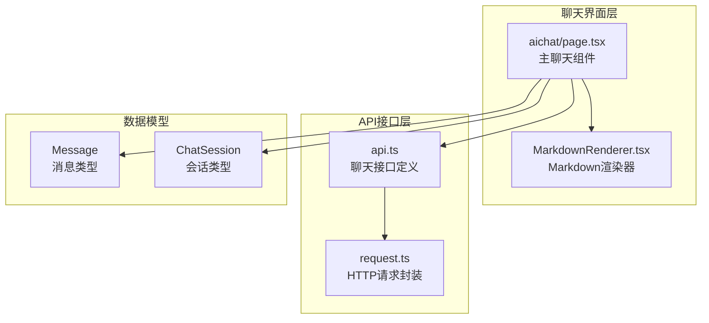
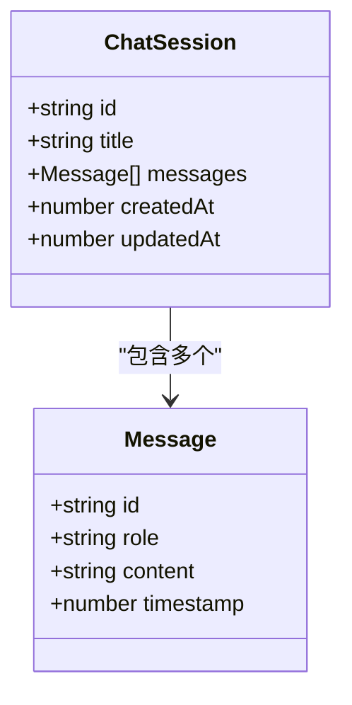
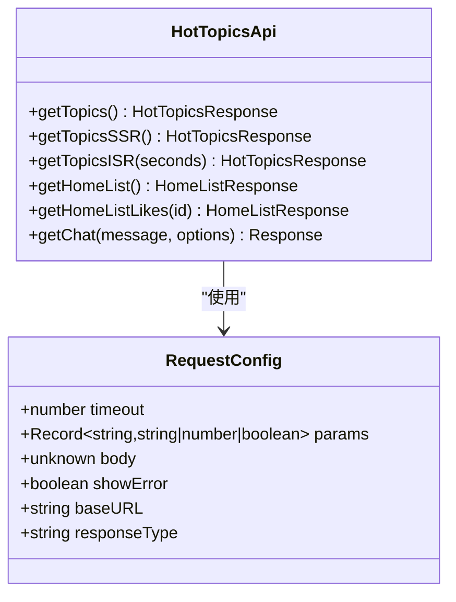
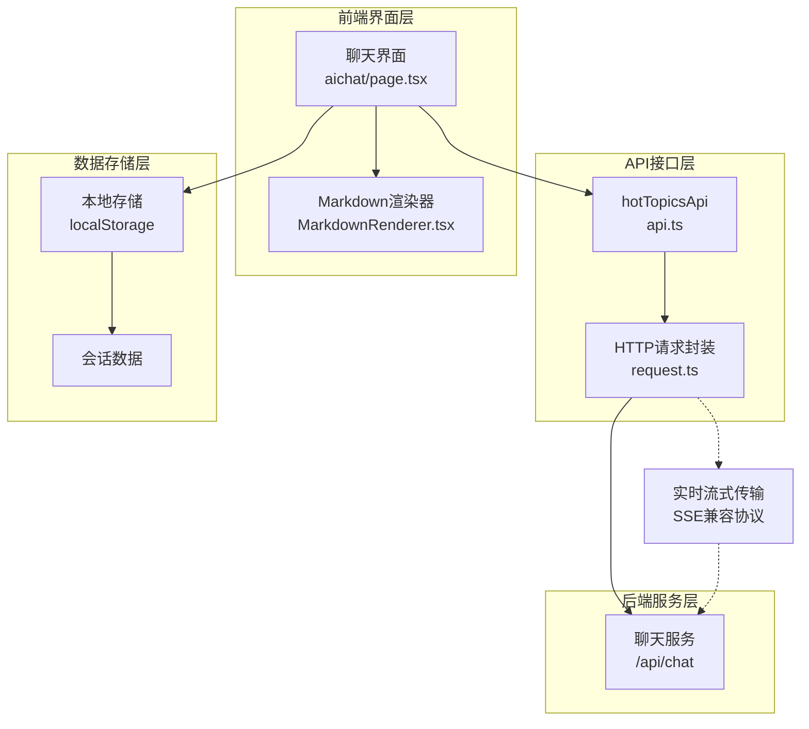
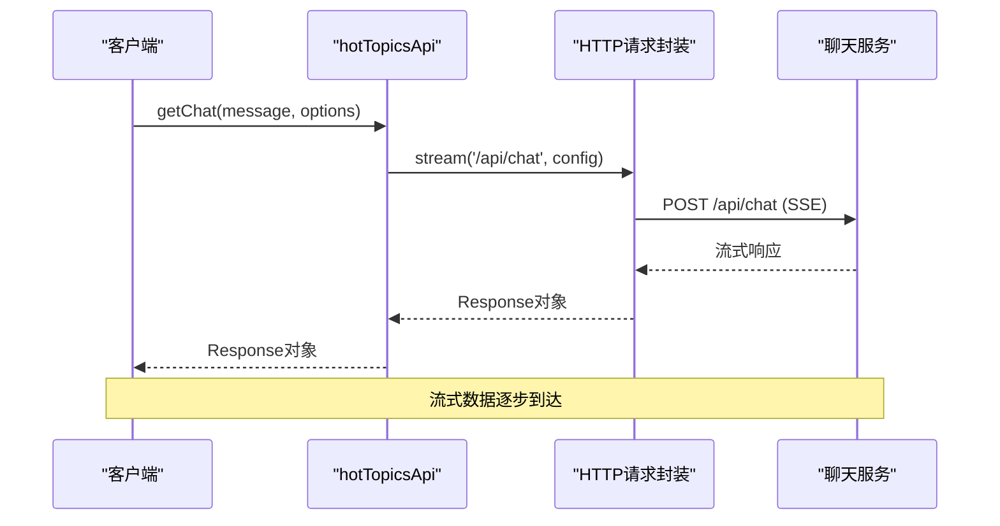
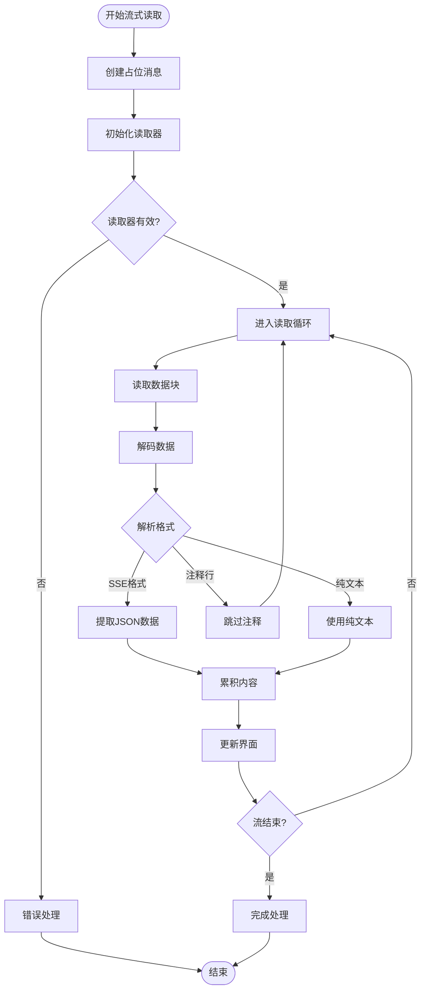
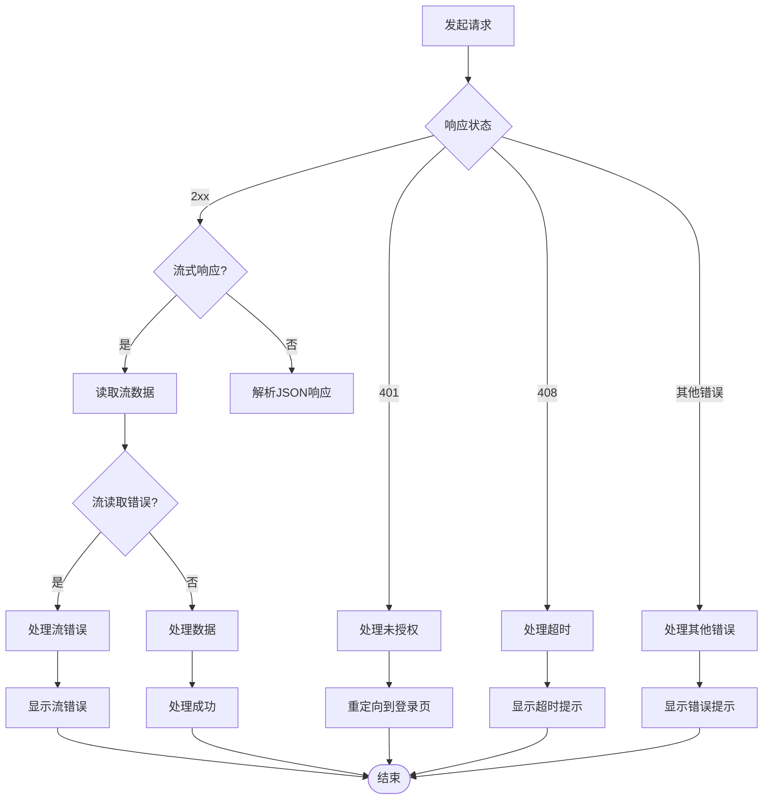
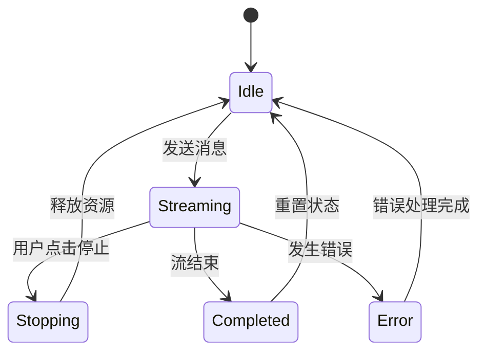
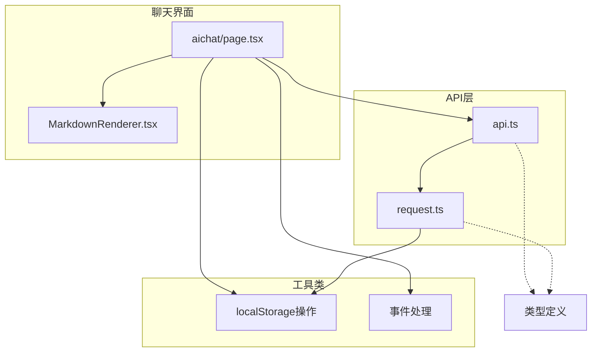
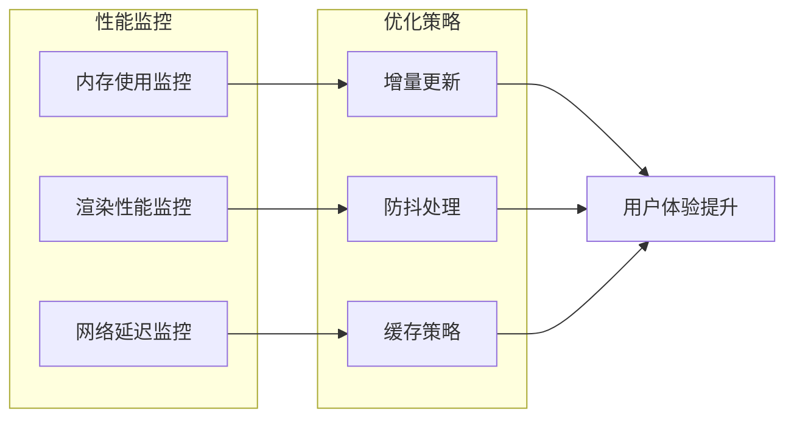

# 聊天接口

<cite>
**本文档引用的文件**
- [src/app/aichat/page.tsx](file://src/app/aichat/page.tsx)
- [src/api/api.ts](file://src/api/api.ts)
- [src/api/request.ts](file://src/api/request.ts)
- [src/components/MarkdownRenderer.tsx](file://src/components/MarkdownRenderer.tsx)
</cite>

## 目录
1. [简介](#简介)
2. [项目结构](#项目结构)
3. [核心组件](#核心组件)
4. [架构概览](#架构概览)
5. [详细组件分析](#详细组件分析)
6. [依赖关系分析](#依赖关系分析)
7. [性能考虑](#性能考虑)
8. [故障排除指南](#故障排除指南)
9. [结论](#结论)

## 简介

本项目实现了基于Next.js的实时聊天功能，采用流式传输机制实现AI助手的实时回复。系统通过HTTP流式响应（SSE兼容）实现近似WebSocket的实时通信效果，支持消息的逐步接收和实时渲染。

## 项目结构

聊天功能主要分布在以下文件中：

**图表来源**
- [src/app/aichat/page.tsx:1-946](file://src/app/aichat/page.tsx#L1-L946)
- [src/api/api.ts:1-128](file://src/api/api.ts#L1-L128)
- [src/api/request.ts:1-455](file://src/api/request.ts#L1-L455)

**章节来源**
- [src/app/aichat/page.tsx:1-946](file://src/app/aichat/page.tsx#L1-L946)
- [src/api/api.ts:1-128](file://src/api/api.ts#L1-L128)
- [src/api/request.ts:1-455](file://src/api/request.ts#L1-L455)

## 核心组件

### 数据模型

系统定义了两个核心数据结构：

**图表来源**
- [src/app/aichat/page.tsx:10-23](file://src/app/aichat/page.tsx#L10-L23)

### 聊天接口定义

聊天接口通过`hotTopicsApi`对象提供统一的访问方式：

**图表来源**
- [src/api/api.ts:44-81](file://src/api/api.ts#L44-L81)
- [src/api/request.ts:11-25](file://src/api/request.ts#L11-L25)

**章节来源**
- [src/app/aichat/page.tsx:10-23](file://src/app/aichat/page.tsx#L10-L23)
- [src/api/api.ts:44-81](file://src/api/api.ts#L44-L81)
- [src/api/request.ts:11-25](file://src/api/request.ts#L11-L25)

## 架构概览

聊天系统的整体架构采用分层设计：

**图表来源**
- [src/app/aichat/page.tsx:1-946](file://src/app/aichat/page.tsx#L1-L946)
- [src/api/api.ts:73-79](file://src/api/api.ts#L73-L79)
- [src/api/request.ts:291-301](file://src/api/request.ts#L291-L301)

## 详细组件分析

### 实时聊天接口 getChat()

`getChat()`方法实现了完整的流式聊天功能：

#### 方法签名和参数

**图表来源**
- [src/api/api.ts:73-79](file://src/api/api.ts#L73-L79)
- [src/api/request.ts:291-301](file://src/api/request.ts#L291-L301)

#### 请求参数格式

聊天接口的请求参数具有明确的格式要求：

| 参数名称 | 类型 | 必需 | 描述 | 默认值 |
|---------|------|------|------|--------|
| message | string | 是 | 用户发送的聊天消息内容 | - |
| options | RequestInit | 否 | 请求配置选项 | {} |

**章节来源**
- [src/api/api.ts:73-79](file://src/api/api.ts#L73-L79)

### 流式传输机制 stream()

系统采用基于fetch的流式传输机制，实现近似WebSocket的实时通信：

#### 流式读取流程

**图表来源**
- [src/app/aichat/page.tsx:217-409](file://src/app/aichat/page.tsx#L217-L409)

#### 流式响应格式支持

系统支持多种流式响应格式：

| 响应格式 | 特征 | 解析方式 |
|---------|------|----------|
| SSE格式 | 以"data: "开头 | 提取data字段并解析JSON |
| JSON格式 | 标准JSON对象 | 解析content或choices字段 |
| 纯文本 | 直接文本内容 | 直接追加到累积内容 |
| 注释行 | 以":"开头 | 跳过处理 |

**章节来源**
- [src/app/aichat/page.tsx:295-368](file://src/app/aichat/page.tsx#L295-L368)

### 错误处理机制

系统实现了多层次的错误处理机制：

**图表来源**
- [src/app/aichat/page.tsx:380-406](file://src/app/aichat/page.tsx#L380-L406)
- [src/api/request.ts:158-234](file://src/api/request.ts#L158-L234)

**章节来源**
- [src/app/aichat/page.tsx:380-406](file://src/app/aichat/page.tsx#L380-L406)
- [src/api/request.ts:158-234](file://src/api/request.ts#L158-L234)

### 连接断开恢复策略

系统提供了完善的连接断开处理机制：

#### 停止生成功能

**图表来源**
- [src/app/aichat/page.tsx:207-214](file://src/app/aichat/page.tsx#L207-L214)

#### 超时控制机制

系统集成了双重超时控制：

1. **内部超时控制**：默认10秒超时
2. **外部信号合并**：支持外部传入的AbortSignal

**章节来源**
- [src/app/aichat/page.tsx:207-214](file://src/app/aichat/page.tsx#L207-L214)
- [src/api/request.ts:130-146](file://src/api/request.ts#L130-L146)

### WebSocket协议使用注意事项

虽然系统使用HTTP流式传输而非WebSocket，但在实际部署中需要注意以下WebSocket相关事项：

#### 协议选择建议

| 方案 | 优点 | 缺点 | 适用场景 |
|------|------|------|----------|
| HTTP流式传输 | 实现简单、兼容性好 | 服务器端复杂度较高 | 现有REST API改造 |
| WebSocket | 实时性强、协议轻量 | 需要额外服务器支持 | 新建实时应用 |
| Server-Sent Events | 单向推送、实现简单 | 仅支持单向通信 | 实时通知场景 |

## 依赖关系分析

### 组件依赖图

**图表来源**
- [src/app/aichat/page.tsx:1-946](file://src/app/aichat/page.tsx#L1-L946)
- [src/api/api.ts:1-128](file://src/api/api.ts#L1-L128)
- [src/api/request.ts:1-455](file://src/api/request.ts#L1-L455)

**章节来源**
- [src/app/aichat/page.tsx:1-946](file://src/app/aichat/page.tsx#L1-L946)
- [src/api/api.ts:1-128](file://src/api/api.ts#L1-L128)
- [src/api/request.ts:1-455](file://src/api/request.ts#L1-L455)

## 性能考虑

### 流式传输优化

1. **内存管理**：使用缓冲区逐行处理，避免大块内存占用
2. **解码优化**：采用TextDecoder进行高效字符串解码
3. **渲染优化**：只更新变化的消息内容，避免全量重渲染

### 错误恢复机制

## 故障排除指南

### 常见问题及解决方案

| 问题类型 | 症状 | 可能原因 | 解决方案 |
|---------|------|----------|----------|
| 流式传输失败 | 无法读取响应流 | 服务器未正确设置SSE头 | 检查服务器SSE配置 |
| 内容为空 | AI未返回内容 | API调用失败或响应异常 | 检查网络连接和API可用性 |
| 超时错误 | 请求超时 | 网络延迟或服务器处理时间过长 | 调整超时配置或优化服务器性能 |
| 断线重连 | 连接意外中断 | 网络不稳定或服务器重启 | 实现自动重连机制 |

### 调试技巧

1. **启用详细日志**：在开发环境中启用详细的请求和响应日志
2. **检查网络面板**：使用浏览器开发者工具监控网络请求
3. **验证服务器响应**：确保服务器正确设置了SSE响应头

**章节来源**
- [src/app/aichat/page.tsx:380-406](file://src/app/aichat/page.tsx#L380-L406)
- [src/api/request.ts:213-234](file://src/api/request.ts#L213-L234)

## 结论

本聊天接口实现了基于HTTP流式传输的实时聊天功能，具有以下特点：

1. **架构清晰**：采用分层设计，职责分离明确
2. **实现简洁**：基于现有fetch API，无需额外依赖
3. **用户体验佳**：支持实时流式渲染和智能错误处理
4. **扩展性强**：支持多种响应格式和自定义配置

系统通过精心设计的流式传输机制，为用户提供接近WebSocket的实时聊天体验，同时保持了实现的简洁性和维护的便利性。