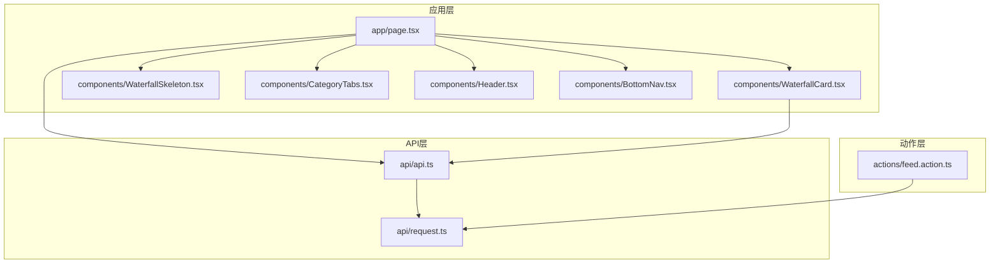
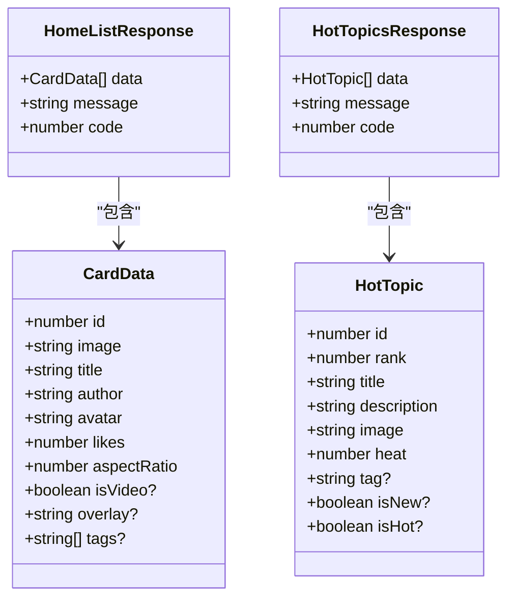
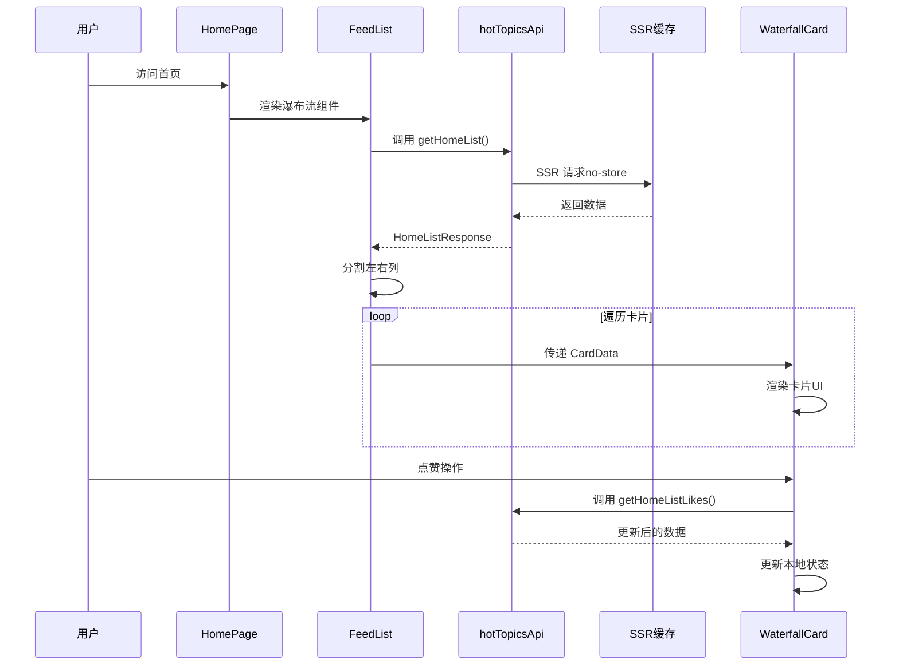
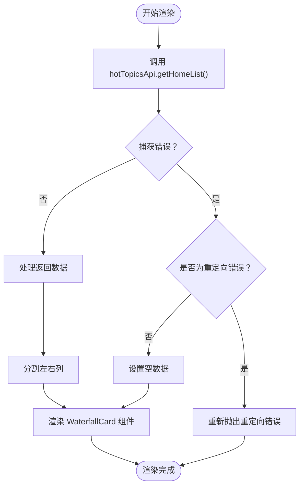
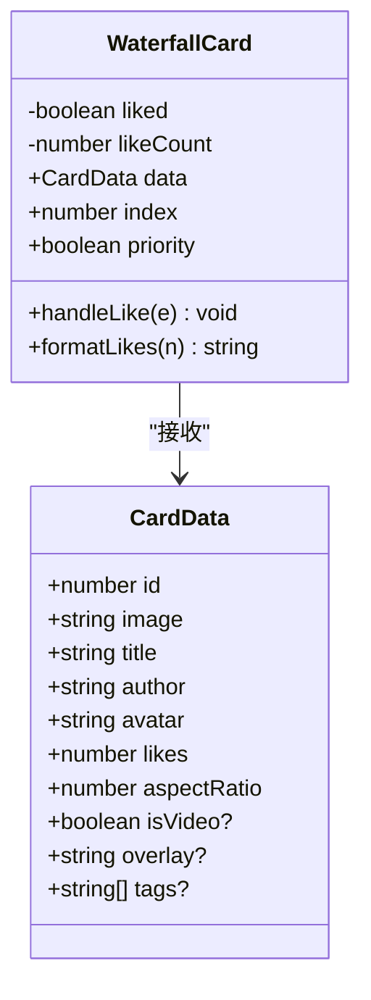
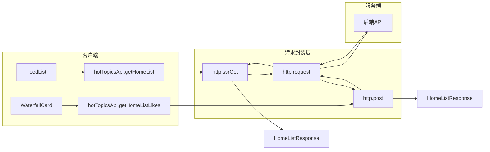
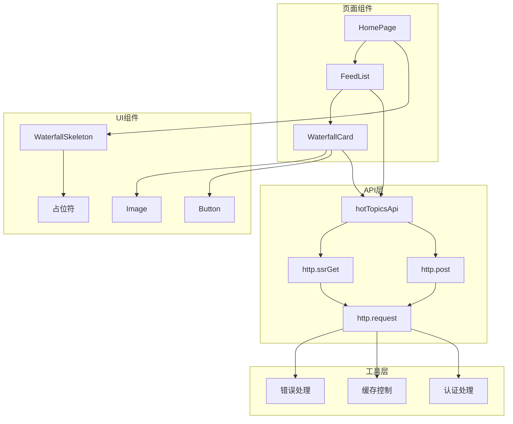
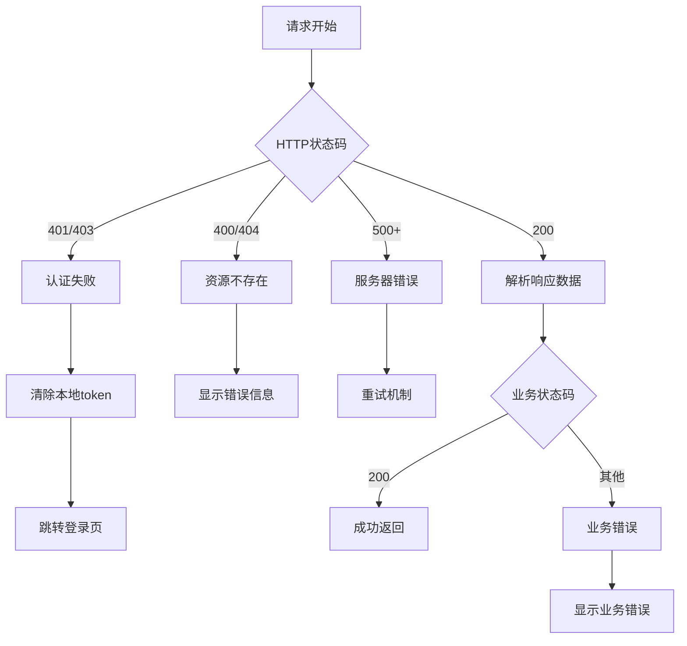

# 首页数据接口

<cite>
**本文档引用的文件**
- [src/actions/feed.action.ts](file://src/actions/feed.action.ts)
- [src/components/WaterfallCard.tsx](file://src/components/WaterfallCard.tsx)
- [src/app/page.tsx](file://src/app/page.tsx)
- [src/api/api.ts](file://src/api/api.ts)
- [src/api/request.ts](file://src/api/request.ts)
- [src/components/WaterfallSkeleton.tsx](file://src/components/WaterfallSkeleton.tsx)
- [src/components/CategoryTabs.tsx](file://src/components/CategoryTabs.tsx)
- [src/components/Header.tsx](file://src/components/Header.tsx)
- [src/components/BottomNav.tsx](file://src/components/BottomNav.tsx)
</cite>

## 目录
1. [简介](#简介)
2. [项目结构](#项目结构)
3. [核心组件](#核心组件)
4. [架构概览](#架构概览)
5. [详细组件分析](#详细组件分析)
6. [依赖关系分析](#依赖关系分析)
7. [性能考虑](#性能考虑)
8. [故障排除指南](#故障排除指南)
9. [结论](#结论)

## 简介

本文档详细说明了首页数据接口的完整实现，包括首页数据流获取接口 `getHomeList()` 和点赞功能接口 `getHomeListLikes()`。文档解释了 `HomeListResponse` 和 `CardData` 的数据结构定义，提供了完整的调用示例，包括数据获取、状态更新和错误处理。同时说明了与 `WaterfallCard` 组件的数据交互关系，并包含实时更新机制和缓存策略的实现细节。

## 项目结构

该项目采用 Next.js 13+ 的 App Router 架构，主要文件组织如下：

**图表来源**
- [src/app/page.tsx:1-75](file://src/app/page.tsx#L1-L75)
- [src/components/WaterfallCard.tsx:1-155](file://src/components/WaterfallCard.tsx#L1-L155)
- [src/api/api.ts:1-128](file://src/api/api.ts#L1-L128)

**章节来源**
- [src/app/page.tsx:1-75](file://src/app/page.tsx#L1-L75)
- [src/components/WaterfallCard.tsx:1-155](file://src/components/WaterfallCard.tsx#L1-L155)
- [src/api/api.ts:1-128](file://src/api/api.ts#L1-L128)

## 核心组件

### 数据接口定义

项目中的数据接口主要集中在 `api/api.ts` 文件中，定义了完整的数据获取和处理流程：

**图表来源**
- [src/api/api.ts:22-32](file://src/api/api.ts#L22-L32)
- [src/api/api.ts:10-20](file://src/api/api.ts#L10-L20)
- [src/components/WaterfallCard.tsx:7-18](file://src/components/WaterfallCard.tsx#L7-L18)

### API 接口方法

项目提供了多种数据获取方式，适应不同的使用场景：

| 方法 | 用途 | 缓存策略 | 返回类型 |
|------|------|----------|----------|
| `hotTopicsApi.getHomeList()` | 首页数据流获取 | SSR 动态渲染 | `HomeListResponse` |
| `hotTopicsApi.getHomeListLikes(id)` | 点赞功能 | 即时更新 | `HomeListResponse` |
| `hotTopicsApi.getTopics()` | 热搜列表（客户端） | 客户端缓存 | `HotTopicsResponse` |
| `hotTopicsApi.getTopicsSSR()` | 热搜列表（服务端） | SSR 动态渲染 | `HotTopicsResponse` |

**章节来源**
- [src/api/api.ts:64-81](file://src/api/api.ts#L64-L81)
- [src/api/api.ts:44-81](file://src/api/api.ts#L44-L81)

## 架构概览

首页数据流的整体架构采用了现代化的 Next.js 13+ 设计模式：

**图表来源**
- [src/app/page.tsx:19-52](file://src/app/page.tsx#L19-L52)
- [src/api/api.ts:64-71](file://src/api/api.ts#L64-L71)
- [src/components/WaterfallCard.tsx:30-41](file://src/components/WaterfallCard.tsx#L30-L41)

## 详细组件分析

### 首页数据获取组件

`FeedList` 组件负责首页数据的获取和瀑布流布局：

**图表来源**
- [src/app/page.tsx:19-52](file://src/app/page.tsx#L19-L52)

#### 数据获取流程

1. **异步数据获取**：使用 `await hotTopicsApi.getHomeList()` 获取首页数据
2. **错误处理**：专门处理 NEXT_REDIRECT 类型的错误
3. **数据分割**：将数据按索引奇偶性分为左右两列
4. **组件渲染**：传递 `CardData` 给 `WaterfallCard` 组件

**章节来源**
- [src/app/page.tsx:19-52](file://src/app/page.tsx#L19-L52)

### 瀑布流卡片组件

`WaterfallCard` 组件实现了完整的卡片展示和交互功能：

**图表来源**
- [src/components/WaterfallCard.tsx:26-155](file://src/components/WaterfallCard.tsx#L26-L155)
- [src/components/WaterfallCard.tsx:7-18](file://src/components/WaterfallCard.tsx#L7-L18)

#### 点赞功能实现

点赞功能采用了即时更新的用户体验设计：

1. **本地状态更新**：立即更新本地的点赞状态和计数
2. **异步请求**：调用后端点赞接口
3. **状态同步**：根据接口返回结果同步最终状态

**章节来源**
- [src/components/WaterfallCard.tsx:30-41](file://src/components/WaterfallCard.tsx#L30-L41)

### API 请求封装

`hotTopicsApi` 提供了统一的 API 接口访问：

**图表来源**
- [src/api/api.ts:64-71](file://src/api/api.ts#L64-L71)
- [src/api/request.ts:57-235](file://src/api/request.ts#L57-L235)

**章节来源**
- [src/api/api.ts:44-81](file://src/api/api.ts#L44-L81)
- [src/api/request.ts:265-346](file://src/api/request.ts#L265-L346)

## 依赖关系分析

项目的核心依赖关系如下：

**图表来源**
- [src/app/page.tsx:1-75](file://src/app/page.tsx#L1-L75)
- [src/components/WaterfallCard.tsx:1-155](file://src/components/WaterfallCard.tsx#L1-L155)
- [src/api/api.ts:1-128](file://src/api/api.ts#L1-L128)

### 数据流依赖

1. **组件依赖**：`HomePage` 依赖 `FeedList`，`FeedList` 依赖 `WaterfallCard`
2. **API 依赖**：所有组件都依赖 `hotTopicsApi`，`hotTopicsApi` 依赖 `http` 请求封装
3. **工具依赖**：`http` 依赖错误处理、缓存控制和认证处理

**章节来源**
- [src/app/page.tsx:1-75](file://src/app/page.tsx#L1-L75)
- [src/components/WaterfallCard.tsx:1-155](file://src/components/WaterfallCard.tsx#L1-L155)
- [src/api/api.ts:1-128](file://src/api/api.ts#L1-L128)

## 性能考虑

### 缓存策略

项目采用了多层次的缓存策略来优化性能：

1. **SSR 动态渲染** (`no-store`)
   - 每次请求都获取最新数据
   - 适用于首页等需要实时性的内容
   - 通过 `http.ssrGet(url, params, { revalidate: 'no-store' })` 实现

2. **流式渲染** (`Suspense`)
   - 使用 `Suspense` 组件实现渐进式渲染
   - 先显示骨架屏，数据到达后逐步替换
   - 提升首屏渲染性能

3. **客户端缓存**
   - 瀑布流卡片组件维护本地状态
   - 点赞操作采用即时更新，减少等待时间

### 性能优化建议

1. **图片优化**：使用 `next/image` 组件自动优化图片加载
2. **懒加载**：通过 `priority` 属性优化首屏图片加载
3. **骨架屏**：使用 `WaterfallSkeleton` 提供更好的用户体验
4. **请求合并**：利用 React 的请求记忆化特性避免重复请求

## 故障排除指南

### 常见错误处理

项目实现了完善的错误处理机制：

**图表来源**
- [src/api/request.ts:158-234](file://src/api/request.ts#L158-L234)

### 错误处理策略

1. **认证错误** (`401/403`)
   - 清除本地存储的 token
   - 自动跳转到登录页面
   - 支持客户端和服务器端两种处理方式

2. **网络错误** (`DOMException`)
   - 显示超时错误信息
   - 提供重试机制

3. **业务错误** (`BusinessError`)
   - 解析后端返回的业务状态码
   - 显示具体的业务错误信息

**章节来源**
- [src/api/request.ts:158-234](file://src/api/request.ts#L158-L234)

### 调试技巧

1. **网络监控**：使用浏览器开发者工具的 Network 面板监控 API 请求
2. **日志输出**：在开发环境中启用详细的日志输出
3. **错误边界**：使用 React 的错误边界组件捕获组件级错误
4. **性能分析**：使用 React Profiler 分析组件渲染性能

## 结论

本文档详细介绍了首页数据接口的完整实现，包括：

1. **数据结构定义**：`HomeListResponse` 和 `CardData` 的完整字段说明
2. **接口实现**：`getHomeList()` 和 `getHomeListLikes()` 的具体实现
3. **组件交互**：`HomePage`、`FeedList` 和 `WaterfallCard` 的协作关系
4. **缓存策略**：SSR 动态渲染和流式渲染的性能优化
5. **错误处理**：完整的错误处理和用户反馈机制

该实现采用了现代化的 Next.js 13+ 架构，结合了服务端渲染、客户端交互和实时更新等多种技术，为用户提供了流畅的使用体验。通过合理的缓存策略和错误处理机制，确保了系统的稳定性和可靠性。