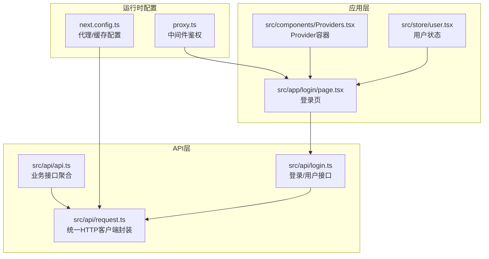
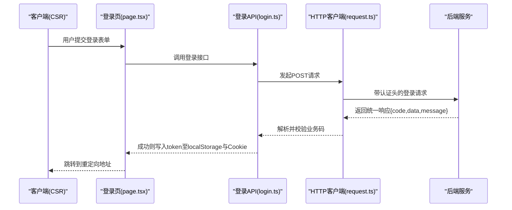
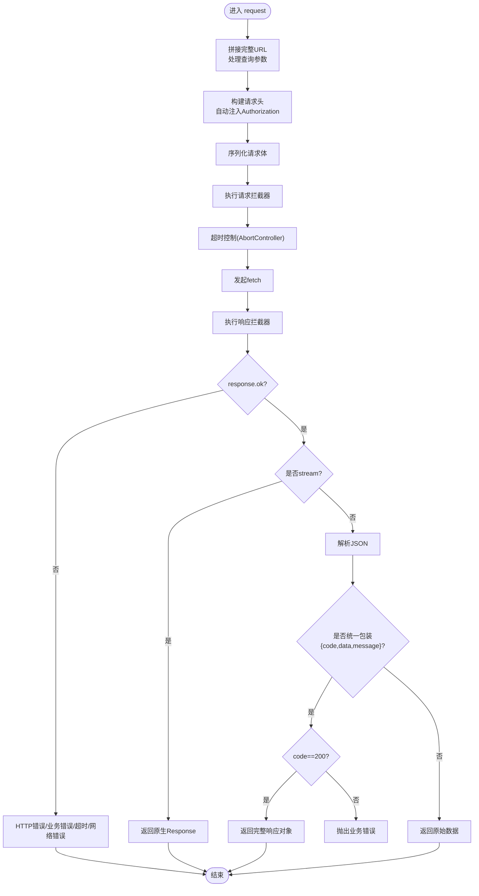
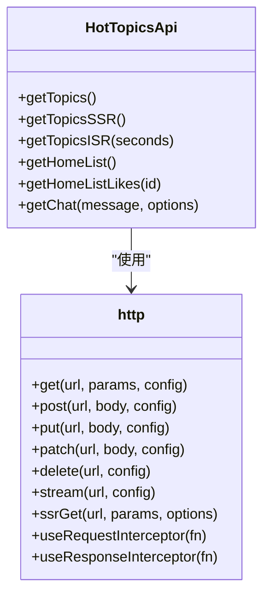
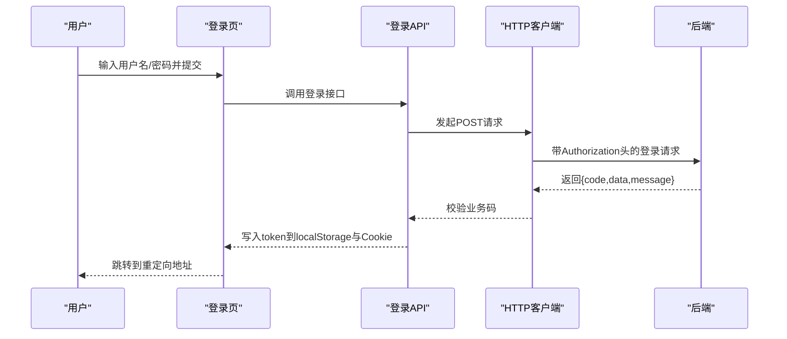
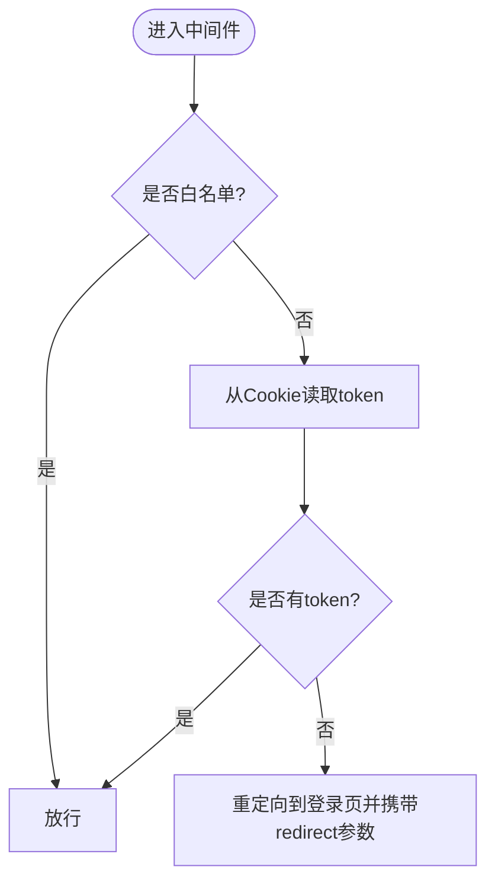
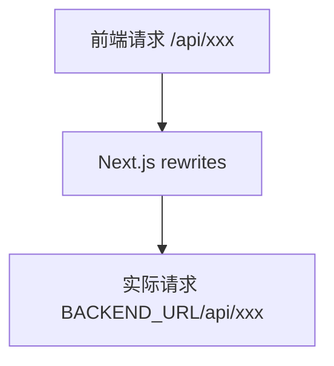
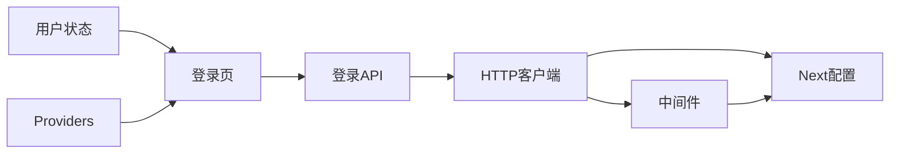

# API集成

<cite>
**本文引用的文件**
- [src/api/request.ts](file://src/api/request.ts)
- [src/api/api.ts](file://src/api/api.ts)
- [src/api/login.ts](file://src/api/login.ts)
- [proxy.ts](file://proxy.ts)
- [next.config.ts](file://next.config.ts)
- [src/app/login/page.tsx](file://src/app/login/page.tsx)
- [src/components/Providers.tsx](file://src/components/Providers.tsx)
- [src/store/user.tsx](file://src/store/user.tsx)
- [package.json](file://package.json)
</cite>

## 目录
1. [简介](#简介)
2. [项目结构](#项目结构)
3. [核心组件](#核心组件)
4. [架构总览](#架构总览)
5. [详细组件分析](#详细组件分析)
6. [依赖关系分析](#依赖关系分析)
7. [性能考量](#性能考量)
8. [故障排查指南](#故障排查指南)
9. [结论](#结论)
10. [附录](#附录)

## 简介
本文件系统性梳理本项目的API集成与网络请求实现，覆盖HTTP客户端配置、请求/响应拦截器、错误管理、代理与跨域处理、API版本管理、认证头设置、请求重试机制与缓存策略，并提供API调用示例、数据格式规范与性能优化技巧，以及调试与网络问题排查方法。目标是帮助开发者快速理解并高效扩展API层能力。

## 项目结构
本项目采用按功能模块划分的组织方式，API相关代码集中在src/api目录，路由与中间件在根目录，前端页面与状态管理位于src/app与src/store。

图表来源
- [src/api/request.ts:1-455](file://src/api/request.ts#L1-L455)
- [src/api/api.ts:1-128](file://src/api/api.ts#L1-L128)
- [src/api/login.ts:1-81](file://src/api/login.ts#L1-L81)
- [next.config.ts:1-76](file://next.config.ts#L1-L76)
- [proxy.ts:1-52](file://proxy.ts#L1-L52)
- [src/app/login/page.tsx:1-119](file://src/app/login/page.tsx#L1-L119)
- [src/components/Providers.tsx:1-20](file://src/components/Providers.tsx#L1-L20)
- [src/store/user.tsx:1-56](file://src/store/user.tsx#L1-L56)

章节来源
- [src/api/request.ts:1-455](file://src/api/request.ts#L1-L455)
- [src/api/api.ts:1-128](file://src/api/api.ts#L1-L128)
- [src/api/login.ts:1-81](file://src/api/login.ts#L1-L81)
- [next.config.ts:1-76](file://next.config.ts#L1-L76)
- [proxy.ts:1-52](file://proxy.ts#L1-L52)
- [src/app/login/page.tsx:1-119](file://src/app/login/page.tsx#L1-L119)
- [src/components/Providers.tsx:1-20](file://src/components/Providers.tsx#L1-L20)
- [src/store/user.tsx:1-56](file://src/store/user.tsx#L1-L56)

## 核心组件
- 统一HTTP客户端封装：提供GET/POST/PUT/PATCH/DELETE/stream/ssrGet等方法，内置超时控制、拦截器、错误类型、SSR缓存策略与认证头自动注入。
- 业务接口聚合：按模块组织接口，如热搜、聊天、用户等，便于调用与维护。
- 中间件鉴权：基于Cookie的全局路由拦截，保护受控页面。
- 代理与跨域：通过Next.js rewrites将前端请求代理到后端，隐藏真实地址，实现跨域访问。
- 登录流程：登录成功后同时写入localStorage与Cookie，支持SSR与CSR双栈使用。

章节来源
- [src/api/request.ts:265-346](file://src/api/request.ts#L265-L346)
- [src/api/api.ts:44-81](file://src/api/api.ts#L44-L81)
- [proxy.ts:11-33](file://proxy.ts#L11-L33)
- [next.config.ts:30-45](file://next.config.ts#L30-L45)
- [src/app/login/page.tsx:20-58](file://src/app/login/page.tsx#L20-L58)

## 架构总览
整体架构围绕“统一HTTP客户端”展开，业务接口通过该客户端发起请求；Next.js中间件负责鉴权；rewrites实现代理与跨域；SSR/CSR分别从Cookie/LocalStorage读取认证信息。

图表来源
- [src/app/login/page.tsx:20-58](file://src/app/login/page.tsx#L20-L58)
- [src/api/login.ts:54-59](file://src/api/login.ts#L54-L59)
- [src/api/request.ts:148-235](file://src/api/request.ts#L148-L235)

## 详细组件分析

### 统一HTTP客户端封装（request.ts）
- 基础路径与环境适配：服务端使用完整URL，客户端使用相对路径；可通过BASE_PATH与环境变量控制。
- 认证头设置：自动从localStorage或Cookie读取token并附加到Authorization头。
- 请求拦截器：支持注册多个请求拦截器，用于统一注入头、签名、埋点等。
- 响应拦截器：支持注册多个响应拦截器，用于统一处理401、刷新token等。
- 错误处理：区分HTTP错误、超时、网络错误与业务错误，抛出自定义异常类型。
- 超时控制：内置AbortController，支持与外部signal合并。
- SSR缓存策略：ssrGet方法根据revalidate策略设置cache/next，支持no-store、force-cache与ISR。
- 流式请求：stream方法返回原生Response，便于SSE/流式数据读取。

图表来源
- [src/api/request.ts:57-235](file://src/api/request.ts#L57-L235)

章节来源
- [src/api/request.ts:35-47](file://src/api/request.ts#L35-L47)
- [src/api/request.ts:88-112](file://src/api/request.ts#L88-L112)
- [src/api/request.ts:125-155](file://src/api/request.ts#L125-L155)
- [src/api/request.ts:157-235](file://src/api/request.ts#L157-L235)
- [src/api/request.ts:309-333](file://src/api/request.ts#L309-L333)
- [src/api/request.ts:291-301](file://src/api/request.ts#L291-L301)

### 业务接口聚合（api.ts）
- 模块化组织：将热搜、首页、聊天等接口按模块集中管理，便于维护与复用。
- SSR/ISR支持：提供getTopicsSSR/getTopicsISR等方法，结合ssrGet实现不同缓存策略。
- 流式接口：chat接口支持stream模式，便于实时对话场景。

图表来源
- [src/api/api.ts:44-81](file://src/api/api.ts#L44-L81)
- [src/api/request.ts:265-346](file://src/api/request.ts#L265-L346)

章节来源
- [src/api/api.ts:44-81](file://src/api/api.ts#L44-L81)

### 登录流程与认证头（login.ts + login/page.tsx）
- 登录接口：提供login/register等接口，返回统一响应结构。
- 登录页：提交表单后调用登录接口，成功后同时写入localStorage与Cookie，支持SSR与CSR双栈。
- 认证头：HTTP客户端自动从Cookie或localStorage读取token并附加到Authorization头。

图表来源
- [src/app/login/page.tsx:20-58](file://src/app/login/page.tsx#L20-L58)
- [src/api/login.ts:54-59](file://src/api/login.ts#L54-L59)
- [src/api/request.ts:94-112](file://src/api/request.ts#L94-L112)

章节来源
- [src/api/login.ts:54-59](file://src/api/login.ts#L54-L59)
- [src/app/login/page.tsx:20-58](file://src/app/login/page.tsx#L20-L58)
- [src/api/request.ts:94-112](file://src/api/request.ts#L94-L112)

### 中间件与鉴权（proxy.ts）
- 白名单：对/login与/register放行。
- 鉴权：从Cookie读取token，无token则重定向到登录页并携带redirect参数。
- 匹配规则：排除静态资源与API路由，仅对普通页面生效。

图表来源
- [proxy.ts:11-33](file://proxy.ts#L11-L33)

章节来源
- [proxy.ts:4-33](file://proxy.ts#L4-L33)

### 代理与跨域（next.config.ts）
- rewrites：将前端的/api/*代理到BACKEND_URL，隐藏真实后端地址，实现跨域访问。
- basePath：支持通过环境变量配置部署路径，便于Nginx代理。

图表来源
- [next.config.ts:30-45](file://next.config.ts#L30-L45)

章节来源
- [next.config.ts:30-45](file://next.config.ts#L30-L45)

### SSR缓存与流式加载（api.ts + next.config.ts）
- ssrGet：支持no-store、force-cache与ISR三种策略，结合Next.js缓存机制实现不同粒度的缓存。
- stream：返回原生Response，便于SSE/流式数据读取。

章节来源
- [src/api/api.ts:50-67](file://src/api/api.ts#L50-L67)
- [src/api/request.ts:309-333](file://src/api/request.ts#L309-L333)
- [src/api/request.ts:291-301](file://src/api/request.ts#L291-L301)

## 依赖关系分析
- 组件耦合：业务接口依赖HTTP客户端；登录页依赖登录API；中间件依赖Cookie；代理配置影响请求路径。
- 外部依赖：Next.js（rewrites、SSR、中间件）、React/Zustand（状态管理）。

图表来源
- [src/app/login/page.tsx:1-119](file://src/app/login/page.tsx#L1-L119)
- [src/api/login.ts:1-81](file://src/api/login.ts#L1-L81)
- [src/api/request.ts:1-455](file://src/api/request.ts#L1-L455)
- [proxy.ts:1-52](file://proxy.ts#L1-L52)
- [next.config.ts:1-76](file://next.config.ts#L1-L76)
- [src/store/user.tsx:1-56](file://src/store/user.tsx#L1-L56)
- [src/components/Providers.tsx:1-20](file://src/components/Providers.tsx#L1-L20)

章节来源
- [src/app/login/page.tsx:1-119](file://src/app/login/page.tsx#L1-L119)
- [src/api/login.ts:1-81](file://src/api/login.ts#L1-L81)
- [src/api/request.ts:1-455](file://src/api/request.ts#L1-L455)
- [proxy.ts:1-52](file://proxy.ts#L1-L52)
- [next.config.ts:1-76](file://next.config.ts#L1-L76)
- [src/store/user.tsx:1-56](file://src/store/user.tsx#L1-L56)
- [src/components/Providers.tsx:1-20](file://src/components/Providers.tsx#L1-L20)

## 性能考量
- 缓存策略
  - SSR/ISR：通过ssrGet的revalidate参数控制缓存更新频率，减少后端压力。
  - 组件缓存：开启cacheComponents提升组件级缓存效率。
- 流式加载：使用stream与Suspense实现渐进式渲染，改善首屏体验。
- 超时控制：合理设置timeout，避免长时间阻塞。
- 代理与跨域：通过rewrites隐藏真实后端地址，减少DNS与TLS握手成本。
- 基础路径：通过basePath与环境变量控制，避免重复拼接与错误路径。

章节来源
- [src/api/request.ts:309-333](file://src/api/request.ts#L309-L333)
- [next.config.ts:58-68](file://next.config.ts#L58-L68)
- [src/api/request.ts:130-147](file://src/api/request.ts#L130-L147)
- [next.config.ts:8-8](file://next.config.ts#L8-L8)

## 故障排查指南
- 登录失败/402
  - 现象：账号密码错误。
  - 处理：前端捕获HttpError(status=402)，展示友好提示。
  - 参考：[src/app/login/page.tsx:52-55](file://src/app/login/page.tsx#L52-L55)
- 未授权/401
  - 现象：token失效或未登录。
  - 处理：客户端清除localStorage中的token并跳转登录页；服务端通过中间件重定向。
  - 参考：[src/api/request.ts:161-173](file://src/api/request.ts#L161-L173)、[proxy.ts:24-29](file://proxy.ts#L24-L29)
- 超时/网络错误
  - 现象：请求超时或网络异常。
  - 处理：抛出HttpError(408或status=0)，记录日志并提示用户。
  - 参考：[src/api/request.ts:224-234](file://src/api/request.ts#L224-L234)
- 业务错误
  - 现象：后端返回非200的业务码。
  - 处理：抛出BusinessError，前端根据code进行分支处理。
  - 参考：[src/api/request.ts:199-209](file://src/api/request.ts#L199-L209)
- 代理/跨域问题
  - 现象：前端请求无法到达后端。
  - 处理：检查next.config.ts中的rewrites配置与BACKEND_URL；确认代理路径与后端一致。
  - 参考：[next.config.ts:30-45](file://next.config.ts#L30-L45)
- 认证头缺失
  - 现象：401未授权。
  - 处理：确认登录成功后同时写入localStorage与Cookie；检查HTTP客户端是否正确读取。
  - 参考：[src/app/login/page.tsx:33-37](file://src/app/login/page.tsx#L33-L37)、[src/api/request.ts:94-112](file://src/api/request.ts#L94-L112)

章节来源
- [src/app/login/page.tsx:52-55](file://src/app/login/page.tsx#L52-L55)
- [src/api/request.ts:161-173](file://src/api/request.ts#L161-L173)
- [proxy.ts:24-29](file://proxy.ts#L24-L29)
- [src/api/request.ts:224-234](file://src/api/request.ts#L224-L234)
- [src/api/request.ts:199-209](file://src/api/request.ts#L199-L209)
- [next.config.ts:30-45](file://next.config.ts#L30-L45)
- [src/app/login/page.tsx:33-37](file://src/app/login/page.tsx#L33-L37)
- [src/api/request.ts:94-112](file://src/api/request.ts#L94-L112)

## 结论
本项目通过统一HTTP客户端封装实现了高内聚、低耦合的API层，结合Next.js中间件与rewrites提供了完善的鉴权与跨域能力，并通过SSR/ISR与流式加载优化了性能与用户体验。建议在实际开发中：
- 明确业务错误码与统一响应结构，便于前端统一处理。
- 合理配置缓存策略，平衡实时性与性能。
- 使用拦截器集中处理通用逻辑（如埋点、签名、国际化头）。
- 在生产环境完善日志与监控，快速定位问题。

## 附录

### API调用示例（路径参考）
- 获取热搜列表（CSR）：[src/api/api.ts:46](file://src/api/api.ts#L46)
- 获取热搜列表（SSR）：[src/api/api.ts:52-55](file://src/api/api.ts#L52-L55)
- 获取热搜列表（ISR）：[src/api/api.ts:58-62](file://src/api/api.ts#L58-L62)
- 获取首页列表：[src/api/api.ts:64-67](file://src/api/api.ts#L64-L67)
- 点赞接口：[src/api/api.ts:69-71](file://src/api/api.ts#L69-L71)
- 聊天接口（流式）：[src/api/api.ts:73-79](file://src/api/api.ts#L73-L79)
- 登录接口：[src/api/login.ts:54-59](file://src/api/login.ts#L54-L59)
- 获取用户信息：[src/api/login.ts:44-46](file://src/api/login.ts#L44-L46)

### 数据格式规范
- 统一响应结构：{ code, data, message }
- 成功：code为200，data为业务数据
- 失败：code非200，message描述错误信息
- 未登录：HTTP 401/403，前端清除token并跳转登录

章节来源
- [src/api/api.ts:22-32](file://src/api/api.ts#L22-L32)
- [src/api/request.ts:197-212](file://src/api/request.ts#L197-L212)
- [src/api/request.ts:157-187](file://src/api/request.ts#L157-L187)

### 性能优化技巧
- 使用ssrGet的revalidate策略控制缓存更新频率
- 启用cacheComponents提升组件级缓存
- 合理设置timeout，避免长时间阻塞
- 使用stream实现SSE/流式数据读取
- 通过rewrites隐藏真实后端地址，减少DNS/TLS成本

章节来源
- [src/api/request.ts:309-333](file://src/api/request.ts#L309-L333)
- [next.config.ts:58-68](file://next.config.ts#L58-L68)
- [src/api/request.ts:130-147](file://src/api/request.ts#L130-L147)
- [src/api/request.ts:291-301](file://src/api/request.ts#L291-L301)

### 调试工具与网络问题排查
- 浏览器Network面板：观察请求路径、状态码、响应头与响应体
- 控制台日志：关注HttpError/BusinessError与超时/网络错误
- 中间件日志：检查重定向与鉴权逻辑
- 代理配置：核对next.config.ts中的rewrites与BACKEND_URL

章节来源
- [src/api/request.ts:213-234](file://src/api/request.ts#L213-L234)
- [proxy.ts:11-33](file://proxy.ts#L11-L33)
- [next.config.ts:30-45](file://next.config.ts#L30-L45)