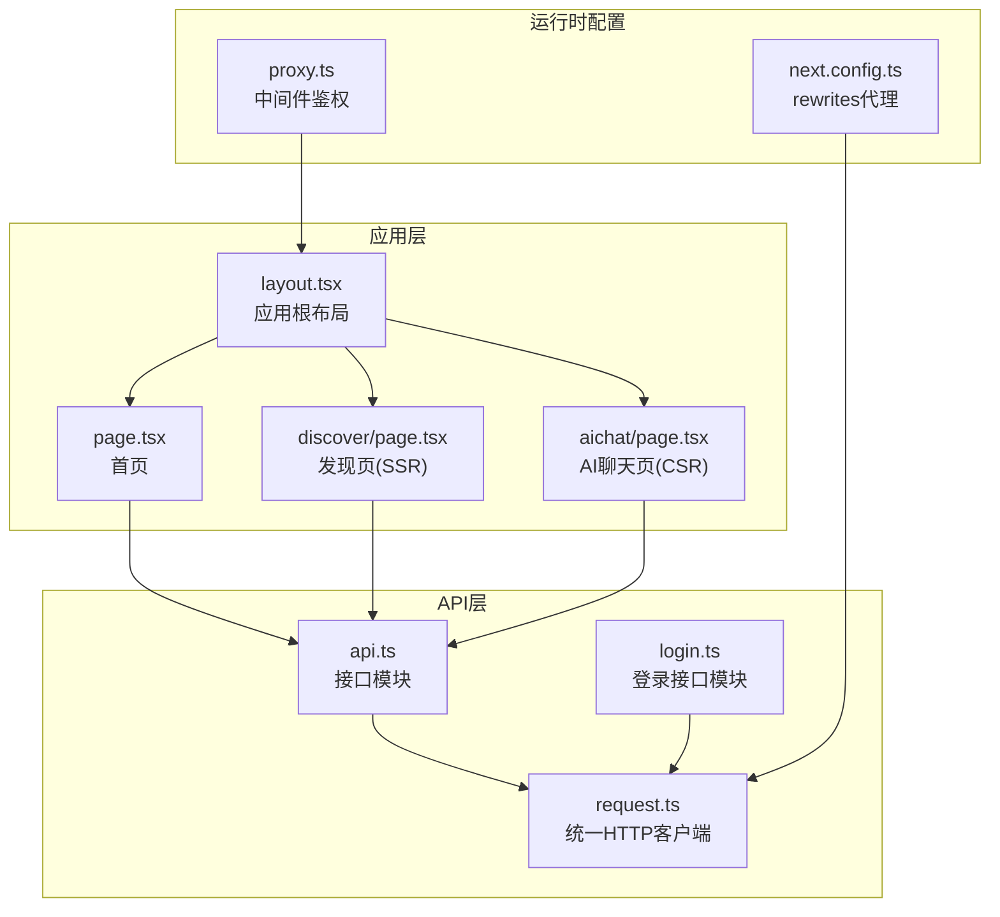
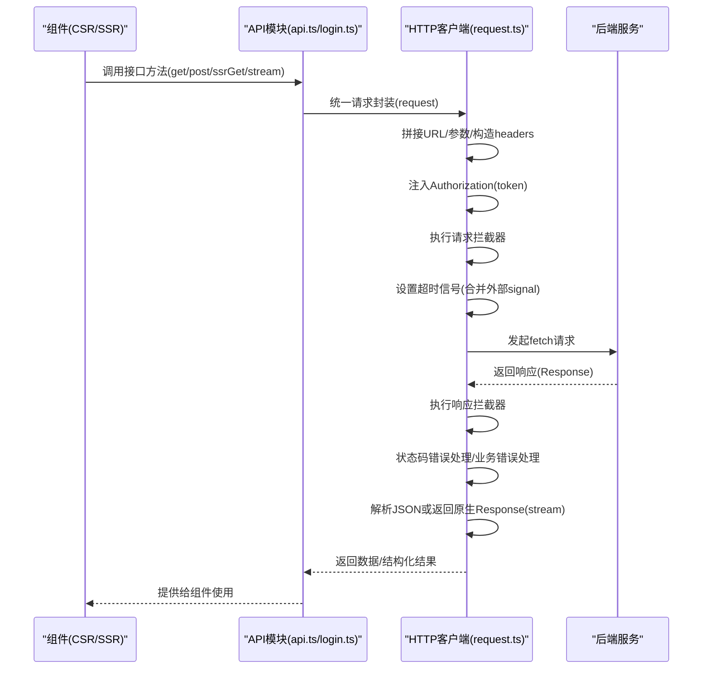
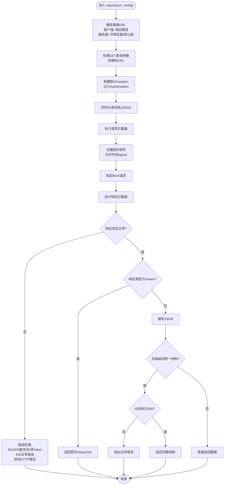
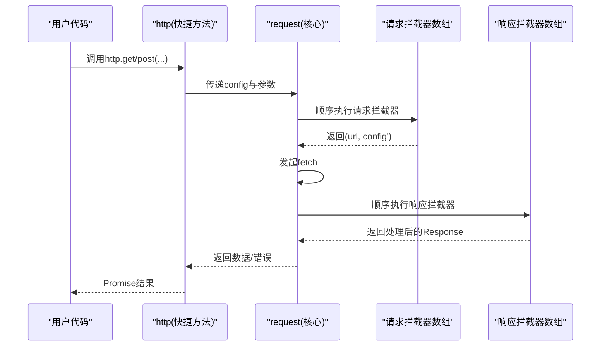
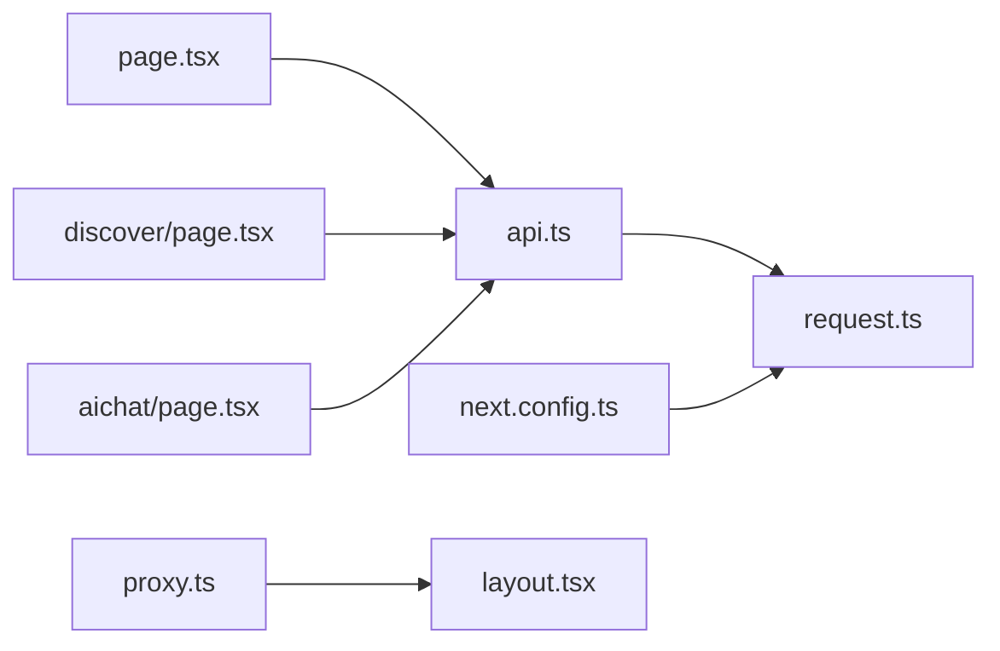

# HTTP客户端配置

<cite>
**本文档引用的文件**
- [src/api/request.ts](file://src/api/request.ts)
- [src/api/api.ts](file://src/api/api.ts)
- [src/api/login.ts](file://src/api/login.ts)
- [src/app/aichat/page.tsx](file://src/app/aichat/page.tsx)
- [src/app/discover/page.tsx](file://src/app/discover/page.tsx)
- [src/components/Providers.tsx](file://src/components/Providers.tsx)
- [next.config.ts](file://next.config.ts)
- [proxy.ts](file://proxy.ts)
- [src/app/layout.tsx](file://src/app/layout.tsx)
- [src/app/page.tsx](file://src/app/page.tsx)
</cite>

## 目录
1. [简介](#简介)
2. [项目结构](#项目结构)
3. [核心组件](#核心组件)
4. [架构总览](#架构总览)
5. [详细组件分析](#详细组件分析)
6. [依赖分析](#依赖分析)
7. [性能考虑](#性能考虑)
8. [故障排查指南](#故障排查指南)
9. [结论](#结论)
10. [附录](#附录)

## 简介
本文件系统化阐述该项目的HTTP客户端配置与使用，涵盖以下主题：
- 初始化流程与基础URL配置
- 默认请求头设置与认证token注入
- 超时控制与信号合并策略
- 请求/响应拦截器机制与典型用法
- 错误处理与业务错误模型
- 配置示例：自定义请求选项、处理不同内容类型、实现请求重试
- 性能优化建议与最佳实践

## 项目结构
HTTP客户端位于src/api/request.ts，围绕统一的request函数与便捷方法（get/post/put/delete/stream/ssrGet）构建；上层API模块（如src/api/api.ts、src/api/login.ts）对具体接口进行分组管理；应用层组件通过这些API发起请求。

**图表来源**
- [src/app/layout.tsx:28-43](file://src/app/layout.tsx#L28-L43)
- [src/app/page.tsx:7](file://src/app/page.tsx#L7)
- [src/app/discover/page.tsx:26](file://src/app/discover/page.tsx#L26)
- [src/app/aichat/page.tsx:5](file://src/app/aichat/page.tsx#L5)
- [src/api/api.ts:6](file://src/api/api.ts#L6)
- [src/api/request.ts:57-235](file://src/api/request.ts#L57-L235)
- [next.config.ts:30-45](file://next.config.ts#L30-L45)
- [proxy.ts:11-33](file://proxy.ts#L11-L33)

**章节来源**
- [src/api/request.ts:1-455](file://src/api/request.ts#L1-L455)
- [src/api/api.ts:1-128](file://src/api/api.ts#L1-L128)
- [src/api/login.ts:1-81](file://src/api/login.ts#L1-L81)
- [next.config.ts:1-76](file://next.config.ts#L1-L76)
- [proxy.ts:1-52](file://proxy.ts#L1-L52)

## 核心组件
- 统一请求函数：负责URL拼接、查询参数、请求头、请求体、拦截器、超时控制、错误处理与响应解析。
- 快捷方法：get/post/put/patch/delete/stream/ssrGet，简化常见场景。
- 拦截器：请求拦截器与响应拦截器，支持链式扩展。
- 错误模型：HttpError（HTTP状态错误）、BusinessError（业务错误码）。
- SSR支持：ssrGet提供cache/revalidate控制，适配Server Component。

关键实现要点：
- 基础URL：客户端使用相对路径，服务端（SSR）使用环境变量或默认值。
- 认证：自动从localStorage（客户端）或cookies（服务端）读取token并注入Authorization头。
- 超时：基于AbortController，支持与外部signal合并。
- 响应：支持json与stream两种响应类型；对统一业务结构进行解包与校验。

**章节来源**
- [src/api/request.ts:35-47](file://src/api/request.ts#L35-L47)
- [src/api/request.ts:94-112](file://src/api/request.ts#L94-L112)
- [src/api/request.ts:130-146](file://src/api/request.ts#L130-L146)
- [src/api/request.ts:157-212](file://src/api/request.ts#L157-L212)
- [src/api/request.ts:239-261](file://src/api/request.ts#L239-L261)

## 架构总览
HTTP客户端采用“统一入口 + 模块化API”的分层设计，结合Next.js的App Router与SSR能力，形成前后端一致的请求体验。

**图表来源**
- [src/api/api.ts:44-80](file://src/api/api.ts#L44-L80)
- [src/api/request.ts:57-235](file://src/api/request.ts#L57-L235)

## 详细组件分析

### 统一请求函数与初始化流程
- 基础URL选择：在服务端环境（SSR）使用完整URL，在客户端使用相对路径，确保跨环境一致性。
- 查询参数：GET请求将params序列化为查询字符串附加到URL。
- 请求头：默认Content-Type为application/json，支持自定义headers；自动注入Authorization头。
- 请求体：当存在body时进行JSON序列化。
- 拦截器：依次执行请求拦截器与响应拦截器，支持链式扩展。
- 超时控制：使用AbortController实现超时；若外部传入signal，优先使用AbortSignal.any合并，否则回退到事件监听。
- 错误处理：区分HTTP状态错误、超时、网络错误；对统一业务结构进行解包与校验。

**图表来源**
- [src/api/request.ts:57-235](file://src/api/request.ts#L57-L235)

**章节来源**
- [src/api/request.ts:57-235](file://src/api/request.ts#L57-L235)

### 基础URL配置
- 客户端（浏览器）：使用空字符串作为基础URL，浏览器自动拼接当前域。
- 服务端（SSR）：使用环境变量BACKEND_URL，若未设置则回退至本地默认端口。
- 代理：通过Next.js rewrites将前端/api/*代理到后端完整URL，无需在代码中硬编码。

**章节来源**
- [src/api/request.ts:35-47](file://src/api/request.ts#L35-L47)
- [next.config.ts:30-45](file://next.config.ts#L30-L45)

### 默认请求头与认证token注入
- Content-Type默认为application/json，可通过config.headers覆盖。
- 客户端：从localStorage读取token并注入Authorization头。
- 服务端：从cookies读取token并注入Authorization头（动态导入避免污染客户端模块）。
- 代理：通过中间件proxy.ts对未登录访问进行重定向。

**章节来源**
- [src/api/request.ts:88-112](file://src/api/request.ts#L88-L112)
- [proxy.ts:19-32](file://proxy.ts#L19-L32)

### 超时配置与信号合并
- 超时：默认10000ms，可通过config.timeout覆盖。
- 信号合并：若外部传入signal，优先使用AbortSignal.any([internal, external])；否则回退到事件监听手动触发内部取消。
- 适用场景：组件级取消（如聊天页的stop streaming）与全局超时控制并存。

**章节来源**
- [src/api/request.ts:61-70](file://src/api/request.ts#L61-L70)
- [src/api/request.ts:130-146](file://src/api/request.ts#L130-L146)
- [src/app/aichat/page.tsx:207-214](file://src/app/aichat/page.tsx#L207-L214)

### 请求拦截器与响应拦截器
- 请求拦截器：接收(url, config)，返回新的[url, config]，可用于注入多语言头、签名、埋点等。
- 响应拦截器：接收Response，返回Response或Promise<Response>，可用于刷新token、统一错误提示等。
- 注册位置：可在layout.tsx或应用入口文件中注册，影响全局请求链路。

**图表来源**
- [src/api/request.ts:27-31](file://src/api/request.ts#L27-L31)
- [src/api/request.ts:337-345](file://src/api/request.ts#L337-L345)

**章节来源**
- [src/api/request.ts:27-31](file://src/api/request.ts#L27-L31)
- [src/api/request.ts:337-345](file://src/api/request.ts#L337-L345)

### 错误处理与业务错误模型
- HTTP状态错误：抛出HttpError，包含status与message；401/403在客户端清理token并跳转登录，在服务端通过重定向处理。
- 业务错误：当后端返回统一结构且code不为200时，抛出BusinessError。
- 超时与网络错误：分别抛出对应HttpError，便于上层捕获与提示。
- 统一结构兜底：若data缺失，自动补空数组，保证调用方稳定性。

**章节来源**
- [src/api/request.ts:157-234](file://src/api/request.ts#L157-L234)
- [src/api/request.ts:239-261](file://src/api/request.ts#L239-L261)

### SSR专用方法与缓存控制
- ssrGet：为Server Component提供缓存控制，支持no-store、force-cache与ISR（revalidate秒数）。
- 与Next.js缓存机制协同：在服务端渲染场景下，合理设置revalidate以平衡新鲜度与性能。

**章节来源**
- [src/api/request.ts:309-333](file://src/api/request.ts#L309-L333)
- [src/app/discover/page.tsx:26-50](file://src/app/discover/page.tsx#L26-L50)

### 配置示例与最佳实践

- 自定义请求选项
  - 设置超时：在config中传入timeout字段。
  - 覆盖默认Content-Type：通过config.headers覆盖默认值。
  - 传递自定义头部：例如在请求拦截器中注入Accept-Language。
  - 传递signal：用于组件级取消（如聊天页的stop streaming）。

- 处理不同内容类型的响应
  - JSON响应：默认行为，自动解析并支持统一结构解包。
  - 流式响应（SSE）：使用stream方法，返回原生Response供业务侧读取reader。

- 实现请求重试逻辑
  - 建议在响应拦截器中根据状态码判断是否重试，并结合指数退避策略。
  - 注意避免对幂等性敏感的请求进行无差别重试。

- 最佳实践
  - 在layout.tsx或入口文件注册通用拦截器，避免重复代码。
  - 服务端与客户端的token来源分离（cookies vs localStorage），确保SSR安全。
  - 合理设置SSR缓存策略，避免过度缓存导致数据陈旧。
  - 对外网关使用Next.js rewrites进行代理，隐藏真实后端地址。

**章节来源**
- [src/api/request.ts:125-128](file://src/api/request.ts#L125-L128)
- [src/api/request.ts:292-301](file://src/api/request.ts#L292-L301)
- [src/app/aichat/page.tsx:207-214](file://src/app/aichat/page.tsx#L207-L214)

## 依赖分析
- 组件依赖API模块：页面组件通过hotTopicsApi等接口调用HTTP客户端。
- API模块依赖HTTP客户端：统一的request封装与便捷方法。
- 运行时配置依赖Next.js：rewrites代理与SSR缓存控制。
- 中间件依赖：proxy.ts对未登录访问进行重定向。

**图表来源**
- [src/app/page.tsx:7](file://src/app/page.tsx#L7)
- [src/app/discover/page.tsx:26](file://src/app/discover/page.tsx#L26)
- [src/app/aichat/page.tsx:5](file://src/app/aichat/page.tsx#L5)
- [src/api/api.ts:6](file://src/api/api.ts#L6)
- [src/api/request.ts:57-235](file://src/api/request.ts#L57-L235)
- [next.config.ts:30-45](file://next.config.ts#L30-L45)
- [proxy.ts:11-33](file://proxy.ts#L11-L33)

**章节来源**
- [src/app/page.tsx:7](file://src/app/page.tsx#L7)
- [src/app/discover/page.tsx:26](file://src/app/discover/page.tsx#L26)
- [src/app/aichat/page.tsx:5](file://src/app/aichat/page.tsx#L5)
- [src/api/api.ts:6](file://src/api/api.ts#L6)
- [src/api/request.ts:57-235](file://src/api/request.ts#L57-L235)
- [next.config.ts:30-45](file://next.config.ts#L30-L45)
- [proxy.ts:11-33](file://proxy.ts#L11-L33)

## 性能考虑
- SSR缓存策略：合理使用ssrGet的revalidate参数，避免过度缓存；对热点数据可采用较短revalidate提升新鲜度。
- 代理与网络：通过rewrites减少DNS与TLS握手开销；在内网环境尽量缩短往返时间。
- 请求拦截器：避免在拦截器中执行阻塞操作，保持链路轻量。
- 流式响应：对于大响应或SSE场景，使用stream模式降低内存占用。
- 错误快速失败：对明显失败的请求尽早中断，减少不必要的计算与IO。

## 故障排查指南
- 401/403未授权
  - 客户端：检查localStorage中的token是否存在与有效；确认拦截器未被意外覆盖。
  - 服务端：检查cookies中token；确认中间件proxy.ts正确重定向。
- 超时问题
  - 检查config.timeout设置；确认外部signal未提前取消；观察AbortSignal.any合并逻辑。
- 网络错误
  - 检查rewrites配置与目标后端可达性；确认代理路径正确。
- 业务错误
  - 检查后端返回的统一结构；确认BusinessError被捕获并处理。

**章节来源**
- [src/api/request.ts:161-173](file://src/api/request.ts#L161-L173)
- [proxy.ts:19-32](file://proxy.ts#L19-L32)
- [next.config.ts:30-45](file://next.config.ts#L30-L45)

## 结论
本HTTP客户端通过统一的request封装与模块化API设计，实现了跨环境的一致性、完善的错误处理与灵活的拦截器机制。结合Next.js的SSR与rewrites能力，既能满足高性能的客户端渲染，也能在服务端场景下获得良好的数据新鲜度与缓存控制。建议在实际项目中遵循拦截器集中注册、SSR缓存策略合理配置与流式响应优先的原则，持续优化用户体验与系统性能。

## 附录
- 代理配置参考：next.config.ts中的rewrites规则，将/api/*代理到BACKEND_URL。
- 中间件鉴权：proxy.ts对未登录访问进行重定向，保护受保护路由。
- 组件入口：layout.tsx中引入Providers，为应用提供全局状态与UI能力。

**章节来源**
- [next.config.ts:30-45](file://next.config.ts#L30-L45)
- [proxy.ts:11-33](file://proxy.ts#L11-L33)
- [src/components/Providers.tsx:8-19](file://src/components/Providers.tsx#L8-L19)