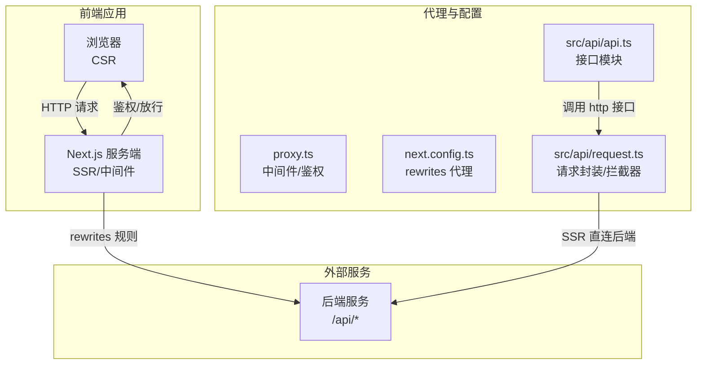
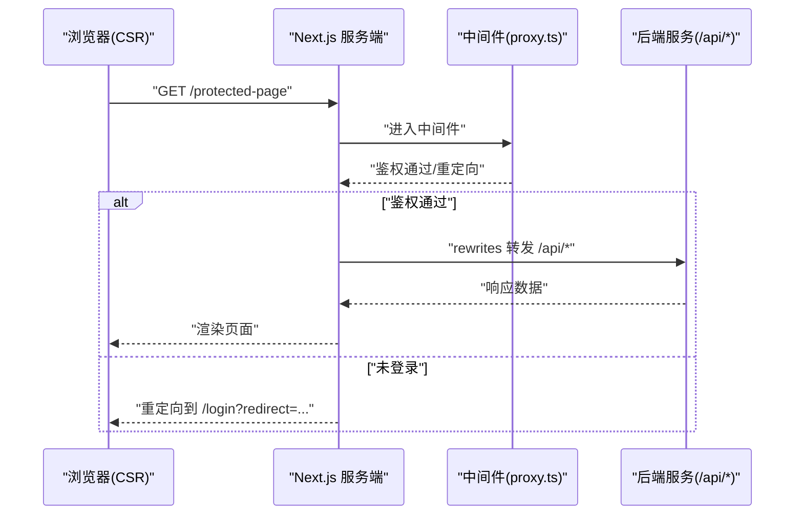
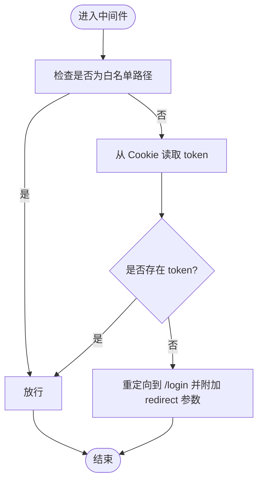
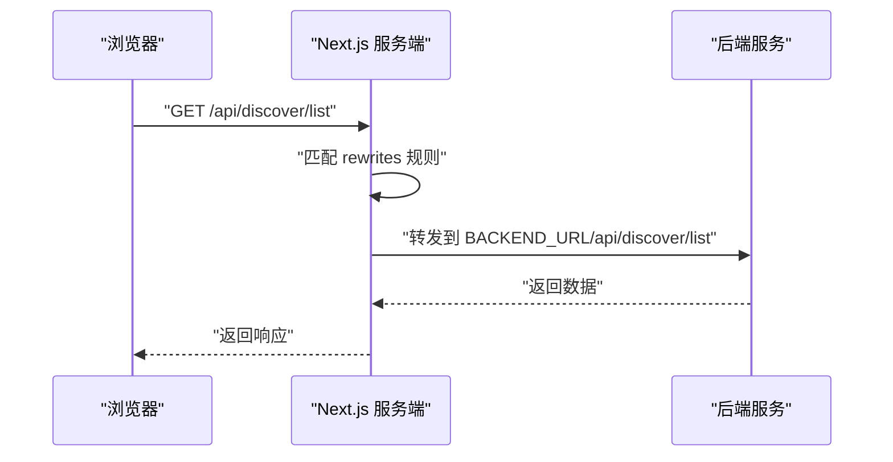
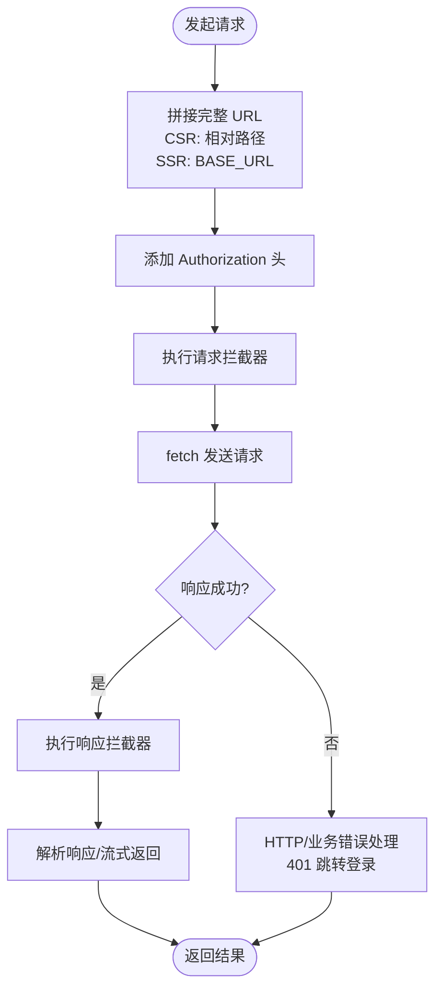
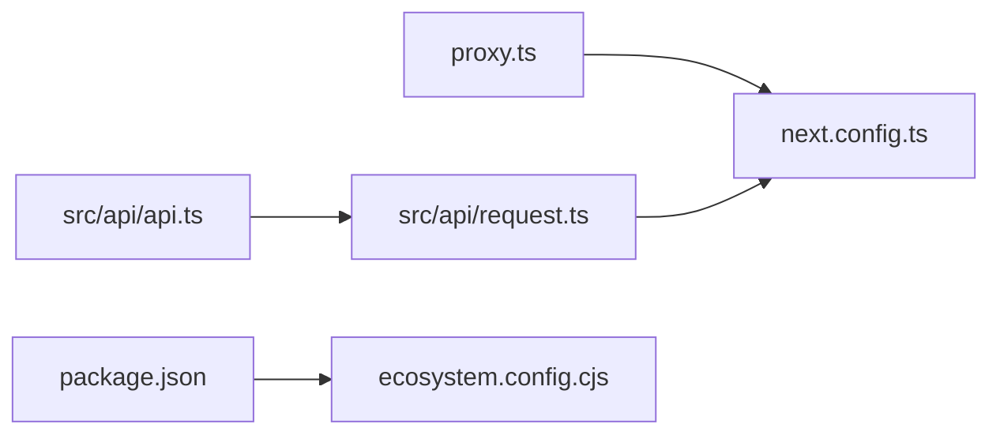

# 代理配置

<cite>
**本文引用的文件**
- [proxy.ts](file://proxy.ts)
- [next.config.ts](file://next.config.ts)
- [src/api/request.ts](file://src/api/request.ts)
- [src/api/api.ts](file://src/api/api.ts)
- [package.json](file://package.json)
- [ecosystem.config.cjs](file://ecosystem.config.cjs)
- [doc/对话问题.md](file://doc/对话问题.md)
</cite>

## 目录
1. [简介](#简介)
2. [项目结构](#项目结构)
3. [核心组件](#核心组件)
4. [架构总览](#架构总览)
5. [详细组件分析](#详细组件分析)
6. [依赖分析](#依赖分析)
7. [性能考虑](#性能考虑)
8. [故障排查指南](#故障排查指南)
9. [结论](#结论)
10. [附录](#附录)

## 简介
本文件系统化梳理本项目的代理配置与路由重写机制，重点覆盖以下方面：
- Next.js 代理中间件（原中间件）的鉴权与路径拦截
- 路由重写（rewrites）规则与反向代理行为
- 本地开发环境的 API 代理、跨域请求处理与外部服务集成
- 生产环境部署注意事项与性能优化建议
- 具体配置示例（路径映射、头部转发、SSL 证书配置）

## 项目结构
本项目采用 App Router 架构，代理相关的关键文件分布如下：
- 代理中间件：proxy.ts（原中间件，负责全局路由拦截与鉴权）
- 路由重写与构建配置：next.config.ts（定义 /api/* 代理规则）
- 前端请求封装与外部服务对接：src/api/request.ts（统一请求、拦截器、SSR/CSR 分支）
- 接口模块：src/api/api.ts（按模块组织的接口定义）
- 环境变量与脚本：package.json（开发/生产脚本）、doc/对话问题.md（常见问题与配置说明）
- 生产进程管理：ecosystem.config.cjs（PM2 配置）

图表来源
- [proxy.ts:11-33](file://proxy.ts#L11-L33)
- [next.config.ts:30-45](file://next.config.ts#L30-L45)
- [src/api/request.ts:40-47](file://src/api/request.ts#L40-L47)
- [src/api/api.ts:44-81](file://src/api/api.ts#L44-L81)

章节来源
- [proxy.ts:1-52](file://proxy.ts#L1-L52)
- [next.config.ts:1-76](file://next.config.ts#L1-L76)
- [src/api/request.ts:1-455](file://src/api/request.ts#L1-L455)
- [src/api/api.ts:1-128](file://src/api/api.ts#L1-L128)
- [package.json:1-39](file://package.json#L1-L39)
- [ecosystem.config.cjs:1-20](file://ecosystem.config.cjs#L1-L20)
- [doc/对话问题.md:1-344](file://doc/对话问题.md#L1-L344)

## 核心组件
- 代理中间件（原中间件）：对受保护路径进行鉴权，未登录用户重定向至登录页，并携带重定向目标参数；对静态资源路径进行排除。
- 路由重写（rewrites）：将前端 /api/* 请求转发至外部后端服务，实现反向代理效果，浏览器地址栏不变化。
- 请求封装（request.ts）：统一处理基础路径、超时、拦截器、SSR/CSR 分支、错误处理与响应拦截；支持服务端直连后端。
- 接口模块（api.ts）：按功能模块组织接口，便于调用与维护。
- 环境变量与脚本：通过环境变量控制后端地址与基础路径，PM2 管理生产进程。

章节来源
- [proxy.ts:11-33](file://proxy.ts#L11-L33)
- [next.config.ts:30-45](file://next.config.ts#L30-L45)
- [src/api/request.ts:40-47](file://src/api/request.ts#L40-L47)
- [src/api/api.ts:44-81](file://src/api/api.ts#L44-L81)
- [package.json:5-10](file://package.json#L5-L10)
- [ecosystem.config.cjs:13-16](file://ecosystem.config.cjs#L13-L16)

## 架构总览
下面的序列图展示了浏览器请求在不同场景下的流转过程，包括 CSR、SSR 以及中间件鉴权。

图表来源
- [proxy.ts:11-33](file://proxy.ts#L11-L33)
- [next.config.ts:30-45](file://next.config.ts#L30-L45)

## 详细组件分析

### 代理中间件（原中间件）
- 功能要点
  - 白名单路径（如 /login、/register）直接放行
  - 其他受保护路径从 Cookie 读取 token，无 token 则重定向至登录页并携带当前路径参数
  - 对静态资源路径（_next/static、_next/image、favicon.ico、api、images）进行排除，避免进入鉴权逻辑
- 关键点
  - 中间件对受保护路径进行统一鉴权，确保未登录用户无法访问
  - matcher 配置精确控制进入中间件的路径范围，减少不必要的处理

图表来源
- [proxy.ts:11-33](file://proxy.ts#L11-L33)
- [proxy.ts:39-51](file://proxy.ts#L39-L51)

章节来源
- [proxy.ts:11-33](file://proxy.ts#L11-L33)
- [proxy.ts:39-51](file://proxy.ts#L39-L51)

### 路由重写（rewrites）与反向代理
- 功能要点
  - 将前端 /api/* 请求转发至外部后端服务，实现反向代理效果
  - 浏览器地址栏不变化，请求由 Next.js 服务端发起并返回
  - 通过环境变量控制后端地址，支持不同环境切换
- 配置示例
  - /api/* → 后端地址 + /api/*
  - 可扩展为特定子路径代理（如 /api/auth/* → 指定服务）
- 注意事项
  - 开发环境默认兜底地址不应指向本机端口，避免死循环
  - 建议移除兜底默认值，确保明确的后端地址

图表来源
- [next.config.ts:30-45](file://next.config.ts#L30-L45)
- [doc/对话问题.md:32-48](file://doc/对话问题.md#L32-L48)

章节来源
- [next.config.ts:27-45](file://next.config.ts#L27-L45)
- [doc/对话问题.md:22-58](file://doc/对话问题.md#L22-L58)
- [doc/对话问题.md:282-305](file://doc/对话问题.md#L282-L305)

### 请求封装与外部服务集成
- 功能要点
  - 统一处理基础路径：CSR 使用相对路径，SSR 使用完整 URL
  - 自动添加 Authorization 头（基于 token）
  - 支持请求/响应拦截器，便于统一处理头部、日志与错误
  - SSR 场景支持缓存控制（no-store、force-cache、ISR）
  - 支持流式请求（SSE）
- 与重写的协作
  - CSR：通过 rewrites 由服务端转发，无需直连后端
  - SSR：可直接连接后端（BASE_URL），避免中间层转发开销
- 错误处理
  - 统一 HTTP 错误与业务错误处理
  - 401/403 自动跳转登录页

图表来源
- [src/api/request.ts:57-235](file://src/api/request.ts#L57-L235)
- [src/api/request.ts:40-47](file://src/api/request.ts#L40-L47)

章节来源
- [src/api/request.ts:40-47](file://src/api/request.ts#L40-L47)
- [src/api/request.ts:94-112](file://src/api/request.ts#L94-L112)
- [src/api/request.ts:148-235](file://src/api/request.ts#L148-L235)
- [src/api/request.ts:309-333](file://src/api/request.ts#L309-L333)

### 接口模块与调用
- 功能要点
  - 按模块组织接口，便于维护与复用
  - 支持 SSR/CSR 两种调用方式
  - 可扩展外部服务接口（如 /api/backend/*）
- 使用建议
  - 将与后端交互的接口集中在 api.ts 中，统一管理

章节来源
- [src/api/api.ts:44-81](file://src/api/api.ts#L44-L81)
- [src/api/api.ts:110-127](file://src/api/api.ts#L110-L127)

## 依赖分析
- 组件耦合
  - proxy.ts 与 next.config.ts 协作：中间件负责鉴权，rewrites 负责转发
  - request.ts 与 api.ts：接口模块依赖请求封装
  - package.json 与 ecosystem.config.cjs：开发/生产脚本与进程管理
- 外部依赖
  - Next.js 版本与特性（App Router、rewrites、中间件）
  - PM2（ecosystem.config.cjs）用于生产进程管理

图表来源
- [proxy.ts:11-33](file://proxy.ts#L11-L33)
- [next.config.ts:30-45](file://next.config.ts#L30-L45)
- [src/api/api.ts:6](file://src/api/api.ts#L6)
- [src/api/request.ts:6](file://src/api/request.ts#L6)
- [package.json:5-10](file://package.json#L5-L10)
- [ecosystem.config.cjs:1-20](file://ecosystem.config.cjs#L1-L20)

章节来源
- [package.json:1-39](file://package.json#L1-L39)
- [ecosystem.config.cjs:1-20](file://ecosystem.config.cjs#L1-L20)

## 性能考虑
- 重写转发 vs 直连
  - CSR：通过 rewrites 由服务端转发，避免跨域与 CORS 处理
  - SSR：可直接连接后端，减少一次服务端转发开销
- 缓存策略
  - SSR 支持缓存控制（no-store、force-cache、ISR），合理设置可降低后端压力
- 超时与中断
  - 请求封装内置超时控制，避免长时间挂起
- 构建与分析
  - 可启用 Bundle Analyzer 辅助定位体积热点

章节来源
- [src/api/request.ts:130-147](file://src/api/request.ts#L130-L147)
- [src/api/request.ts:309-333](file://src/api/request.ts#L309-L333)
- [next.config.ts:71-76](file://next.config.ts#L71-L76)

## 故障排查指南
- 客户端无法访问 process.env.BACKEND_URL
  - 原因：非 NEXT_PUBLIC_ 前缀的环境变量不会注入浏览器
  - 解决：使用 NEXT_PUBLIC_BACKEND_URL 或在 CSR 中使用相对路径走 rewrites
- 开发环境重写默认值导致死循环
  - 现象：destination 默认指向本机端口
  - 解决：移除兜底默认值，确保明确的 BACKEND_URL
- 401/403 自动跳转登录
  - 行为：响应拦截器检测到 401/403 自动跳转
  - 建议：在业务侧处理登录态失效的提示与重定向
- 基础路径与部署
  - basePath 由环境变量控制，生产环境通过 Nginx 代理时需正确配置

章节来源
- [doc/对话问题.md:221-250](file://doc/对话问题.md#L221-L250)
- [doc/对话问题.md:282-305](file://doc/对话问题.md#L282-L305)
- [src/api/request.ts:432-440](file://src/api/request.ts#L432-L440)
- [next.config.ts:5-8](file://next.config.ts#L5-L8)

## 结论
本项目通过“中间件鉴权 + 路由重写”的组合，实现了安全、灵活且高性能的代理与外部服务集成方案：
- 中间件保障受保护路径的安全访问
- 重写规则将 /api/* 请求转发至外部后端，简化跨域与头部处理
- 请求封装统一了 CSR/SSR 的调用差异，支持拦截器与缓存策略
- 生产环境可通过 PM2 与 Nginx 配合部署，结合 basePath 与 SSL 证书实现稳定上线

## 附录

### 本地开发环境代理配置步骤
- 设置后端地址
  - 在 .env.local/.env.development 中配置 BACKEND_URL
  - 如需浏览器访问 NEXT_PUBLIC_BACKEND_URL（不推荐）
- 启动项目
  - 使用 package.json 中的 dev 脚本启动
- 访问接口
  - 在前端代码中使用 /api/* 路径，Next.js 服务端根据 rewrites 转发至后端

章节来源
- [doc/对话问题.md:44-58](file://doc/对话问题.md#L44-L58)
- [package.json:5-10](file://package.json#L5-L10)

### 跨域请求处理与外部服务集成
- 跨域处理
  - CSR：通过 rewrites 由服务端转发，避免浏览器跨域限制
  - SSR：可直接连接后端，避免跨域
- 外部服务集成
  - 在 next.config.ts 中配置 /api/* 到目标后端的映射
  - 在 api.ts 中按模块组织接口，统一调用 request.ts

章节来源
- [next.config.ts:27-45](file://next.config.ts#L27-L45)
- [src/api/api.ts:44-81](file://src/api/api.ts#L44-L81)

### 生产环境部署注意事项
- 进程管理
  - 使用 ecosystem.config.cjs 启动生产进程，设置端口与内存重启阈值
- 基础路径与 Nginx
  - 通过 NEXT_PUBLIC_BASE_PATH 控制 basePath，Nginx 代理路径需与之匹配
- SSL 证书
  - 在 Nginx 层面配置 SSL 证书与 HTTPS，确保前后端通信安全
- 性能优化
  - 合理设置 SSR 缓存策略（no-store/force-cache/ISR）
  - 使用 Bundle Analyzer 分析包体积，优化加载性能

章节来源
- [ecosystem.config.cjs:13-16](file://ecosystem.config.cjs#L13-L16)
- [next.config.ts:5-8](file://next.config.ts#L5-L8)
- [src/api/request.ts:309-333](file://src/api/request.ts#L309-L333)
- [next.config.ts:71-76](file://next.config.ts#L71-L76)