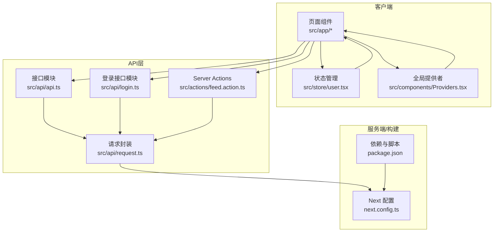
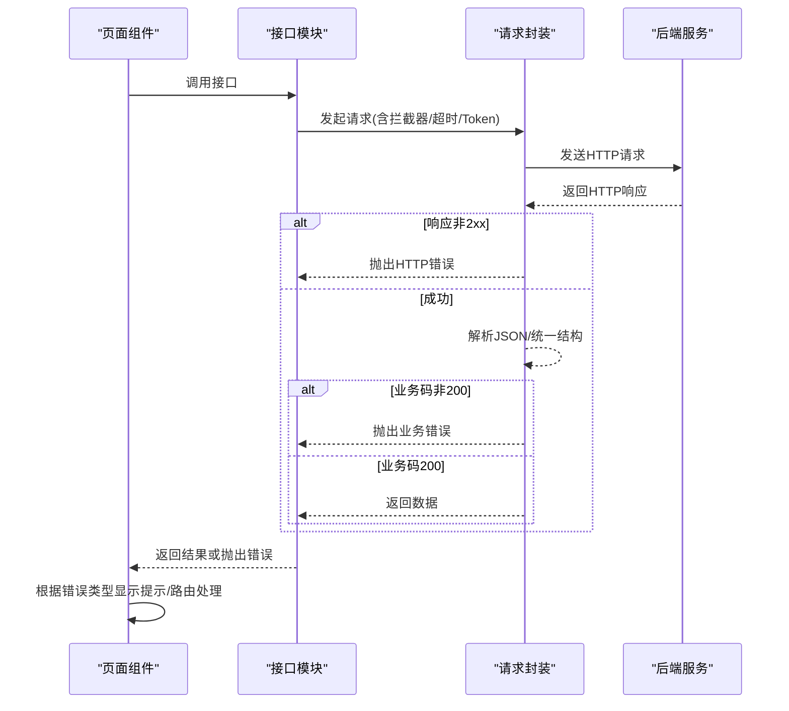
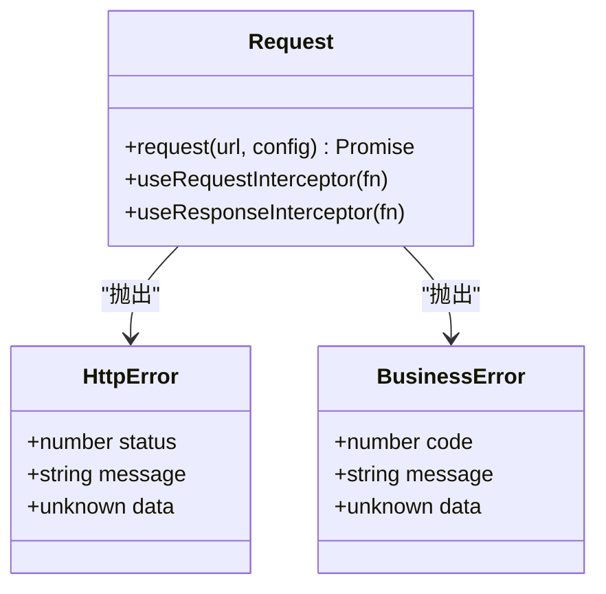
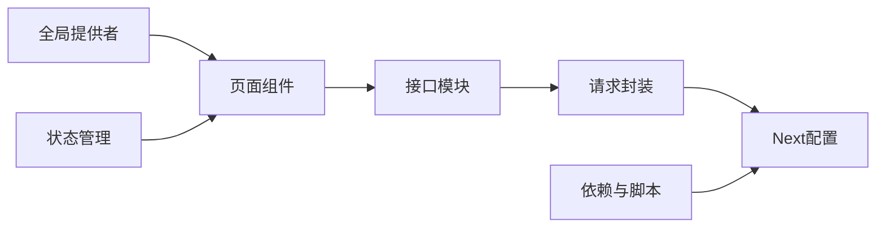

# 错误处理机制

<cite>
**本文引用的文件**
- [src/api/request.ts](file://src/api/request.ts)
- [src/api/api.ts](file://src/api/api.ts)
- [src/api/login.ts](file://src/api/login.ts)
- [src/actions/feed.action.ts](file://src/actions/feed.action.ts)
- [src/app/login/page.tsx](file://src/app/login/page.tsx)
- [src/app/discover/page.tsx](file://src/app/discover/page.tsx)
- [src/components/Providers.tsx](file://src/components/Providers.tsx)
- [src/store/user.tsx](file://src/store/user.tsx)
- [next.config.ts](file://next.config.ts)
- [package.json](file://package.json)
</cite>

## 目录
1. [简介](#简介)
2. [项目结构](#项目结构)
3. [核心组件](#核心组件)
4. [架构总览](#架构总览)
5. [详细组件分析](#详细组件分析)
6. [依赖关系分析](#依赖关系分析)
7. [性能考量](#性能考量)
8. [故障排查指南](#故障排查指南)
9. [结论](#结论)
10. [附录](#附录)

## 简介
本文件系统化梳理本项目的错误处理机制，覆盖网络请求错误分类、错误捕获与处理策略、HTTP状态码映射、网络异常处理、业务逻辑错误统一处理、错误重试机制实现思路、用户友好提示设计以及日志记录策略，并提供调试工具使用指南与常见错误场景的解决方案。目标是帮助开发者快速理解并扩展错误处理能力，提升系统的稳定性与用户体验。

## 项目结构
本项目采用“按模块组织”的API封装与调用方式，核心请求封装位于API层，页面组件负责展示与交互，全局提供者负责UI提示组件的注入，状态管理用于用户信息存储，配置文件负责代理与构建优化。

图表来源
- [src/api/request.ts](file://src/api/request.ts)
- [src/api/api.ts](file://src/api/api.ts)
- [src/api/login.ts](file://src/api/login.ts)
- [src/actions/feed.action.ts](file://src/actions/feed.action.ts)
- [src/app/discover/page.tsx](file://src/app/discover/page.tsx)
- [src/app/login/page.tsx](file://src/app/login/page.tsx)
- [src/components/Providers.tsx](file://src/components/Providers.tsx)
- [src/store/user.tsx](file://src/store/user.tsx)
- [next.config.ts](file://next.config.ts)
- [package.json](file://package.json)

章节来源
- [src/api/request.ts](file://src/api/request.ts)
- [src/api/api.ts](file://src/api/api.ts)
- [src/api/login.ts](file://src/api/login.ts)
- [src/actions/feed.action.ts](file://src/actions/feed.action.ts)
- [src/app/discover/page.tsx](file://src/app/discover/page.tsx)
- [src/app/login/page.tsx](file://src/app/login/page.tsx)
- [src/components/Providers.tsx](file://src/components/Providers.tsx)
- [src/store/user.tsx](file://src/store/user.tsx)
- [next.config.ts](file://next.config.ts)
- [package.json](file://package.json)

## 核心组件
- 请求封装与错误类型
  - 统一请求入口与拦截器机制，内置超时控制、Token 注入、响应拦截与错误分类。
  - 提供两类错误类型：HTTP 错误（4xx/5xx）与业务错误（后端统一返回码非200）。
- 接口模块
  - 按功能模块组织API调用，便于维护与复用；支持SSR/ISR模式。
- 页面与交互
  - 登录页对认证失败进行专门提示；发现页对SSR错误进行捕获与降级。
- 全局提供者与状态
  - 注入Toast组件，提供用户可见的错误提示；Zustand状态管理用于用户信息存储。
- 代理与构建
  - Next配置提供rewrites代理，简化跨域与多后端场景；构建优化减少生产环境日志输出。

章节来源
- [src/api/request.ts](file://src/api/request.ts)
- [src/api/api.ts](file://src/api/api.ts)
- [src/api/login.ts](file://src/api/login.ts)
- [src/app/login/page.tsx](file://src/app/login/page.tsx)
- [src/app/discover/page.tsx](file://src/app/discover/page.tsx)
- [src/components/Providers.tsx](file://src/components/Providers.tsx)
- [src/store/user.tsx](file://src/store/user.tsx)
- [next.config.ts](file://next.config.ts)

## 架构总览
整体错误处理流程分为三层：
- 网络层：统一请求封装，处理超时、网络异常、HTTP状态码映射与拦截器。
- 业务层：识别业务错误码，统一抛出业务错误类型，供上层消费。
- 表现层：页面与组件根据错误类型进行用户提示与路由处理。

图表来源
- [src/api/request.ts](file://src/api/request.ts)
- [src/api/api.ts](file://src/api/api.ts)
- [src/app/login/page.tsx](file://src/app/login/page.tsx)

## 详细组件分析

### 请求封装与错误分类
- 超时控制
  - 使用AbortController与setTimeout实现超时控制，支持与外部signal合并，避免被内部超时覆盖。
- Token注入
  - 客户端从localStorage读取，服务端从cookies读取，自动附加Authorization头。
- 拦截器
  - 支持请求/响应拦截器，便于统一添加语言头、刷新Token、统一错误处理等。
- HTTP状态码映射
  - 401/403：统一跳转登录（客户端清理本地token，服务端通过重定向处理）。
  - 402：认证失败，抛出HTTP错误并携带后端消息。
  - 其他4xx/5xx：抛出HTTP错误，包含状态码与消息。
- 业务错误统一处理
  - 若后端返回统一结构{code,data,message}，当code!=200时抛出业务错误；若code==200但data缺失，进行防御性兜底。
- 流式请求
  - 支持SSE场景，返回原生Response实例，交由业务侧自行读取流。
- 错误类型
  - HttpError：封装HTTP状态码与消息。
  - BusinessError：封装业务错误码与数据。

图表来源
- [src/api/request.ts](file://src/api/request.ts)

章节来源
- [src/api/request.ts](file://src/api/request.ts)

### 接口模块与SSR/ISR
- 接口模块
  - 将不同功能的API按模块组织，便于调用与维护；支持SSR/ISR模式获取数据。
- SSR/ISR
  - 通过ssrGet方法在服务端获取数据，支持no-store/dynamic、force-cache与ISR（按秒数）三种缓存策略。

章节来源
- [src/api/api.ts](file://src/api/api.ts)
- [src/api/request.ts](file://src/api/request.ts)

### 页面与交互中的错误处理
- 登录页
  - 对认证失败（402）进行专门提示；成功后写入localStorage与cookie，并根据redirect/from/callbackUrl参数跳转。
- 发现页（SSR）
  - 捕获可能的重定向错误（NEXT_REDIRECT），确保跳转生效；对异常进行降级处理，保证页面可用。

章节来源
- [src/app/login/page.tsx](file://src/app/login/page.tsx)
- [src/app/discover/page.tsx](file://src/app/discover/page.tsx)

### 全局提供者与状态管理
- 全局提供者
  - 注入ToastProvider，提供顶部弹窗提示能力，便于统一展示错误信息。
- 状态管理
  - 使用Zustand管理用户信息，支持在登录成功后更新用户信息。

章节来源
- [src/components/Providers.tsx](file://src/components/Providers.tsx)
- [src/store/user.tsx](file://src/store/user.tsx)

### Server Actions中的错误处理
- Server Actions
  - 在服务端执行写入类操作，天然屏蔽后端域名与token参数暴露；对异常进行兜底并返回用户可读提示。

章节来源
- [src/actions/feed.action.ts](file://src/actions/feed.action.ts)

### 代理与构建配置
- 代理（rewrites）
  - 通过Next配置将前端/api/*代理到指定后端，简化跨域与多后端场景。
- 构建优化
  - 生产环境移除console输出，降低日志噪声。

章节来源
- [next.config.ts](file://next.config.ts)
- [package.json](file://package.json)

## 依赖关系分析
- 组件耦合
  - 页面组件依赖接口模块；接口模块依赖请求封装；全局提供者与状态管理为表现层提供支撑。
- 外部依赖
  - @heroui/react提供Toast组件；zustand提供状态管理；Next.js提供SSR/ISR与rewrites能力。
- 潜在风险
  - 服务端重定向错误需正确抛出以生效；拦截器链路复杂度增加，需注意顺序与副作用。

图表来源
- [src/api/request.ts](file://src/api/request.ts)
- [src/api/api.ts](file://src/api/api.ts)
- [src/app/discover/page.tsx](file://src/app/discover/page.tsx)
- [src/app/login/page.tsx](file://src/app/login/page.tsx)
- [src/components/Providers.tsx](file://src/components/Providers.tsx)
- [src/store/user.tsx](file://src/store/user.tsx)
- [next.config.ts](file://next.config.ts)
- [package.json](file://package.json)

章节来源
- [src/api/request.ts](file://src/api/request.ts)
- [src/api/api.ts](file://src/api/api.ts)
- [src/app/discover/page.tsx](file://src/app/discover/page.tsx)
- [src/app/login/page.tsx](file://src/app/login/page.tsx)
- [src/components/Providers.tsx](file://src/components/Providers.tsx)
- [src/store/user.tsx](file://src/store/user.tsx)
- [next.config.ts](file://next.config.ts)
- [package.json](file://package.json)

## 性能考量
- 超时控制
  - 合理设置超时阈值，避免长时间阻塞；在并发请求中考虑统一超时策略。
- 缓存策略
  - SSR/ISR模式结合业务特性选择合适的缓存策略，减少重复请求与后端压力。
- 日志输出
  - 生产环境移除console输出，降低I/O开销；开发环境保留详细日志便于定位问题。

章节来源
- [src/api/request.ts](file://src/api/request.ts)
- [next.config.ts](file://next.config.ts)

## 故障排查指南
- 常见错误场景与解决
  - 401/403未授权：客户端清理localStorage中的token，服务端通过重定向处理；检查Token是否正确写入cookie与localStorage。
  - 402认证失败：登录页对402进行专门提示，确认用户名/密码正确性与后端认证逻辑。
  - 超时错误：检查网络状况与后端响应时间，适当提高超时阈值或优化后端性能。
  - 网络异常：检查代理配置与跨域设置，确认rewrites规则正确。
  - 业务错误：根据后端返回的统一结构{code,message,data}进行处理，必要时在拦截器中统一转换。
- 调试工具使用
  - 浏览器Network面板：观察请求状态码、响应体与拦截器链路。
  - 控制台日志：区分HTTP错误与业务错误，定位具体错误来源。
  - SSR错误：在服务端组件中捕获重定向错误并重新抛出，确保跳转生效。
- 用户提示设计
  - 使用Toast组件进行统一提示，区分danger/success/warning等变体，提升可读性与一致性。
- 日志记录策略
  - 开发环境保留详细日志；生产环境移除console输出，必要时接入结构化日志系统。

章节来源
- [src/app/login/page.tsx](file://src/app/login/page.tsx)
- [src/app/discover/page.tsx](file://src/app/discover/page.tsx)
- [src/api/request.ts](file://src/api/request.ts)
- [src/components/Providers.tsx](file://src/components/Providers.tsx)
- [next.config.ts](file://next.config.ts)

## 结论
本项目的错误处理机制通过统一的请求封装、明确的错误类型与拦截器机制，实现了HTTP状态码映射、业务错误统一处理、用户友好提示与日志策略的协同。结合SSR/ISR与代理配置，能够在多场景下稳定运行。建议在实际使用中进一步完善错误重试机制与监控告警体系，持续提升系统的可靠性与可观测性。

## 附录
- 错误重试机制实现方案（建议）
  - 基于指数退避的重试策略：对瞬时网络异常与5xx类错误进行有限次数重试，避免雪崩效应。
  - 区分幂等性：仅对GET/HEAD等幂等请求进行自动重试，写操作需谨慎处理。
  - 配置化：允许在请求配置中启用/禁用重试与设置最大重试次数与退避系数。
- 用户友好提示设计
  - 明确错误分类：HTTP错误、业务错误、网络异常、超时等，分别给出清晰提示。
  - 提供操作建议：如“点击重试”、“检查网络连接”、“联系客服”等。
- 日志记录策略
  - 结构化日志：记录时间戳、请求URL、状态码、错误类型、用户标识等关键信息。
  - 分级输出：开发环境详细日志，生产环境精简日志，敏感信息脱敏处理。