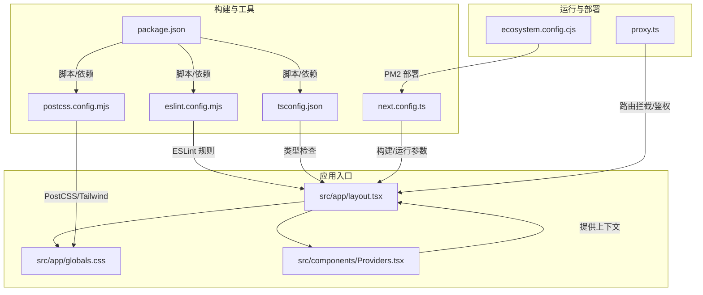
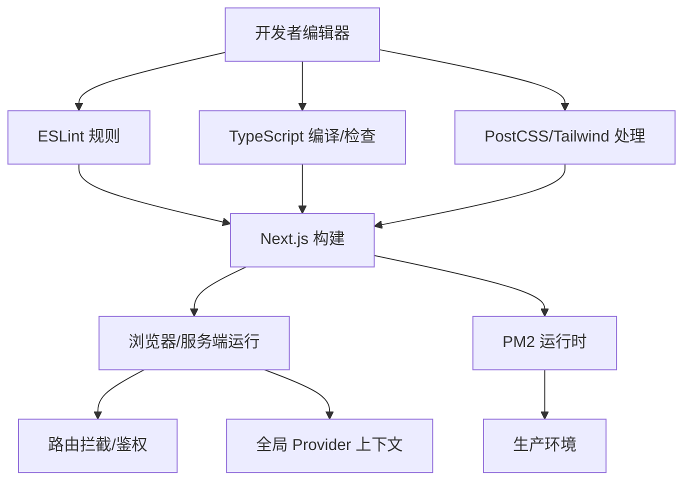
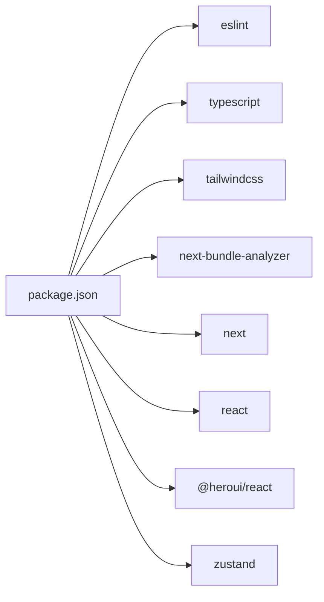

# 开发工具

<cite>
**本文引用的文件**
- [eslint.config.mjs](file://eslint.config.mjs)
- [tsconfig.json](file://tsconfig.json)
- [postcss.config.mjs](file://postcss.config.mjs)
- [next.config.ts](file://next.config.ts)
- [package.json](file://package.json)
- [ecosystem.config.cjs](file://ecosystem.config.cjs)
- [src/app/globals.css](file://src/app/globals.css)
- [src/app/layout.tsx](file://src/app/layout.tsx)
- [src/components/Providers.tsx](file://src/components/Providers.tsx)
- [src/app/login/login.css](file://src/app/login/login.css)
- [src/app/register/login.css](file://src/app/register/login.css)
- [proxy.ts](file://proxy.ts)
- [README.md](file://README.md)
</cite>

## 目录
1. [简介](#简介)
2. [项目结构](#项目结构)
3. [核心组件](#核心组件)
4. [架构总览](#架构总览)
5. [详细组件分析](#详细组件分析)
6. [依赖分析](#依赖分析)
7. [性能考虑](#性能考虑)
8. [故障排查指南](#故障排查指南)
9. [结论](#结论)
10. [附录](#附录)

## 简介
本文件系统性梳理本项目的开发工具与配置，覆盖以下主题：
- ESLint 规则与 Next.js 最佳实践集成
- TypeScript 类型检查与严格模式配置
- PostCSS/Tailwind v4 样式管线与主题变量
- Git 与代码格式化、自动化工具（含 PM2 部署脚本）
- 开发环境调试、热重载与错误追踪技巧
- IDE 配置建议与插件推荐
- 代码质量保障与团队协作工具使用建议

## 项目结构
本项目采用 Next.js App Router 结构，核心开发工具配置集中在根目录的配置文件中，并通过入口布局与组件进行统一注入。

图表来源
- [src/app/layout.tsx:1-44](file://src/app/layout.tsx#L1-L44)
- [src/app/globals.css:1-288](file://src/app/globals.css#L1-L288)
- [src/components/Providers.tsx:1-20](file://src/components/Providers.tsx#L1-L20)
- [eslint.config.mjs:1-19](file://eslint.config.mjs#L1-L19)
- [tsconfig.json:1-35](file://tsconfig.json#L1-L35)
- [postcss.config.mjs:1-8](file://postcss.config.mjs#L1-L8)
- [next.config.ts:1-76](file://next.config.ts#L1-L76)
- [package.json:1-39](file://package.json#L1-L39)
- [proxy.ts:1-52](file://proxy.ts#L1-L52)
- [ecosystem.config.cjs:1-20](file://ecosystem.config.cjs#L1-L20)

章节来源
- [README.md:1-37](file://README.md#L1-L37)
- [package.json:1-39](file://package.json#L1-L39)

## 核心组件
- ESLint 配置：基于 eslint-config-next 的 Core Web Vitals 与 TypeScript 规则，自定义忽略项以适配项目结构。
- TypeScript 配置：启用严格模式、增量编译、隔离模块、路径映射等，确保类型安全与高性能开发体验。
- PostCSS/Tailwind：使用 Tailwind v4 插件管线，结合主题变量与 Heroui 样式库，实现一致的设计系统。
- Next.js 构建配置：基础路径、图像远程模式、API 代理、组件缓存、生产环境移除 console 等。
- 运行与部署：开发脚本、构建脚本、PM2 配置用于生产部署。
- 入口布局与全局样式：统一字体、主题变量、Provider 上下文与全局样式注入。
- 路由拦截与鉴权：基于 Cookie 的全局中间层代理，保护受保护路由。

章节来源
- [eslint.config.mjs:1-19](file://eslint.config.mjs#L1-L19)
- [tsconfig.json:1-35](file://tsconfig.json#L1-L35)
- [postcss.config.mjs:1-8](file://postcss.config.mjs#L1-L8)
- [next.config.ts:1-76](file://next.config.ts#L1-L76)
- [package.json:1-39](file://package.json#L1-L39)
- [src/app/layout.tsx:1-44](file://src/app/layout.tsx#L1-L44)
- [src/app/globals.css:1-288](file://src/app/globals.css#L1-L288)
- [src/components/Providers.tsx:1-20](file://src/components/Providers.tsx#L1-L20)
- [proxy.ts:1-52](file://proxy.ts#L1-L52)
- [ecosystem.config.cjs:1-20](file://ecosystem.config.cjs#L1-L20)

## 架构总览
开发工具链围绕“配置即约定”的理念组织，从编辑器到构建、测试、部署形成闭环。

图表来源
- [eslint.config.mjs:1-19](file://eslint.config.mjs#L1-L19)
- [tsconfig.json:1-35](file://tsconfig.json#L1-L35)
- [postcss.config.mjs:1-8](file://postcss.config.mjs#L1-L8)
- [next.config.ts:1-76](file://next.config.ts#L1-L76)
- [src/app/layout.tsx:1-44](file://src/app/layout.tsx#L1-L44)
- [src/components/Providers.tsx:1-20](file://src/components/Providers.tsx#L1-L20)
- [proxy.ts:1-52](file://proxy.ts#L1-L52)
- [ecosystem.config.cjs:1-20](file://ecosystem.config.cjs#L1-L20)

## 详细组件分析

### ESLint 规则配置
- 集成策略
  - 使用 eslint-config-next 的 Core Web Vitals 与 TypeScript 规则，确保性能指标与类型安全。
  - 自定义忽略项覆盖默认忽略列表，避免对构建产物与临时目录误报。
- 建议
  - 在 CI 中执行 lint 脚本，保持团队一致性。
  - 如需扩展规则，建议新增独立规则文件并通过合并方式引入，避免破坏现有规则集。

章节来源
- [eslint.config.mjs:1-19](file://eslint.config.mjs#L1-L19)
- [package.json:1-39](file://package.json#L1-L39)

### TypeScript 类型检查
- 关键配置点
  - 严格模式开启，提升类型安全性。
  - noEmit 与 bundler 模块解析，适配 Next.js App Router。
  - isolatedModules 与增量编译，提升开发体验。
  - 路径别名 @/* 映射至 src，简化导入。
- 建议
  - 在本地与 CI 中均启用类型检查，避免运行时错误。
  - 对新增模块补充类型声明，保持类型覆盖率。

章节来源
- [tsconfig.json:1-35](file://tsconfig.json#L1-L35)

### PostCSS 与样式处理
- 配置要点
  - 使用 Tailwind v4 插件管线，结合 @tailwindcss/postcss 插件。
  - 全局样式通过 src/app/globals.css 引入 Tailwind 与 Heroui 样式。
  - 主题变量通过 :root 与 @theme inline 定义，统一颜色与字体。
- 登录页样式
  - 登录与注册页面分别提供独立样式文件，便于快速定位与维护。
- 建议
  - 将通用样式抽离至主题变量，减少重复定义。
  - 使用 Tailwind 实现响应式与交互，避免过度手写 CSS。

章节来源
- [postcss.config.mjs:1-8](file://postcss.config.mjs#L1-L8)
- [src/app/globals.css:1-288](file://src/app/globals.css#L1-L288)
- [src/app/login/login.css:1-18](file://src/app/login/login.css#L1-L18)
- [src/app/register/login.css:1-18](file://src/app/register/login.css#L1-L18)

### Next.js 构建与运行配置
- 基础路径与输出目录
  - 通过环境变量控制 basePath，适配反向代理场景；默认输出目录为 .next。
- 图像优化
  - 支持 http/https 远程模式，满足多来源图片需求。
- API 代理（Rewrite）
  - 将 /api/* 请求代理至后端服务，支持多环境配置。
- 组件缓存与生产优化
  - 启用 cacheComponents 提升渲染性能；生产环境移除 console。
- Bundle 分析
  - 通过环境变量开关 bundle analyzer，辅助体积分析。
- 建议
  - 在开发与生产环境明确区分 basePath 与 BACKEND_URL。
  - 使用 revalidate 或 staleTimes 等机制控制动态内容缓存。

章节来源
- [next.config.ts:1-76](file://next.config.ts#L1-L76)
- [package.json:1-39](file://package.json#L1-L39)

### 入口布局与全局样式
- 布局
  - RootLayout 注入字体变量、viewport 设置与 Providers 上下文。
- 全局样式
  - 引入 Tailwind 与 Heroui，定义主题变量与通用样式。
- 建议
  - 将品牌色与字体变量集中管理，避免散落定义。
  - 使用 Suspense 包裹 Provider，提升水合稳定性。

章节来源
- [src/app/layout.tsx:1-44](file://src/app/layout.tsx#L1-L44)
- [src/app/globals.css:1-288](file://src/app/globals.css#L1-L288)
- [src/components/Providers.tsx:1-20](file://src/components/Providers.tsx#L1-L20)

### 路由拦截与鉴权
- 功能概述
  - 基于 Cookie 的 token 校验，白名单路径直接放行，未登录用户跳转登录页并携带 redirect 参数。
  - 使用 matcher 排除静态资源与 API 路由，避免误拦截。
- 建议
  - 在客户端与服务端均校验 token，确保安全边界。
  - 将鉴权逻辑抽象为 Hook 或中间件，复用到其他页面。

章节来源
- [proxy.ts:1-52](file://proxy.ts#L1-L52)

### 运行与部署
- 开发与构建脚本
  - dev/start/build/lint 脚本统一由 package.json 管理。
- PM2 部署
  - ecosystem.config.cjs 定义应用名称、启动命令、工作目录、自动重启与内存阈值，适合生产环境常驻运行。
- 建议
  - 在 CI 中执行 lint 与 build，确保部署前质量门禁。
  - 使用环境变量区分开发/生产配置，避免硬编码。

章节来源
- [package.json:1-39](file://package.json#L1-L39)
- [ecosystem.config.cjs:1-20](file://ecosystem.config.cjs#L1-L20)

## 依赖分析
- 开发依赖
  - ESLint、TypeScript、Tailwind v4、Next Bundle Analyzer，支撑代码质量与构建优化。
- 运行依赖
  - Next.js、React、Heroui、Zustand 等，构成应用功能与状态管理基础。
- 脚本与工具链
  - 通过 npm scripts 统一调用 ESLint、TypeScript、Next.js，配合 PM2 实现生产部署。

图表来源
- [package.json:1-39](file://package.json#L1-L39)

章节来源
- [package.json:1-39](file://package.json#L1-L39)

## 性能考虑
- 组件缓存
  - 启用 cacheComponents，减少重复渲染开销。
- 生产优化
  - 移除 console 输出，降低包体与运行时负担。
- 图像与网络
  - 合理配置 remotePatterns，避免跨域风险；必要时开启 CDN。
- 样式体积
  - 使用 Tailwind 原子类，按需引入组件样式，避免全局样式膨胀。

章节来源
- [next.config.ts:1-76](file://next.config.ts#L1-L76)
- [postcss.config.mjs:1-8](file://postcss.config.mjs#L1-L8)

## 故障排查指南
- ESLint 报错
  - 检查 eslint.config.mjs 是否正确合并 Core Web Vitals 与 TypeScript 规则；确认忽略项是否覆盖到构建产物目录。
- TypeScript 错误
  - 查看 tsconfig.json 的 strict、noEmit、moduleResolution 等选项；确保路径别名 @/* 正确映射。
- 样式异常
  - 确认 src/app/globals.css 是否正确引入 Tailwind 与 Heroui；检查 postcss.config.mjs 的插件配置。
- 路由拦截失效
  - 检查 proxy.ts 的白名单与 matcher；确认 Cookie 中 token 名称与存储方式一致。
- 构建失败或体积过大
  - 使用 ANALYZE=true 启用 bundle analyzer；审查 next.config.ts 的 rewrites 与 cacheComponents 配置。
- 生产进程崩溃
  - 检查 ecosystem.config.cjs 的 max_memory_restart 与日志输出；确认环境变量与端口配置。

章节来源
- [eslint.config.mjs:1-19](file://eslint.config.mjs#L1-L19)
- [tsconfig.json:1-35](file://tsconfig.json#L1-L35)
- [postcss.config.mjs:1-8](file://postcss.config.mjs#L1-L8)
- [proxy.ts:1-52](file://proxy.ts#L1-L52)
- [next.config.ts:1-76](file://next.config.ts#L1-L76)
- [ecosystem.config.cjs:1-20](file://ecosystem.config.cjs#L1-L20)

## 结论
本项目通过标准化的开发工具链实现了高质量的前端工程化：ESLint 与 TypeScript 确保代码质量与类型安全；PostCSS/Tailwind v4 提供一致的设计系统；Next.js 构建配置与路由拦截保障性能与安全；PM2 部署脚本简化生产运维。建议在团队内推广统一的脚本与配置规范，持续优化构建与运行时性能。

## 附录

### 开发环境调试与热重载
- 启动开发服务器
  - 使用 package.json 中的 dev 脚本启动，默认端口 3005。
- 热重载
  - 修改页面、组件或样式会触发局部热更新；若样式未生效，检查 PostCSS 插件与 Tailwind 配置。
- 错误追踪
  - 打开浏览器控制台查看运行时错误；在 Next.js 中可通过日志与堆栈信息定位问题。

章节来源
- [package.json:1-39](file://package.json#L1-L39)
- [next.config.ts:1-76](file://next.config.ts#L1-L76)

### IDE 配置与插件推荐
- VS Code
  - 推荐安装 ESLint、Tailwind CSS IntelliSense、TypeScript Importer、Path Intellisense 等插件。
  - 设置 Editor: Format On Save 与 Editor: Code Actions On Save，提升一致性。
- WebStorm/IntelliJ
  - 启用 ESLint 与 TypeScript 集成；配置 Tailwind CSS 插件以获得智能提示。
- 通用建议
  - 团队统一使用 prettier/eslint/tsconfig 等配置，避免本地差异导致的冲突。

### 代码质量与团队协作
- 质量门禁
  - 在 CI 中执行 lint 与 build；对 PR 强制通过质量检查。
- 文档与规范
  - 维护 README 与内部文档，明确开发流程、分支策略与发布流程。
- 版本与依赖
  - 使用 yarn/pnpm 管理依赖版本；定期同步 Next.js 与相关生态依赖。