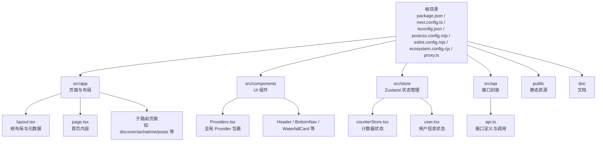
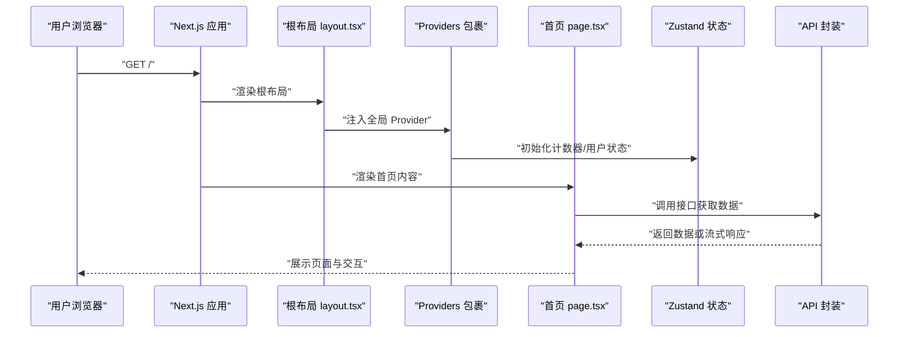
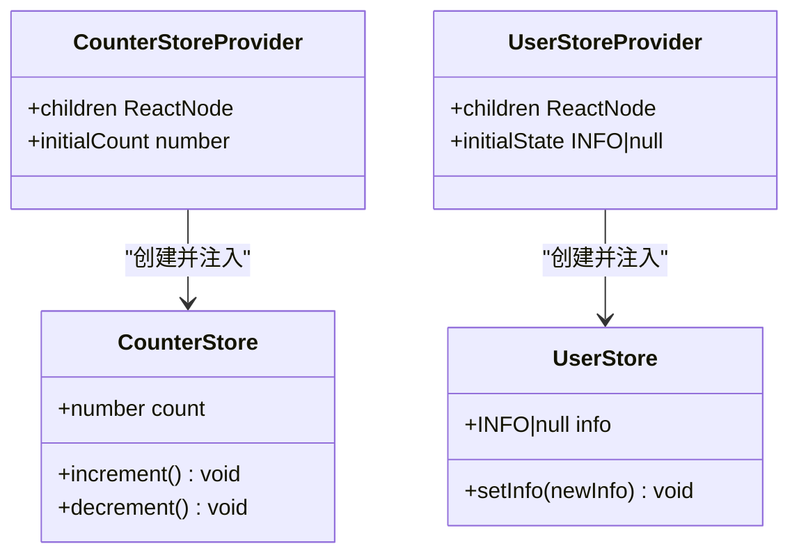
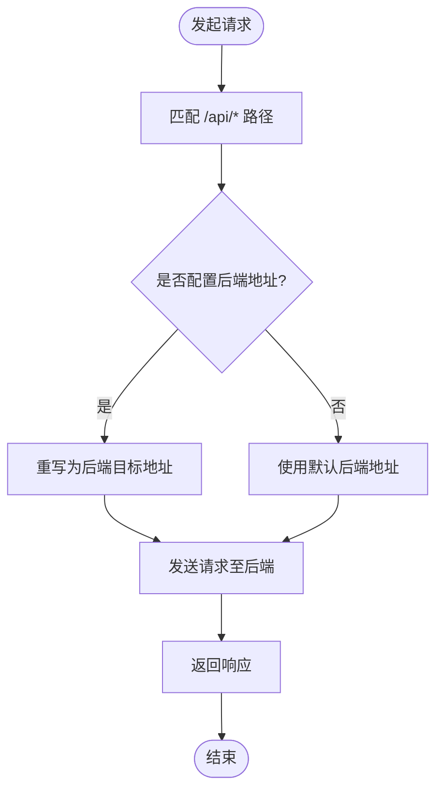
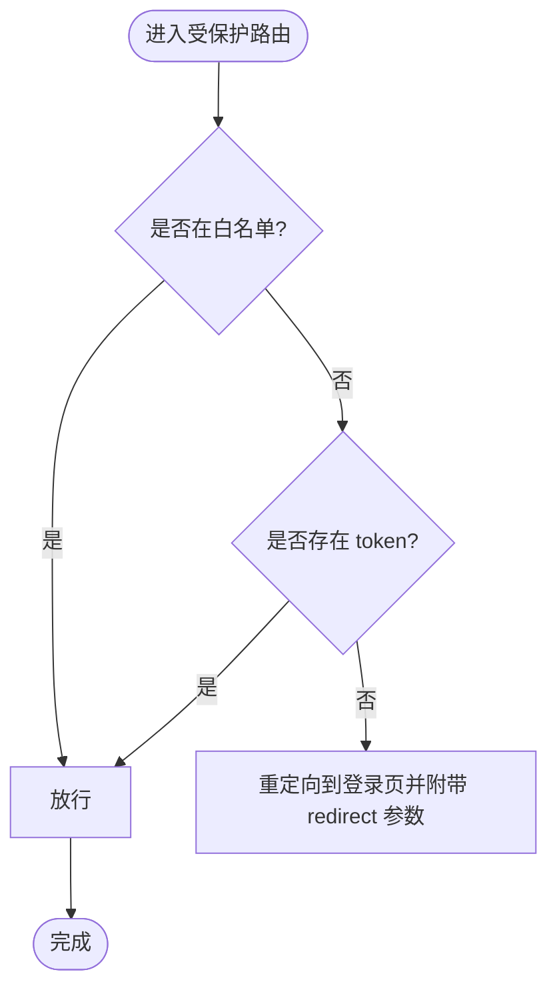

# 快速开始

<cite>
**本文引用的文件**
- [package.json](file://package.json)
- [README.md](file://README.md)
- [next.config.ts](file://next.config.ts)
- [tsconfig.json](file://tsconfig.json)
- [postcss.config.mjs](file://postcss.config.mjs)
- [eslint.config.mjs](file://eslint.config.mjs)
- [ecosystem.config.cjs](file://ecosystem.config.cjs)
- [src/app/layout.tsx](file://src/app/layout.tsx)
- [src/app/page.tsx](file://src/app/page.tsx)
- [src/components/Providers.tsx](file://src/components/Providers.tsx)
- [src/store/counterStore.tsx](file://src/store/counterStore.tsx)
- [src/store/user.tsx](file://src/store/user.tsx)
- [src/api/api.ts](file://src/api/api.ts)
- [proxy.ts](file://proxy.ts)
- [src/app/globals.css](file://src/app/globals.css)
</cite>

## 目录
1. [简介](#简介)
2. [项目结构](#项目结构)
3. [核心组件](#核心组件)
4. [架构总览](#架构总览)
5. [详细组件分析](#详细组件分析)
6. [依赖分析](#依赖分析)
7. [性能考虑](#性能考虑)
8. [故障排查指南](#故障排查指南)
9. [结论](#结论)
10. [附录](#附录)

## 简介
本指南面向首次接触本项目的开发者，帮助你在本地快速完成项目初始化、开发环境配置与依赖安装，并掌握启动开发服务器、构建与运行的基本流程。文档覆盖多包管理器（npm、yarn、pnpm、bun）的使用方式、开发服务器启动、项目目录结构概览、基础运行流程与常见问题解决思路，确保你能迅速上手并理解项目的基本架构。

## 项目结构
本项目采用 Next.js App Router 结构，核心目录与职责如下：
- src/app：页面、布局、路由组、API 路由等
- src/components：可复用 UI 组件
- src/store：基于 Zustand 的状态管理
- src/api：统一的接口封装与调用
- public：静态资源
- doc：文档资料
- 根目录配置：package.json、next.config.ts、tsconfig.json、postcss.config.mjs、eslint.config.mjs、ecosystem.config.cjs、proxy.ts 等

图表来源
- [src/app/layout.tsx:1-44](file://src/app/layout.tsx#L1-L44)
- [src/app/page.tsx:1-75](file://src/app/page.tsx#L1-L75)
- [src/components/Providers.tsx:1-20](file://src/components/Providers.tsx#L1-L20)
- [src/store/counterStore.tsx:1-89](file://src/store/counterStore.tsx#L1-L89)
- [src/store/user.tsx:1-56](file://src/store/user.tsx#L1-L56)
- [src/api/api.ts:1-128](file://src/api/api.ts#L1-L128)

章节来源
- [package.json:1-39](file://package.json#L1-L39)
- [next.config.ts:1-76](file://next.config.ts#L1-L76)
- [tsconfig.json:1-35](file://tsconfig.json#L1-L35)
- [postcss.config.mjs:1-8](file://postcss.config.mjs#L1-L8)
- [eslint.config.mjs:1-19](file://eslint.config.mjs#L1-L19)
- [ecosystem.config.cjs:1-20](file://ecosystem.config.cjs#L1-L20)
- [proxy.ts:1-52](file://proxy.ts#L1-L52)

## 核心组件
- 根布局与元数据：定义站点标题、视口、字体与全局样式入口。
- 首页内容：展示头部导航、分类标签、瀑布流内容与底部导航；使用 Suspense 实现流式加载骨架屏。
- 全局 Provider：整合 Toast、用户状态与计数器状态。
- 状态管理：Zustand 提供轻量、易用的状态仓库，支持服务端与客户端组件。
- 接口封装：统一管理后端接口，支持 SSR/ISR 与流式响应。
- 代理与鉴权：基于中间件实现路由拦截与登录跳转。

章节来源
- [src/app/layout.tsx:1-44](file://src/app/layout.tsx#L1-L44)
- [src/app/page.tsx:1-75](file://src/app/page.tsx#L1-L75)
- [src/components/Providers.tsx:1-20](file://src/components/Providers.tsx#L1-L20)
- [src/store/counterStore.tsx:1-89](file://src/store/counterStore.tsx#L1-L89)
- [src/store/user.tsx:1-56](file://src/store/user.tsx#L1-L56)
- [src/api/api.ts:1-128](file://src/api/api.ts#L1-L128)
- [proxy.ts:1-52](file://proxy.ts#L1-L52)

## 架构总览
下图展示了从浏览器访问到页面渲染、状态注入与接口调用的整体流程。

图表来源
- [src/app/layout.tsx:1-44](file://src/app/layout.tsx#L1-L44)
- [src/components/Providers.tsx:1-20](file://src/components/Providers.tsx#L1-L20)
- [src/store/counterStore.tsx:1-89](file://src/store/counterStore.tsx#L1-L89)
- [src/store/user.tsx:1-56](file://src/store/user.tsx#L1-L56)
- [src/api/api.ts:1-128](file://src/api/api.ts#L1-L128)
- [src/app/page.tsx:1-75](file://src/app/page.tsx#L1-L75)

## 详细组件分析

### 根布局与全局样式
- 根布局负责注入字体变量、全局样式与 Provider 包裹，确保子组件共享状态与主题。
- 全局样式通过 Tailwind 与 Heroui 主题系统统一管理，支持自定义颜色与动画。

章节来源
- [src/app/layout.tsx:1-44](file://src/app/layout.tsx#L1-L44)
- [src/app/globals.css:1-288](file://src/app/globals.css#L1-L288)
- [src/components/Providers.tsx:1-20](file://src/components/Providers.tsx#L1-L20)

### 首页内容与流式加载
- 首页通过 Suspense 与骨架屏实现流式加载，提升首屏体验。
- 数据来源于接口封装模块，支持服务端渲染与增量静态再生（ISR）策略。

章节来源
- [src/app/page.tsx:1-75](file://src/app/page.tsx#L1-L75)
- [src/api/api.ts:1-128](file://src/api/api.ts#L1-L128)

### 状态管理（Zustand）
- 计数器状态与用户状态分别通过独立的 Provider 注入，避免跨组件重复创建实例。
- 使用 useRef 保证 Provider 内部状态仓库在组件多次渲染时不丢失。

图表来源
- [src/store/counterStore.tsx:1-89](file://src/store/counterStore.tsx#L1-L89)
- [src/store/user.tsx:1-56](file://src/store/user.tsx#L1-L56)

章节来源
- [src/store/counterStore.tsx:1-89](file://src/store/counterStore.tsx#L1-L89)
- [src/store/user.tsx:1-56](file://src/store/user.tsx#L1-L56)

### 接口封装与代理
- 接口模块集中管理后端 API，支持 SSR/ISR 与流式响应。
- next.config.ts 中配置 rewrites，将前端 /api/* 请求代理到外部后端地址，便于前后端分离开发。

图表来源
- [src/api/api.ts:1-128](file://src/api/api.ts#L1-L128)
- [next.config.ts:27-45](file://next.config.ts#L27-L45)

章节来源
- [src/api/api.ts:1-128](file://src/api/api.ts#L1-L128)
- [next.config.ts:1-76](file://next.config.ts#L1-L76)

### 代理与鉴权（中间件）
- 通过中间件对非公开路径进行鉴权拦截，未登录用户将被重定向至登录页并携带来源地址参数。
- 静态资源与 API 路由被排除在拦截范围之外。

图表来源
- [proxy.ts:1-52](file://proxy.ts#L1-L52)

章节来源
- [proxy.ts:1-52](file://proxy.ts#L1-L52)

## 依赖分析
- 包管理脚本：提供 dev、build、start、lint 等常用命令，端口默认 3005。
- 运行时依赖：Next.js、React、Tailwind、Heroui、Zustand 等。
- 开发依赖：ESLint、TailwindCSS v4、TypeScript 等。
- 构建与分析：Bundle Analyzer 可按需启用。
- PostCSS：集成 TailwindCSS v4 插件。
- ESLint：基于 Next.js 推荐规则扩展。

章节来源
- [package.json:1-39](file://package.json#L1-L39)
- [next.config.ts:1-76](file://next.config.ts#L1-L76)
- [postcss.config.mjs:1-8](file://postcss.config.mjs#L1-L8)
- [eslint.config.mjs:1-19](file://eslint.config.mjs#L1-L19)

## 性能考虑
- 组件缓存：开启组件级缓存以减少重复渲染。
- 图片优化：允许 http/https 远程图片，结合 next/image 使用更佳。
- 构建产物：可自定义输出目录，生产环境可生成独立可部署包。
- Bundle 分析：通过环境变量启用分析器，定位体积热点。
- 生产环境移除 console：仅在生产环境移除控制台日志，降低包体与运行开销。

章节来源
- [next.config.ts:1-76](file://next.config.ts#L1-L76)

## 故障排查指南
- 开发服务器无法启动
  - 检查端口占用，确认默认端口 3005 是否被占用。
  - 清理缓存后重试：删除 .next 目录并重新安装依赖。
- 页面空白或样式异常
  - 确认全局样式已正确导入，Tailwind 与 Heroui 样式加载顺序无误。
  - 检查字体变量与 CSS 变量是否生效。
- 接口 404 或跨域
  - 确认 next.config.ts 中的 rewrites 是否正确指向后端地址。
  - 检查环境变量 BACKEND_URL 是否配置。
- 登录跳转循环
  - 确认中间件白名单路径与登录页路径一致。
  - 检查 Cookie 中 token 是否存在且有效。
- 生产部署
  - 使用生产命令启动，确保端口与环境变量一致。
  - 如使用 PM2，参考 ecosystem.config.cjs 的配置。

章节来源
- [next.config.ts:1-76](file://next.config.ts#L1-L76)
- [proxy.ts:1-52](file://proxy.ts#L1-L52)
- [ecosystem.config.cjs:1-20](file://ecosystem.config.cjs#L1-L20)

## 结论
本项目基于 Next.js App Router 构建，采用 Zustand 管理状态、Heroui/Tailwind 统一样式、中间件实现鉴权与代理，具备良好的可扩展性与开发体验。按照本指南完成初始化与配置后，即可快速启动开发服务器并开展后续功能迭代。

## 附录

### 快速开始步骤
- 初始化与安装
  - 使用任意包管理器安装依赖：npm、yarn、pnpm、bun
  - 安装完成后，执行开发服务器启动命令
- 启动开发服务器
  - 使用以下任一脚本启动开发服务器（默认端口 3005）
  - 打开浏览器访问本地地址查看效果
- 构建与运行
  - 构建生产包
  - 使用生产命令启动服务
- 代码质量
  - 运行 ESLint 检查
  - 如需启用 Bundle 分析，设置相应环境变量后启动

章节来源
- [README.md:1-37](file://README.md#L1-L37)
- [package.json:1-39](file://package.json#L1-L39)
- [next.config.ts:1-76](file://next.config.ts#L1-L76)
- [eslint.config.mjs:1-19](file://eslint.config.mjs#L1-L19)