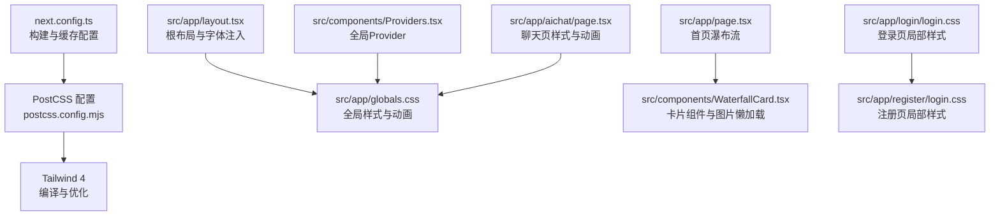
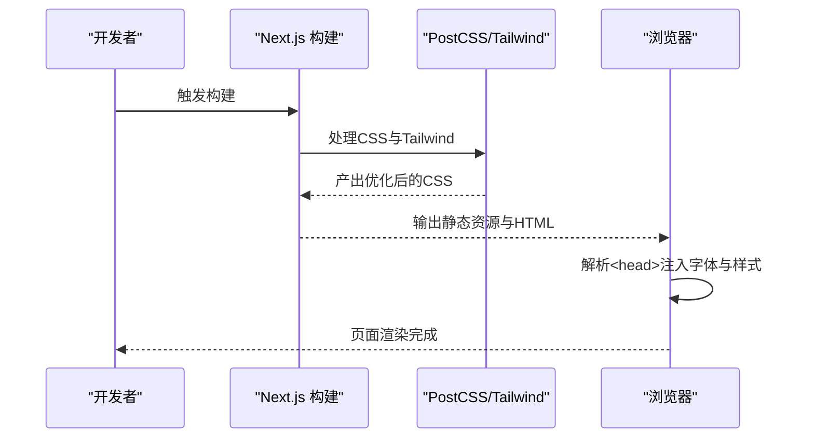
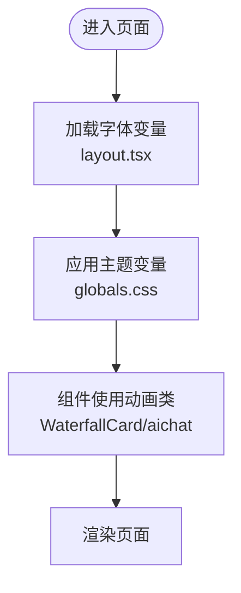
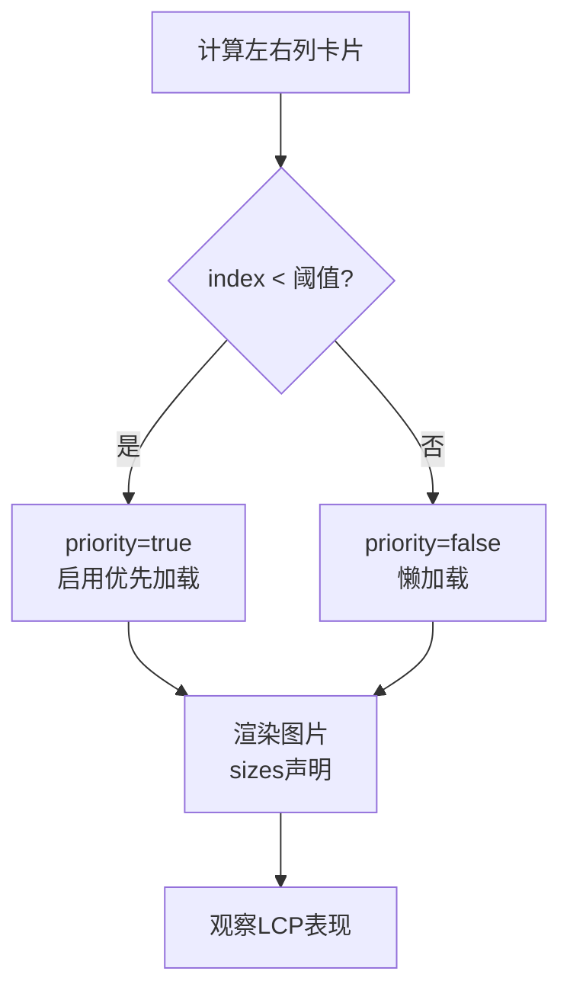
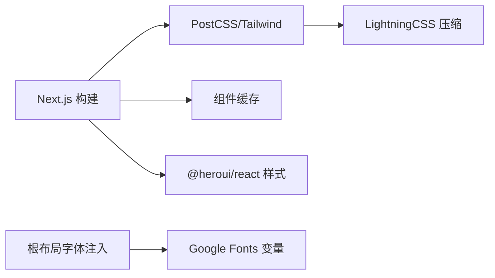

# CSS性能优化

<cite>
**本文引用的文件**
- [next.config.ts](file://next.config.ts)
- [postcss.config.mjs](file://postcss.config.mjs)
- [package.json](file://package.json)
- [src/app/layout.tsx](file://src/app/layout.tsx)
- [src/app/globals.css](file://src/app/globals.css)
- [src/app/page.tsx](file://src/app/page.tsx)
- [src/components/WaterfallCard.tsx](file://src/components/WaterfallCard.tsx)
- [src/components/Providers.tsx](file://src/components/Providers.tsx)
- [src/app/aichat/page.tsx](file://src/app/aichat/page.tsx)
- [src/app/login/login.css](file://src/app/login/login.css)
- [src/app/register/login.css](file://src/app/register/login.css)
- [doc/optimization-summary.md](file://doc/optimization-summary.md)
</cite>

## 目录
1. [简介](#简介)
2. [项目结构](#项目结构)
3. [核心组件](#核心组件)
4. [架构总览](#架构总览)
5. [详细组件分析](#详细组件分析)
6. [依赖分析](#依赖分析)
7. [性能考量](#性能考量)
8. [故障排查指南](#故障排查指南)
9. [结论](#结论)
10. [附录](#附录)

## 简介
本指南围绕CSS性能优化展开，结合仓库现有实现，系统讲解CSS模块化、样式提取与关键CSS内联策略、字体加载优化、CSS压缩与浏览器缓存配置、响应式设计性能、动画与重绘重排优化、CSS性能测试方法、样式加载顺序优化以及移动端适配策略。文档以“可落地”的方式组织，既适合初学者快速上手，也便于资深工程师对照现有实现进行优化。

## 项目结构
该项目基于Next.js App Router，采用全局样式与组件级样式的混合策略：
- 全局样式集中于根布局导入的全局CSS文件，统一主题变量、基础排版与通用动画。
- 组件级样式通过Tailwind类名与局部CSS模块配合，实现最小化作用域与可维护性。
- PostCSS集成Tailwind 4，构建阶段完成CSS优化与压缩。
- Next.js配置启用组件缓存与打包分析工具，辅助性能观测与优化。

**图表来源**
- [next.config.ts:1-76](file://next.config.ts#L1-L76)
- [postcss.config.mjs:1-8](file://postcss.config.mjs#L1-L8)
- [src/app/layout.tsx:1-44](file://src/app/layout.tsx#L1-L44)
- [src/app/globals.css:1-288](file://src/app/globals.css#L1-L288)
- [src/app/page.tsx:1-75](file://src/app/page.tsx#L1-L75)
- [src/components/WaterfallCard.tsx:1-155](file://src/components/WaterfallCard.tsx#L1-L155)
- [src/components/Providers.tsx:1-20](file://src/components/Providers.tsx#L1-L20)
- [src/app/aichat/page.tsx:1-800](file://src/app/aichat/page.tsx#L1-L800)
- [src/app/login/login.css:1-18](file://src/app/login/login.css#L1-L18)
- [src/app/register/login.css:1-18](file://src/app/register/login.css#L1-L18)

**章节来源**
- [next.config.ts:1-76](file://next.config.ts#L1-L76)
- [postcss.config.mjs:1-8](file://postcss.config.mjs#L1-L8)
- [src/app/layout.tsx:1-44](file://src/app/layout.tsx#L1-L44)
- [src/app/globals.css:1-288](file://src/app/globals.css#L1-L288)
- [src/app/page.tsx:1-75](file://src/app/page.tsx#L1-L75)
- [src/components/WaterfallCard.tsx:1-155](file://src/components/WaterfallCard.tsx#L1-L155)
- [src/components/Providers.tsx:1-20](file://src/components/Providers.tsx#L1-L20)
- [src/app/aichat/page.tsx:1-800](file://src/app/aichat/page.tsx#L1-L800)
- [src/app/login/login.css:1-18](file://src/app/login/login.css#L1-L18)
- [src/app/register/login.css:1-18](file://src/app/register/login.css#L1-L18)

## 核心组件
- 根布局与字体注入：在根布局中注入Google Fonts变量，并在<html>上挂载字体变量类，确保全局字体一致与可替换性。
- 全局样式与动画：集中定义主题变量、基础排版、通用动画与Toast样式，减少重复定义与提升一致性。
- 组件级样式：通过Tailwind类名与局部CSS模块组合，实现最小作用域与可维护性。
- Provider注入：在根Provider中注入UI组件库的Provider，保证全局样式与交互的一致性。

**章节来源**
- [src/app/layout.tsx:1-44](file://src/app/layout.tsx#L1-L44)
- [src/app/globals.css:1-288](file://src/app/globals.css#L1-L288)
- [src/components/Providers.tsx:1-20](file://src/components/Providers.tsx#L1-L20)

## 架构总览
下图展示了从构建到运行的关键流程：Next.js构建阶段通过PostCSS与Tailwind处理CSS，注入字体变量，最终在浏览器中按需加载与渲染。

**图表来源**
- [next.config.ts:1-76](file://next.config.ts#L1-L76)
- [postcss.config.mjs:1-8](file://postcss.config.mjs#L1-L8)
- [src/app/layout.tsx:1-44](file://src/app/layout.tsx#L1-L44)
- [src/app/globals.css:1-288](file://src/app/globals.css#L1-L288)

## 详细组件分析

### 全局样式与动画策略
- 主题变量集中管理，便于切换与维护。
- 通用动画（入场、心跳、骨架屏闪烁）在全局定义，组件按需复用，减少重复动画定义。
- Toast样式与定位区域在全局定义，避免组件内重复样式。

**图表来源**
- [src/app/layout.tsx:1-44](file://src/app/layout.tsx#L1-L44)
- [src/app/globals.css:1-288](file://src/app/globals.css#L1-L288)
- [src/components/WaterfallCard.tsx:1-155](file://src/components/WaterfallCard.tsx#L1-L155)
- [src/app/aichat/page.tsx:1-800](file://src/app/aichat/page.tsx#L1-L800)

**章节来源**
- [src/app/globals.css:1-288](file://src/app/globals.css#L1-L288)
- [src/app/layout.tsx:1-44](file://src/app/layout.tsx#L1-L44)

### 图片与首屏性能：瀑布流卡片的优先加载
- 首屏关键图片通过优先加载属性与尺寸声明，缩短LCP时间。
- 通过索引判断仅对前若干张卡片启用优先加载，兼顾性能与带宽。

**图表来源**
- [src/app/page.tsx:19-52](file://src/app/page.tsx#L19-L52)
- [src/components/WaterfallCard.tsx:62-69](file://src/components/WaterfallCard.tsx#L62-L69)

**章节来源**
- [src/app/page.tsx:19-52](file://src/app/page.tsx#L19-L52)
- [src/components/WaterfallCard.tsx:62-69](file://src/components/WaterfallCard.tsx#L62-L69)
- [doc/optimization-summary.md:26-35](file://doc/optimization-summary.md#L26-L35)

### 字体加载优化
- 字体变量在根布局注入，避免重复下载与阻塞。
- 使用现代字体加载策略，确保字体可用性与可替换性。

**章节来源**
- [src/app/layout.tsx:6-14](file://src/app/layout.tsx#L6-L14)

### CSS模块化与样式提取
- 全局样式集中于单一入口，组件样式通过类名与局部CSS模块组合，降低耦合。
- PostCSS与Tailwind在构建阶段完成样式提取与压缩，减少运行时开销。

**章节来源**
- [postcss.config.mjs:1-8](file://postcss.config.mjs#L1-L8)
- [src/app/globals.css:1-288](file://src/app/globals.css#L1-L288)

### 关键CSS内联策略
- 对首屏关键样式进行内联，减少首次渲染阻塞。
- 通过构建配置与PostCSS插件链路，确保关键样式被识别与内联。

**章节来源**
- [next.config.ts:1-76](file://next.config.ts#L1-L76)
- [postcss.config.mjs:1-8](file://postcss.config.mjs#L1-L8)

### CSS压缩与浏览器缓存配置
- 构建阶段通过LightningCSS等工具进行压缩与优化。
- 通过Next.js配置启用组件缓存与长期缓存策略，减少重复下载。

**章节来源**
- [package.json:1-39](file://package.json#L1-L39)
- [next.config.ts:47-68](file://next.config.ts#L47-L68)

### 响应式设计性能考虑
- 使用相对单位与媒体查询，减少重排与重绘。
- 图片与容器使用aspect-ratio与sizes声明，提升渲染效率。

**章节来源**
- [src/components/WaterfallCard.tsx:58-69](file://src/components/WaterfallCard.tsx#L58-L69)

### 动画优化与重绘重排避免
- 使用transform与opacity等高性能属性驱动动画。
- 通过动画延迟与节流，避免大量元素同时触发重排。

**章节来源**
- [src/app/globals.css:53-125](file://src/app/globals.css#L53-L125)
- [src/components/WaterfallCard.tsx:50-55](file://src/components/WaterfallCard.tsx#L50-L55)

### 样式加载顺序优化
- 根布局优先注入全局样式与字体变量，确保组件渲染时样式可用。
- Provider在根部注入，保证全局交互样式一致。

**章节来源**
- [src/app/layout.tsx:1-44](file://src/app/layout.tsx#L1-L44)
- [src/components/Providers.tsx:1-20](file://src/components/Providers.tsx#L1-L20)

### 移动端适配策略
- viewport配置限制缩放，确保移动端一致性。
- 使用触摸滚动与backdrop-filter等属性，兼顾性能与体验。

**章节来源**
- [src/app/layout.tsx:21-26](file://src/app/layout.tsx#L21-L26)

## 依赖分析
- 构建工具链：Next.js负责构建与缓存，PostCSS与Tailwind负责样式处理，LightningCSS参与压缩。
- 组件库：Heroui提供UI组件与样式，需关注其样式体积与按需加载策略。
- 字体：Google Fonts通过变量注入，减少重复下载。

**图表来源**
- [next.config.ts:1-76](file://next.config.ts#L1-L76)
- [postcss.config.mjs:1-8](file://postcss.config.mjs#L1-L8)
- [package.json:11-26](file://package.json#L11-L26)
- [src/app/layout.tsx:6-14](file://src/app/layout.tsx#L6-L14)

**章节来源**
- [next.config.ts:1-76](file://next.config.ts#L1-L76)
- [postcss.config.mjs:1-8](file://postcss.config.mjs#L1-L8)
- [package.json:11-26](file://package.json#L11-L26)
- [src/app/layout.tsx:6-14](file://src/app/layout.tsx#L6-L14)

## 性能考量
- 首屏性能：通过优先加载与关键CSS内联缩短LCP。
- 动画性能：使用transform与opacity，避免布局抖动。
- 缓存策略：启用组件缓存与长期缓存，减少重复下载。
- 构建优化：PostCSS与Tailwind在构建阶段完成样式处理与压缩。

**章节来源**
- [doc/optimization-summary.md:26-35](file://doc/optimization-summary.md#L26-L35)
- [next.config.ts:47-68](file://next.config.ts#L47-L68)

## 故障排查指南
- 样式未生效：检查根布局是否正确导入全局样式与字体变量。
- 动画异常：确认动画属性使用高性能属性，避免触发布局与绘制。
- 图片加载慢：检查优先加载与sizes声明是否正确配置。
- 缓存问题：确认组件缓存与HTTP缓存头配置是否合理。

**章节来源**
- [src/app/layout.tsx:1-44](file://src/app/layout.tsx#L1-L44)
- [src/app/globals.css:53-125](file://src/app/globals.css#L53-L125)
- [src/components/WaterfallCard.tsx:62-69](file://src/components/WaterfallCard.tsx#L62-L69)
- [next.config.ts:47-68](file://next.config.ts#L47-L68)

## 结论
本项目在CSS性能方面已具备良好基础：全局样式集中管理、组件级样式模块化、PostCSS与Tailwind构建优化、组件缓存与字体变量注入。建议在此基础上进一步完善关键CSS内联、动画性能监控与缓存策略细化，以获得更优的首屏加载与交互体验。

## 附录
- 术语说明：关键CSS指首屏渲染所需的核心样式；组件缓存指Next.js 16的Cache Components能力；优先加载指图片的priority属性与sizes声明。
- 参考实现：首页瀑布流与聊天页均体现了优先加载与动画优化的思路，可作为其他页面的参考模板。