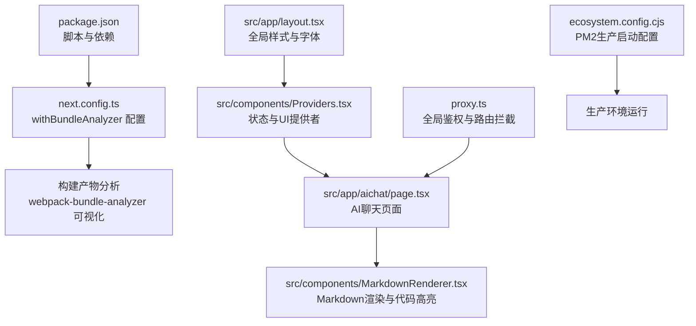
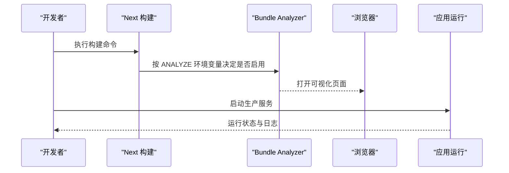
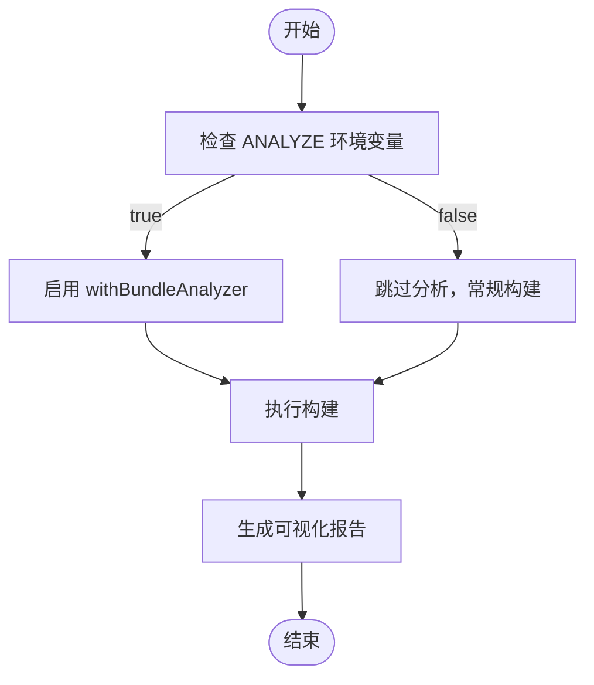
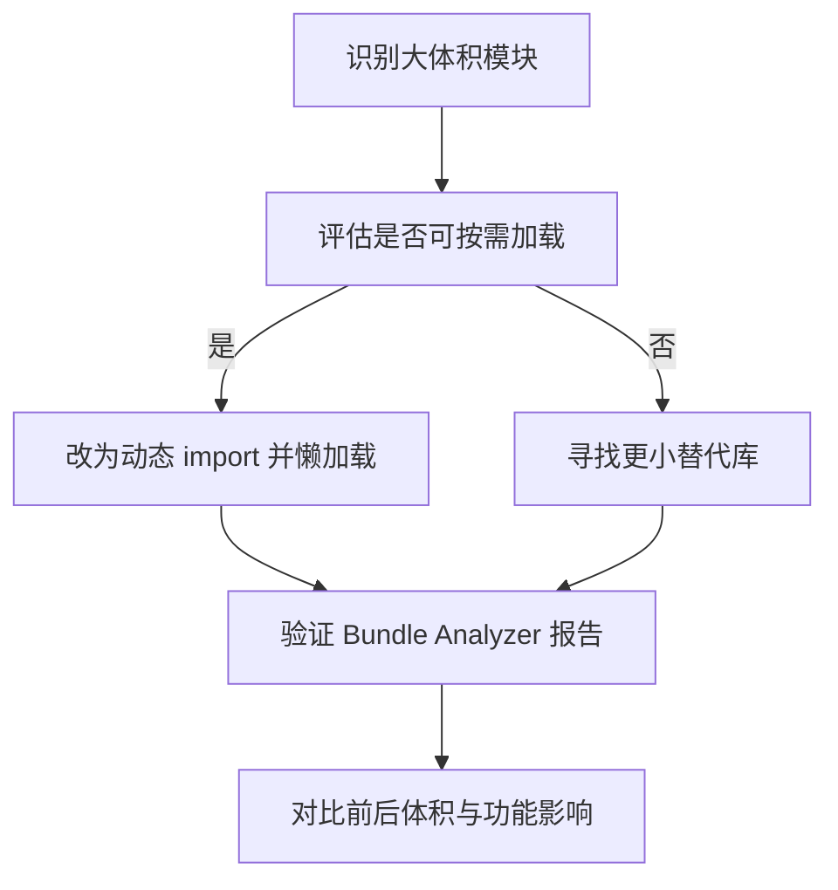
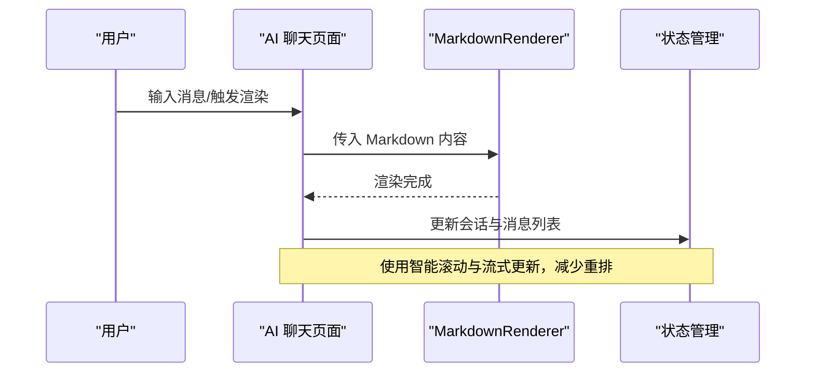
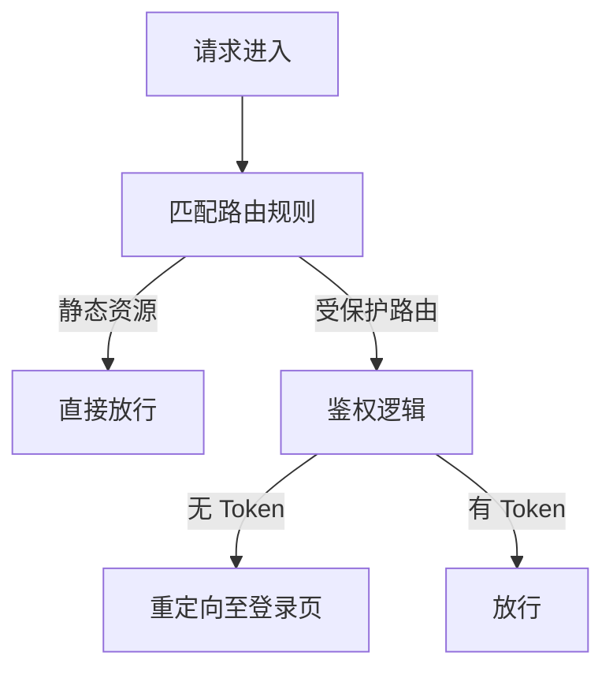
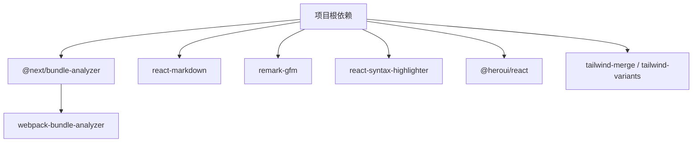

# 包分析与监控

<cite>
**本文引用的文件**
- [package.json](file://package.json)
- [next.config.ts](file://next.config.ts)
- [ecosystem.config.cjs](file://ecosystem.config.cjs)
- [proxy.ts](file://proxy.ts)
- [src/app/layout.tsx](file://src/app/layout.tsx)
- [src/components/MarkdownRenderer.tsx](file://src/components/MarkdownRenderer.tsx)
- [src/components/Providers.tsx](file://src/components/Providers.tsx)
- [src/app/aichat/page.tsx](file://src/app/aichat/page.tsx)
- [doc/optimization-summary.md](file://doc/optimization-summary.md)
- [yarn.lock](file://yarn.lock)
</cite>

## 目录
1. [简介](#简介)
2. [项目结构](#项目结构)
3. [核心组件](#核心组件)
4. [架构总览](#架构总览)
5. [详细组件分析](#详细组件分析)
6. [依赖分析](#依赖分析)
7. [性能考虑](#性能考虑)
8. [故障排查指南](#故障排查指南)
9. [结论](#结论)
10. [附录](#附录)

## 简介
本指南围绕“包分析与性能监控”主题，结合仓库中的 Next.js 16 应用与现有配置，系统讲解如何使用 Bundle Analyzer 进行包体积分析、如何基于分析结果进行依赖与第三方库优化、如何建立性能基准测试与运行时监控，并提供可操作的分析报告解读与优化建议。文档兼顾工程落地与可读性，适合不同技术背景的读者。

## 项目结构
该项目采用 Next.js App Router 结构，核心入口与配置集中在 next.config.ts，包分析能力通过 @next/bundle-analyzer 插件启用。关键特性包括：
- 使用 @next/bundle-analyzer 在构建时按需开启可视化分析
- 通过环境变量控制分析开关，避免在常规开发/生产构建中引入额外开销
- 集成 Tailwind 4、组件化状态管理与 Markdown 渲染等优化实践

图表来源
- [package.json:1-39](file://package.json#L1-L39)
- [next.config.ts:1-76](file://next.config.ts#L1-L76)
- [src/app/layout.tsx:1-44](file://src/app/layout.tsx#L1-L44)
- [src/components/Providers.tsx:1-20](file://src/components/Providers.tsx#L1-L20)
- [src/app/aichat/page.tsx:1-946](file://src/app/aichat/page.tsx#L1-L946)
- [src/components/MarkdownRenderer.tsx:1-139](file://src/components/MarkdownRenderer.tsx#L1-L139)
- [proxy.ts:1-52](file://proxy.ts#L1-L52)
- [ecosystem.config.cjs:1-20](file://ecosystem.config.cjs#L1-L20)

章节来源
- [package.json:1-39](file://package.json#L1-L39)
- [next.config.ts:1-76](file://next.config.ts#L1-L76)
- [src/app/layout.tsx:1-44](file://src/app/layout.tsx#L1-L44)
- [src/components/Providers.tsx:1-20](file://src/components/Providers.tsx#L1-L20)
- [src/app/aichat/page.tsx:1-946](file://src/app/aichat/page.tsx#L1-L946)
- [src/components/MarkdownRenderer.tsx:1-139](file://src/components/MarkdownRenderer.tsx#L1-L139)
- [proxy.ts:1-52](file://proxy.ts#L1-L52)
- [ecosystem.config.cjs:1-20](file://ecosystem.config.cjs#L1-L20)

## 核心组件
- 包分析与可视化
  - 通过 @next/bundle-analyzer 插件在 next.config.ts 中按需启用，使用环境变量 ANALYZE=true 触发分析。
  - 该插件基于 webpack-bundle-analyzer，可在构建完成后打开本地可视化页面，直观查看各模块体积占比与依赖关系。
- 构建与运行配置
  - package.json 定义了 dev/build/start/lint 脚本，便于在 CI/本地进行构建与分析。
  - ecosystem.config.cjs 提供 PM2 启动参数与内存上限，有助于生产环境稳定性监控。
- 页面与组件
  - layout.tsx 提供全局样式与字体注入，确保首屏渲染一致性。
  - Providers.tsx 聚合多个状态提供者，减少重复包裹层级。
  - MarkdownRenderer.tsx 集成 react-markdown、remark-gfm 与 react-syntax-highlighter，承担渲染与性能优化职责。
  - aichat/page.tsx 展示流式渲染、滚动策略与停止机制，体现运行时性能与用户体验优化。

章节来源
- [next.config.ts:71-75](file://next.config.ts#L71-L75)
- [package.json:5-10](file://package.json#L5-L10)
- [ecosystem.config.cjs:13-16](file://ecosystem.config.cjs#L13-L16)
- [src/app/layout.tsx:16-26](file://src/app/layout.tsx#L16-L26)
- [src/components/Providers.tsx:8-19](file://src/components/Providers.tsx#L8-L19)
- [src/components/MarkdownRenderer.tsx:72-136](file://src/components/MarkdownRenderer.tsx#L72-L136)
- [src/app/aichat/page.tsx:217-409](file://src/app/aichat/page.tsx#L217-L409)

## 架构总览
下图展示了从构建到运行的关键流程，以及包分析在其中的位置：

图表来源
- [next.config.ts:71-75](file://next.config.ts#L71-L75)
- [package.json:7](file://package.json#L7)
- [ecosystem.config.cjs:2-18](file://ecosystem.config.cjs#L2-L18)

## 详细组件分析

### 组件一：包分析与 Bundle Analyzer 配置
- 启用方式
  - 在 next.config.ts 中通过 withBundleAnalyzer 包裹 nextConfig，并以 ANALYZE 环境变量控制开关。
  - 该方式避免在常规构建中引入分析开销，仅在需要时触发。
- 分析范围
  - 通过 webpack-bundle-analyzer 可视化查看各模块大小、分包情况与依赖树，辅助定位大体积依赖与重复打包问题。
- 使用建议
  - 在 PR 审查或发布前临时开启 ANALYZE=true，生成报告并与基线对比，形成“包体积基线”。

图表来源
- [next.config.ts:71-75](file://next.config.ts#L71-L75)

章节来源
- [next.config.ts:71-75](file://next.config.ts#L71-L75)
- [package.json:7](file://package.json#L7)

### 组件二：依赖包大小分析与优化策略
- 依赖体量评估
  - 通过 Bundle Analyzer 的饼图/树状图识别“最大模块”，关注第三方库是否过大或存在重复打包。
- 优化策略
  - 按需引入：仅导入所需子模块，避免整包引入。
  - 替代方案：评估更轻量的同类库，例如将重型 UI 组件库拆分为更细粒度的按需加载。
  - 动态导入：对非首屏使用的模块使用动态 import，配合 suspense 与骨架屏提升首屏体验。
  - 版本升级：保持依赖版本更新，利用社区修复与体积优化。
- 第三方库优化
  - 对 react-markdown、remark-gfm、react-syntax-highlighter 等进行按需加载与主题裁剪，减少不必要的样式与语言支持。
  - 对 UI 组件库（如 @heroui/react）遵循官方按需导入指南，避免全局样式污染与体积膨胀。

图表来源
- [src/components/MarkdownRenderer.tsx:4-8](file://src/components/MarkdownRenderer.tsx#L4-L8)
- [src/components/MarkdownRenderer.tsx:72-136](file://src/components/MarkdownRenderer.tsx#L72-L136)

章节来源
- [src/components/MarkdownRenderer.tsx:4-8](file://src/components/MarkdownRenderer.tsx#L4-L8)
- [src/components/MarkdownRenderer.tsx:72-136](file://src/components/MarkdownRenderer.tsx#L72-L136)

### 组件三：性能指标监控与运行时分析
- 首屏性能（LCP）
  - 通过在首屏关键区域对图片设置优先加载策略，减少 LCP 时间。
  - 参考：在瀑布流与发现页中对首排图片启用优先加载，避免懒加载导致的 LCP 延迟。
- 运行时性能
  - 在 AI 聊天页面中实现智能滚动与流式渲染，避免频繁重排与闪烁。
  - 使用 AbortController 实现请求中断，降低无效渲染与内存占用。
- 内存使用监控
  - 在 ecosystem.config.cjs 中设置 max_memory_restart，防止内存泄漏导致进程崩溃。
  - 结合浏览器 DevTools Memory 面板与 Performance 面板，观察长列表、事件监听与闭包的内存变化。

图表来源
- [src/app/aichat/page.tsx:125-142](file://src/app/aichat/page.tsx#L125-L142)
- [src/app/aichat/page.tsx:217-409](file://src/app/aichat/page.tsx#L217-L409)
- [src/components/MarkdownRenderer.tsx:72-136](file://src/components/MarkdownRenderer.tsx#L72-L136)

章节来源
- [doc/optimization-summary.md:26-35](file://doc/optimization-summary.md#L26-L35)
- [src/app/aichat/page.tsx:125-142](file://src/app/aichat/page.tsx#L125-L142)
- [src/app/aichat/page.tsx:217-409](file://src/app/aichat/page.tsx#L217-L409)
- [ecosystem.config.cjs:12](file://ecosystem.config.cjs#L12)

### 组件四：全局鉴权与路由拦截对性能的影响
- proxy.ts 对静态资源路径进行排除，避免对图片等静态资源进行鉴权逻辑，从而减少不必要的重定向与阻塞。
- 建议：在生产环境中保持对静态资源的直连访问，仅对受保护路由启用鉴权逻辑。

图表来源
- [proxy.ts:39-51](file://proxy.ts#L39-L51)
- [proxy.ts:11-33](file://proxy.ts#L11-L33)

章节来源
- [proxy.ts:11-33](file://proxy.ts#L11-L33)
- [proxy.ts:39-51](file://proxy.ts#L39-L51)

## 依赖分析
- 关键依赖与版本
  - @next/bundle-analyzer 与 webpack-bundle-analyzer：提供可视化分析能力。
  - react-markdown、remark-gfm、react-syntax-highlighter：用于 Markdown 渲染与代码高亮。
  - @heroui/react、tailwind-merge、tailwind-variants：UI 与样式工具链。
- 锁定文件映射
  - yarn.lock 中包含 @next/bundle-analyzer 与 webpack-bundle-analyzer 的依赖树，便于追溯分析工具链版本与潜在冲突。

图表来源
- [yarn.lock:572-578](file://yarn.lock#L572-L578)
- [package.json:11-26](file://package.json#L11-L26)

章节来源
- [yarn.lock:572-578](file://yarn.lock#L572-L578)
- [package.json:11-26](file://package.json#L11-L26)

## 性能考虑
- 构建阶段
  - 使用 ANALYZE=true 生成报告，定期对比基线，防止体积回归。
  - 对非关键第三方库采用动态导入，缩短首屏加载时间。
- 运行阶段
  - 首屏图片优先加载策略，减少 LCP 延迟。
  - 长列表与复杂渲染组件使用虚拟化与懒加载，降低内存与 CPU 占用。
  - 使用 AbortController 中断无效请求，释放资源。
- 生产监控
  - 设置 max_memory_restart 防止内存泄漏导致的进程崩溃。
  - 结合浏览器性能面板与内存快照，定位异常增长点。

## 故障排查指南
- 分析报告为空或体积异常
  - 检查 ANALYZE 环境变量是否正确设置。
  - 确认构建命令包含分析插件配置。
- 运行时内存持续上涨
  - 检查是否存在未清理的事件监听、定时器或闭包持有。
  - 使用浏览器内存面板进行快照对比，定位泄漏对象。
- 首屏 LCP 延迟
  - 确认首屏图片是否启用优先加载策略。
  - 检查是否存在阻塞渲染的脚本或样式。
- 鉴权导致的重定向问题
  - 确认静态资源路径是否被排除在鉴权逻辑之外。

章节来源
- [next.config.ts:71-75](file://next.config.ts#L71-L75)
- [ecosystem.config.cjs:12](file://ecosystem.config.cjs#L12)
- [doc/optimization-summary.md:26-35](file://doc/optimization-summary.md#L26-L35)
- [proxy.ts:39-51](file://proxy.ts#L39-L51)

## 结论
通过将 @next/bundle-analyzer 与现有工程实践相结合，可以在构建期与运行期双维度把控包体积与性能表现。建议将包体积分析纳入 CI 流程，形成“基线对比—优化—回归检测”的闭环；同时在运行期持续关注首屏性能与内存使用，确保用户体验与稳定性。

## 附录
- 快速上手步骤
  - 本地分析：设置 ANALYZE=true 并执行构建，打开可视化页面查看模块占比。
  - 优化落地：针对大模块进行按需加载、动态导入与依赖替换，再次分析对比。
  - 生产监控：结合 PM2 内存限制与浏览器性能面板，建立长期监控机制。