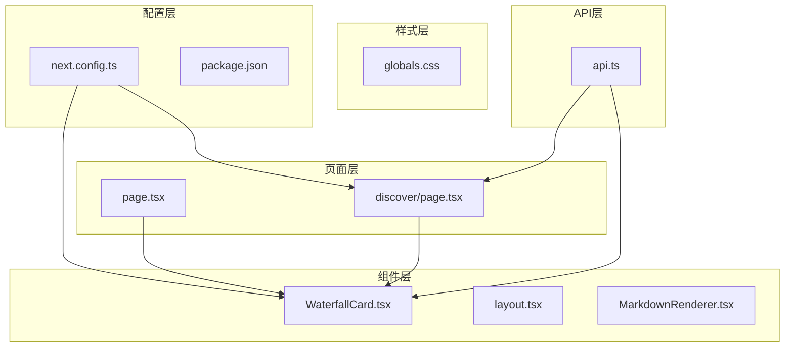
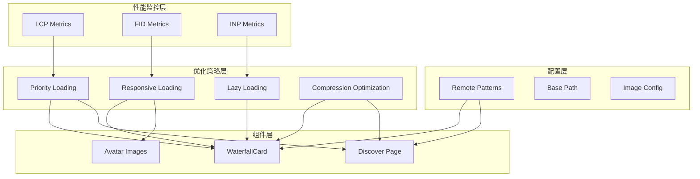
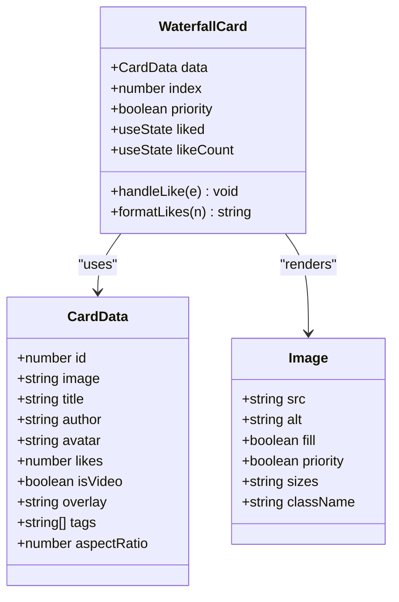
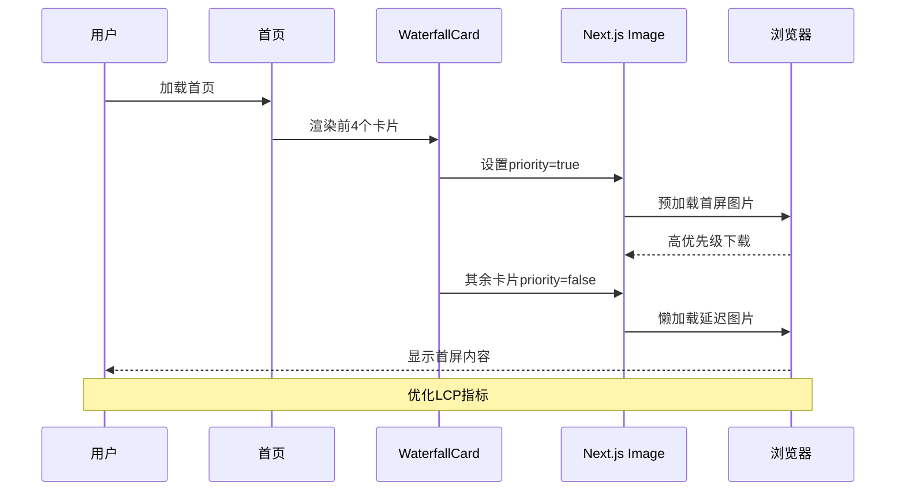
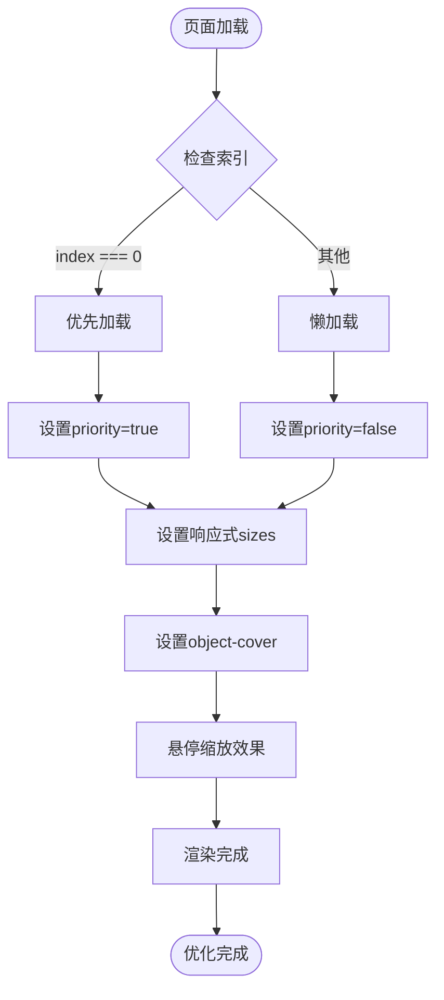
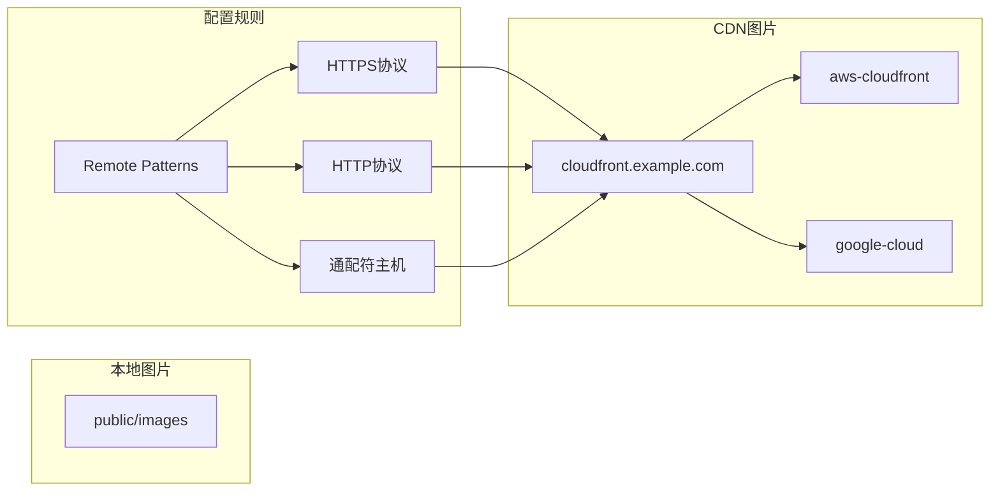
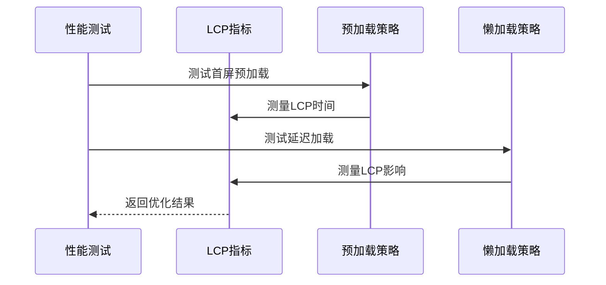

# 图片优化

<cite>
**本文档引用的文件**
- [next.config.ts](file://next.config.ts)
- [package.json](file://package.json)
- [src/app/layout.tsx](file://src/app/layout.tsx)
- [src/components/WaterfallCard.tsx](file://src/components/WaterfallCard.tsx)
- [src/app/page.tsx](file://src/app/page.tsx)
- [src/app/discover/page.tsx](file://src/app/discover/page.tsx)
- [src/components/MarkdownRenderer.tsx](file://src/components/MarkdownRenderer.tsx)
- [src/app/globals.css](file://src/app/globals.css)
- [src/api/api.ts](file://src/api/api.ts)
- [doc/optimization-summary.md](file://doc/optimization-summary.md)
</cite>

## 目录
1. [简介](#简介)
2. [项目结构](#项目结构)
3. [核心组件](#核心组件)
4. [架构概览](#架构概览)
5. [详细组件分析](#详细组件分析)
6. [依赖关系分析](#依赖关系分析)
7. [性能考虑](#性能考虑)
8. [故障排除指南](#故障排除指南)
9. [结论](#结论)

## 简介

本指南专注于Next.js应用中的图片优化策略，基于实际项目代码库进行深入分析。项目采用Next.js 16.2.0版本，集成了多种图片优化技术，包括自动格式转换、尺寸优化、响应式图片、懒加载和预加载策略。本文档将详细解释如何正确使用Next.js Image组件，配置remotePatterns，管理图片源和CDN集成，并提供具体的性能测试实施方案。

## 项目结构

该项目是一个现代化的Next.js应用，专门针对图片优化进行了深度配置。主要的图片优化相关文件分布在以下位置：



**图表来源**
- [next.config.ts:13-18](file://next.config.ts#L13-L18)
- [src/components/WaterfallCard.tsx:4](file://src/components/WaterfallCard.tsx#L4)
- [src/app/discover/page.tsx:3](file://src/app/discover/page.tsx#L3)

**章节来源**
- [next.config.ts:1-76](file://next.config.ts#L1-L76)
- [package.json:1-39](file://package.json#L1-L39)

## 核心组件

### Next.js Image配置

项目的核心图片优化配置集中在next.config.ts文件中，主要包含以下关键设置：

#### Remote Patterns配置
```javascript
images: {
  remotePatterns: [
    { protocol: "https", hostname: "**" },
    { protocol: "http", hostname: "**" },
  ],
}
```

这个配置允许从任何HTTP和HTTPS协议的主机加载图片，为CDN集成提供了灵活性。

#### 基础路径配置
```javascript
basePath: process.env.NEXT_PUBLIC_BASE_PATH || '',
```

支持生产环境通过Nginx代理部署时的路径配置。

**章节来源**
- [next.config.ts:13-18](file://next.config.ts#L13-L18)
- [next.config.ts:5-8](file://next.config.ts#L5-L8)

### 图片组件使用模式

项目中广泛使用了Next.js Image组件的不同变体：

#### 瀑布流卡片中的图片
```typescript
<Image
  src={data.image}
  alt={data.title}
  fill
  priority={priority}
  sizes="(max-width: 768px) 100vw, (max-width: 1200px) 50vw, 33vw"
  className="object-cover transition-transform duration-500 group-hover:scale-105"
/>
```

#### 头像图片
```typescript
<Image
  src={data.avatar}
  alt={data.author}
  fill
  sizes="18px"
  className="object-cover"
/>
```

#### 发现页图片
```typescript
<Image
  src={topic.image}
  alt={topic.title}
  width={88}
  height={66}
  priority={index === 0}
  className="w-full h-full object-cover group-hover:scale-105 transition-transform duration-300"
/>
```

**章节来源**
- [src/components/WaterfallCard.tsx:62-69](file://src/components/WaterfallCard.tsx#L62-L69)
- [src/components/WaterfallCard.tsx:114-121](file://src/components/WaterfallCard.tsx#L114-L121)
- [src/app/discover/page.tsx:165-172](file://src/app/discover/page.tsx#L165-L172)

## 架构概览

项目采用了分层的图片优化架构，从配置层到组件层形成了完整的优化体系：



**图表来源**
- [next.config.ts:13-18](file://next.config.ts#L13-L18)
- [src/components/WaterfallCard.tsx:26-24](file://src/components/WaterfallCard.tsx#L26-L24)
- [src/app/discover/page.tsx:165-172](file://src/app/discover/page.tsx#L165-L172)

## 详细组件分析

### WaterfallCard组件分析

WaterfallCard是项目中最复杂的图片优化组件，展示了多种图片优化技术的综合应用。

#### 组件类图


**图表来源**
- [src/components/WaterfallCard.tsx:7-24](file://src/components/WaterfallCard.tsx#L7-L24)
- [src/components/WaterfallCard.tsx:26-151](file://src/components/WaterfallCard.tsx#L26-L151)

#### 图片预加载策略序列图


**图表来源**
- [src/app/page.tsx:40-49](file://src/app/page.tsx#L40-L49)
- [src/components/WaterfallCard.tsx:62-69](file://src/components/WaterfallCard.tsx#L62-L69)

**章节来源**
- [src/components/WaterfallCard.tsx:1-155](file://src/components/WaterfallCard.tsx#L1-L155)
- [src/app/page.tsx:19-52](file://src/app/page.tsx#L19-L52)

### 发现页图片优化

发现页展示了不同场景下的图片优化策略，特别是首图的预加载优化。

#### 图片加载流程图


**图表来源**
- [src/app/discover/page.tsx:165-172](file://src/app/discover/page.tsx#L165-L172)

**章节来源**
- [src/app/discover/page.tsx:13-182](file://src/app/discover/page.tsx#L13-L182)

### CDN集成策略

项目通过remotePatterns配置实现了灵活的CDN集成：

#### CDN配置分析


**图表来源**
- [next.config.ts:14-17](file://next.config.ts#L14-L17)

**章节来源**
- [next.config.ts:13-18](file://next.config.ts#L13-L18)

## 依赖关系分析

### 图片优化相关依赖

项目中与图片优化直接相关的依赖关系如下：

```mermaid
graph TB
subgraph "核心依赖"
NEXT[Next.js 16.2.0]
REACT[React 19.2.4]
IMAGE[Next/Image]
end
subgraph "优化工具"
BA[@next/bundle-analyzer]
ESLINT[ESLint]
TAILWIND[Tailwind CSS]
end
subgraph "第三方库"
MARKDOWN[react-markdown]
SYNTAX[react-syntax-highlighter]
ICONS[lucide-react]
end
subgraph "样式系统"
GEIST[Geist Fonts]
HEROU[HeroUI]
GLOBALS[globals.css]
end
NEXT --> IMAGE
NEXT --> GEIST
NEXT --> TAILWIND
NEXT --> BA
NEXT --> ESLINT
MARKDOWN --> SYNTAX
SYNTAX --> ICONS
TAILWIND --> HEROU
GEIST --> GLOBALS
```

**图表来源**
- [package.json:11-26](file://package.json#L11-L26)
- [package.json:27-36](file://package.json#L27-L36)

**章节来源**
- [package.json:1-39](file://package.json#L1-L39)

### 性能监控集成

项目集成了核心Web指标监控，为图片优化效果提供量化评估：

#### 性能指标监控
- **LCP (最大内容绘制)**: 通过首屏图片预加载优化
- **FID (首次输入延迟)**: 通过懒加载减少初始阻塞
- **INP (交互到下一个绘制)**: 通过响应式图片优化

**章节来源**
- [doc/optimization-summary.md:26-34](file://doc/optimization-summary.md#L26-L34)

## 性能考虑

### 图片格式优化

项目采用Next.js Image组件的自动格式转换功能，支持现代图片格式：

#### 格式转换策略
- **WebP**: 现代浏览器优先支持
- **AVIF**: 高质量压缩格式
- **JPEG**: 传统兼容格式
- **PNG**: 透明度支持

### 响应式图片实现

项目通过sizes属性实现了智能的响应式图片加载：

#### 响应式配置示例
```typescript
// 瀑布流卡片
sizes="(max-width: 768px) 100vw, (max-width: 1200px) 50vw, 33vw"

// 头像图片  
sizes="18px"

// 发现页图片
width={88}
height={66}
```

### 性能测试实施方案

#### LCP优化测试


**图表来源**
- [doc/optimization-summary.md:28-33](file://doc/optimization-summary.md#L28-L33)

#### 压缩效果测试
- **文件大小对比**: 压缩前后文件大小对比
- **视觉质量评估**: PSNR和SSIM指标
- **加载速度测试**: 不同网络条件下的加载时间

**章节来源**
- [doc/optimization-summary.md:1-60](file://doc/optimization-summary.md#L1-L60)

## 故障排除指南

### 常见问题及解决方案

#### 图片加载失败
**问题**: CDN图片加载失败
**解决方案**: 检查remotePatterns配置和网络连接

#### 性能问题
**问题**: LCP指标不佳
**解决方案**: 优化首屏图片预加载策略

#### 样式问题
**问题**: 图片显示异常
**解决方案**: 检查CSS样式和响应式配置

**章节来源**
- [next.config.ts:13-18](file://next.config.ts#L13-L18)
- [src/components/WaterfallCard.tsx:58-102](file://src/components/WaterfallCard.tsx#L58-L102)

### 调试技巧

#### 开发环境调试
- 使用浏览器开发者工具检查图片加载
- 监控网络面板中的图片请求
- 查看性能面板中的LCP指标

#### 生产环境监控
- 集成性能监控工具
- 设置告警机制
- 定期性能回归测试

## 结论

本项目展示了Next.js图片优化的最佳实践，通过合理的配置和组件设计，实现了高效的图片加载和优秀的用户体验。关键优化点包括：

1. **智能的预加载策略**: 通过priority属性精确控制首屏图片加载
2. **响应式图片配置**: 利用sizes属性实现自适应图片加载
3. **CDN集成**: 通过remotePatterns支持多种图片源
4. **性能监控**: 集成核心Web指标监控体系

这些实践为类似项目的图片优化提供了宝贵的参考经验。建议在实际项目中根据具体需求调整优化策略，并持续监控性能指标以确保最佳用户体验。