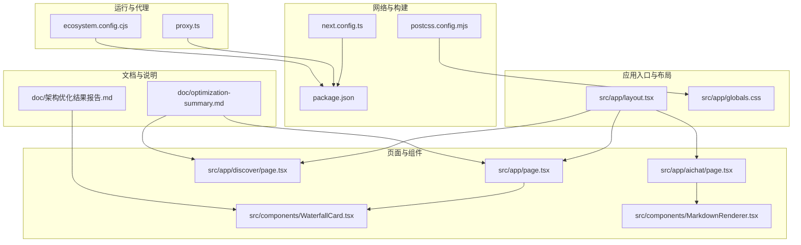
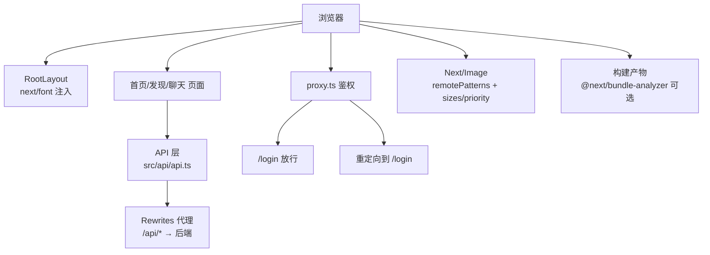
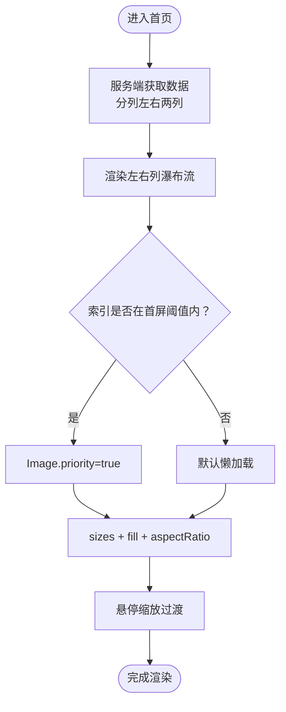
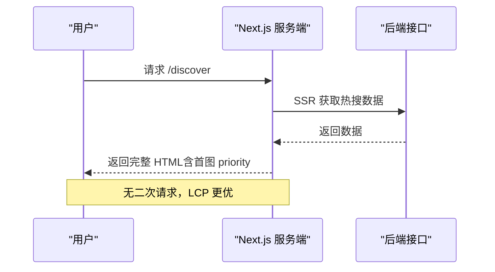
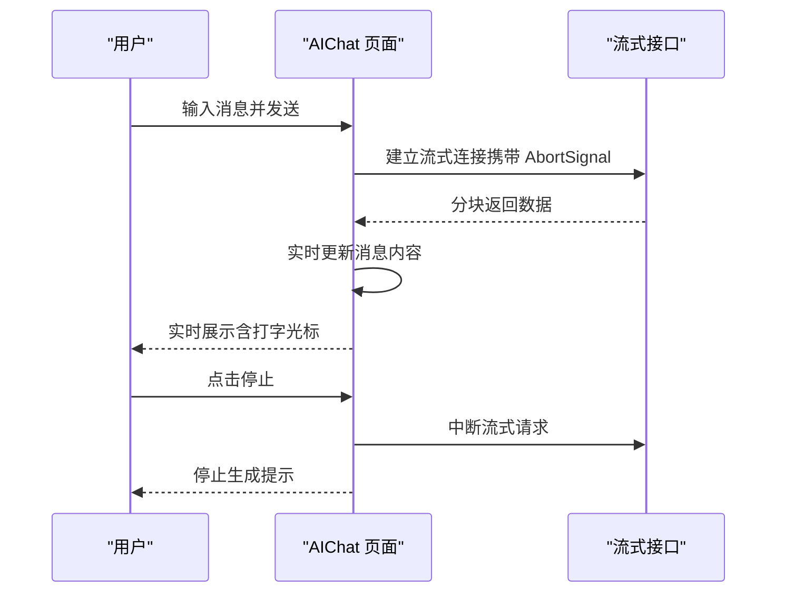
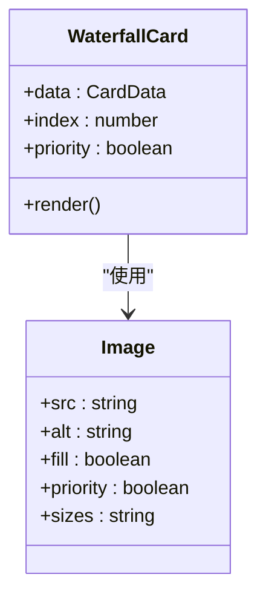
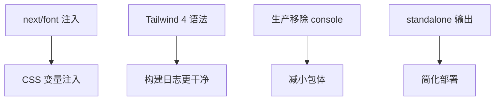
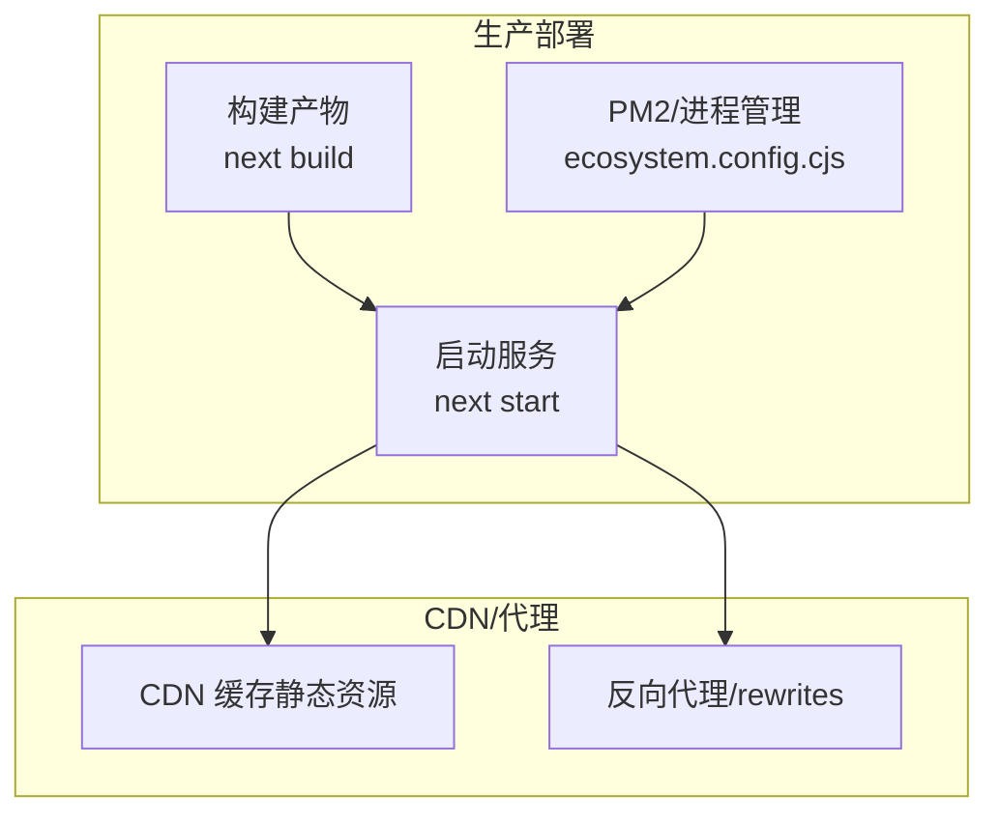
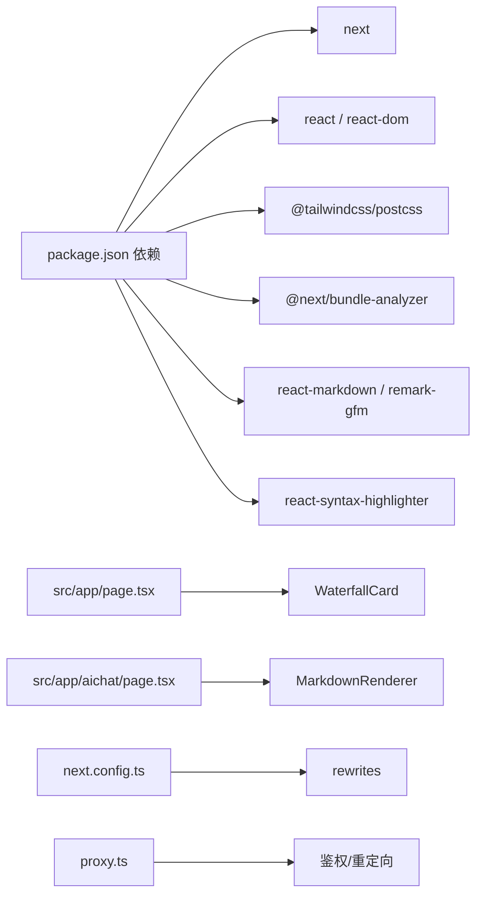

# 性能优化

<cite>
**本文引用的文件**
- [next.config.ts](file://next.config.ts)
- [package.json](file://package.json)
- [src/app/layout.tsx](file://src/app/layout.tsx)
- [src/app/globals.css](file://src/app/globals.css)
- [src/app/page.tsx](file://src/app/page.tsx)
- [src/app/discover/page.tsx](file://src/app/discover/page.tsx)
- [src/app/aichat/page.tsx](file://src/app/aichat/page.tsx)
- [src/components/WaterfallCard.tsx](file://src/components/WaterfallCard.tsx)
- [src/components/MarkdownRenderer.tsx](file://src/components/MarkdownRenderer.tsx)
- [src/api/api.ts](file://src/api/api.ts)
- [postcss.config.mjs](file://postcss.config.mjs)
- [proxy.ts](file://proxy.ts)
- [ecosystem.config.cjs](file://ecosystem.config.cjs)
- [doc/optimization-summary.md](file://doc/optimization-summary.md)
- [doc/架构优化结果报告.md](file://doc/架构优化结果报告.md)
</cite>

## 目录
1. [简介](#简介)
2. [项目结构](#项目结构)
3. [核心组件](#核心组件)
4. [架构总览](#架构总览)
5. [详细组件分析](#详细组件分析)
6. [依赖分析](#依赖分析)
7. [性能考量](#性能考量)
8. [故障排查指南](#故障排查指南)
9. [结论](#结论)
10. [附录](#附录)

## 简介
本指南围绕 Next.js 16 应用的性能优化展开，结合仓库现有实现，系统阐述以下主题：
- Next.js 内置优化特性与配置要点
- 图片优化与懒加载策略
- 代码分割与懒加载实践
- CSS 优化、字体加载与资源压缩
- 性能监控、瓶颈分析与优化建议
- 生产环境部署与 CDN 配置思路
- 具体优化案例与性能测试方法

## 项目结构
该项目采用 App Router + src 目录隔离的现代结构，配合 Tailwind 4、Next Font、Next/Image 等优化能力，形成以页面为中心的模块化组织方式。

图表来源
- [src/app/layout.tsx:1-44](file://src/app/layout.tsx#L1-L44)
- [src/app/page.tsx:1-75](file://src/app/page.tsx#L1-L75)
- [src/app/discover/page.tsx:1-183](file://src/app/discover/page.tsx#L1-L183)
- [src/app/aichat/page.tsx:1-946](file://src/app/aichat/page.tsx#L1-L946)
- [src/components/WaterfallCard.tsx:1-155](file://src/components/WaterfallCard.tsx#L1-L155)
- [src/components/MarkdownRenderer.tsx:1-139](file://src/components/MarkdownRenderer.tsx#L1-L139)
- [next.config.ts:1-76](file://next.config.ts#L1-L76)
- [postcss.config.mjs:1-8](file://postcss.config.mjs#L1-L8)
- [proxy.ts:1-52](file://proxy.ts#L1-L52)
- [ecosystem.config.cjs:1-20](file://ecosystem.config.cjs#L1-L20)
- [doc/optimization-summary.md:1-60](file://doc/optimization-summary.md#L1-L60)
- [doc/架构优化结果报告.md:1-34](file://doc/架构优化结果报告.md#L1-L34)

章节来源
- [src/app/layout.tsx:1-44](file://src/app/layout.tsx#L1-L44)
- [src/app/globals.css:1-288](file://src/app/globals.css#L1-L288)
- [next.config.ts:1-76](file://next.config.ts#L1-L76)
- [postcss.config.mjs:1-8](file://postcss.config.mjs#L1-L8)
- [proxy.ts:1-52](file://proxy.ts#L1-L52)
- [ecosystem.config.cjs:1-20](file://ecosystem.config.cjs#L1-L20)
- [doc/optimization-summary.md:1-60](file://doc/optimization-summary.md#L1-L60)
- [doc/架构优化结果报告.md:1-34](file://doc/架构优化结果报告.md#L1-L34)

## 核心组件
- 页面与渲染策略
  - 首页瀑布流采用 Suspense + 服务端数据获取，提升首屏可交互性与 LCP。
  - 发现页采用 SSR，避免首屏白屏，提升 LCP 与 SEO。
  - AI 聊天页采用流式渲染与智能滚动，兼顾 UX 与性能。
- 图片优化
  - 使用 Next/Image 并配置 remotePatterns，结合 priority/sizes 实现首屏关键图与响应式尺寸优化。
- 字体与 CSS
  - 使用 next/font 与 Tailwind 4，CSS 通过 @theme inline 注入变量，减少运行时开销。
- 网络与代理
  - 通过 rewrites 将 /api/* 代理到后端，减少跨域与额外握手成本。
  - 通过 proxy.ts 实现轻量鉴权与静态资源排除，避免不必要的重定向。
- 构建与运行
  - 使用 @next/bundle-analyzer 可选分析，生产环境移除 console，standalone 输出可选。

章节来源
- [src/app/page.tsx:1-75](file://src/app/page.tsx#L1-L75)
- [src/app/discover/page.tsx:1-183](file://src/app/discover/page.tsx#L1-L183)
- [src/app/aichat/page.tsx:1-946](file://src/app/aichat/page.tsx#L1-L946)
- [src/components/WaterfallCard.tsx:1-155](file://src/components/WaterfallCard.tsx#L1-L155)
- [src/app/layout.tsx:1-44](file://src/app/layout.tsx#L1-L44)
- [src/app/globals.css:1-288](file://src/app/globals.css#L1-L288)
- [next.config.ts:1-76](file://next.config.ts#L1-L76)
- [proxy.ts:1-52](file://proxy.ts#L1-L52)

## 架构总览
下图展示了从浏览器到后端的请求链路与关键优化点：

图表来源
- [src/app/layout.tsx:1-44](file://src/app/layout.tsx#L1-L44)
- [src/app/page.tsx:1-75](file://src/app/page.tsx#L1-L75)
- [src/app/discover/page.tsx:1-183](file://src/app/discover/page.tsx#L1-L183)
- [src/app/aichat/page.tsx:1-946](file://src/app/aichat/page.tsx#L1-L946)
- [src/api/api.ts:1-128](file://src/api/api.ts#L1-L128)
- [next.config.ts:28-45](file://next.config.ts#L28-L45)
- [proxy.ts:1-52](file://proxy.ts#L1-L52)

## 详细组件分析

### 首页瀑布流与图片预加载策略
- 首屏关键图策略
  - 通过在父容器中对前若干卡片开启 priority，确保首屏 LCP 图优先加载。
  - 使用 Image 的 sizes 与 fill，结合容器 aspectRatio，避免布局偏移与重复渲染。
- 代码分割与懒加载
  - 使用 Suspense 包裹数据获取组件，实现流式渲染与骨架屏过渡。
  - 组件内部按需渲染，避免一次性渲染大量节点。
- 性能收益
  - 减少主线程阻塞，缩短 FCP/LCP。
  - 降低内存占用与首次绘制压力。

图表来源
- [src/app/page.tsx:18-52](file://src/app/page.tsx#L18-L52)
- [src/components/WaterfallCard.tsx:58-69](file://src/components/WaterfallCard.tsx#L58-L69)

章节来源
- [src/app/page.tsx:18-52](file://src/app/page.tsx#L18-L52)
- [src/components/WaterfallCard.tsx:58-69](file://src/components/WaterfallCard.tsx#L58-L69)
- [doc/optimization-summary.md:28-34](file://doc/optimization-summary.md#L28-L34)

### 发现页 SSR 与首屏 LCP 优化
- SSR 渲染
  - 服务端直接获取数据并渲染完整 HTML，避免首屏闪烁与二次请求。
- 关键图优化
  - 首图使用 priority，提升 LCP。
- 对比与引导
  - 提供 CSR 版本对比入口，便于理解 SSR 带来的性能差异。

图表来源
- [src/app/discover/page.tsx:13-51](file://src/app/discover/page.tsx#L13-L51)
- [src/app/discover/page.tsx:164-172](file://src/app/discover/page.tsx#L164-L172)

章节来源
- [src/app/discover/page.tsx:13-51](file://src/app/discover/page.tsx#L13-L51)
- [src/app/discover/page.tsx:164-172](file://src/app/discover/page.tsx#L164-L172)
- [doc/optimization-summary.md:26-34](file://doc/optimization-summary.md#L26-L34)

### AI 聊天流式渲染与滚动策略
- 流式输出
  - 使用流式读取与实时更新，避免一次性渲染大文本。
- 智能滚动
  - 仅在用户靠近底部时自动滚动，否则显示“回到底部”按钮，减少强制滚动带来的抖动。
- 停止生成
  - 正确传递 AbortSignal，实现可靠中断，避免资源浪费。

图表来源
- [src/app/aichat/page.tsx:216-409](file://src/app/aichat/page.tsx#L216-L409)
- [src/components/MarkdownRenderer.tsx:72-136](file://src/components/MarkdownRenderer.tsx#L72-L136)

章节来源
- [src/app/aichat/page.tsx:125-142](file://src/app/aichat/page.tsx#L125-L142)
- [src/app/aichat/page.tsx:206-214](file://src/app/aichat/page.tsx#L206-L214)
- [src/app/aichat/page.tsx:216-409](file://src/app/aichat/page.tsx#L216-L409)
- [src/components/MarkdownRenderer.tsx:72-136](file://src/components/MarkdownRenderer.tsx#L72-L136)
- [doc/optimization-summary.md:14-23](file://doc/optimization-summary.md#L14-L23)

### 图片优化与懒加载（Next/Image）
- 配置要点
  - remotePatterns 白名单允许远程图片直传，减少中间层转发。
  - sizes 与 fill 结合，按视口宽度与容器比例选择合适尺寸。
  - priority 仅用于首屏关键图，避免过度抢占带宽。
- 组件级封装
  - WaterfallCard 暴露 priority 接口，父组件按 index 精准控制首屏预加载。

图表来源
- [src/components/WaterfallCard.tsx:20-69](file://src/components/WaterfallCard.tsx#L20-L69)
- [next.config.ts:13-18](file://next.config.ts#L13-L18)

章节来源
- [src/components/WaterfallCard.tsx:20-69](file://src/components/WaterfallCard.tsx#L20-L69)
- [next.config.ts:13-18](file://next.config.ts#L13-L18)
- [doc/架构优化结果报告.md:13-17](file://doc/架构优化结果报告.md#L13-L17)

### CSS 优化、字体加载与资源压缩
- 字体优化
  - next/font 本地注入，避免网络字体阻塞渲染；通过变量注入全局字体族。
- CSS 优化
  - Tailwind 4 语法迁移，删除弃用类，减少构建噪音。
  - @theme inline 注入变量，减少运行时计算。
- 资源压缩
  - 生产环境移除 console，降低包体与运行时开销。
  - 可选 standalone 输出，简化部署。

图表来源
- [src/app/layout.tsx:6-14](file://src/app/layout.tsx#L6-L14)
- [src/app/globals.css:15-26](file://src/app/globals.css#L15-L26)
- [next.config.ts:65-68](file://next.config.ts#L65-L68)
- [next.config.ts:23-25](file://next.config.ts#L23-L25)

章节来源
- [src/app/layout.tsx:6-14](file://src/app/layout.tsx#L6-L14)
- [src/app/globals.css:15-26](file://src/app/globals.css#L15-L26)
- [next.config.ts:65-68](file://next.config.ts#L65-L68)
- [next.config.ts:23-25](file://next.config.ts#L23-L25)
- [doc/optimization-summary.md:37-46](file://doc/optimization-summary.md#L37-L46)

### 性能监控、瓶颈分析与优化建议
- 监控与分析
  - 使用 @next/bundle-analyzer 可选分析，定位体积增长来源。
  - 通过浏览器性能面板观察主线程占用、布局抖动与内存峰值。
- 瓶颈识别
  - 首屏图片过多：优先使用 priority 控制数量。
  - 流式渲染过大文本：拆分段落、限制最大长度。
  - 频繁重渲染：使用 useMemo/useCallback、Suspense 分片。
- 优化建议
  - 为关键路径资源启用 HTTP/2 多路复用与缓存。
  - 使用 CDN 缓存静态资源与图片，结合边缘缓存策略。
  - 对第三方脚本采用 defer/async 或隔离到独立包。

章节来源
- [next.config.ts:71-75](file://next.config.ts#L71-L75)
- [src/app/aichat/page.tsx:292-339](file://src/app/aichat/page.tsx#L292-L339)

### 生产环境部署与 CDN 配置
- 运行与进程管理
  - 使用 ecosystem.config.cjs 管理生产进程，设置内存重启阈值与端口。
- 部署输出
  - 可选 standalone 输出，便于容器化与边缘部署。
- CDN 与反向代理
  - 通过 rewrites 将 /api/* 代理到后端，减少跨域与额外握手。
  - 静态资源与图片走 CDN，结合缓存头与压缩策略。

图表来源
- [ecosystem.config.cjs:1-20](file://ecosystem.config.cjs#L1-L20)
- [next.config.ts:28-45](file://next.config.ts#L28-L45)
- [package.json:5-10](file://package.json#L5-L10)

章节来源
- [ecosystem.config.cjs:1-20](file://ecosystem.config.cjs#L1-L20)
- [next.config.ts:28-45](file://next.config.ts#L28-L45)
- [package.json:5-10](file://package.json#L5-L10)

## 依赖分析
- 外部依赖
  - next、react、react-dom：框架与运行时。
  - tailwindcss、@tailwindcss/postcss：样式与构建集成。
  - @next/bundle-analyzer：体积分析。
  - react-markdown、remark-gfm、react-syntax-highlighter：Markdown 渲染与代码高亮。
- 内部依赖
  - 页面组件依赖 API 层与通用组件（如 WaterfallCard、MarkdownRenderer）。
  - proxy.ts 与 rewrites 形成鉴权与路由代理闭环。

图表来源
- [package.json:11-37](file://package.json#L11-L37)
- [src/app/page.tsx:1-75](file://src/app/page.tsx#L1-L75)
- [src/app/aichat/page.tsx:1-946](file://src/app/aichat/page.tsx#L1-L946)
- [src/components/WaterfallCard.tsx:1-155](file://src/components/WaterfallCard.tsx#L1-L155)
- [src/components/MarkdownRenderer.tsx:1-139](file://src/components/MarkdownRenderer.tsx#L1-L139)
- [next.config.ts:28-45](file://next.config.ts#L28-L45)
- [proxy.ts:1-52](file://proxy.ts#L1-L52)

章节来源
- [package.json:11-37](file://package.json#L11-L37)
- [src/app/page.tsx:1-75](file://src/app/page.tsx#L1-L75)
- [src/app/aichat/page.tsx:1-946](file://src/app/aichat/page.tsx#L1-L946)
- [src/components/WaterfallCard.tsx:1-155](file://src/components/WaterfallCard.tsx#L1-L155)
- [src/components/MarkdownRenderer.tsx:1-139](file://src/components/MarkdownRenderer.tsx#L1-L139)
- [next.config.ts:28-45](file://next.config.ts#L28-L45)
- [proxy.ts:1-52](file://proxy.ts#L1-L52)

## 性能考量
- 渲染策略
  - 首页：Suspense + 服务端数据获取，优先保证 LCP 与可交互性。
  - 发现页：SSR 直出完整 HTML，避免二次请求。
  - 聊天页：流式渲染与智能滚动，兼顾 UX 与性能。
- 资源加载
  - 图片：Next/Image + remotePatterns + sizes/priority。
  - 字体：next/font 注入，减少 FOIT/FOFT。
  - CSS：Tailwind 4 语法与 @theme inline，减少运行时开销。
- 构建与运行
  - 生产移除 console，standalone 输出可选，bundle-analyzer 可选分析。
- 部署
  - rewrites 代理减少往返，CDN 缓存静态资源，PM2 管理进程。

## 故障排查指南
- 首屏图片加载慢
  - 检查是否正确使用 priority 与 sizes。
  - 确认 remotePatterns 是否允许目标域名。
- 流式渲染卡顿
  - 检查流式读取与更新频率，避免频繁 setState。
  - 确认 AbortSignal 传递与中断逻辑。
- 路由重定向导致图片 404
  - 检查 proxy.ts 的 matcher 是否排除了静态资源路径。
  - 确认 rewrites 目标地址与权限。
- 构建体积过大
  - 使用 @next/bundle-analyzer 分析依赖体积。
  - 检查是否误引入大型库或重复依赖。

章节来源
- [src/components/WaterfallCard.tsx:62-68](file://src/components/WaterfallCard.tsx#L62-L68)
- [next.config.ts:13-18](file://next.config.ts#L13-L18)
- [src/app/aichat/page.tsx:292-339](file://src/app/aichat/page.tsx#L292-L339)
- [proxy.ts:39-51](file://proxy.ts#L39-L51)
- [next.config.ts:28-45](file://next.config.ts#L28-L45)
- [next.config.ts:71-75](file://next.config.ts#L71-L75)

## 结论
本项目在 Next.js 16 的基础上，结合 SSR、Suspense、Next/Image、next/font、Tailwind 4 与代理/CDN 等手段，形成了较为完善的性能优化体系。建议在生产环境中进一步：
- 引入性能监控（Web Vitals、APM）持续观测。
- 通过 CDN 与边缘缓存优化静态资源与图片。
- 对关键路径资源启用 HTTP/2 与缓存策略。
- 定期使用 bundle-analyzer 与性能面板进行回归分析。

## 附录
- 性能测试方法
  - 使用 Lighthouse/Chrome DevTools Performance 面板进行端到端评估。
  - 通过 WebPageTest/CDN 边缘节点进行多地测试。
  - 建立基线指标（FCP/LCP/TTFB/INP），定期回归。
- 优化案例
  - 首页瀑布流：通过父容器精准控制首屏图片数量与尺寸，显著改善 LCP。
  - 发现页：SSR 直出完整 HTML，消除二次请求，提升 LCP 与 SEO。
  - 聊天页：流式渲染与智能滚动，平衡 UX 与性能。

章节来源
- [doc/optimization-summary.md:26-59](file://doc/optimization-summary.md#L26-L59)
- [doc/架构优化结果报告.md:1-34](file://doc/架构优化结果报告.md#L1-L34)