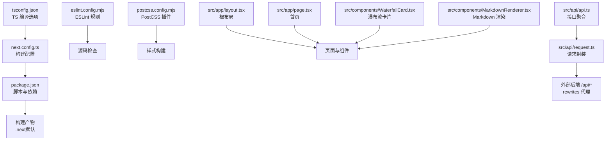
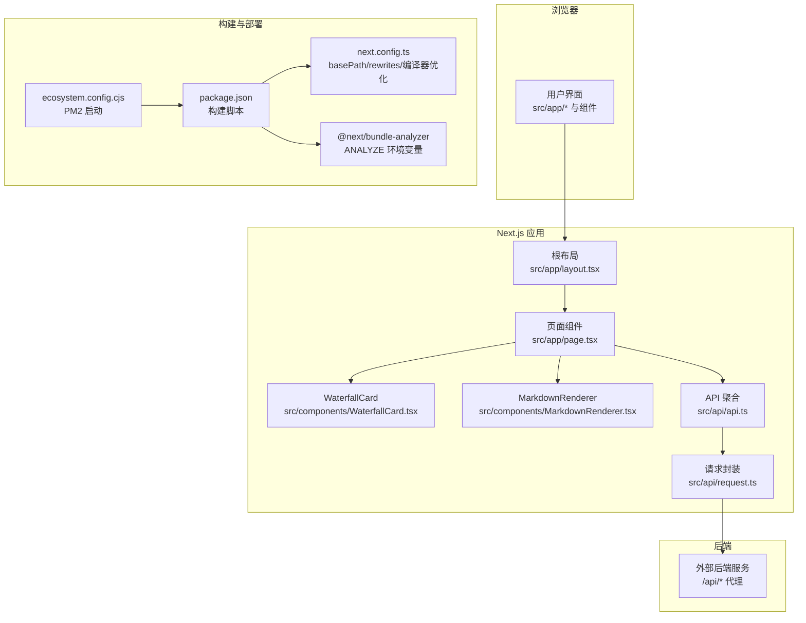
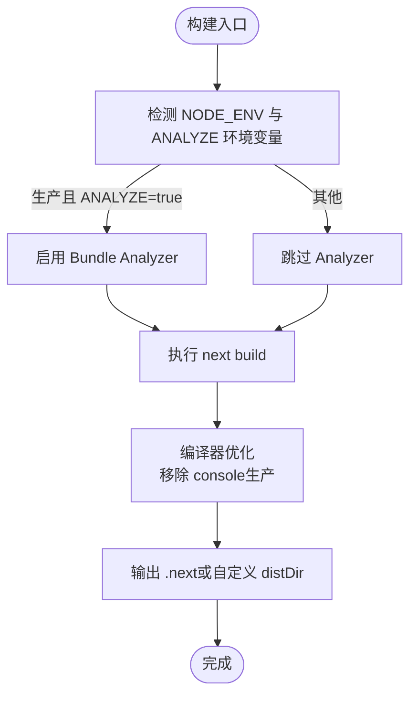
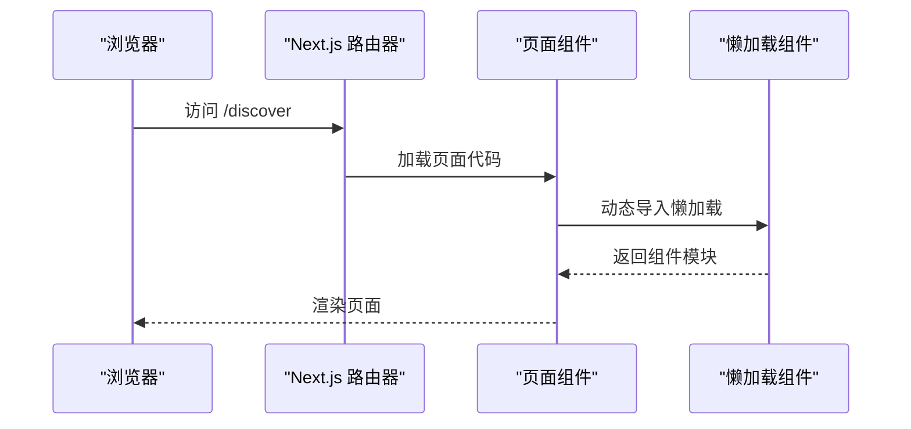
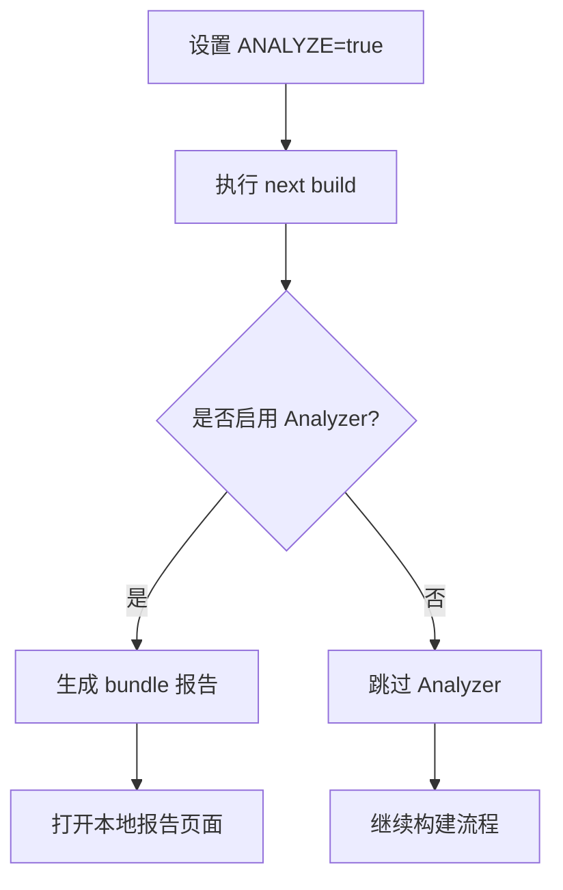
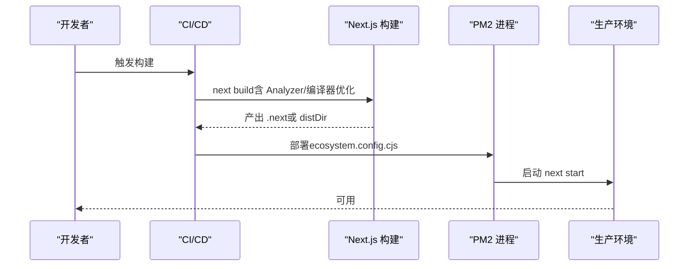
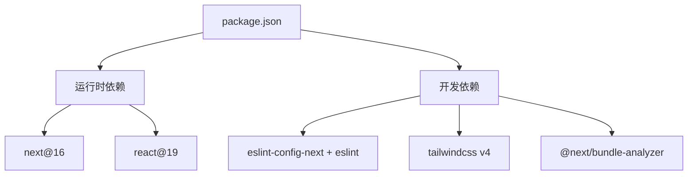

# 构建优化

<cite>
**本文引用的文件**
- [next.config.ts](file://next.config.ts)
- [package.json](file://package.json)
- [ecosystem.config.cjs](file://ecosystem.config.cjs)
- [tsconfig.json](file://tsconfig.json)
- [eslint.config.mjs](file://eslint.config.mjs)
- [postcss.config.mjs](file://postcss.config.mjs)
- [src/app/layout.tsx](file://src/app/layout.tsx)
- [src/app/page.tsx](file://src/app/page.tsx)
- [src/components/WaterfallCard.tsx](file://src/components/WaterfallCard.tsx)
- [src/components/MarkdownRenderer.tsx](file://src/components/MarkdownRenderer.tsx)
- [src/api/api.ts](file://src/api/api.ts)
- [src/api/request.ts](file://src/api/request.ts)
- [doc/optimization-summary.md](file://doc/optimization-summary.md)
- [doc/next16-面试重难点.md](file://doc/next16-面试重难点.md)
</cite>

## 目录
1. [简介](#简介)
2. [项目结构](#项目结构)
3. [核心组件](#核心组件)
4. [架构总览](#架构总览)
5. [详细组件分析](#详细组件分析)
6. [依赖分析](#依赖分析)
7. [性能考量](#性能考量)
8. [故障排查指南](#故障排查指南)
9. [结论](#结论)
10. [附录](#附录)

## 简介
本指南围绕 Next.js 16 项目构建优化展开，结合仓库现有配置与实现，系统讲解以下主题：
- 构建配置：basePath 设置、输出目录、编译器优化（含移除 console）
- 代码分割与 Tree Shaking：基于 App Router 的路由分组与动态导入
- Bundle Analyzer 使用：按需启用与报告解读
- 生产环境优化：standalone 输出、缓存组件（cacheComponents）、代理重写（rewrites）
- 去除 console.log 的生产环境配置
- 构建性能监控与最佳实践

本指南既面向初学者，也提供深入的技术细节与可视化图表，帮助读者快速落地优化策略。

## 项目结构
该项目采用 Next.js App Router 目录结构，核心配置集中在 next.config.ts，构建脚本与依赖在 package.json 中定义。TypeScript、ESLint、PostCSS 等工具链配置分别位于 tsconfig.json、eslint.config.mjs、postcss.config.mjs。业务代码主要分布在 src 下，包含页面、组件、API 封装与样式入口。

**图表来源**
- [next.config.ts:1-76](file://next.config.ts#L1-L76)
- [package.json:1-39](file://package.json#L1-L39)
- [tsconfig.json:1-35](file://tsconfig.json#L1-L35)
- [eslint.config.mjs:1-19](file://eslint.config.mjs#L1-L19)
- [postcss.config.mjs:1-8](file://postcss.config.mjs#L1-L8)
- [src/app/layout.tsx:1-44](file://src/app/layout.tsx#L1-L44)
- [src/app/page.tsx:1-75](file://src/app/page.tsx#L1-L75)
- [src/components/WaterfallCard.tsx:1-155](file://src/components/WaterfallCard.tsx#L1-L155)
- [src/components/MarkdownRenderer.tsx:1-139](file://src/components/MarkdownRenderer.tsx#L1-L139)
- [src/api/api.ts:1-128](file://src/api/api.ts#L1-L128)
- [src/api/request.ts:1-455](file://src/api/request.ts#L1-L455)

**章节来源**
- [next.config.ts:1-76](file://next.config.ts#L1-L76)
- [package.json:1-39](file://package.json#L1-L39)
- [tsconfig.json:1-35](file://tsconfig.json#L1-L35)
- [eslint.config.mjs:1-19](file://eslint.config.mjs#L1-L19)
- [postcss.config.mjs:1-8](file://postcss.config.mjs#L1-L8)

## 核心组件
本节聚焦与构建优化直接相关的关键配置与实现：

- 构建配置与编译器优化
  - basePath：通过环境变量控制，开发与生产路径差异可通过 NEXT_PUBLIC_BASE_PATH 区分。
  - 输出目录：默认 .next，可通过 distDir 修改，注意生产启动需同步调整。
  - 编译器优化：在生产环境移除 console，减少包体积与运行时噪音。
  - standalone：可选生成独立可部署包，注意 assetPrefix 与绝对路径的搭配。
  - rewrites：将 /api/* 代理至后端，隐藏真实后端地址，提升安全性与可维护性。
  - cacheComponents：启用组件级缓存，结合 Suspense 实现流式渲染与静态外壳的平衡。

- 代码分割与 Tree Shaking
  - App Router 的路由即代码分割单元，动态路由与懒加载组件自然生效。
  - TypeScript 与 bundler 解析器提升 Tree Shaking 效果，确保未使用代码被剔除。

- Bundle Analyzer
  - 通过环境变量 ANALYZE=true 启用，生成可视化报告，定位大体积模块与重复依赖。

- 生产环境部署
  - ecosystem.config.cjs 提供 PM2 启动配置，包含内存上限、端口与环境变量。

**章节来源**
- [next.config.ts:1-76](file://next.config.ts#L1-L76)
- [package.json:1-39](file://package.json#L1-L39)
- [ecosystem.config.cjs:1-20](file://ecosystem.config.cjs#L1-L20)

## 架构总览
下图展示了从浏览器到后端的请求链路，以及构建阶段的关键优化点：

**图表来源**
- [next.config.ts:1-76](file://next.config.ts#L1-L76)
- [package.json:1-39](file://package.json#L1-L39)
- [ecosystem.config.cjs:1-20](file://ecosystem.config.cjs#L1-L20)
- [src/app/layout.tsx:1-44](file://src/app/layout.tsx#L1-L44)
- [src/app/page.tsx:1-75](file://src/app/page.tsx#L1-L75)
- [src/components/WaterfallCard.tsx:1-155](file://src/components/WaterfallCard.tsx#L1-L155)
- [src/components/MarkdownRenderer.tsx:1-139](file://src/components/MarkdownRenderer.tsx#L1-L139)
- [src/api/api.ts:1-128](file://src/api/api.ts#L1-L128)
- [src/api/request.ts:1-455](file://src/api/request.ts#L1-L455)

## 详细组件分析

### 构建配置与编译器优化
- basePath 设置
  - 通过环境变量 NEXT_PUBLIC_BASE_PATH 控制，开发环境留空，生产环境指向子路径（如 /app/）。
  - 注意：standalone 模式下不建议设置 assetPrefix，保持默认绝对路径以避免资源路径问题。

- 输出目录与启动
  - 默认 .next，可通过 distDir 修改输出目录，生产启动需同步指定 --dir 参数。

- 编译器优化
  - removeConsole 仅在生产环境启用，有效减少包体积与运行时日志输出。

- standalone 与缓存组件
  - standalone 便于独立部署；cacheComponents 启用组件级缓存，结合 Suspense 实现静态外壳与动态流式注入。

- 代理重写（rewrites）
  - 将 /api/* 代理至 BACKEND_URL，隐藏真实后端地址，简化前端调用与部署。

**图表来源**
- [next.config.ts:64-76](file://next.config.ts#L64-L76)
- [package.json:5-10](file://package.json#L5-L10)

**章节来源**
- [next.config.ts:1-76](file://next.config.ts#L1-L76)
- [package.json:1-39](file://package.json#L1-L39)

### 代码分割策略与 Tree Shaking
- 路由即分割单元
  - App Router 将每个页面视为独立代码块，动态路由与懒加载组件天然受益。

- Tree Shaking 实践
  - TypeScript 与 bundler 解析器提升摇树效果，确保未使用代码被剔除。
  - ESLint 与 TS 配置共同保证类型安全与模块化。

**图表来源**
- [src/app/page.tsx:18-52](file://src/app/page.tsx#L18-L52)
- [tsconfig.json:10-11](file://tsconfig.json#L10-L11)

**章节来源**
- [src/app/page.tsx:18-52](file://src/app/page.tsx#L18-L52)
- [tsconfig.json:1-35](file://tsconfig.json#L1-L35)

### Bundle Analyzer 使用方法
- 启用方式
  - 设置 ANALYZE=true 环境变量后执行构建，Analyzer 将生成可视化报告，帮助识别大体积模块与重复依赖。

- 报告解读
  - 关注 vendor 与第三方包占比，优先优化高频依赖与未使用的子模块。

**图表来源**
- [next.config.ts:71-75](file://next.config.ts#L71-L75)
- [package.json:7](file://package.json#L7)

**章节来源**
- [next.config.ts:71-75](file://next.config.ts#L71-L75)
- [package.json:1-39](file://package.json#L1-L39)

### 生产环境构建优化
- standalone 输出
  - 可选启用，生成独立可部署包，便于容器化与边缘部署。

- 缓存组件（cacheComponents）
  - 启用组件级缓存，结合 Suspense 实现静态外壳与动态流式注入，兼顾首屏性能与数据实时性。

- 代理重写（rewrites）
  - 将 /api/* 代理至后端，隐藏真实地址，简化前端调用与部署。

- 部署与启动
  - ecosystem.config.cjs 提供 PM2 启动配置，包含内存限制、端口与环境变量。

**图表来源**
- [next.config.ts:23-45](file://next.config.ts#L23-L45)
- [ecosystem.config.cjs:1-20](file://ecosystem.config.cjs#L1-L20)

**章节来源**
- [next.config.ts:23-45](file://next.config.ts#L23-L45)
- [ecosystem.config.cjs:1-20](file://ecosystem.config.cjs#L1-L20)

### 去除 console.log 配置
- 生产环境移除 console
  - 通过编译器配置在生产环境移除 console，减少包体积与运行时日志输出。

- 建议
  - 保留开发环境 console 便于调试；仅在生产环境启用 removeConsole。

**章节来源**
- [next.config.ts:64-68](file://next.config.ts#L64-L68)

### 构建性能监控
- 依赖与工具链
  - TypeScript、ESLint、PostCSS 等工具链配置直接影响构建速度与产物质量。

- 监控建议
  - 使用 Bundle Analyzer 识别大体积模块；结合 ESLint 与 TS 配置提升类型检查效率。

**章节来源**
- [tsconfig.json:1-35](file://tsconfig.json#L1-L35)
- [eslint.config.mjs:1-19](file://eslint.config.mjs#L1-L19)
- [postcss.config.mjs:1-8](file://postcss.config.mjs#L1-L8)

## 依赖分析
- 构建与运行时依赖
  - Next.js 16、React 19、Zustand 等核心依赖；@next/bundle-analyzer 用于分析构建产物。

- 开发依赖
  - ESLint、Tailwind 4、TypeScript 等，确保代码质量与样式一致性。

**图表来源**
- [package.json:11-37](file://package.json#L11-L37)

**章节来源**
- [package.json:1-39](file://package.json#L1-L39)

## 性能考量
- 首屏性能（LCP）
  - 首屏图片预加载：在瀑布流与发现页中，通过 priority 接口对首排图片进行精确预加载，缩短 LCP 时间。
  - 组件级缓存：启用 cacheComponents，结合 Suspense 实现静态外壳与动态流式注入。

- 代码体积
  - Tree Shaking：通过 TypeScript 与 bundler 解析器提升摇树效果。
  - Analyzer：定期分析构建产物，识别大体积模块与重复依赖。

- 请求与缓存
  - fetch 默认策略：Next 16 默认不缓存，避免陈旧数据；必要时使用 revalidate 或 cacheComponents 精细化控制。
  - 代理重写：隐藏后端地址，简化前端调用与部署。

**章节来源**
- [doc/optimization-summary.md:26-35](file://doc/optimization-summary.md#L26-L35)
- [next.config.ts:47-63](file://next.config.ts#L47-L63)
- [doc/next16-面试重难点.md:14-16](file://doc/next16-面试重难点.md#L14-L16)

## 故障排查指南
- 构建失败或包过大
  - 检查 ANALYZE 环境变量与 Bundle Analyzer 报告，定位大体积模块。
  - 确认 removeConsole 仅在生产环境启用，避免开发环境日志缺失。

- 资源路径问题
  - standalone 模式下不设置 assetPrefix，保持默认绝对路径。
  - basePath 通过环境变量控制，开发与生产路径需一致。

- 代理请求异常
  - 确认 rewrites 配置与 BACKEND_URL 一致，避免路径映射错误。
  - 检查请求封装中的 baseURL 与相对路径处理。

- 运行时错误
  - 检查 ESLint 与 TS 配置，确保类型安全与模块化。
  - 使用 PM2 日志与内存监控，定位进程异常。

**章节来源**
- [next.config.ts:6-8](file://next.config.ts#L6-L8)
- [next.config.ts:23-26](file://next.config.ts#L23-L26)
- [next.config.ts:28-45](file://next.config.ts#L28-L45)
- [ecosystem.config.cjs:13-16](file://ecosystem.config.cjs#L13-L16)

## 结论
本指南基于仓库现有配置与实现，系统梳理了 Next.js 16 的构建优化要点：从 basePath、输出目录、编译器优化到代码分割、Tree Shaking 与 Bundle Analyzer；从生产环境的 standalone、cacheComponents 到代理重写与部署流程。结合图片预加载与缓存策略，可在保证性能的同时提升用户体验。建议在持续集成中加入 Analyzer 报告与 ESLint/TS 检查，形成闭环的质量与性能保障体系。

## 附录
- 配置示例与最佳实践
  - basePath：通过环境变量区分开发与生产路径。
  - distDir：如需修改输出目录，生产启动需同步调整。
  - removeConsole：仅在生产环境启用。
  - cacheComponents：启用组件级缓存，结合 Suspense。
  - rewrites：统一代理 /api/* 至后端。
  - Analyzer：ANALYZE=true 启用，定期分析构建产物。
  - 部署：PM2 配置包含内存上限与端口，确保稳定性。

**章节来源**
- [next.config.ts:1-76](file://next.config.ts#L1-L76)
- [package.json:1-39](file://package.json#L1-L39)
- [ecosystem.config.cjs:1-20](file://ecosystem.config.cjs#L1-L20)
- [doc/optimization-summary.md:57-60](file://doc/optimization-summary.md#L57-L60)
- [doc/next16-面试重难点.md:61-65](file://doc/next16-面试重难点.md#L61-L65)