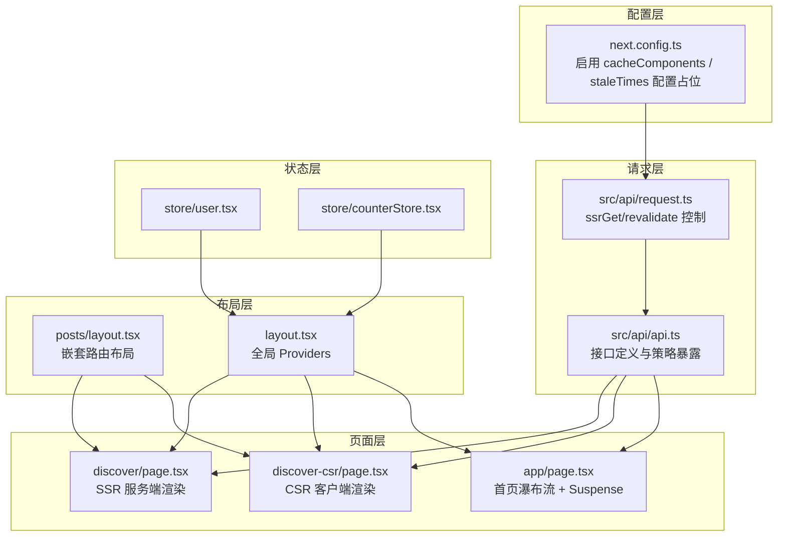
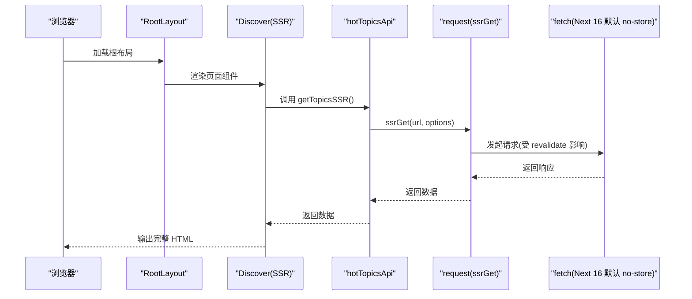
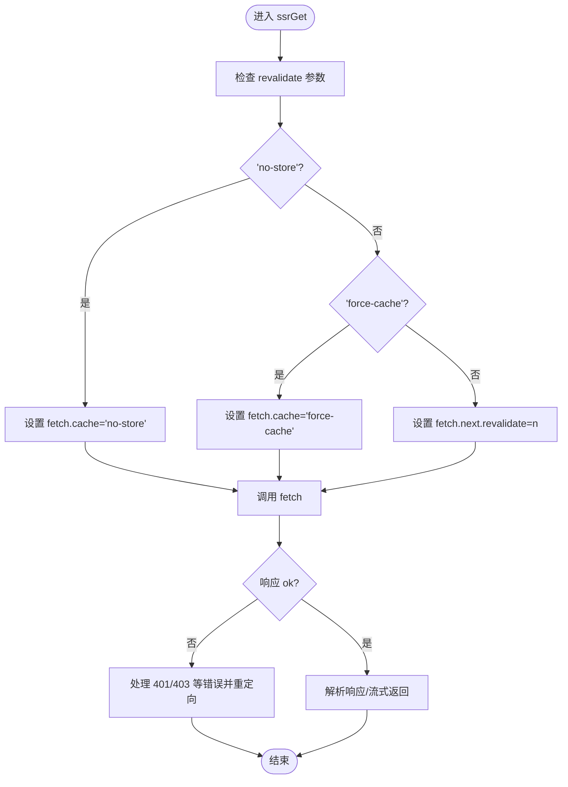
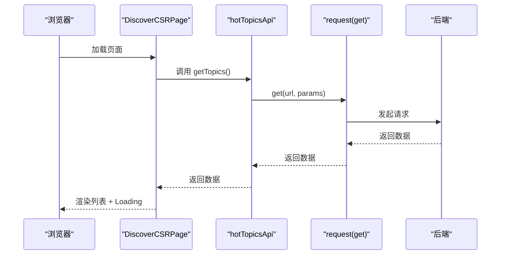
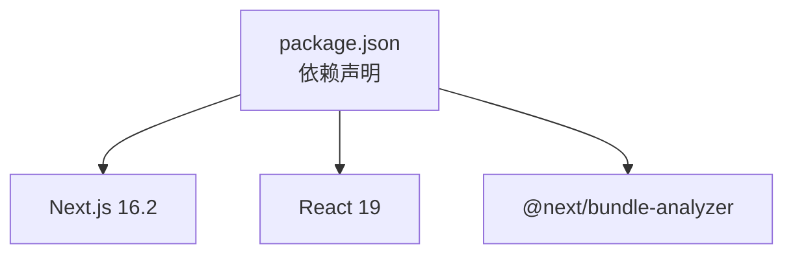

# 缓存策略

<cite>
**本文引用的文件**
- [next.config.ts](file://next.config.ts)
- [package.json](file://package.json)
- [src/app/layout.tsx](file://src/app/layout.tsx)
- [src/app/page.tsx](file://src/app/page.tsx)
- [src/app/discover/page.tsx](file://src/app/discover/page.tsx)
- [src/app/discover-csr/page.tsx](file://src/app/discover-csr/page.tsx)
- [src/app/posts/layout.tsx](file://src/app/posts/layout.tsx)
- [src/api/request.ts](file://src/api/request.ts)
- [src/api/api.ts](file://src/api/api.ts)
- [src/store/user.tsx](file://src/store/user.tsx)
- [src/store/counterStore.tsx](file://src/store/counterStore.tsx)
- [doc/optimization-summary.md](file://doc/optimization-summary.md)
- [doc/next16-面试重难点.md](file://doc/next16-面试重难点.md)
</cite>

## 目录
1. [简介](#简介)
2. [项目结构](#项目结构)
3. [核心组件](#核心组件)
4. [架构总览](#架构总览)
5. [详细组件分析](#详细组件分析)
6. [依赖分析](#依赖分析)
7. [性能考量](#性能考量)
8. [故障排查指南](#故障排查指南)
9. [结论](#结论)
10. [附录](#附录)

## 简介
本文件围绕本项目的缓存策略展开，系统梳理 Next.js 16 的缓存能力与实现方式，涵盖：
- Next.js 缓存组件（cacheComponents）与路由缓存（staleTimes）配置
- 静态生成缓存、动态路由缓存与数据获取缓存策略
- 客户端缓存、服务端缓存与混合缓存方案
- 缓存失效处理、性能监控与调试工具使用

本项目基于 Next.js 16.2 与 React 19，采用服务端组件（RSC）与 App Router，结合统一请求封装与状态管理，形成从请求到渲染的完整缓存闭环。

## 项目结构
项目采用 App Router 目录结构，关键与缓存相关的位置如下：
- 配置层：next.config.ts（启用 cacheComponents、staleTimes 配置占位）
- 请求层：src/api/request.ts（封装 fetch，支持 SSR 专用 ssrGet 与 revalidate 控制）
- API 定义层：src/api/api.ts（按模块组织接口，暴露 SSR/ISR/no-store 等策略）
- 页面层：src/app/discover/page.tsx（SSR 服务端渲染）、src/app/discover-csr/page.tsx（CSR 客户端渲染）
- 布局层：src/app/posts/layout.tsx（嵌套路由布局，体现路由缓存与状态保持）
- 根布局：src/app/layout.tsx（全局 Providers 注入）
- 状态层：src/store/user.tsx、src/store/counterStore.tsx（客户端状态管理）

**图表来源**
- [next.config.ts:47-63](file://next.config.ts#L47-L63)
- [src/api/request.ts:309-333](file://src/api/request.ts#L309-L333)
- [src/api/api.ts:44-81](file://src/api/api.ts#L44-L81)
- [src/app/discover/page.tsx:13-183](file://src/app/discover/page.tsx#L13-L183)
- [src/app/discover-csr/page.tsx:16-252](file://src/app/discover-csr/page.tsx#L16-L252)
- [src/app/page.tsx:54-75](file://src/app/page.tsx#L54-L75)
- [src/app/posts/layout.tsx:26-34](file://src/app/posts/layout.tsx#L26-L34)
- [src/app/layout.tsx:28-44](file://src/app/layout.tsx#L28-L44)
- [src/store/user.tsx:36-56](file://src/store/user.tsx#L36-L56)
- [src/store/counterStore.tsx:53-89](file://src/store/counterStore.tsx#L53-L89)

**章节来源**
- [next.config.ts:1-76](file://next.config.ts#L1-L76)
- [src/api/request.ts:1-455](file://src/api/request.ts#L1-L455)
- [src/api/api.ts:1-128](file://src/api/api.ts#L1-L128)
- [src/app/discover/page.tsx:1-183](file://src/app/discover/page.tsx#L1-L183)
- [src/app/discover-csr/page.tsx:1-252](file://src/app/discover-csr/page.tsx#L1-L252)
- [src/app/page.tsx:1-75](file://src/app/page.tsx#L1-L75)
- [src/app/posts/layout.tsx:1-34](file://src/app/posts/layout.tsx#L1-L34)
- [src/app/layout.tsx:1-44](file://src/app/layout.tsx#L1-L44)
- [src/store/user.tsx:1-56](file://src/store/user.tsx#L1-L56)
- [src/store/counterStore.tsx:1-89](file://src/store/counterStore.tsx#L1-L89)

## 核心组件
- 缓存组件与路由缓存配置
  - 在 next.config.ts 中预留了 cacheComponents 与 staleTimes 配置占位，便于后续启用组件级缓存与路由段过期时间控制。
- 请求封装与 revalidate 控制
  - request.ts 提供 ssrGet 方法，支持 revalidate 参数：'no-store'（动态）、'force-cache'（静态）、数字（ISR 间隔）。
  - 该方法自动映射到 fetch 的 cache 或 next.revalidate，从而影响数据缓存与重建策略。
- API 模块化与策略暴露
  - api.ts 按模块组织接口，提供 SSR/ISR/no-store 等策略的便捷调用，便于在页面中直接选择合适的缓存模式。
- 页面与布局的缓存行为
  - discover/page.tsx 使用 SSR 获取数据，避免浏览器侧请求，体现服务端缓存优势。
  - discover-csr/page.tsx 使用 CSR，数据在浏览器侧获取，体现客户端缓存与流式渲染差异。
  - posts/layout.tsx 展示嵌套路由布局，强调路由切换时的状态保持与缓存行为。

**章节来源**
- [next.config.ts:47-63](file://next.config.ts#L47-L63)
- [src/api/request.ts:309-333](file://src/api/request.ts#L309-L333)
- [src/api/api.ts:44-81](file://src/api/api.ts#L44-L81)
- [src/app/discover/page.tsx:13-183](file://src/app/discover/page.tsx#L13-L183)
- [src/app/discover-csr/page.tsx:16-252](file://src/app/discover-csr/page.tsx#L16-L252)
- [src/app/posts/layout.tsx:26-34](file://src/app/posts/layout.tsx#L26-L34)

## 架构总览
本项目的缓存架构围绕“请求层-页面层-布局层-状态层”展开，核心流程如下：

**图表来源**
- [src/app/layout.tsx:28-44](file://src/app/layout.tsx#L28-L44)
- [src/app/discover/page.tsx:25-50](file://src/app/discover/page.tsx#L25-L50)
- [src/api/api.ts:50-55](file://src/api/api.ts#L50-L55)
- [src/api/request.ts:309-333](file://src/api/request.ts#L309-L333)

## 详细组件分析

### 组件 A：请求封装与数据缓存策略（ssrGet 与 revalidate）
- 设计要点
  - ssrGet 根据 revalidate 参数分别设置 fetch 的 cache 或 next.revalidate，从而控制缓存行为：
    - 'no-store'：禁用缓存（默认），适合动态数据
    - 'force-cache'：强制缓存（静态），适合构建时固定数据
    - 数字 n：ISR 间隔（秒），适合定时重建
  - 该封装统一了 SSR 场景下的数据获取与缓存策略，避免分散配置带来的不一致。
- 复杂度与性能
  - 时间复杂度：O(1)（单次请求），空间复杂度：O(n)（响应数据大小）
  - 通过 revalidate 精细化控制缓存重建时机，降低不必要的重复请求
- 错误处理与边界
  - 对 401/403 等状态进行拦截与重定向处理，确保缓存命中时也能正确处理鉴权问题
  - 对超时与网络异常进行统一捕获与抛出，便于上层感知

**图表来源**
- [src/api/request.ts:309-333](file://src/api/request.ts#L309-L333)
- [src/api/request.ts:148-235](file://src/api/request.ts#L148-L235)

**章节来源**
- [src/api/request.ts:309-333](file://src/api/request.ts#L309-L333)
- [src/api/request.ts:148-235](file://src/api/request.ts#L148-L235)

### 组件 B：页面级缓存策略（SSR vs CSR）
- SSR（服务端渲染）
  - discover/page.tsx 使用 getTopicsSSR，数据在服务端获取，浏览器收到完整 HTML，Network 面板不出现 /api 请求，体现服务端缓存优势
  - 适合对 SEO 与首屏性能要求高的场景
- CSR（客户端渲染）
  - discover-csr/page.tsx 使用 getTopics，数据在浏览器侧获取，体现客户端缓存与流式渲染差异
  - 适合交互频繁、个性化强的场景
- 首页瀑布流
  - app/page.tsx 使用 Suspense 与服务端组件，结合图片优先级策略，优化首屏 LCP

**图表来源**
- [src/app/discover-csr/page.tsx:43-75](file://src/app/discover-csr/page.tsx#L43-L75)
- [src/api/api.ts:46-48](file://src/api/api.ts#L46-L48)
- [src/api/request.ts:267-289](file://src/api/request.ts#L267-L289)

**章节来源**
- [src/app/discover/page.tsx:13-183](file://src/app/discover/page.tsx#L13-L183)
- [src/app/discover-csr/page.tsx:16-252](file://src/app/discover-csr/page.tsx#L16-L252)
- [src/app/page.tsx:54-75](file://src/app/page.tsx#L54-L75)
- [src/api/api.ts:46-48](file://src/api/api.ts#L46-L48)
- [src/api/request.ts:267-289](file://src/api/request.ts#L267-L289)

### 组件 C：路由缓存与嵌套路由（posts/layout）
- 嵌套路由布局
  - posts/layout.tsx 展示了嵌套路由的父组件，子页面切换时布局不重新渲染，体现路由缓存与状态保持
- 与缓存的关系
  - 布局层的稳定性有助于减少不必要的重渲染，配合页面层的 SSR/CSR 策略，形成整体缓存友好性

**章节来源**
- [src/app/posts/layout.tsx:26-34](file://src/app/posts/layout.tsx#L26-L34)

### 组件 D：状态管理与缓存副作用
- 用户状态与计数器
  - user.tsx 与 counterStore.tsx 提供客户端状态管理，避免在 SSR 场景下访问浏览器 API
  - 与缓存策略的协同：在 CSR 场景下，状态变化不应触发不必要的数据请求；在 SSR 场景下，状态应在服务端初始化，减少客户端副作用

**章节来源**
- [src/store/user.tsx:36-56](file://src/store/user.tsx#L36-L56)
- [src/store/counterStore.tsx:53-89](file://src/store/counterStore.tsx#L53-L89)

## 依赖分析
- Next.js 与 React 版本
  - 项目使用 Next.js 16.2 与 React 19，具备最新的缓存与渲染能力
- 缓存相关依赖
  - @next/bundle-analyzer：用于构建体积与缓存命中率分析
- 与缓存策略的耦合点
  - next.config.ts 中的 cacheComponents 与 staleTimes 配置占位，为后续启用组件级缓存与路由段过期时间提供基础
  - request.ts 的 ssrGet 与 revalidate 映射，直接影响数据缓存与重建策略

**图表来源**
- [package.json:11-26](file://package.json#L11-L26)
- [package.json:27-37](file://package.json#L27-L37)

**章节来源**
- [package.json:11-39](file://package.json#L11-L39)
- [next.config.ts:47-63](file://next.config.ts#L47-L63)

## 性能考量
- 首屏性能（LCP）
  - 瀑布流与发现页的图片优先级策略，仅对首屏少量图片开启 priority，提升 LCP 表现
- 缓存策略选择
  - 动态数据使用 'no-store'，避免陈旧数据
  - 构建时固定数据使用 'force-cache'，最大化缓存命中
  - 定时更新场景使用数字 revalidate（ISR），平衡新鲜度与性能
- 流式渲染与 Suspense
  - 首页与发现页结合 Suspense 与服务端组件，缩短首屏时间，改善用户体验

**章节来源**
- [doc/optimization-summary.md:26-34](file://doc/optimization-summary.md#L26-L34)
- [src/app/page.tsx:54-75](file://src/app/page.tsx#L54-L75)
- [src/api/request.ts:309-333](file://src/api/request.ts#L309-L333)

## 故障排查指南
- 常见问题与定位
  - 401/403 未授权：request.ts 对 401/403 进行拦截并重定向，确保缓存命中时也能正确处理鉴权
  - 超时与网络异常：统一捕获并抛出，便于上层感知与重试
  - SSR 与 CSR 的差异：通过 Network 面板对比 SSR（无 /api 请求）与 CSR（存在 /api 请求）的差异
- 调试工具
  - 使用 @next/bundle-analyzer 分析构建体积与缓存命中情况
  - 在开发环境通过浏览器 Network 面板观察 revalidate 行为与缓存重建频率

**章节来源**
- [src/api/request.ts:148-235](file://src/api/request.ts#L148-L235)
- [package.json:27-37](file://package.json#L27-L37)

## 结论
本项目在 Next.js 16.2 与 React 19 的基础上，通过统一请求封装与 revalidate 策略，结合 SSR/CSR 的差异化缓存方案，形成了从请求到渲染的完整缓存闭环。配合路由布局与状态管理的协同，既保证了性能与体验，又提供了清晰的调试与监控手段。后续可按需启用 cacheComponents 与 staleTimes，进一步精细化组件级与路由段级缓存。

## 附录
- Next.js 16 缓存机制要点
  - 请求记忆化、数据缓存、完整路由缓存、客户端路由缓存
  - cacheComponents 替代 PPR，结合 Suspense 实现静态外壳与动态内容流式注入
- 面试重难点
  - fetch 默认缓存策略反转（默认 no-store）
  - middleware.ts 迁移到 proxy.ts 的架构意义
  - 服务端主导的缓存策略与安全反序列化约束

**章节来源**
- [doc/next16-面试重难点.md:14-32](file://doc/next16-面试重难点.md#L14-L32)
- [doc/next16-面试重难点.md:47-58](file://doc/next16-面试重难点.md#L47-L58)