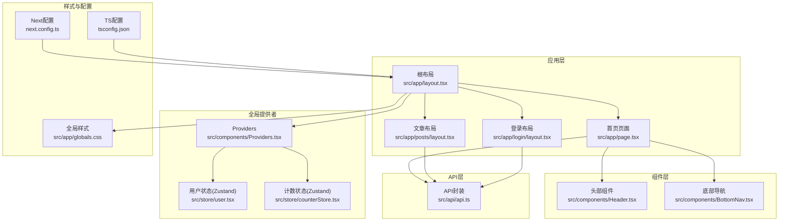
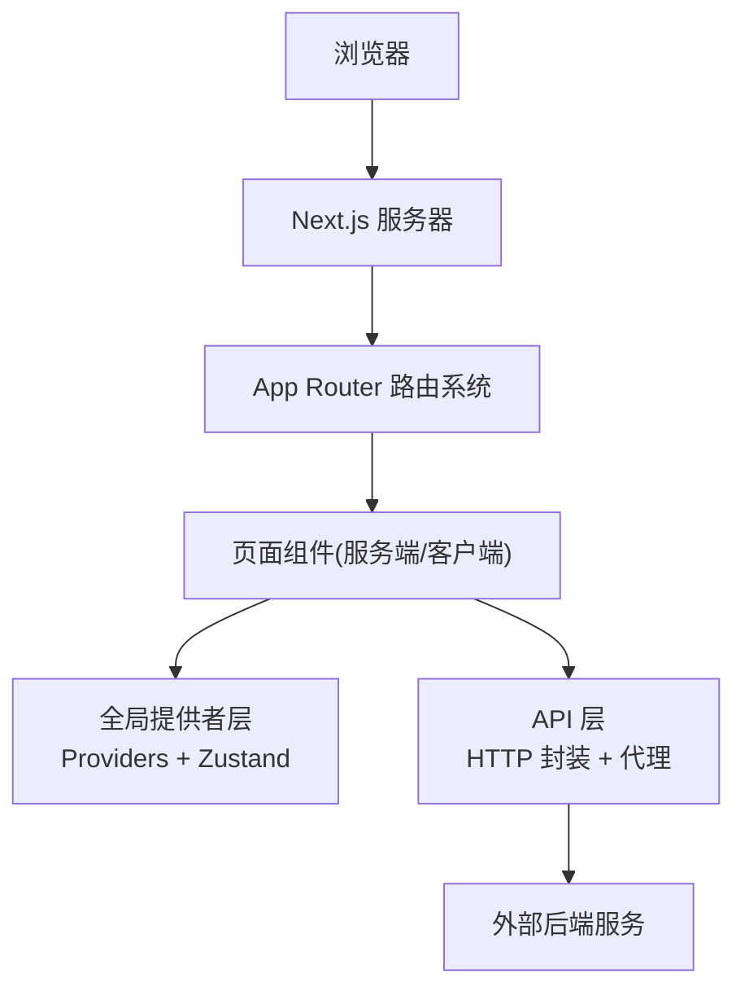
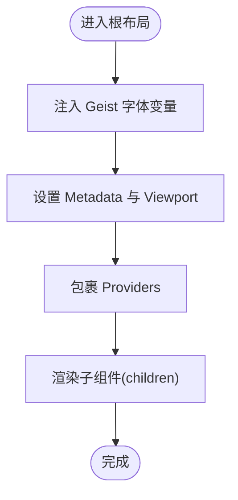
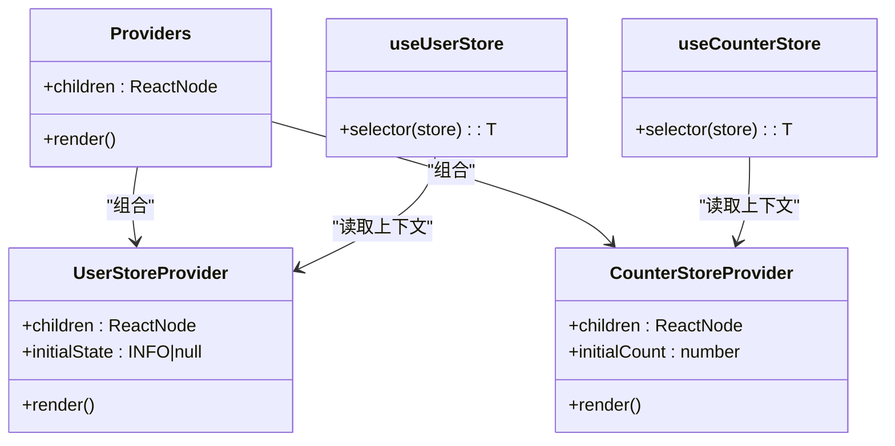
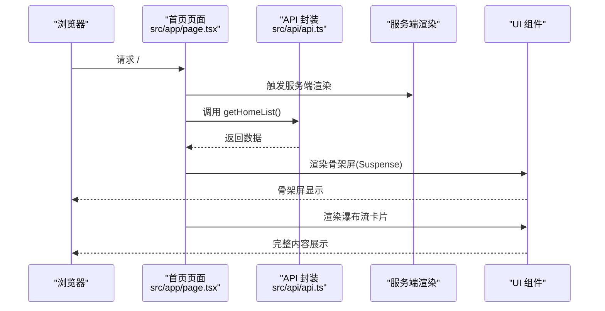
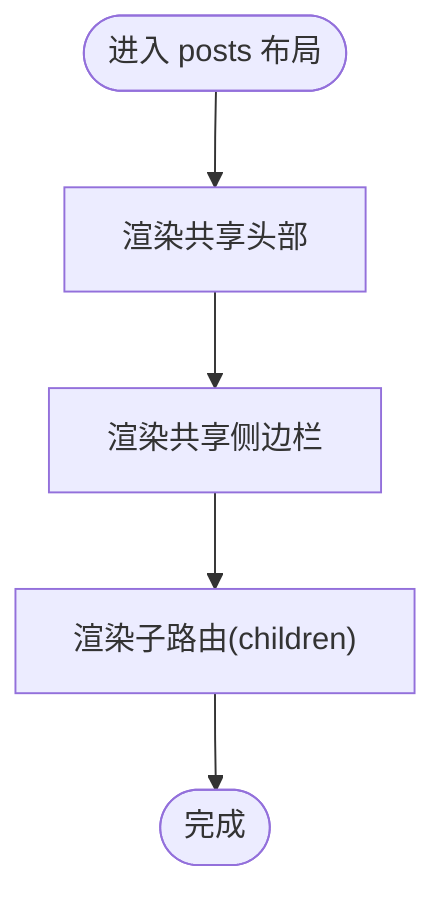
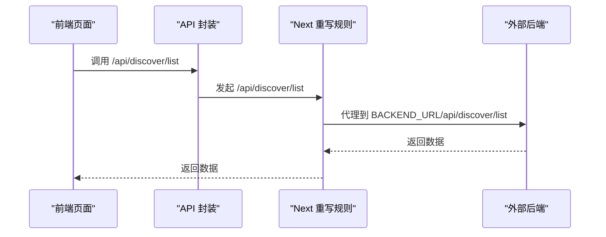
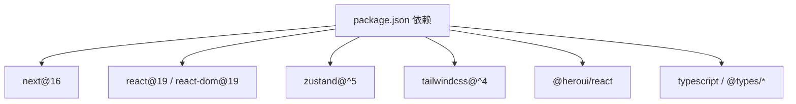

# 架构概览

<cite>
**本文引用的文件**
- [README.md](file://README.md)
- [package.json](file://package.json)
- [next.config.ts](file://next.config.ts)
- [tsconfig.json](file://tsconfig.json)
- [src/app/layout.tsx](file://src/app/layout.tsx)
- [src/components/Providers.tsx](file://src/components/Providers.tsx)
- [src/store/counterStore.tsx](file://src/store/counterStore.tsx)
- [src/store/user.tsx](file://src/store/user.tsx)
- [src/app/page.tsx](file://src/app/page.tsx)
- [src/app/posts/layout.tsx](file://src/app/posts/layout.tsx)
- [src/app/login/layout.tsx](file://src/app/login/layout.tsx)
- [src/api/api.ts](file://src/api/api.ts)
- [src/components/Header.tsx](file://src/components/Header.tsx)
- [src/components/BottomNav.tsx](file://src/components/BottomNav.tsx)
- [src/app/globals.css](file://src/app/globals.css)
</cite>

## 目录
1. [简介](#简介)
2. [项目结构](#项目结构)
3. [核心组件](#核心组件)
4. [架构总览](#架构总览)
5. [详细组件分析](#详细组件分析)
6. [依赖分析](#依赖分析)
7. [性能考虑](#性能考虑)
8. [故障排查指南](#故障排查指南)
9. [结论](#结论)
10. [附录](#附录)

## 简介
本项目是一个基于 Next.js App Router 的移动端优先应用，采用服务端组件与客户端组件混合架构，结合 Zustand 状态管理、Heroui 组件库与 TailwindCSS 样式体系，实现高性能、可扩展的前端应用。应用通过根布局统一注入全局样式与多层 Provider，围绕 App Router 的路由约定组织页面与嵌套路由，配合 API 层进行数据获取与流式渲染，形成清晰的系统边界与模块化职责。

## 项目结构
应用采用 App Router 目录结构，页面按功能域划分，公共组件与状态管理位于 src 目录内，配置集中在根目录。关键目录与文件如下：
- 根配置：next.config.ts、tsconfig.json、package.json
- 应用入口与全局：src/app/layout.tsx、src/app/globals.css
- 全局提供者：src/components/Providers.tsx
- 状态管理：src/store/counterStore.tsx、src/store/user.tsx
- 页面与路由：src/app/page.tsx、src/app/posts/layout.tsx、src/app/login/layout.tsx 等
- 组件：src/components/Header.tsx、src/components/BottomNav.tsx 等
- API 层：src/api/api.ts

图表来源
- [src/app/layout.tsx:1-44](file://src/app/layout.tsx#L1-L44)
- [src/components/Providers.tsx:1-20](file://src/components/Providers.tsx#L1-L20)
- [src/store/user.tsx:1-56](file://src/store/user.tsx#L1-L56)
- [src/store/counterStore.tsx:1-89](file://src/store/counterStore.tsx#L1-L89)
- [src/app/page.tsx:1-75](file://src/app/page.tsx#L1-L75)
- [src/app/posts/layout.tsx:1-119](file://src/app/posts/layout.tsx#L1-L119)
- [src/app/login/layout.tsx:1-30](file://src/app/login/layout.tsx#L1-L30)
- [src/api/api.ts:1-128](file://src/api/api.ts#L1-L128)
- [src/app/globals.css:1-288](file://src/app/globals.css#L1-L288)
- [next.config.ts:1-76](file://next.config.ts#L1-L76)
- [tsconfig.json:1-35](file://tsconfig.json#L1-L35)

章节来源
- [README.md:1-37](file://README.md#L1-L37)
- [package.json:1-39](file://package.json#L1-L39)
- [next.config.ts:1-76](file://next.config.ts#L1-L76)
- [tsconfig.json:1-35](file://tsconfig.json#L1-L35)

## 核心组件
- 根布局与全局样式：根布局负责注入字体、元数据、视口配置与全局样式，并通过 Providers 注入状态与提示组件上下文。
- 全局提供者：Providers 将 ToastProvider、用户状态与计数状态提供给子树，确保跨页面共享状态与提示能力。
- 状态管理：Zustand 提供轻量级状态容器，分别管理用户信息与计数逻辑，通过 Context 与自定义 Hook 暴露给组件使用。
- 页面与路由：首页页面采用服务端组件与 Suspense 流式渲染，嵌套路由布局在 posts 下共享侧边栏与标题栏，登录页采用独立布局。
- 组件：Header 与 BottomNav 提供基础 UI 与导航能力；全局样式通过 Tailwind 与 Heroui 定义主题变量与动画。

章节来源
- [src/app/layout.tsx:1-44](file://src/app/layout.tsx#L1-L44)
- [src/components/Providers.tsx:1-20](file://src/components/Providers.tsx#L1-L20)
- [src/store/user.tsx:1-56](file://src/store/user.tsx#L1-L56)
- [src/store/counterStore.tsx:1-89](file://src/store/counterStore.tsx#L1-L89)
- [src/app/page.tsx:1-75](file://src/app/page.tsx#L1-L75)
- [src/app/posts/layout.tsx:1-119](file://src/app/posts/layout.tsx#L1-L119)
- [src/app/login/layout.tsx:1-30](file://src/app/login/layout.tsx#L1-L30)
- [src/components/Header.tsx:1-55](file://src/components/Header.tsx#L1-L55)
- [src/components/BottomNav.tsx:1-103](file://src/components/BottomNav.tsx#L1-L103)
- [src/app/globals.css:1-288](file://src/app/globals.css#L1-L288)

## 架构总览
系统采用分层架构：
- 表现层：App Router 页面与组件，负责 UI 呈现与用户交互。
- 数据层：API 封装与代理，统一处理后端接口与重写规则。
- 状态层：Zustand 状态容器，提供细粒度状态管理与选择器订阅。
- 基础设施：Next 配置、TypeScript 配置与构建工具链。

图表来源
- [src/app/layout.tsx:1-44](file://src/app/layout.tsx#L1-L44)
- [src/components/Providers.tsx:1-20](file://src/components/Providers.tsx#L1-L20)
- [src/api/api.ts:1-128](file://src/api/api.ts#L1-L128)
- [next.config.ts:27-45](file://next.config.ts#L27-L45)

## 详细组件分析

### 根布局与全局样式
- 根布局负责注入字体变量、元数据与视口配置，统一背景色与最小高度。
- 通过 Providers 包裹子树，确保全局状态与提示可用。
- 全局样式通过 Tailwind 与 Heroui 组织主题变量与动画类名。

图表来源
- [src/app/layout.tsx:16-43](file://src/app/layout.tsx#L16-L43)
- [src/app/globals.css:1-288](file://src/app/globals.css#L1-L288)

章节来源
- [src/app/layout.tsx:1-44](file://src/app/layout.tsx#L1-L44)
- [src/app/globals.css:1-288](file://src/app/globals.css#L1-L288)

### 全局提供者与状态管理
- Providers 组合多个上下文提供者，保证状态与 UI 提示在整棵组件树中可用。
- 用户状态与计数状态分别通过独立的 Zustand store 管理，避免耦合。
- 自定义 Hook useUserStore/useCounterStore 以选择器方式订阅状态，减少重渲染。

图表来源
- [src/components/Providers.tsx:8-19](file://src/components/Providers.tsx#L8-L19)
- [src/store/user.tsx:36-56](file://src/store/user.tsx#L36-L56)
- [src/store/counterStore.tsx:53-89](file://src/store/counterStore.tsx#L53-L89)

章节来源
- [src/components/Providers.tsx:1-20](file://src/components/Providers.tsx#L1-L20)
- [src/store/user.tsx:1-56](file://src/store/user.tsx#L1-L56)
- [src/store/counterStore.tsx:1-89](file://src/store/counterStore.tsx#L1-L89)

### 首页页面与数据流
- 首页页面采用服务端组件与 Suspense，实现流式渲染与骨架屏体验。
- 数据获取通过 API 封装的接口完成，异常处理中区分重定向场景。
- 瀑布流布局将卡片分为左右两列，优先级前几张卡片提升首屏体验。

图表来源
- [src/app/page.tsx:19-52](file://src/app/page.tsx#L19-L52)
- [src/api/api.ts:64-71](file://src/api/api.ts#L64-L71)

章节来源
- [src/app/page.tsx:1-75](file://src/app/page.tsx#L1-L75)
- [src/api/api.ts:1-128](file://src/api/api.ts#L1-L128)

### 嵌套路由布局与导航
- posts 布局作为嵌套路由父组件，共享标题栏与侧边栏，子路由切换时不重新渲染。
- 底部导航根据当前路径高亮对应项，支持中心按钮与安全区域适配。

图表来源
- [src/app/posts/layout.tsx:26-118](file://src/app/posts/layout.tsx#L26-L118)
- [src/components/BottomNav.tsx:67-102](file://src/components/BottomNav.tsx#L67-L102)

章节来源
- [src/app/posts/layout.tsx:1-119](file://src/app/posts/layout.tsx#L1-L119)
- [src/components/BottomNav.tsx:1-103](file://src/components/BottomNav.tsx#L1-L103)

### 登录页布局
- 登录页采用独立布局，注入专用样式，便于隔离不同页面的主题与结构。

章节来源
- [src/app/login/layout.tsx:1-30](file://src/app/login/layout.tsx#L1-L30)

### API 层与代理
- API 封装集中管理接口类型与调用方法，支持 SSR、ISR 与流式响应。
- Next 配置中的 rewrites 将前端 /api/* 请求代理至外部后端，实现无感转发。

图表来源
- [src/api/api.ts:44-81](file://src/api/api.ts#L44-L81)
- [next.config.ts:30-45](file://next.config.ts#L30-L45)

章节来源
- [src/api/api.ts:1-128](file://src/api/api.ts#L1-L128)
- [next.config.ts:27-45](file://next.config.ts#L27-L45)

## 依赖分析
- 技术栈：Next.js 16、React 19、TypeScript、TailwindCSS v4、Heroui、Zustand。
- 构建与分析：使用 @next/bundle-analyzer 进行体积分析，按需启用。
- 路由与渲染：App Router 默认静态优先，动态路由自动降级；可选启用组件缓存与缓存生命周期。
- 图片与代理：允许 http/https 远程图片；通过 rewrites 将 /api/* 代理到后端。

图表来源
- [package.json:11-26](file://package.json#L11-L26)

章节来源
- [package.json:1-39](file://package.json#L1-L39)
- [next.config.ts:1-76](file://next.config.ts#L1-L76)
- [tsconfig.json:1-35](file://tsconfig.json#L1-L35)

## 性能考虑
- 渲染策略：服务端组件优先，Suspense 支持流式渲染与骨架屏；可选启用组件缓存以降低重复渲染成本。
- 资源优化：自动字体优化与 Tailwind 样式按需生成；生产环境移除 console 输出。
- 网络代理：通过 rewrites 将 /api/* 透明代理到后端，减少跨域与额外中间层开销。
- 构建分析：集成 bundle 分析器，便于识别体积热点与优化方向。

章节来源
- [src/app/page.tsx:64-68](file://src/app/page.tsx#L64-L68)
- [next.config.ts:47-68](file://next.config.ts#L47-L68)
- [next.config.ts:27-45](file://next.config.ts#L27-L45)

## 故障排查指南
- 重定向异常：在首页数据获取中区分 NEXT_REDIRECT，避免误吞重定向错误。
- 状态未提供：若 useUserStore 或 useCounterStore 抛出未包裹 Provider 错误，请检查根布局是否正确包裹 Providers。
- 路由代理：确认 next.config.ts 中 rewrites 的目标地址与环境变量 BACKEND_URL 是否一致。
- 样式冲突：检查全局样式与 Heroui 主题变量，确保颜色与动画类名未被覆盖。

章节来源
- [src/app/page.tsx:24-30](file://src/app/page.tsx#L24-L30)
- [src/store/user.tsx:51-53](file://src/store/user.tsx#L51-L53)
- [src/store/counterStore.tsx:80-83](file://src/store/counterStore.tsx#L80-L83)
- [next.config.ts:30-45](file://next.config.ts#L30-L45)
- [src/app/globals.css:1-288](file://src/app/globals.css#L1-L288)

## 结论
该应用以 App Router 为核心，结合服务端组件、Zustand 状态管理与 Heroui/Tailwind 样式体系，实现了清晰的模块化与良好的性能表现。通过全局提供者与统一 API 封装，系统具备良好的可扩展性与可维护性。建议在后续迭代中持续关注组件缓存策略、路由代理稳定性与构建体积分析，以进一步优化用户体验与开发效率。

## 附录
- 开发与运行：参考项目根目录 README 的开发脚本与命令。
- 部署建议：生产环境可启用 standalone 构建与缓存组件，结合 Nginx 基础路径配置进行部署。

章节来源
- [README.md:1-37](file://README.md#L1-L37)