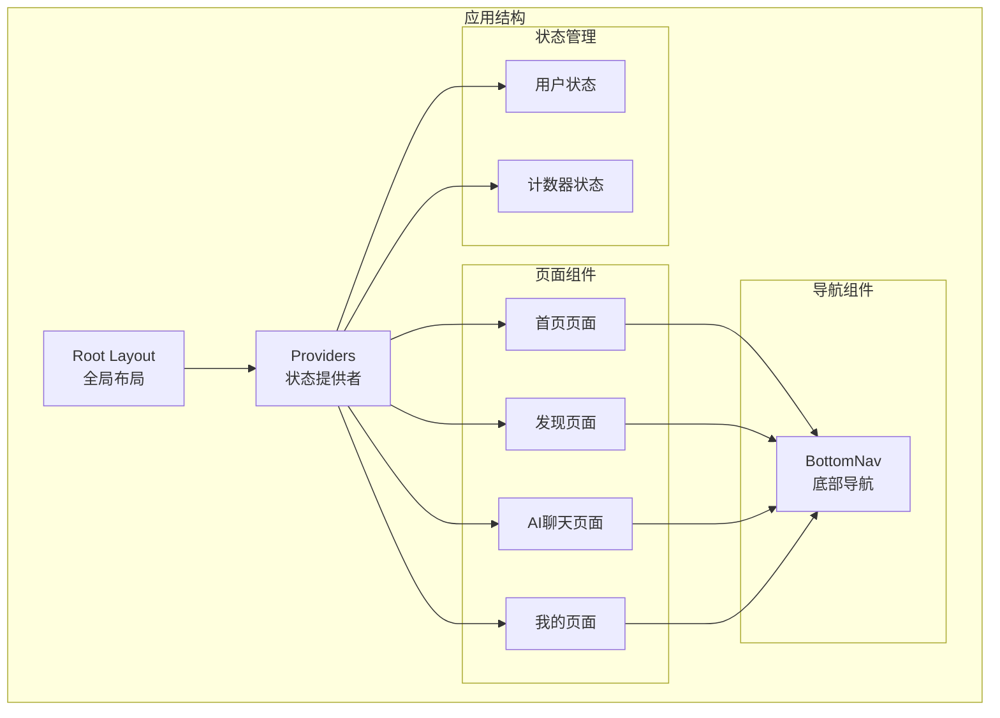
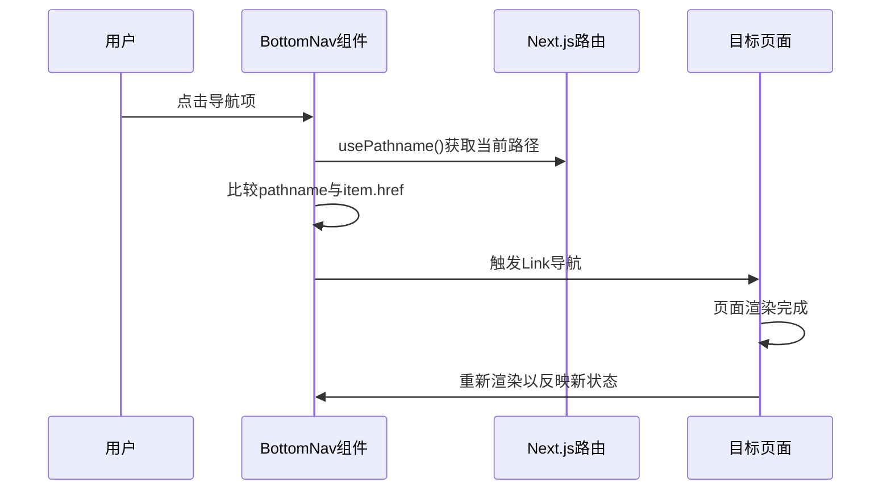
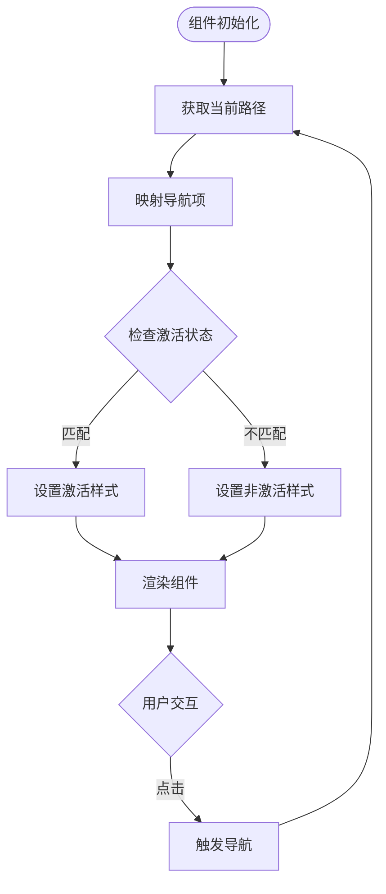
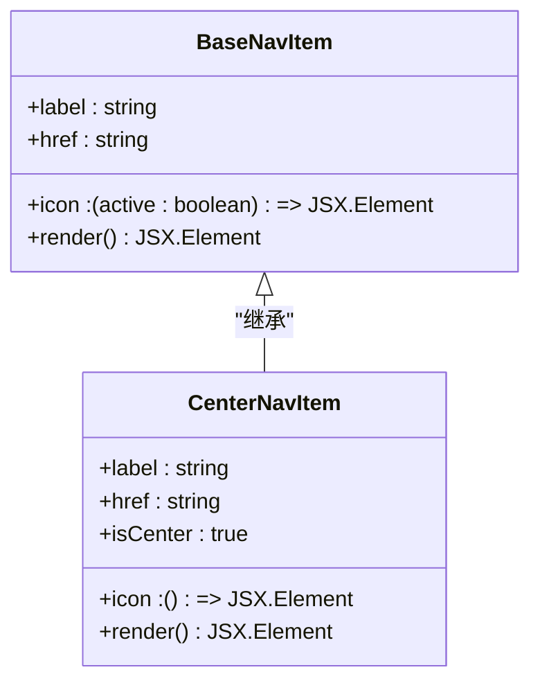
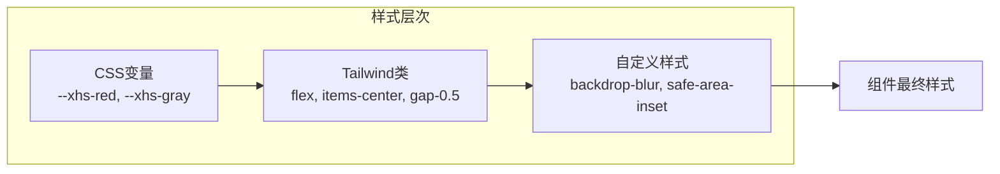
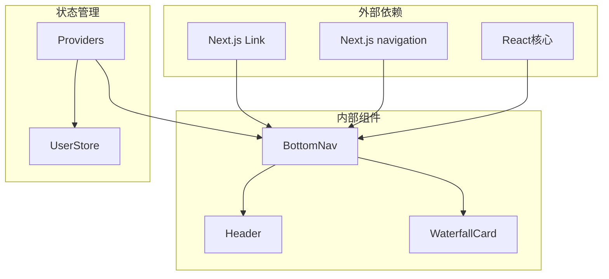

# BottomNav 底部导航组件

<cite>
**本文档引用的文件**
- [BottomNav.tsx](file://src/components/BottomNav.tsx)
- [layout.tsx](file://src/app/layout.tsx)
- [page.tsx](file://src/app/page.tsx)
- [discover/page.tsx](file://src/app/discover/page.tsx)
- [aichat/page.tsx](file://src/app/aichat/page.tsx)
- [me/page.tsx](file://src/app/me/page.tsx)
- [Providers.tsx](file://src/components/Providers.tsx)
- [user.tsx](file://src/store/user.tsx)
- [globals.css](file://src/app/globals.css)
- [api.ts](file://src/api/api.ts)
</cite>

## 目录
1. [简介](#简介)
2. [项目结构](#项目结构)
3. [核心组件](#核心组件)
4. [架构概览](#架构概览)
5. [详细组件分析](#详细组件分析)
6. [依赖关系分析](#依赖关系分析)
7. [性能考虑](#性能考虑)
8. [故障排除指南](#故障排除指南)
9. [结论](#结论)
10. [附录](#附录)

## 简介

BottomNav 是一个基于 Next.js 14+ 的现代化底部导航组件，专为移动端应用设计。该组件采用函数式编程范式，结合 React Hooks 和 Next.js 的现代特性，提供了流畅的用户体验和高度的可定制性。

该组件的核心特点包括：
- 响应式设计，完美适配移动设备
- 基于 SVG 的图标系统，支持动态颜色变化
- 智能的状态管理，自动高亮当前激活项
- 支持中心突出按钮的特殊导航项
- 与 Next.js 路由系统的无缝集成
- 现代化的视觉效果和交互反馈

## 项目结构

BottomNav 组件位于项目的组件目录中，与其他页面组件协同工作，形成完整的应用导航体系。



**图表来源**
- [layout.tsx:28-42](file://src/app/layout.tsx#L28-L42)
- [Providers.tsx:8-19](file://src/components/Providers.tsx#L8-L19)

**章节来源**
- [layout.tsx:1-44](file://src/app/layout.tsx#L1-L44)
- [Providers.tsx:1-20](file://src/components/Providers.tsx#L1-L20)

## 核心组件

### BottomNav 组件架构

BottomNav 组件采用简洁而高效的架构设计，通过单一文件实现了完整的导航功能。

```mermaid
classDiagram
class BottomNav {
+navItems : NavItem[]
+pathname : string
+render() JSX.Element
}
class NavItem {
+label : string
+href : string
+icon : (active : boolean) => JSX.Element
+isCenter? : boolean
}
class Link {
+href : string
+prefetch : boolean
+className : string
+children : ReactNode
}
BottomNav --> NavItem : "包含多个"
BottomNav --> Link : "渲染"
NavItem --> "SVG图标" : "使用"
```

**图表来源**
- [BottomNav.tsx:6-65](file://src/components/BottomNav.tsx#L6-L65)
- [BottomNav.tsx:67-102](file://src/components/BottomNav.tsx#L67-L102)

### 导航项配置系统

组件通过静态配置数组 `navItems` 管理所有导航项，每个导航项都具有明确的职责和配置选项。

| 属性 | 类型 | 必需 | 描述 |
|------|------|------|------|
| label | string | 是 | 导航项显示的标签文本 |
| href | string | 是 | 导航目标的路由路径 |
| icon | (active: boolean) => JSX.Element | 是 | 图标渲染函数，接收激活状态参数 |
| isCenter | boolean | 否 | 是否为中心突出按钮 |

**章节来源**
- [BottomNav.tsx:6-65](file://src/components/BottomNav.tsx#L6-L65)

## 架构概览

### 路由集成架构

BottomNav 组件与 Next.js 的路由系统深度集成，通过 `usePathname` Hook 实现智能的导航状态管理。



**图表来源**
- [BottomNav.tsx:67-102](file://src/components/BottomNav.tsx#L67-L102)

### 状态管理模式

组件采用函数式状态管理，通过 React 的内置 Hook 实现轻量级的状态控制。



**图表来源**
- [BottomNav.tsx:67-102](file://src/components/BottomNav.tsx#L67-L102)

**章节来源**
- [BottomNav.tsx:1-103](file://src/components/BottomNav.tsx#L1-L103)

## 详细组件分析

### 导航项配置详解

每个导航项都经过精心设计，以确保一致的用户体验和视觉效果。

#### 基础导航项结构



**图表来源**
- [BottomNav.tsx:6-65](file://src/components/BottomNav.tsx#L6-L65)

#### 图标系统设计

组件使用 SVG 图标系统，支持根据激活状态动态改变颜色和样式。

| 图标类型 | 激活状态 | 非激活状态 | 特殊属性 |
|----------|----------|------------|----------|
| 首页 | 实心填充 | 空心轮廓 | `fill="currentColor"` |
| 发现SSR | 实心填充 | 空心轮廓 | `fill="currentColor"` |
| 发现CSR | 实心填充 | 空心轮廓 | `fill="currentColor"` |
| AI | 渐变背景 | 无 | `bg-linear-to-r from-violet-500 to-blue-500` |
| 消息 | 实心填充 | 空心轮廓 | `fill="currentColor"` |
| 我 | 实心填充 | 空心轮廓 | `fill="currentColor"` |

**章节来源**
- [BottomNav.tsx:10-64](file://src/components/BottomNav.tsx#L10-L64)

### 样式系统与主题

组件采用 Tailwind CSS 和自定义 CSS 变量相结合的方式，实现灵活的主题定制。



**图表来源**
- [globals.css:4-26](file://src/app/globals.css#L4-L26)
- [BottomNav.tsx:70-100](file://src/components/BottomNav.tsx#L70-L100)

### 响应式设计实现

组件针对不同屏幕尺寸进行了优化，确保在各种设备上都有良好的用户体验。

**章节来源**
- [BottomNav.tsx:70-100](file://src/components/BottomNav.tsx#L70-L100)

## 依赖关系分析

### 组件间依赖关系



**图表来源**
- [BottomNav.tsx:3-4](file://src/components/BottomNav.tsx#L3-L4)
- [Providers.tsx:8-19](file://src/components/Providers.tsx#L8-L19)

### 外部库依赖

组件主要依赖以下外部库：

| 依赖包 | 版本 | 用途 |
|--------|------|------|
| next | 最新版本 | Next.js 框架和路由 |
| react | 最新版本 | React 核心库 |
| @heroui/react | 依赖 | UI 组件库 |
| zustand | 依赖 | 状态管理 |

**章节来源**
- [Providers.tsx:3-6](file://src/components/Providers.tsx#L3-L6)

## 性能考虑

### 渲染优化策略

1. **懒加载和预加载**：使用 `prefetch={true}` 提升导航体验
2. **条件渲染**：仅在需要时渲染标签文本
3. **CSS 动画**：使用硬件加速的 CSS 过渡效果
4. **最小化重渲染**：通过精确的状态比较避免不必要的更新

### 移动端优化

- **触摸友好**：适当的点击区域大小
- **手势支持**：平滑的缩放和过渡动画
- **内存管理**：及时清理事件监听器和定时器

## 故障排除指南

### 常见问题及解决方案

#### 导航项不显示激活状态

**问题描述**：导航项在切换页面后不显示激活状态

**解决方案**：
1. 检查 `usePathname` Hook 是否正确获取当前路径
2. 确认 `item.href` 与实际路由路径完全匹配
3. 验证 CSS 类名拼写是否正确

#### 图标不显示或显示异常

**问题描述**：SVG 图标不显示或样式异常

**解决方案**：
1. 检查 SVG 元素的 `viewBox` 属性
2. 确认 `fill` 和 `stroke` 属性的正确使用
3. 验证 Tailwind CSS 类名的有效性

#### 移动端适配问题

**问题描述**：在某些移动设备上显示异常

**解决方案**：
1. 检查 `safe-area-inset-bottom` CSS 变量
2. 验证 `backdrop-blur` 属性的浏览器兼容性
3. 确认 `env()` 函数的正确使用

**章节来源**
- [BottomNav.tsx:67-102](file://src/components/BottomNav.tsx#L67-L102)

## 结论

BottomNav 底部导航组件是一个设计精良、功能完备的移动端导航解决方案。它成功地结合了现代前端开发的最佳实践，包括：

- **简洁的架构设计**：单一职责的组件设计，易于理解和维护
- **强大的功能实现**：完整的导航状态管理和用户交互处理
- **优秀的性能表现**：优化的渲染策略和资源管理
- **灵活的定制能力**：丰富的样式系统和配置选项
- **良好的可扩展性**：清晰的接口设计和模块化结构

该组件不仅满足了当前项目的需求，也为未来的功能扩展奠定了坚实的基础。通过合理的架构设计和最佳实践的应用，BottomNav 成为了一个高质量的 UI 组件示例。

## 附录

### 使用示例

#### 基本使用

```typescript
// 在页面中引入 BottomNav
import BottomNav from "@/components/BottomNav";

export default function MyPage() {
  return (
    <div>
      {/* 页面内容 */}
      <BottomNav />
    </div>
  );
}
```

#### 自定义导航项

```typescript
const customNavItems = [
  {
    label: "自定义",
    href: "/custom",
    icon: (active: boolean) => (
      <svg>...</svg>
    ),
  },
  // 更多导航项...
];

// 在组件中使用自定义配置
```

#### 状态集成

```typescript
// 与用户状态集成
import { useUserStore } from '@/store/user';

export default function MyPage() {
  const userInfo = useUserStore(state => state.info);
  
  return (
    <div>
      {/* 页面内容 */}
      <BottomNav />
    </div>
  );
}
```

### 最佳实践建议

1. **保持导航项数量适中**：通常建议不超过 5-6 个主要导航项
2. **统一图标风格**：确保所有图标的视觉风格一致
3. **测试多设备兼容性**：在不同尺寸和分辨率的设备上进行测试
4. **优化加载性能**：合理使用懒加载和预加载策略
5. **遵循无障碍设计**：确保导航项具有适当的语义和可访问性