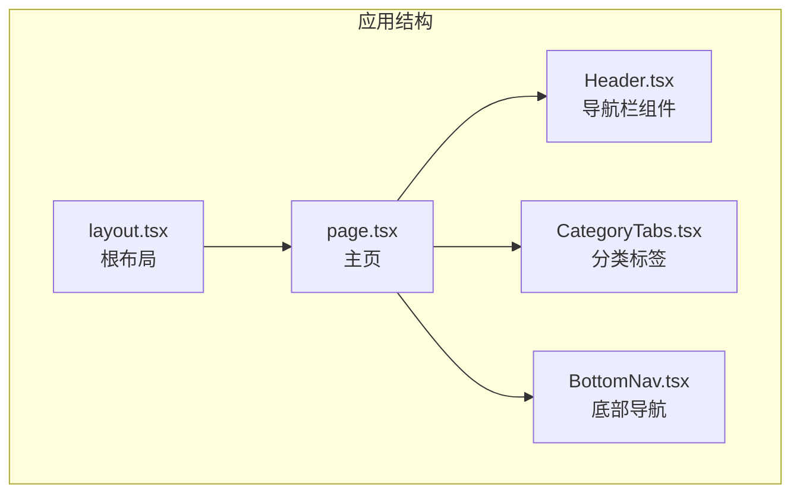
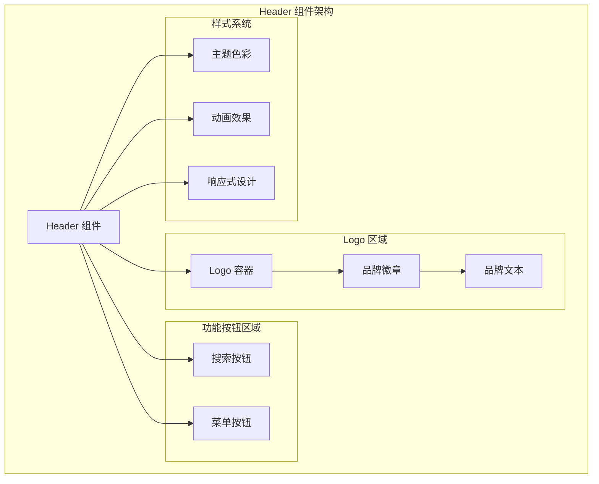
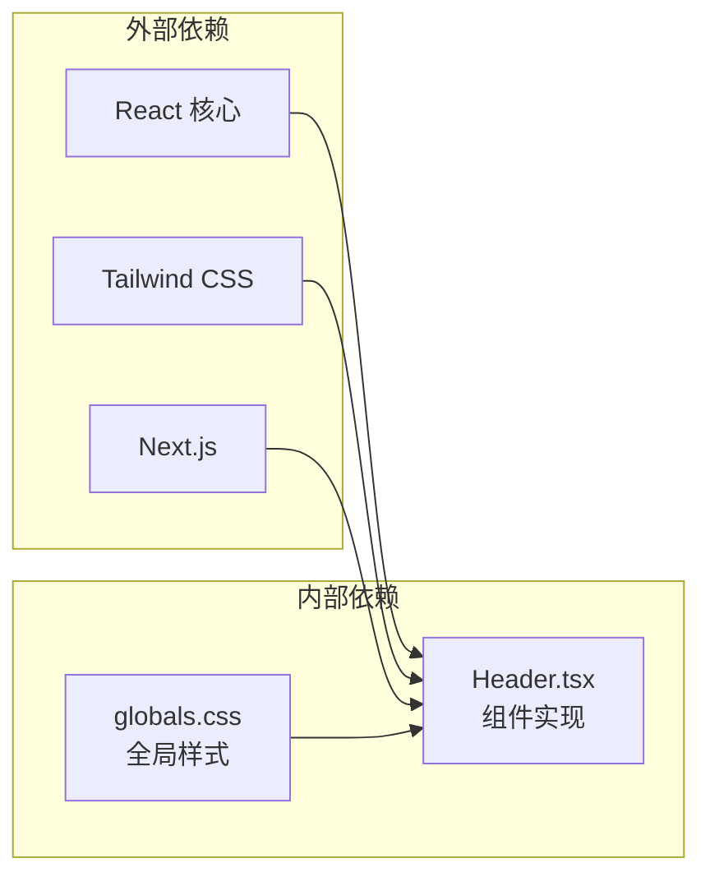
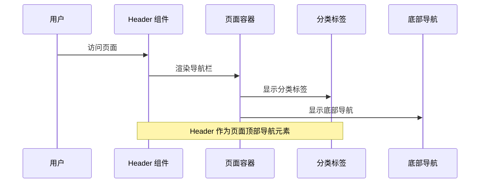

# Header 导航栏组件

<cite>
**本文档引用的文件**
- [Header.tsx](file://src/components/Header.tsx)
- [globals.css](file://src/app/globals.css)
- [page.tsx](file://src/app/page.tsx)
- [layout.tsx](file://src/app/layout.tsx)
- [CategoryTabs.tsx](file://src/components/CategoryTabs.tsx)
- [BottomNav.tsx](file://src/components/BottomNav.tsx)
</cite>

## 目录
1. [简介](#简介)
2. [项目结构](#项目结构)
3. [核心组件](#核心组件)
4. [架构概览](#架构概览)
5. [详细组件分析](#详细组件分析)
6. [依赖关系分析](#依赖关系分析)
7. [性能考虑](#性能考虑)
8. [故障排除指南](#故障排除指南)
9. [结论](#结论)
10. [附录](#附录)

## 简介

Header 导航栏组件是本项目中的核心界面元素，负责提供应用的主要导航入口和品牌标识。该组件采用现代化的设计理念，结合了响应式布局、主题色彩系统和流畅的动画效果，为用户提供一致且直观的导航体验。

组件设计遵循以下核心原则：
- **简洁性**：最小化的视觉元素，突出内容本身
- **一致性**：与整体应用设计语言保持统一
- **可用性**：提供清晰的导航层级和反馈机制
- **性能优化**：使用服务端渲染和轻量级实现

## 项目结构

Header 组件位于组件目录中，作为独立的功能模块与其他UI组件协同工作。整个应用采用分层架构，Header 组件在页面布局中扮演着关键角色。



**图表来源**
- [layout.tsx:28-43](file://src/app/layout.tsx#L28-L43)
- [page.tsx:54-74](file://src/app/page.tsx#L54-L74)
- [Header.tsx:2-54](file://src/components/Header.tsx#L2-L54)

**章节来源**
- [layout.tsx:1-44](file://src/app/layout.tsx#L1-L44)
- [page.tsx:1-75](file://src/app/page.tsx#L1-L75)

## 核心组件

Header 组件是一个无状态函数组件，采用简洁而高效的实现方式。组件的核心功能包括：

### 主要特性
- **固定定位**：使用 sticky 定位确保导航栏始终可见
- **模糊背景**：应用 backdrop-blur 效果增强视觉层次
- **响应式设计**：适配不同屏幕尺寸和设备类型
- **主题集成**：完全融入项目的色彩体系

### 布局结构
组件采用 Flexbox 布局，实现左右对称的导航栏结构：
- **左侧区域**：品牌 Logo 区域
- **右侧区域**：功能按钮组（搜索、菜单）

**章节来源**
- [Header.tsx:2-54](file://src/components/Header.tsx#L2-L54)

## 架构概览

Header 组件在整个应用架构中承担着重要的导航职责，与多个组件形成协作关系。



**图表来源**
- [Header.tsx:4-52](file://src/components/Header.tsx#L4-L52)
- [globals.css:4-26](file://src/app/globals.css#L4-L26)

## 详细组件分析

### Logo 区域实现

Logo 区域是 Header 的核心视觉标识，采用品牌色彩和字体设计。

#### 设计要素
- **品牌色彩**：使用 `bg-xhs-red` 背景色突出品牌识别度
- **白色文字**：确保在红色背景上的高对比度可读性
- **圆角设计**：应用 `rounded-md` 创建现代感的徽章外观
- **紧凑布局**：通过 `px-2.5 py-0.5` 实现精致的内边距

#### 响应式特性
Logo 区域在不同屏幕尺寸下保持一致的视觉比例，通过相对单位确保在各种设备上都有良好的显示效果。

**章节来源**
- [Header.tsx:7-11](file://src/components/Header.tsx#L7-L11)

### 搜索按钮功能

搜索按钮提供内容检索功能，采用简洁的圆形设计和微妙的交互反馈。

#### 交互设计
- **悬停效果**：`hover:bg-xhs-gray-light` 在鼠标悬停时显示浅灰色背景
- **点击反馈**：`active:scale-95` 提供按压时的缩放动画
- **过渡动画**：`transition-colors duration-200` 实现平滑的颜色变化
- **图标设计**：使用标准的搜索图标确保用户熟悉度

#### 可访问性考虑
按钮具备标准的键盘导航支持和屏幕阅读器兼容性，确保所有用户都能正常使用搜索功能。

**章节来源**
- [Header.tsx:16-31](file://src/components/Header.tsx#L16-L31)

### 菜单按钮实现

菜单按钮负责打开应用的主要导航菜单，提供移动端友好的汉堡菜单设计。

#### 功能特性
- **三线图标**：经典的汉堡菜单图标设计
- **统一交互**：与搜索按钮相同的交互模式和动画效果
- **语义化设计**：使用语义化的 SVG 结构确保可访问性

#### 移动端优化
菜单按钮在移动设备上提供最佳的触摸目标尺寸，符合移动端交互的最佳实践。

**章节来源**
- [Header.tsx:34-49](file://src/components/Header.tsx#L34-L49)

### 样式系统集成

Header 组件深度集成了项目的样式系统，充分利用主题变量和 Tailwind CSS 类。

#### 主题色彩系统
组件使用项目定义的自定义 CSS 变量：
- `--xhs-red`: #ff2442 - 主品牌色彩
- `--xhs-gray-light`: #f5f5f5 - 浅灰色背景
- `--xhs-border`: #eeeeee - 边框色彩

#### 动画和过渡效果
- **背景模糊**：`backdrop-blur-md` 提供毛玻璃效果
- **颜色过渡**：`transition-colors duration-200` 实现平滑的颜色变化
- **缩放动画**：`active:scale-95` 提供触觉反馈

**章节来源**
- [globals.css:4-26](file://src/app/globals.css#L4-L26)
- [Header.tsx:4](file://src/components/Header.tsx#L4)

### 响应式设计实现

Header 组件采用多层响应式策略，确保在各种设备上都有优秀的用户体验。

#### 屏幕尺寸适配
- **桌面端**：完整宽度的导航栏，支持所有功能按钮
- **平板端**：优化的间距和字体大小
- **移动端**：紧凑设计，优先显示核心功能

#### 视口配置
应用使用固定的视口设置，防止用户缩放影响导航栏的布局一致性。

**章节来源**
- [layout.tsx:21-26](file://src/app/layout.tsx#L21-L26)

## 依赖关系分析

Header 组件的依赖关系相对简单，主要依赖于项目的基础样式系统和 React 生态。



**图表来源**
- [Header.tsx:1](file://src/components/Header.tsx#L1)
- [globals.css:1-2](file://src/app/globals.css#L1-L2)

### 组件间协作

Header 组件与页面布局和其他 UI 组件形成良好的协作关系：



**图表来源**
- [page.tsx:54-74](file://src/app/page.tsx#L54-L74)
- [Header.tsx:2](file://src/components/Header.tsx#L2)

**章节来源**
- [page.tsx:1-75](file://src/app/page.tsx#L1-L75)

## 性能考虑

Header 组件在设计时充分考虑了性能优化，采用多种策略确保最佳的用户体验。

### 渲染性能
- **服务端渲染**：Header 组件作为服务端组件渲染，减少客户端 JavaScript 执行
- **轻量级实现**：避免复杂的计算逻辑，专注于展示功能
- **静态样式**：使用预定义的 CSS 类，减少运行时样式计算

### 交互性能
- **硬件加速**：利用 CSS3 变换和过渡实现流畅动画
- **事件优化**：按钮交互使用轻量级事件处理
- **内存效率**：无状态组件设计，避免不必要的状态存储

### 加载性能
- **延迟加载**：配合 Suspense 实现流式渲染
- **缓存策略**：样式和资源的合理缓存
- **体积控制**：精简的 SVG 图标和 CSS 代码

## 故障排除指南

### 常见问题及解决方案

#### 样式不生效
**问题描述**：Header 组件样式显示异常或主题色彩未正确应用

**可能原因**：
- 全局样式未正确导入
- CSS 变量定义缺失
- Tailwind 配置问题

**解决步骤**：
1. 检查 `globals.css` 是否正确导入
2. 验证 CSS 变量定义是否完整
3. 确认 Tailwind 配置文件存在

#### 响应式问题
**问题描述**：在某些设备上 Header 布局出现错位

**可能原因**：
- 视口配置不当
- 断点设置问题
- Flexbox 属性冲突

**解决步骤**：
1. 检查 `viewport` 配置
2. 验证断点媒体查询
3. 检查父容器的 Flexbox 设置

#### 交互问题
**问题描述**：按钮点击无响应或动画效果异常

**可能原因**：
- 事件处理器缺失
- CSS 动画冲突
- JavaScript 执行错误

**解决步骤**：
1. 确认按钮的点击事件绑定
2. 检查 CSS 动画属性
3. 查看浏览器控制台错误

**章节来源**
- [globals.css:1-288](file://src/app/globals.css#L1-L288)

## 结论

Header 导航栏组件展现了现代前端开发的最佳实践，通过简洁的设计、完善的响应式支持和优秀的性能表现，为用户提供了优质的导航体验。

### 设计优势
- **一致性**：与整体应用设计语言完美融合
- **可扩展性**：模块化设计便于功能扩展
- **可维护性**：清晰的代码结构和注释
- **性能友好**：优化的渲染和交互实现

### 改进建议
- 可考虑添加更多的交互反馈
- 可以增加键盘导航支持
- 可以考虑添加无障碍功能增强

## 附录

### 使用示例

Header 组件可以在任何页面中轻松集成：

```typescript
// 在页面组件中使用
import Header from "@/components/Header";

export default function MyPage() {
  return (
    <div>
      <Header />
      {/* 页面内容 */}
    </div>
  );
}
```

### 主题定制选项

组件支持多种定制方式：

1. **颜色定制**：通过修改 CSS 变量调整品牌色彩
2. **尺寸调整**：通过修改内边距和高度值调整布局
3. **动画效果**：通过调整过渡时间和缓动函数改变动画特性

### 最佳实践建议

1. **保持简洁**：避免在 Header 中放置过多功能
2. **关注性能**：确保组件渲染效率
3. **测试兼容性**：在不同设备和浏览器中验证显示效果
4. **考虑可访问性**：确保所有用户都能正常使用