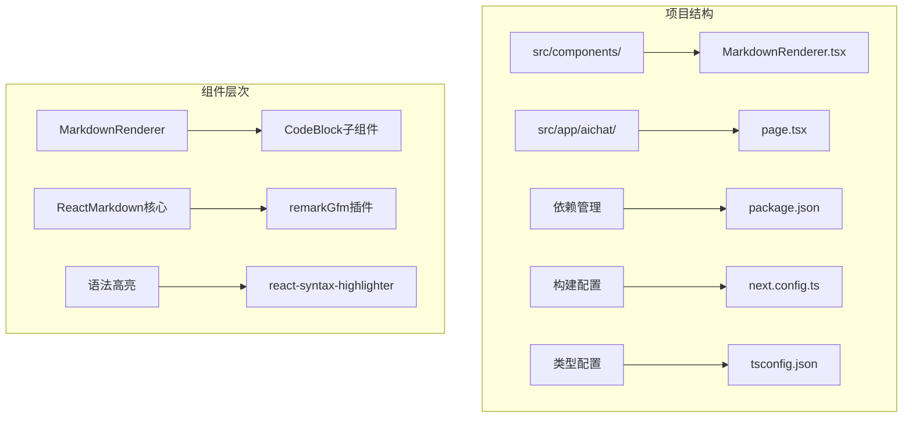
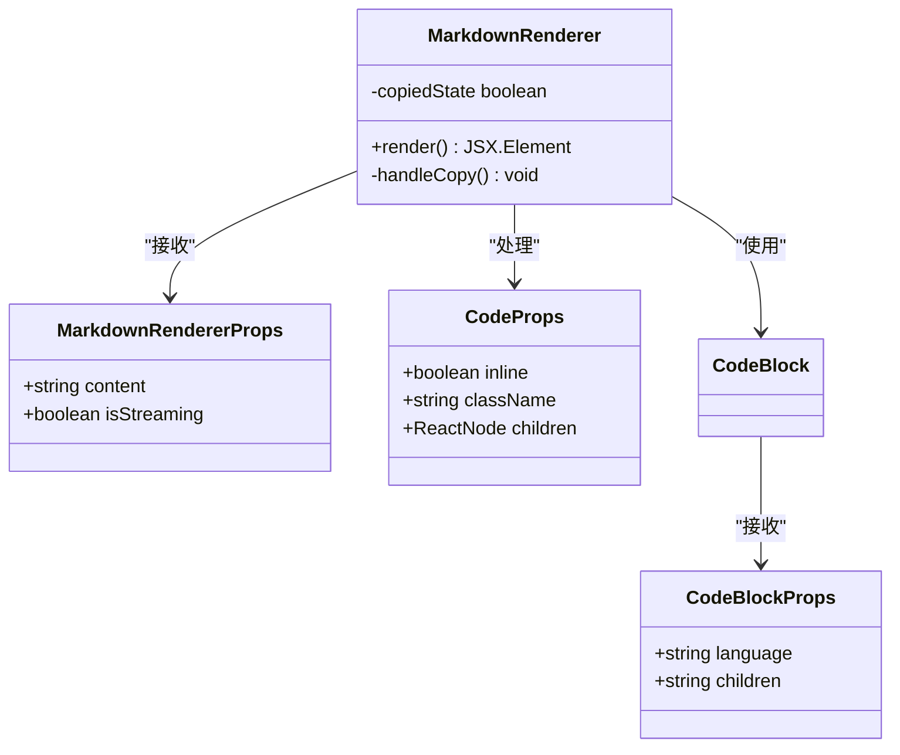
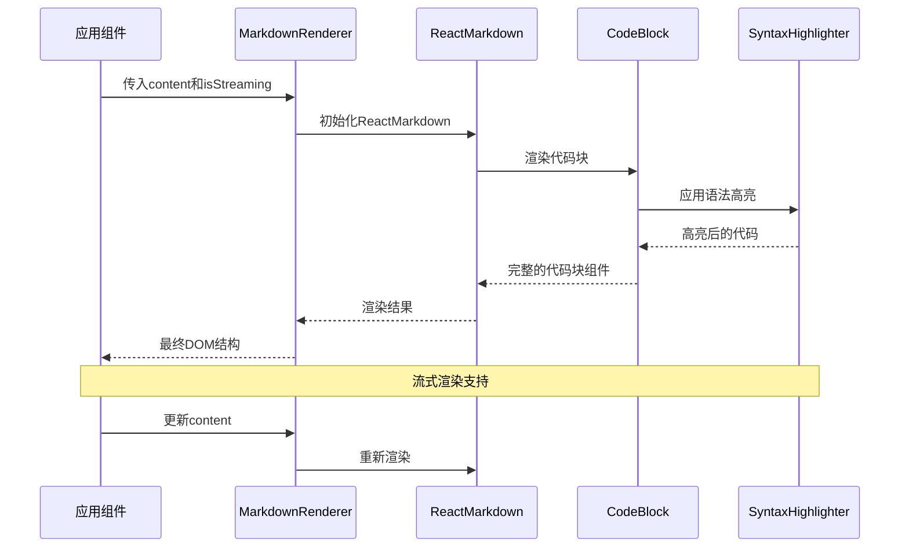
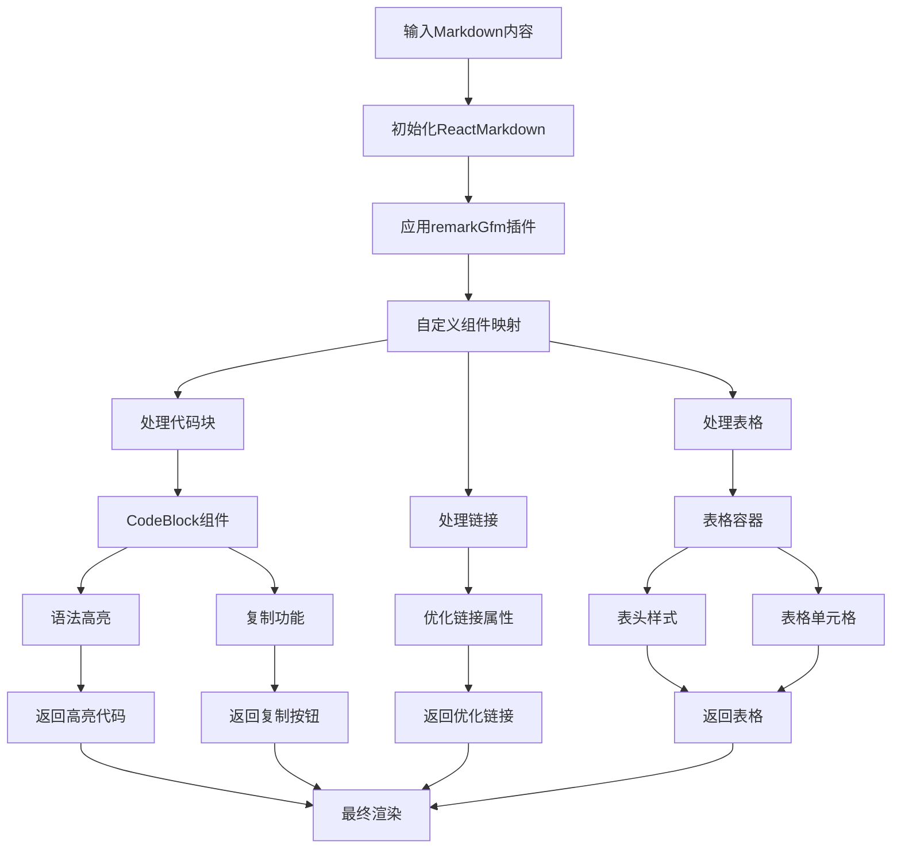
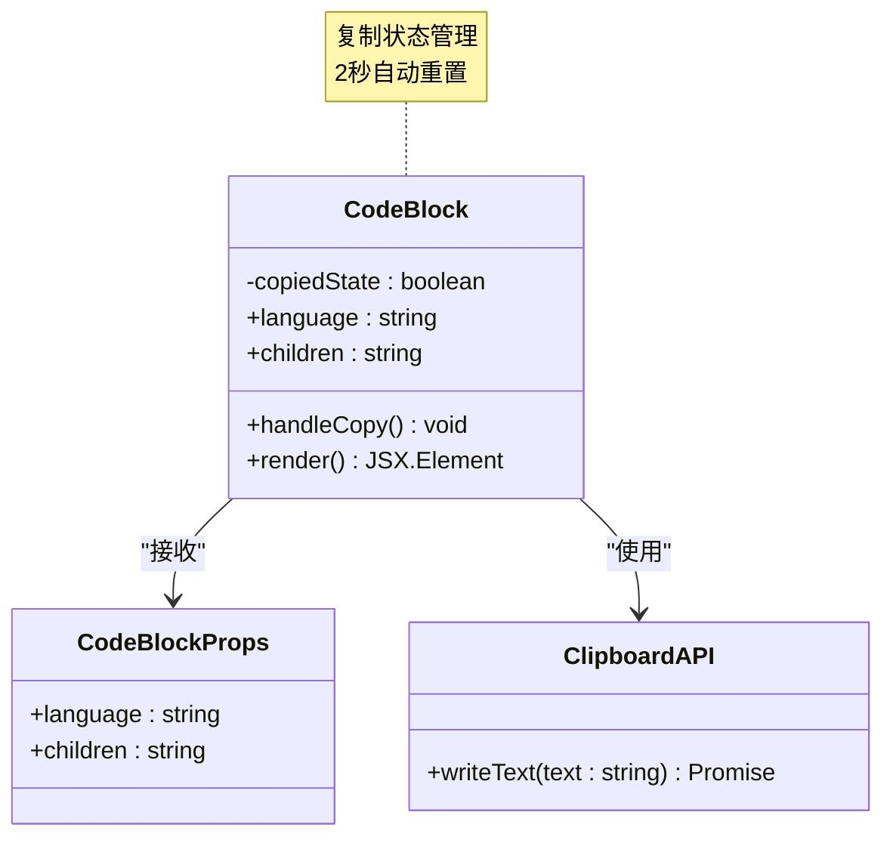
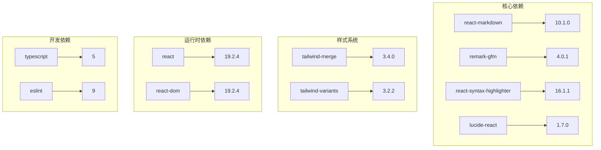
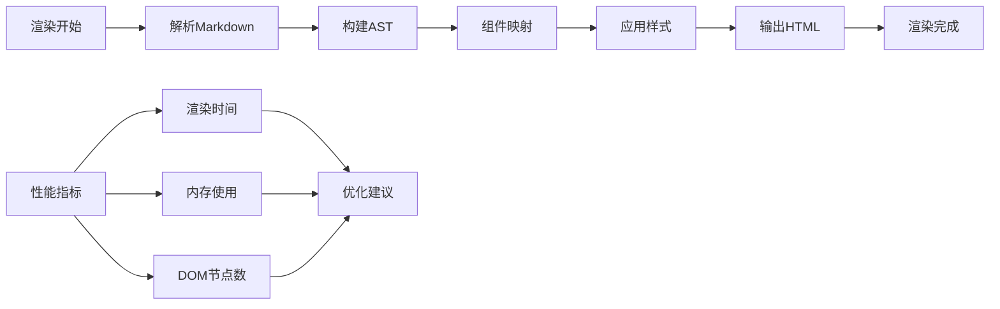
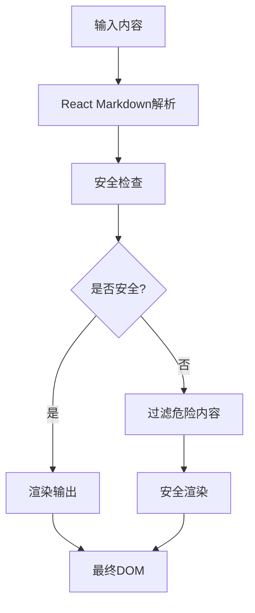
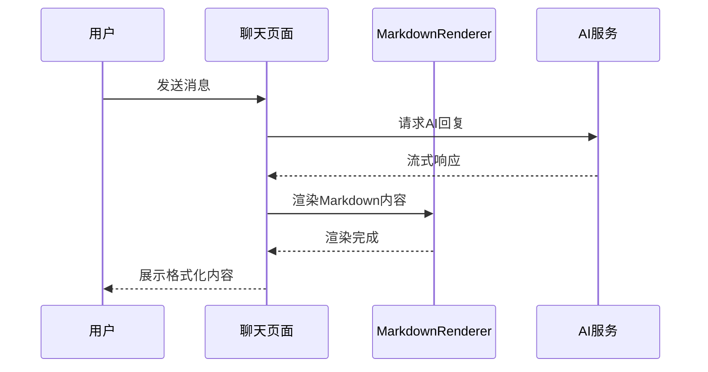

# MarkdownRenderer Markdown渲染组件

<cite>
**本文档引用的文件**
- [MarkdownRenderer.tsx](file://src/components/MarkdownRenderer.tsx)
- [package.json](file://package.json)
- [page.tsx](file://src/app/aichat/page.tsx)
- [next.config.ts](file://next.config.ts)
- [tsconfig.json](file://tsconfig.json)
</cite>

## 目录
1. [简介](#简介)
2. [项目结构](#项目结构)
3. [核心组件](#核心组件)
4. [架构概览](#架构概览)
5. [详细组件分析](#详细组件分析)
6. [依赖关系分析](#依赖关系分析)
7. [性能考虑](#性能考虑)
8. [安全防护指南](#安全防护指南)
9. [使用示例](#使用示例)
10. [扩展指南](#扩展指南)
11. [故障排除](#故障排除)
12. [结论](#结论)

## 简介

MarkdownRenderer是一个专为Next.js应用设计的高性能Markdown渲染组件，基于React Markdown生态系统构建。该组件提供了完整的Markdown语法支持，包括GitHub Flavored Markdown (GFM)、代码高亮、表格渲染、链接优化等功能，并集成了现代化的用户体验设计。

该组件在AI聊天应用中得到广泛应用，支持实时流式渲染和一键复制功能，为用户提供流畅的Markdown内容展示体验。

## 项目结构

MarkdownRenderer组件位于项目的组件层中，采用模块化设计，便于复用和维护。



**图表来源**
- [MarkdownRenderer.tsx:1-139](file://src/components/MarkdownRenderer.tsx#L1-L139)
- [package.json:1-39](file://package.json#L1-L39)

**章节来源**
- [MarkdownRenderer.tsx:1-139](file://src/components/MarkdownRenderer.tsx#L1-L139)
- [package.json:1-39](file://package.json#L1-L39)

## 核心组件

### 组件接口定义

MarkdownRenderer组件采用TypeScript接口定义，确保类型安全和开发体验。



**图表来源**
- [MarkdownRenderer.tsx:10-13](file://src/components/MarkdownRenderer.tsx#L10-L13)
- [MarkdownRenderer.tsx:62-66](file://src/components/MarkdownRenderer.tsx#L62-L66)
- [MarkdownRenderer.tsx:18-60](file://src/components/MarkdownRenderer.tsx#L18-L60)

### 主要特性

1. **完整的Markdown支持**: 基于React Markdown和remark-GFM插件
2. **代码高亮**: 集成Prism语法高亮器
3. **流式渲染**: 支持实时内容更新
4. **一键复制**: 代码块复制功能
5. **响应式设计**: Tailwind CSS样式系统
6. **暗色模式**: 自动适配深色主题

**章节来源**
- [MarkdownRenderer.tsx:72-136](file://src/components/MarkdownRenderer.tsx#L72-L136)

## 架构概览

MarkdownRenderer采用分层架构设计，将渲染逻辑、样式处理和交互功能分离。



**图表来源**
- [MarkdownRenderer.tsx:72-136](file://src/components/MarkdownRenderer.tsx#L72-L136)
- [page.tsx:797-800](file://src/app/aichat/page.tsx#L797-L800)

## 详细组件分析

### ReactMarkdown核心渲染

组件的核心渲染逻辑基于React Markdown库，通过remark-GFM插件启用GitHub风格的Markdown语法。



**图表来源**
- [MarkdownRenderer.tsx:75-126](file://src/components/MarkdownRenderer.tsx#L75-L126)

### CodeBlock组件实现

CodeBlock是MarkdownRenderer的核心子组件，负责处理代码块的渲染和交互功能。



**图表来源**
- [MarkdownRenderer.tsx:18-60](file://src/components/MarkdownRenderer.tsx#L18-L60)

### 组件映射配置

MarkdownRenderer通过components属性配置自定义渲染组件，实现高度定制化的渲染效果。

| 组件类型 | 自定义实现 | 功能特性 |
|---------|-----------|----------|
| `code` | CodeBlock包装器 | 代码高亮、复制功能、语言检测 |
| `a` | 链接优化器 | 新窗口打开、安全属性、样式优化 |
| `table` | 表格容器 | 水平滚动、阴影效果、边框样式 |
| `th` | 表头样式 | 上下文颜色、字体样式、对齐方式 |
| `td` | 表格单元格 | 边框分隔、文本样式、内边距 |

**章节来源**
- [MarkdownRenderer.tsx:78-126](file://src/components/MarkdownRenderer.tsx#L78-L126)

## 依赖关系分析

### 核心依赖库

MarkdownRenderer组件依赖多个关键库来实现完整的Markdown渲染功能。



**图表来源**
- [package.json:11-25](file://package.json#L11-L25)

### 版本兼容性

组件确保与Next.js 16.2.0版本的兼容性，采用最新的React 19.2.4生态系统。

**章节来源**
- [package.json:11-39](file://package.json#L11-L39)

## 性能考虑

### 渲染优化策略

1. **增量渲染**: 使用React的虚拟DOM进行高效的局部更新
2. **组件缓存**: 利用Next.js的组件缓存机制
3. **懒加载**: 语法高亮器按需加载
4. **内存管理**: 自动清理复制状态和定时器

### 性能监控



**图表来源**
- [MarkdownRenderer.tsx:72-136](file://src/components/MarkdownRenderer.tsx#L72-L136)

### 优化建议

1. **内容分片**: 对长Markdown内容进行分片渲染
2. **虚拟滚动**: 大量内容时使用虚拟滚动技术
3. **预渲染**: 静态内容使用预渲染优化
4. **CDN加速**: 图片和外部资源使用CDN

## 安全防护指南

### XSS防护机制

MarkdownRenderer组件内置多重安全防护措施：

1. **DOM属性白名单**: 仅允许安全的HTML属性
2. **链接安全**: 自动添加`rel="noopener noreferrer"`
3. **目标窗口**: 所有外部链接在新窗口打开
4. **内容过滤**: 通过React Markdown的沙箱机制



**图表来源**
- [MarkdownRenderer.tsx:103-110](file://src/components/MarkdownRenderer.tsx#L103-L110)

### 内容安全策略

组件遵循以下安全原则：
- 禁止JavaScript执行
- 限制CSS样式范围
- 过滤恶意标签
- 验证URL安全性

**章节来源**
- [MarkdownRenderer.tsx:103-110](file://src/components/MarkdownRenderer.tsx#L103-L110)

## 使用示例

### 基础使用

```typescript
// 基本渲染
<MarkdownRenderer content={markdownContent} />

// 流式渲染
<MarkdownRenderer 
  content={streamingContent} 
  isStreaming={true} 
/>
```

### 在AI聊天中的应用

在AI聊天页面中，MarkdownRenderer被广泛用于展示AI助手的回复内容。



**图表来源**
- [page.tsx:797-800](file://src/app/aichat/page.tsx#L797-L800)

### 高级配置

```typescript
// 自定义样式配置
<MarkdownRenderer 
  content={content}
  isStreaming={isStreaming}
  className="custom-renderer"
/>

// 动态内容更新
const [content, setContent] = useState(initialContent);
// setContent(newContent) 触发重新渲染
```

**章节来源**
- [page.tsx:797-800](file://src/app/aichat/page.tsx#L797-L800)

## 扩展指南

### 自定义组件映射

可以通过扩展components属性添加更多自定义渲染组件：

```typescript
const customComponents = {
  // 添加自定义图片处理器
  img: ({ node, ...props }) => (
    
  ),
  
  // 添加自定义标题样式
  h1: ({ node, ...props }) => (
    <h1 {...props} className="text-3xl font-bold text-gray-900 mb-6" />
  ),
  
  // 添加自定义段落样式
  p: ({ node, ...props }) => (
    <p {...props} className="text-gray-700 leading-relaxed mb-4" />
  )
};
```

### 语法高亮扩展

支持多种编程语言的语法高亮：

```typescript
// 可用的语言列表
const supportedLanguages = [
  'javascript', 'python', 'java', 'cpp', 'csharp',
  'go', 'rust', 'php', 'swift', 'kotlin',
  'html', 'css', 'sql', 'bash', 'yaml'
];
```

### 性能优化扩展

```typescript
// 内存优化
const useOptimizedRenderer = () => {
  const [cache, setCache] = useState(new Map());
  
  const renderWithCache = useCallback((content) => {
    if (cache.has(content)) {
      return cache.get(content);
    }
    
    const result = <MarkdownRenderer content={content} />;
    cache.set(content, result);
    return result;
  }, [cache]);
  
  return renderWithCache;
};
```

## 故障排除

### 常见问题及解决方案

1. **代码高亮不生效**
   - 检查语法高亮器是否正确导入
   - 确认代码块包含正确的语言标识

2. **链接无法点击**
   - 验证链接格式是否正确
   - 检查CSS样式是否影响了点击区域

3. **渲染性能问题**
   - 对长内容使用分片渲染
   - 考虑使用虚拟滚动

### 调试工具

```typescript
// 开发模式下的调试
const debugRenderer = (content: string) => {
  console.log('渲染内容:', content);
  console.log('内容长度:', content.length);
  console.log('字符统计:', getCharCount(content));
};

// 内容分析工具
const analyzeContent = (content: string) => {
  return {
    wordCount: content.trim().split(/\s+/).length,
    charCount: content.length,
    lineCount: content.split('\n').length,
    codeBlockCount: (content.match(/```/g) || []).length / 2
  };
};
```

**章节来源**
- [MarkdownRenderer.tsx:18-60](file://src/components/MarkdownRenderer.tsx#L18-L60)

## 结论

MarkdownRenderer组件为Next.js应用提供了强大而灵活的Markdown渲染解决方案。通过精心设计的架构和全面的功能支持，该组件能够满足现代Web应用对内容展示的各种需求。

### 主要优势

1. **功能完整**: 支持完整的Markdown语法和GFM特性
2. **性能优秀**: 优化的渲染算法和缓存机制
3. **安全可靠**: 内置多层安全防护措施
4. **易于扩展**: 模块化设计支持功能扩展
5. **用户体验**: 现代化的界面设计和交互体验

### 未来发展方向

1. **更多语法支持**: 扩展对更多Markdown变体的支持
2. **增强编辑功能**: 集成富文本编辑能力
3. **离线支持**: 实现离线渲染和缓存机制
4. **国际化**: 支持多语言内容渲染
5. **无障碍访问**: 增强无障碍功能支持

MarkdownRenderer组件代表了现代Web应用中内容渲染的最佳实践，为开发者提供了一个既强大又易用的解决方案。