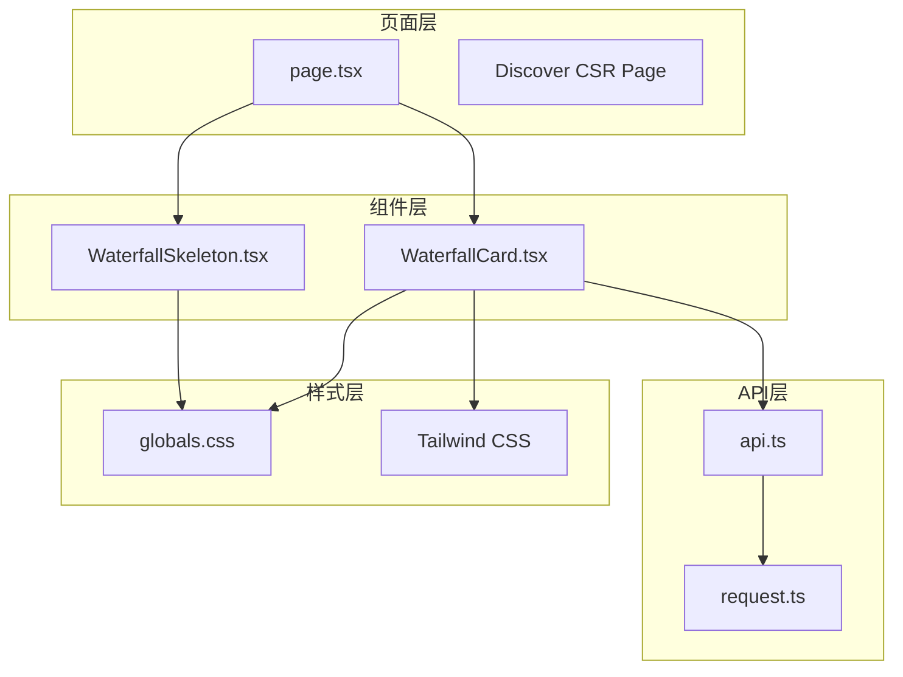
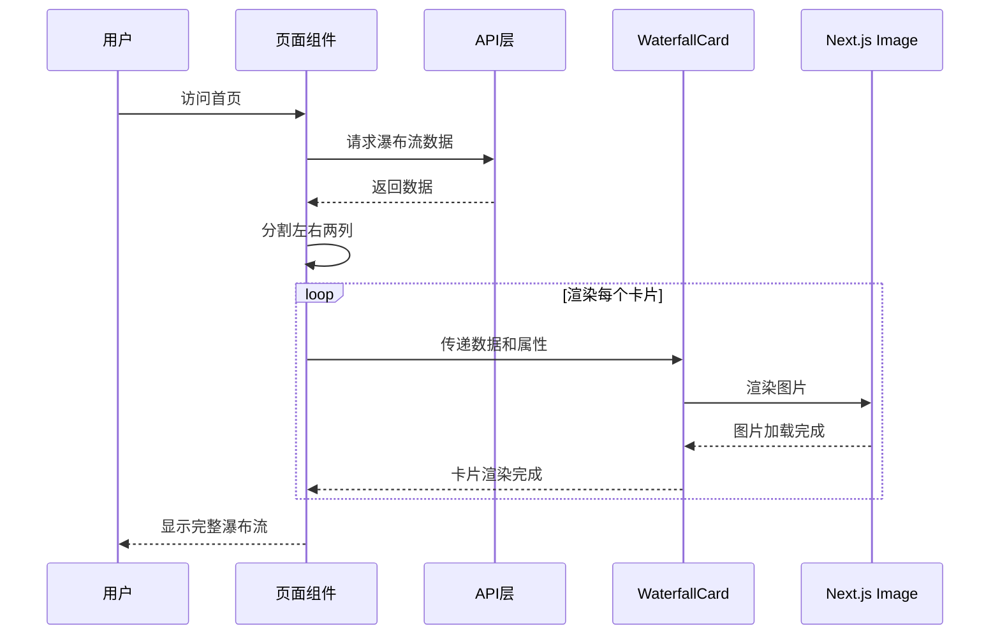
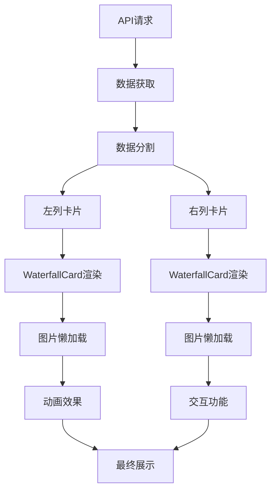
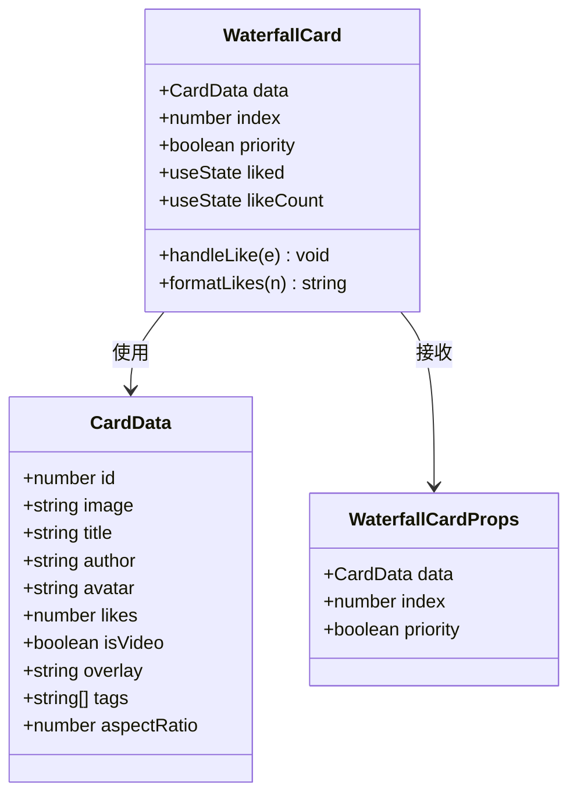
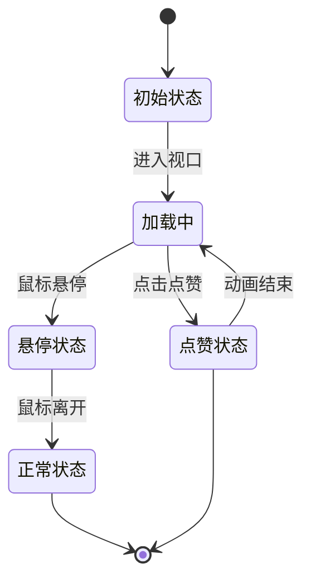
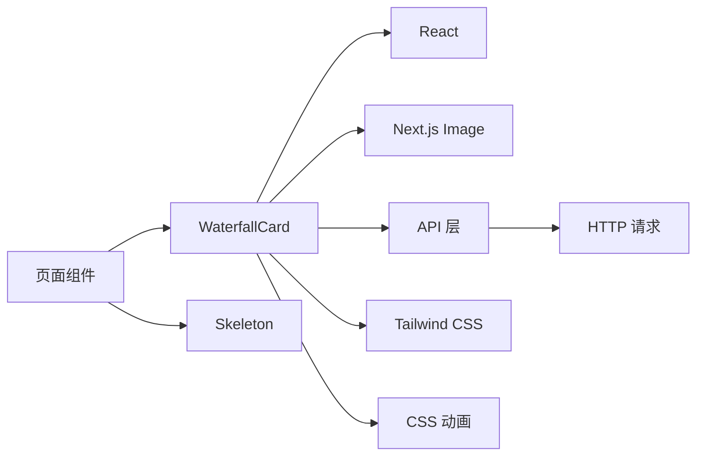
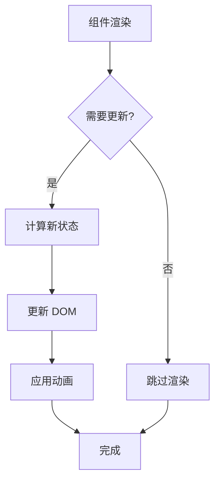

# WaterfallCard 瀑布流卡片组件

<cite>
**本文档引用的文件**
- [WaterfallCard.tsx](file://src/components/WaterfallCard.tsx)
- [WaterfallSkeleton.tsx](file://src/components/WaterfallSkeleton.tsx)
- [page.tsx](file://src/app/page.tsx)
- [api.ts](file://src/api/api.ts)
- [globals.css](file://src/app/globals.css)
</cite>

## 目录
1. [简介](#简介)
2. [项目结构](#项目结构)
3. [核心组件](#核心组件)
4. [架构概览](#架构概览)
5. [详细组件分析](#详细组件分析)
6. [依赖关系分析](#依赖关系分析)
7. [性能考虑](#性能考虑)
8. [故障排除指南](#故障排除指南)
9. [结论](#结论)
10. [附录](#附录)

## 简介

WaterfallCard 是一个专为 Next.js 应用设计的瀑布流卡片组件，采用双列布局实现视觉上的瀑布流效果。该组件集成了动态高度计算、图片懒加载、点赞交互、视频标识和标签系统等功能，为用户提供流畅的移动端浏览体验。

组件的核心特性包括：
- **双列瀑布流布局**：通过左右两列的交替排列实现自然的瀑布流视觉效果
- **智能图片懒加载**：利用 Next.js Image 组件的优先级机制优化首屏加载性能
- **动画过渡效果**：包含入场动画、悬停缩放和点赞心跳动画
- **响应式设计**：适配不同屏幕尺寸的设备
- **骨架屏加载**：提供流畅的加载体验

## 项目结构

WaterfallCard 组件位于项目的组件目录中，与相关的页面组件和样式文件共同构成完整的瀑布流功能体系。



**图表来源**
- [WaterfallCard.tsx:1-155](file://src/components/WaterfallCard.tsx#L1-L155)
- [page.tsx:1-75](file://src/app/page.tsx#L1-L75)
- [api.ts:1-128](file://src/api/api.ts#L1-L128)

**章节来源**
- [WaterfallCard.tsx:1-155](file://src/components/WaterfallCard.tsx#L1-L155)
- [page.tsx:1-75](file://src/app/page.tsx#L1-L75)

## 核心组件

### WaterfallCard 主组件

WaterfallCard 是瀑布流卡片的核心组件，负责渲染单个内容卡片。组件采用函数式组件设计，使用 React Hooks 管理状态。

#### 数据结构定义

组件使用严格的 TypeScript 接口定义数据结构：

```typescript
interface CardData {
  id: number;
  image: string;
  title: string;
  author: string;
  avatar: string;
  likes: number;
  isVideo?: boolean;
  overlay?: string;
  tags?: string[];
  aspectRatio: number;
}

interface WaterfallCardProps {
  data: CardData;
  index: number;
  priority?: boolean;
}
```

#### 核心功能特性

1. **动态高度计算**：通过 `aspectRatio` 属性动态计算图片容器的高度
2. **图片懒加载**：利用 Next.js Image 组件的 `priority` 属性实现智能预加载
3. **点赞交互**：支持实时点赞状态切换和数量更新
4. **视频标识**：可选的视频播放按钮显示
5. **标签系统**：支持多个标签的展示
6. **悬停效果**：图片缩放和阴影变化

**章节来源**
- [WaterfallCard.tsx:7-24](file://src/components/WaterfallCard.tsx#L7-L24)
- [WaterfallCard.tsx:26-47](file://src/components/WaterfallCard.tsx#L26-L47)

### WaterfallSkeleton 骨架屏组件

WaterfallSkeleton 提供了瀑布流加载时的骨架屏显示，模拟真实内容的布局结构。

#### 骨架屏设计特点

1. **双列布局**：模拟左右两列的真实布局
2. **随机高度**：图片高度采用随机比例，增强真实感
3. **渐变动画**：使用 shimmer 动画提供加载反馈
4. **响应式结构**：标题、作者信息和点赞区域的完整模拟

**章节来源**
- [WaterfallSkeleton.tsx:1-40](file://src/components/WaterfallSkeleton.tsx#L1-L40)

## 架构概览

WaterfallCard 组件的架构采用分层设计，从数据获取到渲染展示形成完整的数据流。



**图表来源**
- [page.tsx:19-52](file://src/app/page.tsx#L19-L52)
- [api.ts:64-71](file://src/api/api.ts#L64-L71)

### 数据流向图



**图表来源**
- [page.tsx:32-51](file://src/app/page.tsx#L32-L51)
- [WaterfallCard.tsx:58-69](file://src/components/WaterfallCard.tsx#L58-L69)

## 详细组件分析

### WaterfallCard 组件详解

#### 组件结构分析

WaterfallCard 采用模块化的结构设计，每个部分都有明确的功能职责：



**图表来源**
- [WaterfallCard.tsx:7-24](file://src/components/WaterfallCard.tsx#L7-L24)
- [WaterfallCard.tsx:26-47](file://src/components/WaterfallCard.tsx#L26-L47)

#### 图片懒加载机制

WaterfallCard 实现了智能的图片懒加载策略：

1. **优先级控制**：通过 `priority` 属性控制前几个卡片的预加载
2. **响应式尺寸**：使用 `sizes` 属性为不同断点设置合适的图片尺寸
3. **填充模式**：使用 `fill` 属性确保图片填满容器
4. **过渡效果**：悬停时的缩放动画提升用户体验

#### 动画系统

组件包含多个精心设计的动画效果：



**图表来源**
- [WaterfallCard.tsx:52-54](file://src/components/WaterfallCard.tsx#L52-L54)
- [WaterfallCard.tsx:125-146](file://src/components/WaterfallCard.tsx#L125-L146)

#### 交互行为分析

组件实现了丰富的用户交互功能：

1. **点赞交互**：点击爱心图标切换点赞状态
2. **悬停效果**：图片缩放和阴影变化
3. **点击导航**：卡片作为可点击元素触发导航
4. **动画反馈**：多种动画效果提供即时反馈

**章节来源**
- [WaterfallCard.tsx:30-41](file://src/components/WaterfallCard.tsx#L30-L41)
- [WaterfallCard.tsx:125-146](file://src/components/WaterfallCard.tsx#L125-L146)

### 数据绑定方式

#### API 数据集成

WaterfallCard 通过 API 层获取数据，实现数据与组件的解耦：

```mermaid
erDiagram
CARD_DATA {
number id PK
string image
string title
string author
string avatar
number likes
boolean isVideo
string overlay
string[] tags
number aspectRatio
}
HOME_LIST_RESPONSE {
card_data[] data
string message
number code
}
HOT_TOPICS_API {
function getHomeList()
function getHomeListLikes(id)
}
CARD_DATA ||--|| HOME_LIST_RESPONSE : 包含
HOT_TOPICS_API --> HOME_LIST_RESPONSE : 返回
```

**图表来源**
- [api.ts:28-32](file://src/api/api.ts#L28-L32)
- [api.ts:64-71](file://src/api/api.ts#L64-L71)

#### 页面数据处理

页面组件负责数据的分割和传递：

1. **数据分割**：使用奇偶索引将数据分为左右两列
2. **优先级设置**：前几个卡片设置为优先加载
3. **索引传递**：为每个卡片计算动画延迟

**章节来源**
- [page.tsx:32-51](file://src/app/page.tsx#L32-L51)

### 样式配置选项

#### CSS 动画系统

组件使用了完整的 CSS 动画系统：

| 动画名称 | 描述 | 触发条件 |
|---------|------|----------|
| fadeInUp | 卡片淡入上移 | 组件挂载 |
| shimmer | 骨架屏渐变 | 骨架屏加载 |
| heartBeat | 点赞心跳 | 点赞动画 |
| scaleIn | 缩放进入 | 特定场景 |

#### Tailwind CSS 类

组件广泛使用 Tailwind CSS 实现响应式设计：

- **间距系统**：使用 `mb-2.5`、`p-2.5` 等类名
- **颜色系统**：使用主题色变量如 `text-xhs-red`
- **动画系统**：使用 `animate-*` 类名
- **布局系统**：使用 `flex`、`gap` 等布局类

**章节来源**
- [globals.css:54-124](file://src/app/globals.css#L54-L124)

## 依赖关系分析

### 外部依赖

WaterfallCard 组件依赖以下外部库和框架：



**图表来源**
- [WaterfallCard.tsx:3-5](file://src/components/WaterfallCard.tsx#L3-L5)
- [page.tsx:1-6](file://src/app/page.tsx#L1-L6)

### 内部依赖关系

组件之间的依赖关系清晰且层次分明：

1. **页面组件**：负责数据获取和布局分割
2. **API 层**：提供数据访问接口
3. **组件层**：实现具体的渲染逻辑
4. **样式层**：提供视觉表现

**章节来源**
- [page.tsx:19-52](file://src/app/page.tsx#L19-L52)
- [api.ts:44-81](file://src/api/api.ts#L44-L81)

## 性能考虑

### 首屏优化

WaterfallCard 实现了多项首屏性能优化策略：

1. **智能预加载**：前几个卡片设置为优先加载
2. **懒加载机制**：后续卡片采用懒加载策略
3. **响应式图片**：根据屏幕尺寸选择合适分辨率
4. **骨架屏**：提供即时的视觉反馈

### 内存管理

组件在内存管理方面采用了以下策略：

1. **状态最小化**：只存储必要的组件状态
2. **事件处理优化**：避免不必要的事件监听器
3. **动画性能**：使用 GPU 加速的 CSS 动画

### 渲染优化



**图表来源**
- [WaterfallCard.tsx:26-47](file://src/components/WaterfallCard.tsx#L26-L47)

## 故障排除指南

### 常见问题及解决方案

#### 图片加载问题

**问题**：图片无法正确显示或加载缓慢
**解决方案**：
1. 检查 `aspectRatio` 属性是否正确设置
2. 验证图片 URL 是否有效
3. 确认网络连接正常

#### 动画异常

**问题**：动画效果不生效或卡顿
**解决方案**：
1. 检查 CSS 动画类名是否正确
2. 确认浏览器支持相关 CSS 特性
3. 验证动画关键帧定义

#### 交互失效

**问题**：点赞功能或其他交互无响应
**解决方案**：
1. 检查事件处理器绑定
2. 确认 API 调用正常
3. 验证状态更新逻辑

**章节来源**
- [WaterfallCard.tsx:30-41](file://src/components/WaterfallCard.tsx#L30-L41)
- [api.ts:69-71](file://src/api/api.ts#L69-L71)

## 结论

WaterfallCard 瀑布流卡片组件是一个功能完整、性能优化良好的 React 组件。它成功地将瀑布流布局、智能懒加载、丰富的交互效果和优雅的动画系统结合在一起，为用户提供了优秀的移动端浏览体验。

组件的主要优势包括：
- **架构清晰**：分层设计便于维护和扩展
- **性能优秀**：多项优化策略确保流畅的用户体验
- **功能丰富**：涵盖现代 Web 应用所需的各种功能
- **易于定制**：灵活的样式系统支持各种定制需求

## 附录

### 使用示例

#### 基本使用

```typescript
// 在页面中使用
<WaterfallCard 
  data={cardData} 
  index={index} 
  priority={index < 4} 
/>
```

#### 自定义配置

```typescript
// 自定义卡片数据
const customCardData = {
  id: 1,
  image: '/images/example.jpg',
  title: '示例标题',
  author: '作者名称',
  avatar: '/avatars/example.jpg',
  likes: 100,
  isVideo: true,
  overlay: '示例覆盖文本',
  tags: ['标签1', '标签2'],
  aspectRatio: 1.5
};
```

### 最佳实践

1. **合理设置优先级**：根据首屏可视区域设置适当的优先加载数量
2. **优化图片质量**：使用合适的图片格式和压缩策略
3. **监控性能指标**：定期检查组件的渲染性能和内存使用情况
4. **测试兼容性**：确保在不同浏览器和设备上的兼容性