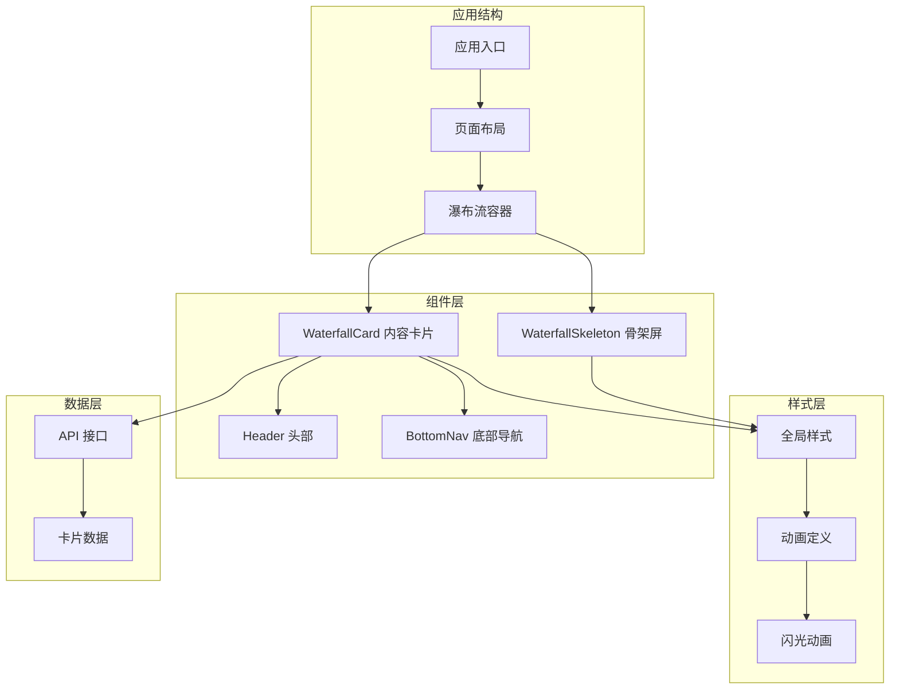
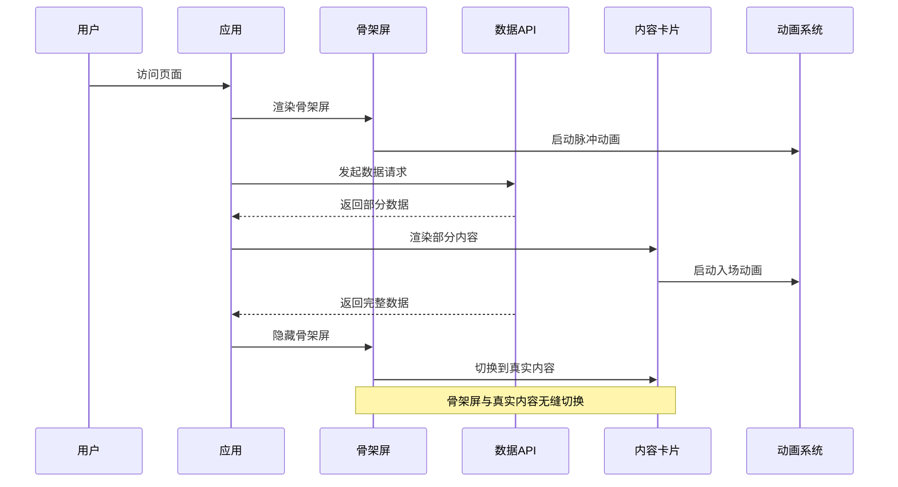
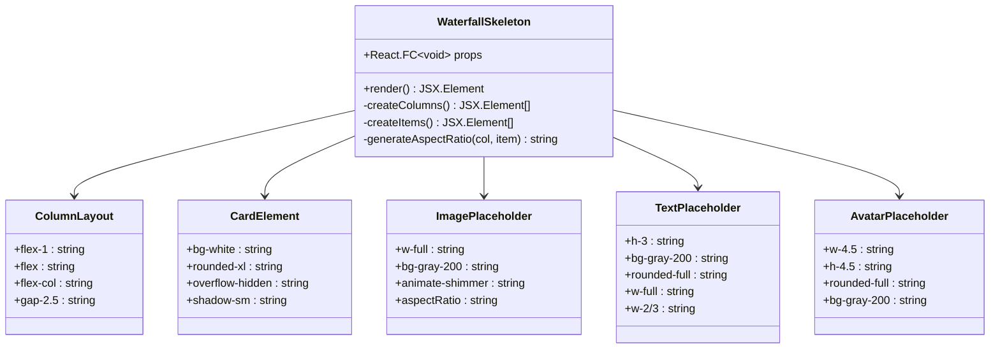
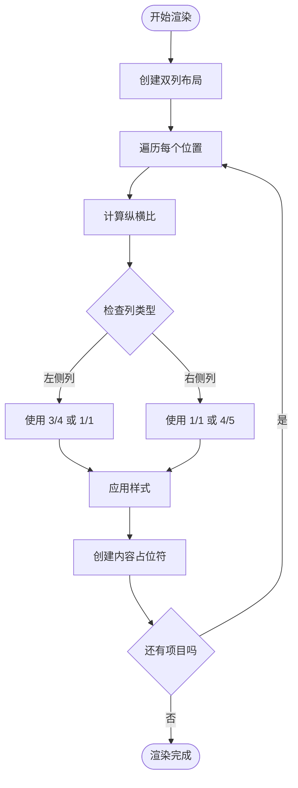
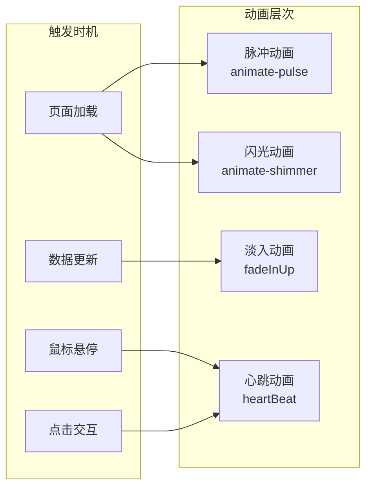
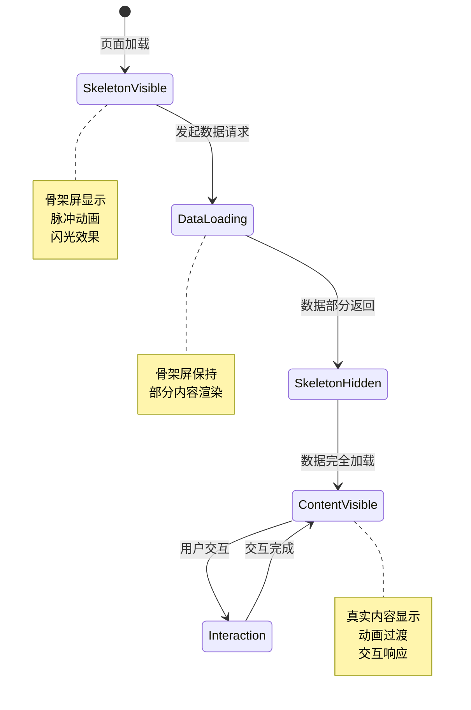
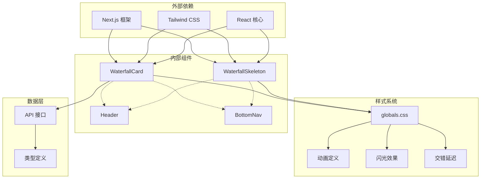
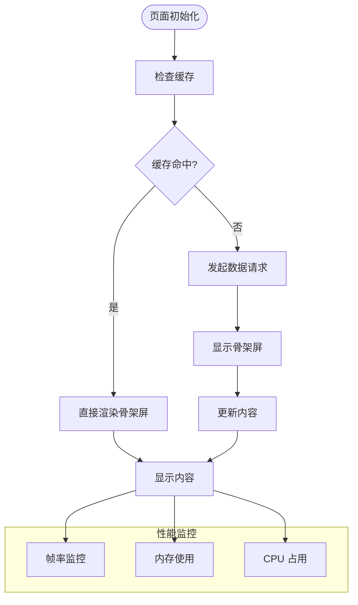

# WaterfallSkeleton 瀑布流骨架屏组件

<cite>
**本文档引用的文件**
- [WaterfallSkeleton.tsx](file://src/components/WaterfallSkeleton.tsx)
- [WaterfallCard.tsx](file://src/components/WaterfallCard.tsx)
- [page.tsx](file://src/app/page.tsx)
- [globals.css](file://src/app/globals.css)
- [api.ts](file://src/api/api.ts)
</cite>

## 目录
1. [简介](#简介)
2. [项目结构](#项目结构)
3. [核心组件](#核心组件)
4. [架构概览](#架构概览)
5. [详细组件分析](#详细组件分析)
6. [依赖关系分析](#依赖关系分析)
7. [性能考量](#性能考量)
8. [故障排除指南](#故障排除指南)
9. [结论](#结论)

## 简介

WaterfallSkeleton 是一个专为瀑布流布局设计的骨架屏组件，用于在数据加载期间提供视觉反馈和用户体验优化。该组件通过模拟真实内容的布局结构，为用户提供清晰的加载状态指示，避免页面闪烁和布局抖动问题。

该组件采用响应式设计，支持双列瀑布流布局，具有流畅的动画效果和良好的可访问性。通过与主瀑布流组件的紧密协作，实现了无缝的加载过渡体验。

## 项目结构

WaterfallSkeleton 组件位于组件目录中，与 WaterfallCard 组件共同构成完整的瀑布流展示系统：

**图表来源**
- [WaterfallSkeleton.tsx:1-40](file://src/components/WaterfallSkeleton.tsx#L1-L40)
- [WaterfallCard.tsx:1-155](file://src/components/WaterfallCard.tsx#L1-L155)
- [page.tsx:1-75](file://src/app/page.tsx#L1-L75)

**章节来源**
- [WaterfallSkeleton.tsx:1-40](file://src/components/WaterfallSkeleton.tsx#L1-L40)
- [WaterfallCard.tsx:1-155](file://src/components/WaterfallCard.tsx#L1-L155)
- [page.tsx:1-75](file://src/app/page.tsx#L1-L75)

## 核心组件

### WaterfallSkeleton 组件

WaterfallSkeleton 是一个轻量级的骨架屏组件，专门针对瀑布流布局进行了优化。该组件通过以下关键特性提供优秀的用户体验：

#### 布局结构设计
- **双列布局**：模拟真实的瀑布流双列结构
- **响应式间距**：使用 `gap-2` 和 `gap-2.5` 实现合理的间距控制
- **圆角卡片**：每个骨架元素都采用圆角设计，与真实卡片保持一致

#### 动画效果实现
- **脉冲动画**：使用 `animate-pulse` 提供基础的闪烁效果
- **闪光动画**：通过 `animate-shimmer` 实现内容区域的动态高亮
- **渐进式加载**：结合卡片自身的 `fadeInUp` 动画实现流畅的加载过渡

#### 占位符配置
- **图片占位**：使用不同纵横比模拟真实图片的随机高度
- **文本占位**：标题和副标题使用不同宽度的矩形占位符
- **头像占位**：圆形头像占位符模拟用户信息区域

**章节来源**
- [WaterfallSkeleton.tsx:3-39](file://src/components/WaterfallSkeleton.tsx#L3-L39)

## 架构概览

WaterfallSkeleton 与主瀑布流系统的集成采用了现代 React 的 Suspense 模式，实现了真正的流式加载体验：

**图表来源**
- [page.tsx:65-67](file://src/app/page.tsx#L65-L67)
- [WaterfallSkeleton.tsx:5](file://src/components/WaterfallSkeleton.tsx#L5)
- [WaterfallCard.tsx:53](file://src/components/WaterfallCard.tsx#L53)

### 状态同步机制

组件间的状态同步通过以下机制实现：

1. **Suspense 边界**：使用 `Suspense` 包装数据获取逻辑
2. **流式渲染**：数据分批返回时逐步渲染内容
3. **动画协调**：骨架屏和真实内容使用相同的动画时序
4. **优先级控制**：通过 `priority` 属性控制首屏加载顺序

**章节来源**
- [page.tsx:19-52](file://src/app/page.tsx#L19-L52)
- [WaterfallCard.tsx:26-41](file://src/components/WaterfallCard.tsx#L26-L41)

## 详细组件分析

### WaterfallSkeleton 组件架构

**图表来源**
- [WaterfallSkeleton.tsx:7-36](file://src/components/WaterfallSkeleton.tsx#L7-L36)

#### 布局算法分析

骨架屏采用双列瀑布流布局算法，通过数学公式实现智能的纵横比分配：

**图表来源**
- [WaterfallSkeleton.tsx:14-18](file://src/components/WaterfallSkeleton.tsx#L14-L18)

#### 动画系统实现

组件使用了多层次的动画系统来增强用户体验：

**图表来源**
- [globals.css:54-114](file://src/app/globals.css#L54-L114)
- [WaterfallCard.tsx:133](file://src/components/WaterfallCard.tsx#L133)

**章节来源**
- [WaterfallSkeleton.tsx:1-40](file://src/components/WaterfallSkeleton.tsx#L1-L40)
- [globals.css:53-125](file://src/app/globals.css#L53-L125)

### WaterfallCard 组件集成

WaterfallCard 组件与骨架屏形成了完美的互补关系：

#### 数据结构兼容性
两个组件共享相同的数据接口，确保骨架屏和真实内容的一致性：

| 字段 | 类型 | 骨架屏用途 | 真实内容用途 |
|------|------|------------|-------------|
| id | number | 占位符标识 | 数据唯一标识 |
| image | string | 图片占位符 | 实际图片地址 |
| title | string | 文本占位符 | 标题内容 |
| author | string | 文本占位符 | 作者名称 |
| avatar | string | 圆形占位符 | 头像地址 |
| likes | number | 数字占位符 | 点赞数量 |
| isVideo | boolean | 视频图标占位 | 视频标识 |
| overlay | string | 文本遮罩占位 | 文本遮罩 |
| tags | string[] | 标签占位符 | 标签数组 |
| aspectRatio | number | 图片纵横比 | 图片纵横比 |

#### 加载状态协调

**图表来源**
- [page.tsx:65](file://src/app/page.tsx#L65)
- [WaterfallCard.tsx:53](file://src/components/WaterfallCard.tsx#L53)

**章节来源**
- [WaterfallCard.tsx:7-18](file://src/components/WaterfallCard.tsx#L7-L18)
- [page.tsx:39-48](file://src/app/page.tsx#L39-L48)

## 依赖关系分析

### 组件依赖图

**图表来源**
- [WaterfallSkeleton.tsx:1](file://src/components/WaterfallSkeleton.tsx#L1)
- [WaterfallCard.tsx:3](file://src/components/WaterfallCard.tsx#L3)
- [globals.css:1-2](file://src/app/globals.css#L1-L2)
- [api.ts:6](file://src/api/api.ts#L6)

### 性能依赖分析

组件的性能表现主要依赖于以下几个方面：

1. **CSS 动画性能**：使用 GPU 加速的 transform 和 opacity 属性
2. **内存使用**：骨架屏只包含静态占位符，内存占用极低
3. **渲染开销**：双列布局通过 Flexbox 实现，渲染效率高
4. **网络优化**：与主瀑布流组件共享数据接口，减少重复请求

**章节来源**
- [globals.css:65-114](file://src/app/globals.css#L65-L114)
- [WaterfallSkeleton.tsx:5](file://src/components/WaterfallSkeleton.tsx#L5)

## 性能考量

### 动画性能优化

WaterfallSkeleton 组件在设计时充分考虑了性能因素：

#### GPU 加速动画
- 使用 `transform` 和 `opacity` 属性实现硬件加速
- 避免触发布局和重绘的属性修改
- 通过 `will-change` 属性提示浏览器优化

#### 内存管理
- 骨架屏组件体积小，内存占用低
- 不需要维护复杂的状态树
- 生命周期短，垃圾回收压力小

#### 渲染优化
- 使用纯 CSS 动画，避免 JavaScript 动画的性能开销
- 采用 Flexbox 布局，渲染性能优异
- 最小化 DOM 节点数量

### 加载策略优化

**图表来源**
- [page.tsx:65](file://src/app/page.tsx#L65)
- [WaterfallSkeleton.tsx:5](file://src/components/WaterfallSkeleton.tsx#L5)

### 最佳实践建议

基于项目中的优化经验，以下是使用 WaterfallSkeleton 组件的最佳实践：

1. **合理使用优先级**：通过 `priority` 属性控制首屏加载
2. **避免过度动画**：在移动设备上适当简化动画效果
3. **内存泄漏防护**：确保组件卸载时清理所有定时器和事件监听器
4. **性能监控**：定期检查组件的渲染性能和内存使用情况

**章节来源**
- [page.tsx:41](file://src/app/page.tsx#L41)
- [WaterfallCard.tsx:26](file://src/components/WaterfallCard.tsx#L26)

## 故障排除指南

### 常见问题及解决方案

#### 骨架屏不显示
**问题描述**：骨架屏组件没有正确渲染
**可能原因**：
- Suspense 边界未正确设置
- 数据获取逻辑异常
- 样式文件加载失败

**解决方案**：
1. 检查 Suspense 包装是否正确
2. 验证数据获取函数的返回值
3. 确认样式文件路径正确

#### 动画效果异常
**问题描述**：骨架屏动画效果不正常
**可能原因**：
- CSS 动画定义缺失
- 浏览器兼容性问题
- 动画冲突

**解决方案**：
1. 确认 `animate-pulse` 和 `animate-shimmer` 类存在
2. 检查浏览器对 CSS 动画的支持
3. 避免与其他动画效果冲突

#### 响应式布局问题
**问题描述**：在不同屏幕尺寸下布局异常
**可能原因**：
- 断点设置不当
- 容器宽度限制
- 弹性布局配置错误

**解决方案**：
1. 调整断点参数
2. 检查容器的 `max-width` 设置
3. 优化 Flexbox 配置

**章节来源**
- [WaterfallSkeleton.tsx:5](file://src/components/WaterfallSkeleton.tsx#L5)
- [globals.css:105-114](file://src/app/globals.css#L105-L114)

### 调试技巧

1. **开发者工具检查**：使用浏览器开发者工具检查 DOM 结构和样式应用
2. **性能分析**：使用 Chrome DevTools 的 Performance 面板分析渲染性能
3. **内存监控**：监控组件的内存使用情况，确保没有内存泄漏
4. **网络分析**：检查数据请求的响应时间和成功率

## 结论

WaterfallSkeleton 组件是一个精心设计的骨架屏解决方案，它成功地解决了瀑布流布局中的加载体验问题。通过合理的架构设计、优秀的性能优化和完善的用户体验考虑，该组件为现代 Web 应用提供了可靠的加载状态指示方案。

### 主要优势

1. **架构简洁**：组件设计简单明了，易于理解和维护
2. **性能优秀**：采用纯 CSS 动画，渲染性能优异
3. **用户体验良好**：提供自然的加载过渡效果
4. **扩展性强**：可以轻松适配不同的设计需求

### 改进建议

1. **主题定制**：增加更多的样式定制选项
2. **动画配置**：允许用户自定义动画参数
3. **无障碍支持**：增强屏幕阅读器的兼容性
4. **性能监控**：内置性能指标收集功能

该组件为瀑布流应用提供了一个优秀的骨架屏解决方案，值得在类似的项目中推广使用。