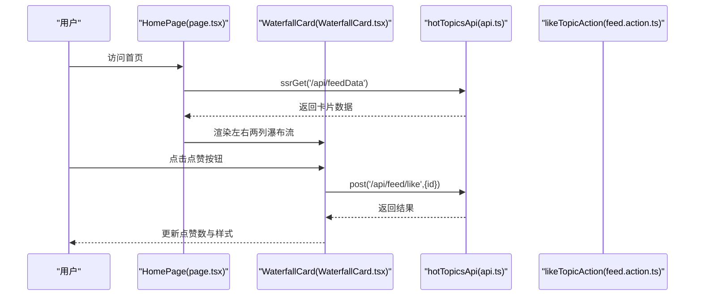
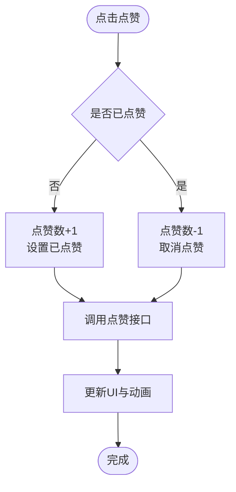
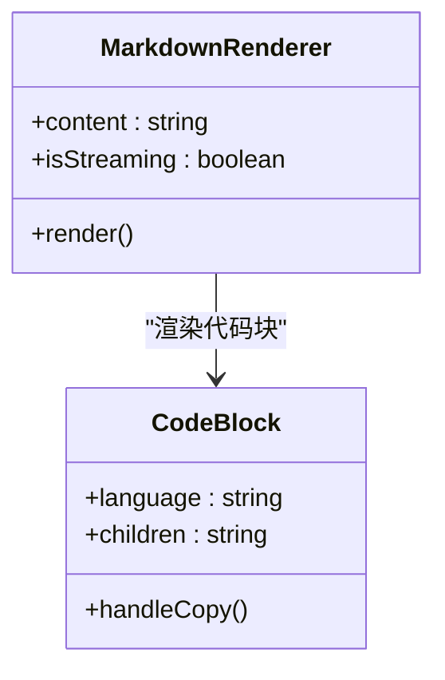
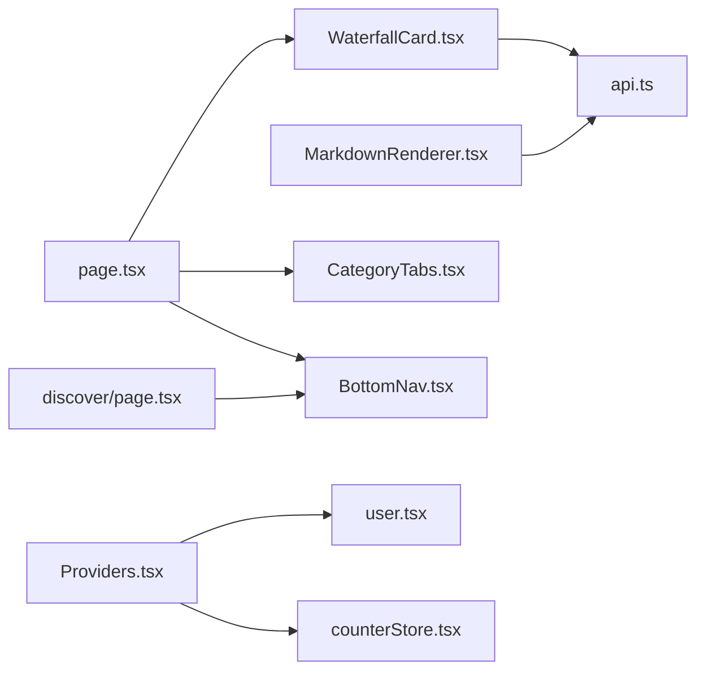

# 核心组件

<cite>
**本文引用的文件**
- [Header.tsx](file://src/components/Header.tsx)
- [BottomNav.tsx](file://src/components/BottomNav.tsx)
- [WaterfallCard.tsx](file://src/components/WaterfallCard.tsx)
- [MarkdownRenderer.tsx](file://src/components/MarkdownRenderer.tsx)
- [CategoryTabs.tsx](file://src/components/CategoryTabs.tsx)
- [WaterfallSkeleton.tsx](file://src/components/WaterfallSkeleton.tsx)
- [layout.tsx](file://src/app/layout.tsx)
- [globals.css](file://src/app/globals.css)
- [Providers.tsx](file://src/components/Providers.tsx)
- [page.tsx](file://src/app/page.tsx)
- [discover/page.tsx](file://src/app/discover/page.tsx)
- [user.tsx](file://src/store/user.tsx)
- [counterStore.tsx](file://src/store/counterStore.tsx)
- [feed.action.ts](file://src/actions/feed.action.ts)
- [api.ts](file://src/api/api.ts)
</cite>

## 目录
1. [引言](#引言)
2. [项目结构](#项目结构)
3. [核心组件](#核心组件)
4. [架构总览](#架构总览)
5. [详细组件分析](#详细组件分析)
6. [依赖分析](#依赖分析)
7. [性能考量](#性能考量)
8. [故障排查指南](#故障排查指南)
9. [结论](#结论)
10. [附录](#附录)

## 引言
本文件围绕项目中的核心UI组件库进行系统化文档化，重点覆盖以下组件的设计理念、API接口、属性配置与使用场景：Header 导航栏、BottomNav 底部导航、Waterfall 瀑布流卡片、Markdown 渲染器，并补充 CategoryTabs 分类标签与 WaterfallSkeleton 骨架屏。文档同时解释组件间的协作关系、状态管理模式、样式定制选项以及最佳实践，帮助开发者快速理解与扩展。

## 项目结构
组件库位于 src/components 目录，页面级入口位于 src/app，全局样式与主题变量位于 src/app/globals.css，状态管理采用 Zustand 并通过 Providers 注入到应用根部。

```mermaid
graph TB
subgraph "应用根"
L["layout.tsx"]
P["Providers.tsx"]
end
subgraph "页面"
HP["page.tsx"]
DP["discover/page.tsx"]
end
subgraph "组件库"
H["Header.tsx"]
BN["BottomNav.tsx"]
WC["WaterfallCard.tsx"]
MR["MarkdownRenderer.tsx"]
CT["CategoryTabs.tsx"]
SK["WaterfallSkeleton.tsx"]
end
subgraph "样式与主题"
GCSS["globals.css"]
end
subgraph "状态与动作"
US["user.tsx"]
CS["counterStore.tsx"]
FA["feed.action.ts"]
end
subgraph "API"
API["api.ts"]
end
L --> P --> HP
L --> P --> DP
HP --> H
HP --> CT
HP --> WC
HP --> SK
DP --> BN
HP --> BN
WC --> API
MR --> API
P --> US
P --> CS
HP --> FA
```

图表来源
- [layout.tsx:28-42](file://src/app/layout.tsx#L28-L42)
- [Providers.tsx:8-19](file://src/components/Providers.tsx#L8-L19)
- [page.tsx:1-75](file://src/app/page.tsx#L1-L75)
- [discover/page.tsx:1-183](file://src/app/discover/page.tsx#L1-L183)
- [Header.tsx:2-53](file://src/components/Header.tsx#L2-L53)
- [BottomNav.tsx:67-102](file://src/components/BottomNav.tsx#L67-L102)
- [WaterfallCard.tsx:26-152](file://src/components/WaterfallCard.tsx#L26-L152)
- [MarkdownRenderer.tsx:72-136](file://src/components/MarkdownRenderer.tsx#L72-L136)
- [CategoryTabs.tsx:7-36](file://src/components/CategoryTabs.tsx#L7-L36)
- [WaterfallSkeleton.tsx:3-39](file://src/components/WaterfallSkeleton.tsx#L3-L39)
- [globals.css:1-288](file://src/app/globals.css#L1-L288)
- [user.tsx:18-56](file://src/store/user.tsx#L18-L56)
- [counterStore.tsx:24-89](file://src/store/counterStore.tsx#L24-L89)
- [feed.action.ts:14-30](file://src/actions/feed.action.ts#L14-L30)
- [api.ts:44-81](file://src/api/api.ts#L44-L81)

章节来源
- [layout.tsx:28-42](file://src/app/layout.tsx#L28-L42)
- [globals.css:1-288](file://src/app/globals.css#L1-L288)

## 核心组件
本节概述四个关键组件的设计目标与职责边界：
- Header 导航栏：提供顶部品牌标识与右侧操作入口（搜索、菜单），采用粘性定位与毛玻璃背景增强视觉层次。
- BottomNav 底部导航：移动端底部导航，基于 Next.js 路由与图标状态切换，支持中心突出按钮与活跃态高亮。
- WaterfallCard 瀑布流卡片：展示图文内容，支持视频角标、标签遮罩、作者头像、点赞交互与数字格式化。
- MarkdownRenderer 渲染器：基于 react-markdown 与 remark-gfm，提供代码高亮、复制、表格优化与流式输出指示。

章节来源
- [Header.tsx:2-53](file://src/components/Header.tsx#L2-L53)
- [BottomNav.tsx:67-102](file://src/components/BottomNav.tsx#L67-L102)
- [WaterfallCard.tsx:26-152](file://src/components/WaterfallCard.tsx#L26-L152)
- [MarkdownRenderer.tsx:72-136](file://src/components/MarkdownRenderer.tsx#L72-L136)

## 架构总览
组件库与页面、状态、API 的协作关系如下：



图表来源
- [page.tsx:19-52](file://src/app/page.tsx#L19-L52)
- [WaterfallCard.tsx:30-41](file://src/components/WaterfallCard.tsx#L30-L41)
- [api.ts:64-71](file://src/api/api.ts#L64-L71)
- [feed.action.ts:14-30](file://src/actions/feed.action.ts#L14-L30)

## 详细组件分析

### Header 导航栏
- 设计理念
  - 简洁一致的品牌识别（Logo 文案与品牌色）。
  - 右侧操作区提供搜索与菜单入口，统一的悬停与点击反馈。
  - 粘性定位与半透明背景，兼顾可读性与层级感。
- API 与属性
  - 无 Props 输入；通过 Tailwind 类控制尺寸、间距与颜色。
  - 使用主题变量与品牌色常量保证一致性。
- 使用场景
  - 适用于需要统一顶部导航的页面，如首页、发现页等。
- 样式定制
  - 可通过修改容器类名与颜色变量调整背景、边框与字体大小。
  - 支持在父容器中添加额外的导航项或搜索框。

章节来源
- [Header.tsx:2-53](file://src/components/Header.tsx#L2-L53)
- [globals.css:4-26](file://src/app/globals.css#L4-L26)

### BottomNav 底部导航
- 设计理念
  - 以图标+标签的形式呈现，中心按钮突出“AI”功能。
  - 基于当前路径动态切换图标填充与描边，提供即时反馈。
  - 支持安全区适配与固定定位，确保在不同设备上的可用性。
- API 与属性
  - 无显式 Props；通过 navItems 列表配置项（label、href、icon、isCenter）描述导航项。
  - 使用 Next.js 的 usePathname 与 Link 组件实现客户端导航。
- 使用场景
  - 移动端底部导航，承载主要页面入口。
- 样式定制
  - 可通过修改图标尺寸、颜色与间距类名实现风格统一。
  - 活跃态与非活跃态的颜色与缩放可通过类名过渡控制。

章节来源
- [BottomNav.tsx:67-102](file://src/components/BottomNav.tsx#L67-L102)
- [BottomNav.tsx:6-65](file://src/components/BottomNav.tsx#L6-L65)

### WaterfallCard 瀑布流卡片
- 设计理念
  - 卡片采用断列避免模式，配合入场动画提升视觉流畅度。
  - 图片容器支持动态宽高比与悬停缩放，增强交互体验。
  - 支持视频角标、遮罩文本、标签集合与作者信息。
- API 与属性
  - Props：data（CardData）、index（number）、priority（boolean，可选）。
  - CardData 字段：id、image、title、author、avatar、likes、isVideo、overlay、tags、aspectRatio。
  - 交互：点赞按钮支持本地状态切换与后端接口调用。
- 使用场景
  - 首页信息流、推荐列表等瀑布流布局。
- 样式定制
  - 可通过 aspectRatio 控制图片比例，通过类名调整阴影、圆角与间距。
  - 动画时序通过 index 计算，可按需调整延迟步长。



图表来源
- [WaterfallCard.tsx:30-41](file://src/components/WaterfallCard.tsx#L30-L41)
- [WaterfallCard.tsx:43-47](file://src/components/WaterfallCard.tsx#L43-L47)
- [api.ts:68-71](file://src/api/api.ts#L68-L71)

章节来源
- [WaterfallCard.tsx:20-24](file://src/components/WaterfallCard.tsx#L20-L24)
- [WaterfallCard.tsx:7-18](file://src/components/WaterfallCard.tsx#L7-L18)
- [WaterfallCard.tsx:26-152](file://src/components/WaterfallCard.tsx#L26-L152)

### MarkdownRenderer 渲染器
- 设计理念
  - 基于 react-markdown 与 remark-gfm，支持表格、任务列表等扩展语法。
  - 代码块高亮与一键复制，流式输出时显示光标指示，提升阅读与交互体验。
- API 与属性
  - Props：content（string）、isStreaming（boolean，可选）。
  - 自定义组件：code（内联/块级）、a（外链）、table/th/td 等。
  - 代码块组件：支持语言识别、复制状态与样式定制。
- 使用场景
  - AI 对话输出、文章详情、评论内容等富文本渲染。
- 样式定制
  - 通过主题样式（atomDark）与容器类名控制排版、边框与阴影。
  - 可根据需求替换高亮主题或调整字体大小。



图表来源
- [MarkdownRenderer.tsx:72-136](file://src/components/MarkdownRenderer.tsx#L72-L136)
- [MarkdownRenderer.tsx:18-60](file://src/components/MarkdownRenderer.tsx#L18-L60)

章节来源
- [MarkdownRenderer.tsx:10-13](file://src/components/MarkdownRenderer.tsx#L10-L13)
- [MarkdownRenderer.tsx:72-136](file://src/components/MarkdownRenderer.tsx#L72-L136)

### CategoryTabs 分类标签
- 设计理念
  - 顶部吸顶布局，支持横向滚动与隐藏滚动条，突出当前分类。
  - 通过缩放与阴影强调选中态，提供直观的导航反馈。
- API 与属性
  - 无 Props；内置分类数组与默认激活索引。
- 使用场景
  - 信息流中按类别筛选内容。
- 样式定制
  - 可通过类名调整字号、圆角、间距与阴影强度。

章节来源
- [CategoryTabs.tsx:7-36](file://src/components/CategoryTabs.tsx#L7-L36)

### WaterfallSkeleton 骨架屏
- 设计理念
  - 模拟左右两列瀑布流骨架，随机高度与占位元素，结合 shimmer 动画提升等待体验。
- API 与属性
  - 无 Props；通过循环生成多列与多行骨架。
- 使用场景
  - 数据加载时的占位渲染，提升感知性能。
- 样式定制
  - 可通过 aspectRatio 与占位高度模拟不同卡片比例。

章节来源
- [WaterfallSkeleton.tsx:3-39](file://src/components/WaterfallSkeleton.tsx#L3-L39)

## 依赖分析
- 组件间耦合
  - Header/BottomNav 为通用导航组件，被多个页面复用。
  - WaterfallCard 依赖 API 层进行数据与交互，依赖全局样式变量。
  - MarkdownRenderer 依赖第三方库与主题样式。
- 外部依赖
  - Next.js 路由与导航（usePathname、Link）。
  - Zustand 状态管理（用户与计数器）。
  - heroui 提供 Toast 容器与样式。
- 潜在循环依赖
  - 组件库与页面之间为单向依赖，无循环导入风险。



图表来源
- [WaterfallCard.tsx:5](file://src/components/WaterfallCard.tsx#L5)
- [api.ts:6-81](file://src/api/api.ts#L6-L81)
- [page.tsx:1-7](file://src/app/page.tsx#L1-L7)
- [discover/page.tsx:1-2](file://src/app/discover/page.tsx#L1-L2)
- [Providers.tsx:8-19](file://src/components/Providers.tsx#L8-L19)
- [user.tsx:18-56](file://src/store/user.tsx#L18-L56)
- [counterStore.tsx:24-89](file://src/store/counterStore.tsx#L24-L89)

章节来源
- [api.ts:6-81](file://src/api/api.ts#L6-L81)
- [Providers.tsx:8-19](file://src/components/Providers.tsx#L8-L19)

## 性能考量
- 渲染性能
  - 瀑布流卡片使用断列避免模式与入场动画，建议合理控制首屏数量与优先级。
  - 图片懒加载与 sizes 属性配合，减少主线程压力。
- 交互性能
  - 点赞按钮使用本地状态与防抖式接口调用，避免频繁重渲染。
  - Markdown 渲染器对代码块进行按需高亮，减少不必要的计算。
- 状态与缓存
  - 页面级数据获取与缓存策略（如 SSR/ISR）应与组件渲染策略协同，避免重复请求。
  - Server Action 用于写操作，减少前端暴露敏感逻辑。

## 故障排查指南
- 瀑布流卡片点赞异常
  - 检查接口返回与错误处理逻辑，确认 id 传参正确。
  - 确认样式动画类名与状态切换逻辑一致。
- Markdown 渲染空白或样式错乱
  - 检查 remark 插件与高亮主题是否正确引入。
  - 确认容器类名与主题变量未被覆盖。
- 底部导航活跃态不准确
  - 检查 usePathname 返回值与 href 是否匹配。
  - 确认 Link 组件的 prefetch 与类名切换逻辑。
- 骨架屏与首屏闪烁
  - 确保 Suspense 边界与 fallback 正确配置。
  - 检查动画与 shimmer 样式是否生效。

章节来源
- [WaterfallCard.tsx:30-41](file://src/components/WaterfallCard.tsx#L30-L41)
- [MarkdownRenderer.tsx:72-136](file://src/components/MarkdownRenderer.tsx#L72-L136)
- [BottomNav.tsx:67-102](file://src/components/BottomNav.tsx#L67-L102)
- [WaterfallSkeleton.tsx:3-39](file://src/components/WaterfallSkeleton.tsx#L3-L39)

## 结论
本组件库以简洁、可复用为核心设计原则，结合 Next.js 的路由与渲染特性，提供了从导航到内容展示的一体化解决方案。通过明确的 Props 定义、可定制的样式体系与清晰的交互流程，开发者可以快速搭建高质量的移动端信息流界面。建议在实际项目中遵循组件职责分离、状态集中管理与性能优先的原则，持续优化用户体验。

## 附录
- 主题与样式变量
  - 全局变量定义了品牌色与字体族，组件通过类名引用。
- 状态管理
  - 用户信息与计数器通过 Provider 注入，组件通过自定义 Hook 获取状态。
- API 与动作
  - 数据接口集中在 api.ts，Server Action 封装写操作，保障安全性与可维护性。

章节来源
- [globals.css:4-26](file://src/app/globals.css#L4-L26)
- [Providers.tsx:8-19](file://src/components/Providers.tsx#L8-L19)
- [user.tsx:18-56](file://src/store/user.tsx#L18-L56)
- [counterStore.tsx:24-89](file://src/store/counterStore.tsx#L24-L89)
- [api.ts:44-81](file://src/api/api.ts#L44-L81)
- [feed.action.ts:14-30](file://src/actions/feed.action.ts#L14-L30)