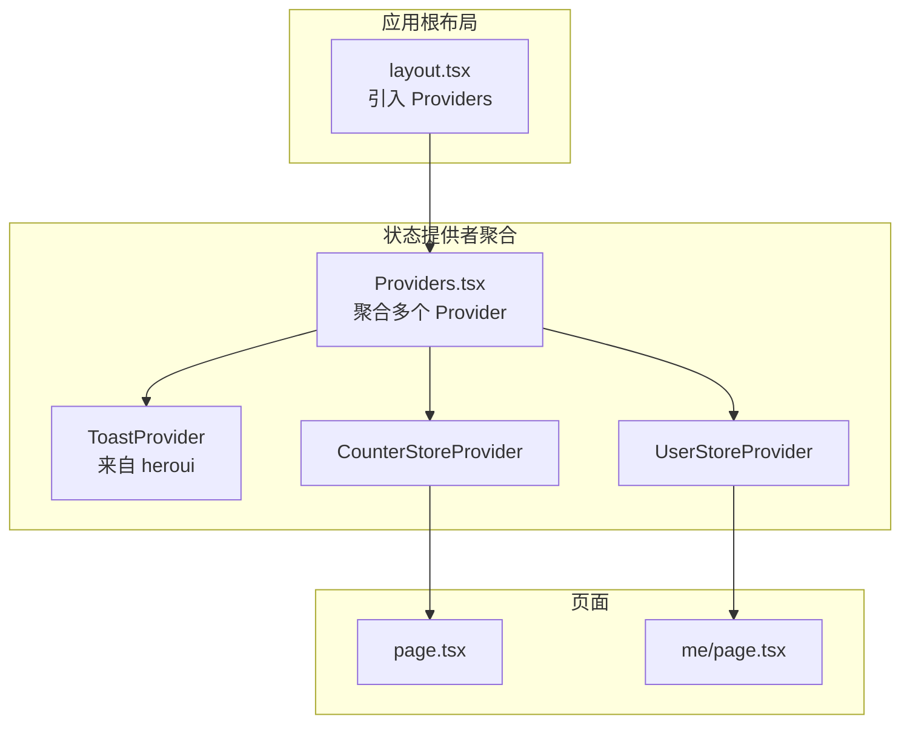
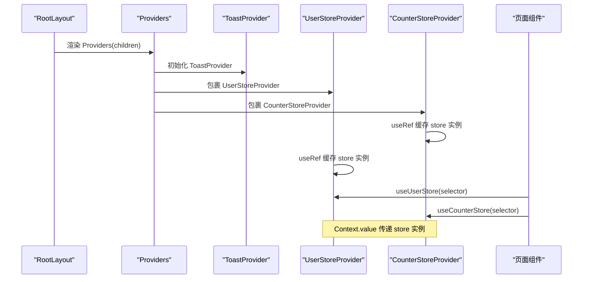
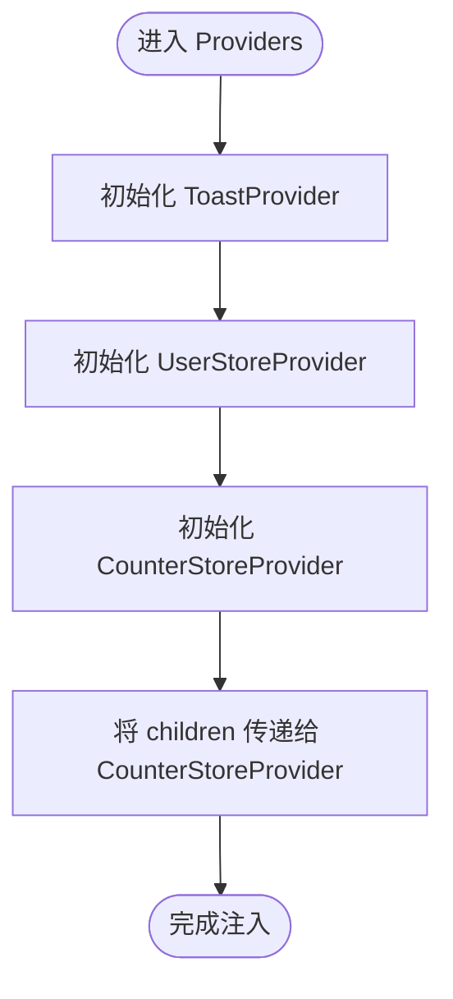
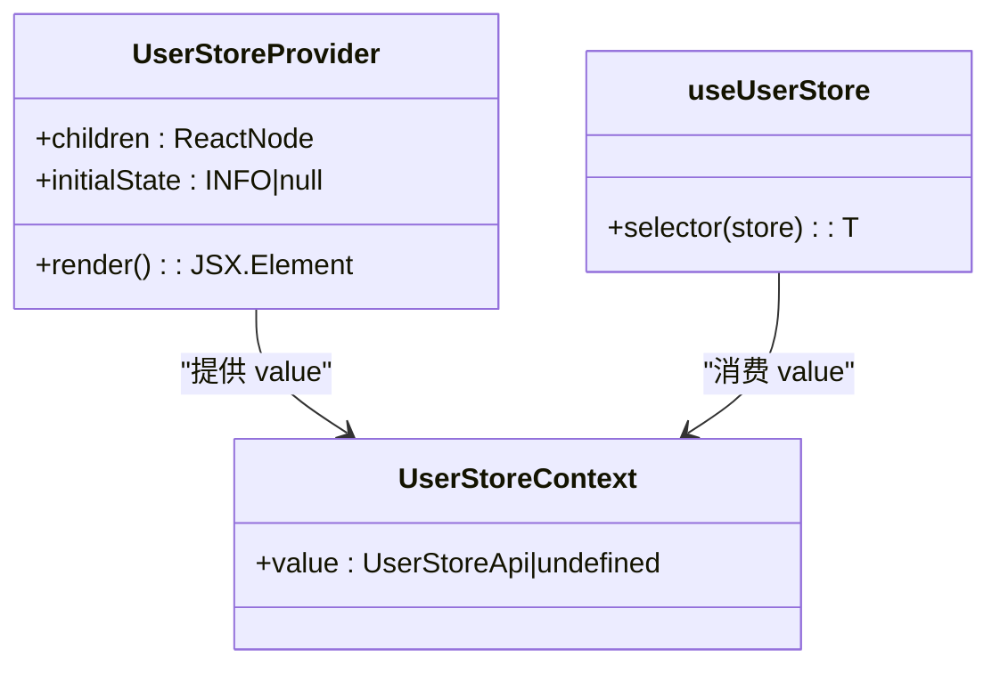
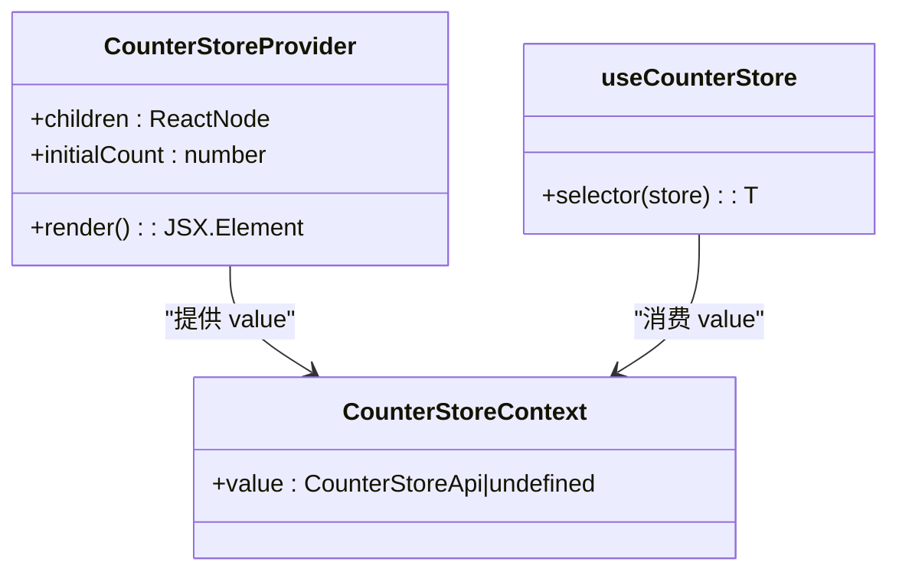
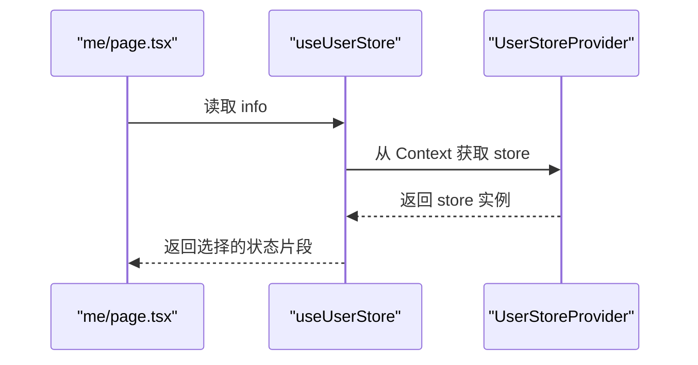
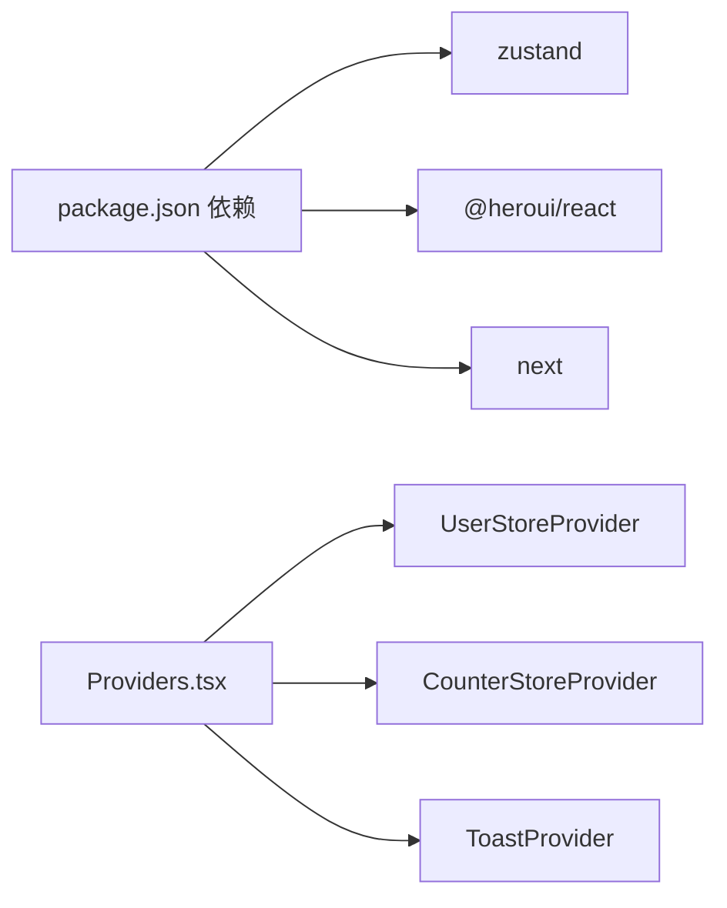

# 状态提供者配置

<cite>
**本文引用的文件**
- [Providers.tsx](file://src/components/Providers.tsx)
- [user.tsx](file://src/store/user.tsx)
- [counterStore.tsx](file://src/store/counterStore.tsx)
- [layout.tsx](file://src/app/layout.tsx)
- [page.tsx](file://src/app/page.tsx)
- [me\page.tsx](file://src/app/me/page.tsx)
- [api.ts](file://src/api/api.ts)
- [feed.action.ts](file://src/actions/feed.action.ts)
- [package.json](file://package.json)
</cite>

## 目录
1. [简介](#简介)
2. [项目结构](#项目结构)
3. [核心组件](#核心组件)
4. [架构总览](#架构总览)
5. [详细组件分析](#详细组件分析)
6. [依赖分析](#依赖分析)
7. [性能考虑](#性能考虑)
8. [故障排查指南](#故障排查指南)
9. [结论](#结论)
10. [附录](#附录)

## 简介
本文件围绕状态提供者配置进行系统化说明，重点覆盖以下方面：
- Providers 组件的作用与职责：作为全局状态提供者的聚合入口，负责在应用根部注入多个独立的 store 提供者，并确保上下文在组件树中的正确传递。
- 多 store 组合管理：通过嵌套 Provider 的方式，将用户信息 store 与计数器 store 同时注入到组件树中，实现跨页面、跨组件的状态共享。
- 组件树结构：基于 Next.js App Router 的布局体系，Provider 在根布局中包裹所有子路由与页面，形成统一的状态根节点。
- 配置与使用：如何正确初始化与使用各类 store 提供者，以及上下文传递机制与状态共享策略。
- Provider 嵌套规则：明确嵌套顺序、父子关系与作用域边界，避免重复创建或丢失状态。
- 性能优化：利用 useRef 缓存 store 实例、最小化重渲染、合理拆分 store 以降低耦合。
- 错误处理：在缺少 Provider 包裹时抛出明确错误，帮助快速定位问题。

## 项目结构
本项目的状态提供者配置位于组件层与 store 层，配合 Next.js 根布局完成全局注入。关键文件与职责如下：
- 根布局：在根布局中引入 Providers，使所有页面共享同一套状态提供者。
- Providers：聚合多个 store 提供者，负责上下文传递与 Suspense 包裹。
- store 层：每个 store 采用“工厂函数 + Context + Provider + 自定义 Hook”的模式，确保实例稳定与类型安全。

**图表来源**
- [layout.tsx:28-42](file://src/app/layout.tsx#L28-L42)
- [Providers.tsx:8-19](file://src/components/Providers.tsx#L8-L19)
- [user.tsx:36-46](file://src/store/user.tsx#L36-L46)
- [counterStore.tsx:53-71](file://src/store/counterStore.tsx#L53-L71)
- [page.tsx:54-74](file://src/app/page.tsx#L54-L74)
- [me\page.tsx:6-66](file://src/app/me/page.tsx#L6-L66)

**章节来源**
- [layout.tsx:28-42](file://src/app/layout.tsx#L28-L42)
- [Providers.tsx:8-19](file://src/components/Providers.tsx#L8-L19)

## 核心组件
- Providers 组件
  - 作用：在应用根部统一注入多个状态提供者，保证全局可用。
  - 关键点：使用 Suspense 包裹，减少首屏阻塞；按需引入第三方 Provider（如 ToastProvider）。
  - 嵌套顺序：先注入用户信息 store，再注入计数器 store，最外层包裹 children。
- UserStoreProvider
  - 作用：为用户信息相关的状态提供上下文，支持初始状态注入。
  - 实现要点：通过 useRef 缓存 store 实例，避免重复创建；在 Provider 的 value 中向下传递。
- CounterStoreProvider
  - 作用：为计数器状态提供上下文，支持初始值注入。
  - 实现要点：同样通过 useRef 缓存 store 实例，确保组件多次渲染不丢失状态。
- useUserStore/useCounterStore
  - 作用：自定义 Hook，从对应 Context 中读取 store 实例并选择性订阅状态。
  - 错误处理：若未在对应 Provider 内使用，抛出明确错误，防止幽灵状态。

**章节来源**
- [Providers.tsx:8-19](file://src/components/Providers.tsx#L8-L19)
- [user.tsx:36-56](file://src/store/user.tsx#L36-L56)
- [counterStore.tsx:53-88](file://src/store/counterStore.tsx#L53-L88)

## 架构总览
下图展示了从根布局到各页面的状态提供者链路，以及 store 的实例化与上下文传递过程。

**图表来源**
- [layout.tsx:28-42](file://src/app/layout.tsx#L28-L42)
- [Providers.tsx:8-19](file://src/components/Providers.tsx#L8-L19)
- [user.tsx:36-56](file://src/store/user.tsx#L36-L56)
- [counterStore.tsx:53-88](file://src/store/counterStore.tsx#L53-L88)

## 详细组件分析

### Providers 组件分析
- 设计模式：聚合 Provider，统一注入多个 store 与第三方 UI 提供者。
- 嵌套规则：遵循“外层包裹内层”的原则，确保 Context 作用域正确。
- Suspense 包裹：减少首屏阻塞，提升用户体验。
- 第三方集成：引入 ToastProvider，便于全局提示展示。

**图表来源**
- [Providers.tsx:8-19](file://src/components/Providers.tsx#L8-L19)

**章节来源**
- [Providers.tsx:8-19](file://src/components/Providers.tsx#L8-L19)

### UserStoreProvider 分析
- 工厂函数：createUserStore(initState) 生成独立 store 实例。
- Context：UserStoreContext 用于在组件树中传递 store。
- Provider：通过 useRef 缓存实例，首次渲染时创建，后续渲染复用。
- 自定义 Hook：useUserStore(selector) 从 Context 中读取 store 并订阅状态。

**图表来源**
- [user.tsx:36-56](file://src/store/user.tsx#L36-L56)

**章节来源**
- [user.tsx:18-56](file://src/store/user.tsx#L18-L56)

### CounterStoreProvider 分析
- 工厂函数：createCounterStore(initCount) 生成独立 store 实例。
- Context：CounterStoreContext 用于在组件树中传递 store。
- Provider：通过 useRef 缓存实例，首次渲染时创建，后续渲染复用。
- 自定义 Hook：useCounterStore(selector) 从 Context 中读取 store 并订阅状态。

**图表来源**
- [counterStore.tsx:53-88](file://src/store/counterStore.tsx#L53-L88)

**章节来源**
- [counterStore.tsx:24-88](file://src/store/counterStore.tsx#L24-L88)

### 页面使用示例分析
- me 页面：通过 useUserStore 读取用户信息，实现个人信息展示与登出逻辑。
- 首页：通过 useCounterStore 读取计数器状态，实现计数交互（示例页面未直接展示计数器交互，但具备使用能力）。

**图表来源**
- [me\page.tsx:6-66](file://src/app/me/page.tsx#L6-L66)
- [user.tsx:48-56](file://src/store/user.tsx#L48-L56)

**章节来源**
- [me\page.tsx:6-66](file://src/app/me/page.tsx#L6-L66)
- [page.tsx:54-74](file://src/app/page.tsx#L54-L74)

## 依赖分析
- 外部依赖
  - Zustand：用于创建与管理 store，提供 useStore 订阅能力。
  - @heroui/react：提供 ToastProvider，用于全局提示展示。
  - Next.js：通过 App Router 与客户端组件特性，支撑 Provider 注入与状态共享。
- 内部依赖
  - Providers 聚合多个 store 提供者，形成统一的状态根。
  - 各 store 提供者之间无直接耦合，通过 Context 独立传递。

**图表来源**
- [package.json:11-26](file://package.json#L11-L26)
- [Providers.tsx:3-6](file://src/components/Providers.tsx#L3-L6)

**章节来源**
- [package.json:11-26](file://package.json#L11-L26)
- [Providers.tsx:3-6](file://src/components/Providers.tsx#L3-L6)

## 性能考虑
- useRef 缓存 store 实例
  - 在 UserStoreProvider 与 CounterStoreProvider 中均使用 useRef 缓存 store 实例，避免组件多次渲染导致实例重建，从而保持状态稳定。
- 最小化重渲染
  - 通过 useStore(selector) 精准订阅状态片段，仅在被选择的状态变化时触发组件重渲染。
- Suspense 包裹
  - 在 Providers 中使用 Suspense 包裹，有助于首屏加载与渐进式渲染，减少阻塞。
- store 拆分
  - 将用户信息与计数器拆分为独立 store，降低耦合度，避免无关状态变化引发的重渲染。

**章节来源**
- [user.tsx:36-46](file://src/store/user.tsx#L36-L46)
- [counterStore.tsx:53-71](file://src/store/counterStore.tsx#L53-L71)
- [Providers.tsx:8-19](file://src/components/Providers.tsx#L8-L19)

## 故障排查指南
- 缺少 Provider 包裹
  - 症状：在组件中直接使用 useUserStore 或 useCounterStore 且未在根部包裹对应 Provider，会抛出错误。
  - 解决：确保在根布局中引入 Providers，并正确嵌套 UserStoreProvider 与 CounterStoreProvider。
- 嵌套顺序错误
  - 症状：Provider 嵌套顺序不当，导致 Context 无法正确传递。
  - 解决：遵循“外层包裹内层”的顺序，确保父级 Provider 先于子级 Provider 渲染。
- 重复创建 store 实例
  - 症状：组件多次渲染导致 store 实例被反复创建，状态丢失。
  - 解决：使用 useRef 缓存 store 实例，仅在首次渲染时创建。
- 类型不匹配
  - 症状：selector 返回类型与预期不符，导致编译或运行时错误。
  - 解决：确保 selector 正确选择状态片段，并与自定义 Hook 的泛型参数一致。

**章节来源**
- [user.tsx:48-56](file://src/store/user.tsx#L48-L56)
- [counterStore.tsx:76-88](file://src/store/counterStore.tsx#L76-L88)
- [Providers.tsx:8-19](file://src/components/Providers.tsx#L8-L19)

## 结论
本项目的状态提供者配置通过 Providers 聚合多个 store 提供者，结合 useRef 缓存与 Context 传递，实现了稳定的全局状态管理。通过清晰的嵌套规则与自定义 Hook，开发者可以在任意页面中便捷地访问用户信息与计数器状态。同时，Suspense 包裹与最小化重渲染策略提升了性能与用户体验。建议在扩展新 store 时遵循现有模式，确保类型安全与实例稳定性。

## 附录
- 配置示例路径
  - 根布局注入：[layout.tsx:28-42](file://src/app/layout.tsx#L28-L42)
  - Provider 聚合：[Providers.tsx:8-19](file://src/components/Providers.tsx#L8-L19)
  - 用户 store 提供者：[user.tsx:36-56](file://src/store/user.tsx#L36-L56)
  - 计数器 store 提供者：[counterStore.tsx:53-88](file://src/store/counterStore.tsx#L53-L88)
  - 页面使用示例（用户信息）：[me\page.tsx:6-66](file://src/app/me/page.tsx#L6-L66)
  - 页面使用示例（计数器）：[page.tsx:54-74](file://src/app/page.tsx#L54-L74)
  - API 与 Server Action（与状态管理协同）：[api.ts:44-81](file://src/api/api.ts#L44-L81)、[feed.action.ts:14-30](file://src/actions/feed.action.ts#L14-L30)