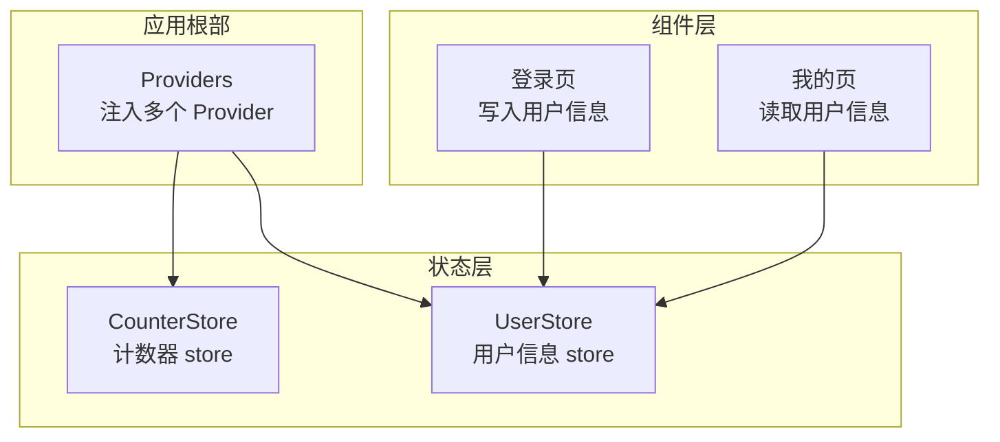
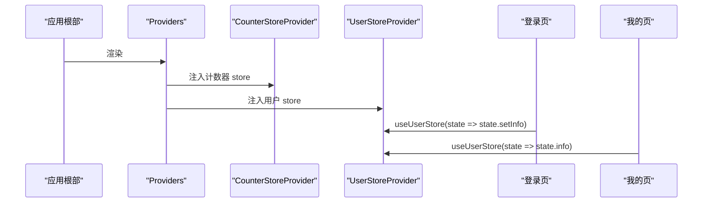
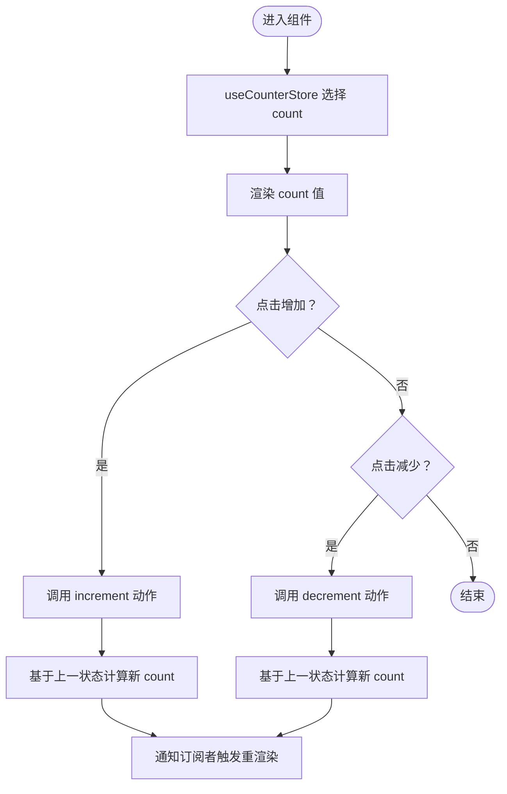
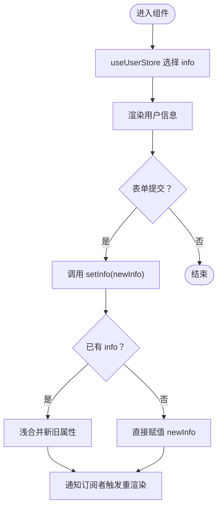
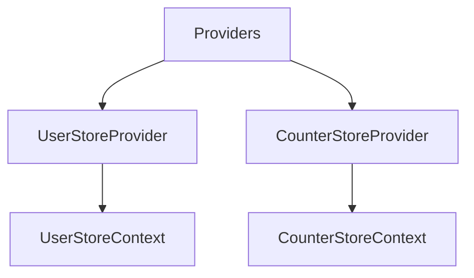
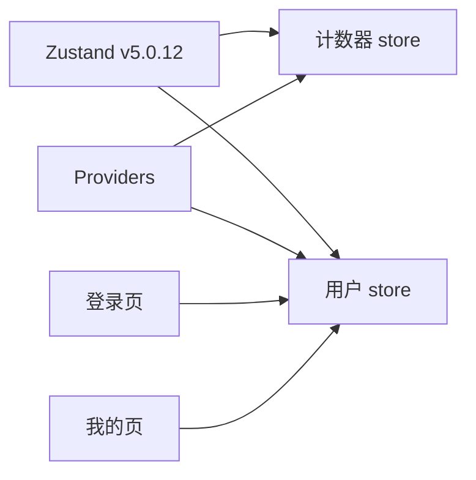

# 状态管理

<cite>
**本文引用的文件**
- [package.json](file://package.json)
- [Providers.tsx](file://src/components/Providers.tsx)
- [counterStore.tsx](file://src/store/counterStore.tsx)
- [user.tsx](file://src/store/user.tsx)
- [login/page.tsx](file://src/app/login/page.tsx)
- [me/page.tsx](file://src/app/me/page.tsx)
- [api.ts](file://src/api/api.ts)
- [feed.action.ts](file://src/actions/feed.action.ts)
</cite>

## 目录
1. [简介](#简介)
2. [项目结构](#项目结构)
3. [核心组件](#核心组件)
4. [架构总览](#架构总览)
5. [详细组件分析](#详细组件分析)
6. [依赖分析](#依赖分析)
7. [性能考虑](#性能考虑)
8. [故障排查指南](#故障排查指南)
9. [结论](#结论)
10. [附录](#附录)

## 简介
本文件系统性梳理本项目的状态管理方案，围绕 Zustand 状态库的使用展开，覆盖 store 设计模式、全局状态结构、action 定义与状态订阅、状态持久化策略、异步状态更新与状态重置策略，并提供调试与性能优化建议。项目采用多 store 分离的设计，分别管理计数器与用户信息两类状态，通过 Provider 组织在应用根部，配合自定义 Hook 实现组件级订阅与最小化重渲染。

## 项目结构
- 状态库依赖：Zustand v5.0.12
- 状态模块：
  - 计数器 store：提供计数与增减操作
  - 用户 store：提供用户信息的合并更新
- 全局提供者：在应用根部注入多个 Provider，保证 store 在客户端组件树中可用
- 使用示例：
  - 登录页：使用用户 store 的 setInfo 动作写入用户信息
  - 我的页面：订阅用户 info 以展示用户数据
  - 计数器 store：通过自定义 Hook 订阅 count 并进行增减

图表来源
- [Providers.tsx:8-19](file://src/components/Providers.tsx#L8-L19)
- [counterStore.tsx:24-32](file://src/store/counterStore.tsx#L24-L32)
- [user.tsx:18-25](file://src/store/user.tsx#L18-L25)
- [login/page.tsx:18](file://src/app/login/page.tsx#L18)
- [me/page.tsx:9](file://src/app/me/page.tsx#L9)

章节来源
- [package.json:25](file://package.json#L25)
- [Providers.tsx:8-19](file://src/components/Providers.tsx#L8-L19)

## 核心组件
- 计数器 store
  - 结构：包含 count 字段与 increment/decrement 两个动作
  - 工厂函数：createCounterStore(initCount) 返回 Zustand store 实例
  - Provider：CounterStoreProvider，使用 useRef 缓存 store 实例，避免重复创建
  - 自定义 Hook：useCounterStore(selector)，基于 useStore 实现按需订阅
- 用户 store
  - 结构：包含 info 字段与 setInfo 动作，支持部分属性合并更新
  - 工厂函数：createUserStore(initState) 返回 Zustand store 实例
  - Provider：UserStoreProvider，同样使用 useRef 缓存 store 实例
  - 自定义 Hook：useUserStore(selector)，基于 useStore 实现按需订阅

章节来源
- [counterStore.tsx:14-18](file://src/store/counterStore.tsx#L14-L18)
- [counterStore.tsx:24-32](file://src/store/counterStore.tsx#L24-L32)
- [counterStore.tsx:53-71](file://src/store/counterStore.tsx#L53-L71)
- [counterStore.tsx:76-88](file://src/store/counterStore.tsx#L76-L88)
- [user.tsx:13-16](file://src/store/user.tsx#L13-L16)
- [user.tsx:18-25](file://src/store/user.tsx#L18-L25)
- [user.tsx:36-46](file://src/store/user.tsx#L36-L46)
- [user.tsx:48-56](file://src/store/user.tsx#L48-L56)

## 架构总览
应用通过 Providers 在根部注入多个 Provider，使子树中的任意组件均可通过自定义 Hook 订阅对应 store。Zustand 的 useStore 仅在 selector 选择的状态片段发生变化时触发组件重渲染，从而实现高效的局部更新。

图表来源
- [Providers.tsx:8-19](file://src/components/Providers.tsx#L8-L19)
- [counterStore.tsx:53-71](file://src/store/counterStore.tsx#L53-L71)
- [user.tsx:36-46](file://src/store/user.tsx#L36-L46)
- [login/page.tsx:18](file://src/app/login/page.tsx#L18)
- [me/page.tsx:9](file://src/app/me/page.tsx#L9)

## 详细组件分析

### 计数器 store 设计与订阅
- 设计要点
  - 使用工厂函数 createCounterStore(initCount) 生成独立 store 实例
  - 通过 useRef 缓存 store 实例，避免组件重渲染导致实例丢失
  - 自定义 Hook useCounterStore(selector) 仅订阅 selector 选择的部分，减少重渲染
- 订阅方式
  - 组件通过 useCounterStore((s) => s.count) 订阅 count
  - 通过 useCounterStore((s) => s.increment) 订阅 increment 动作
- 增减逻辑
  - increment：基于上一状态计算新值
  - decrement：基于上一状态计算新值

图表来源
- [counterStore.tsx:24-32](file://src/store/counterStore.tsx#L24-L32)
- [counterStore.tsx:76-88](file://src/store/counterStore.tsx#L76-L88)

章节来源
- [counterStore.tsx:24-32](file://src/store/counterStore.tsx#L24-L32)
- [counterStore.tsx:53-71](file://src/store/counterStore.tsx#L53-L71)
- [counterStore.tsx:76-88](file://src/store/counterStore.tsx#L76-L88)

### 用户 store 设计与订阅
- 设计要点
  - 工厂函数 createUserStore(initState) 生成独立 store 实例
  - setInfo 支持部分属性合并更新，避免全量替换
  - 通过 useRef 缓存 store 实例，避免重复创建
- 订阅方式
  - 组件通过 useUserStore((s) => s.info) 订阅用户信息
  - 通过 useUserStore((s) => s.setInfo) 订阅更新动作
- 更新策略
  - 若已有 info，则对新旧属性进行浅合并
  - 若无 info，则直接赋值新对象

图表来源
- [user.tsx:18-25](file://src/store/user.tsx#L18-L25)
- [user.tsx:48-56](file://src/store/user.tsx#L48-L56)

章节来源
- [user.tsx:18-25](file://src/store/user.tsx#L18-L25)
- [user.tsx:36-46](file://src/store/user.tsx#L36-L46)
- [user.tsx:48-56](file://src/store/user.tsx#L48-L56)

### 全局提供者与上下文
- Providers 组织
  - 在应用根部统一注入多个 Provider，保证 store 在客户端组件树中可用
  - 采用 Suspense 包裹，提升首屏体验
- 上下文与实例缓存
  - 每个 store 使用 Context 传递实例
  - 通过 useRef 缓存实例，避免组件重渲染导致实例丢失

图表来源
- [Providers.tsx:8-19](file://src/components/Providers.tsx#L8-L19)
- [user.tsx:29](file://src/store/user.tsx#L29)
- [counterStore.tsx:42](file://src/store/counterStore.tsx#L42)

章节来源
- [Providers.tsx:8-19](file://src/components/Providers.tsx#L8-L19)
- [user.tsx:29](file://src/store/user.tsx#L29)
- [counterStore.tsx:42](file://src/store/counterStore.tsx#L42)

### 状态持久化策略
- 当前实现
  - 用户登录成功后，同时写入 localStorage 与 cookie，用于客户端与服务端识别
- 建议
  - 对于需要跨会话保留的状态，可结合 Zustand 插件或本地存储方案实现持久化
  - 注意敏感信息不要持久化到 localStorage，优先使用 HttpOnly Cookie

章节来源
- [login/page.tsx:33-36](file://src/app/login/page.tsx#L33-L36)

### 异步状态更新与状态重置
- 异步更新
  - 用户登录成功后，通过 setInfo 将用户信息写入 store
  - 服务端渲染场景下，可通过 API 层面的 revalidate 机制触发缓存失效与页面更新
- 状态重置
  - 退出登录时，移除 localStorage 与 cookie，并跳转至登录页
  - 可扩展：在 store 中提供 reset 动作，将 info 置空或恢复默认值

章节来源
- [login/page.tsx:32-48](file://src/app/login/page.tsx#L32-L48)
- [me/page.tsx:10-17](file://src/app/me/page.tsx#L10-L17)

## 依赖分析
- Zustand v5.0.12
  - 作为状态管理核心库，提供 createStore/useStore 能力
- 组件与 store 的耦合
  - 通过自定义 Hook 与 Context 解耦，降低组件对 store 的直接依赖
- Provider 层级
  - 多 Provider 嵌套，确保 store 在客户端组件树中可用

图表来源
- [package.json:25](file://package.json#L25)
- [Providers.tsx:8-19](file://src/components/Providers.tsx#L8-L19)
- [login/page.tsx:18](file://src/app/login/page.tsx#L18)
- [me/page.tsx:9](file://src/app/me/page.tsx#L9)

章节来源
- [package.json:25](file://package.json#L25)
- [Providers.tsx:8-19](file://src/components/Providers.tsx#L8-L19)

## 性能考虑
- 最小化重渲染
  - 使用 useStore(selector) 仅订阅所需字段，避免整 store 重渲染
- 实例缓存
  - 通过 useRef 缓存 store 实例，避免组件重渲染导致实例重建
- 选择合适的 Provider 层级
  - 将 Provider 放置在应用根部，减少不必要的 Provider 层级嵌套
- 异步更新与缓存
  - 对于服务端渲染场景，合理使用 revalidate 机制，避免过度刷新

## 故障排查指南
- 错误：在 Provider 外部使用自定义 Hook
  - 现象：抛出错误提示必须在对应 Provider 内使用
  - 处理：确保组件树包含对应的 Provider
- 错误：状态未更新或未触发重渲染
  - 现象：组件未响应状态变化
  - 处理：确认 selector 是否正确选择到变化字段；检查动作是否使用基于上一状态的更新方式
- 错误：实例丢失导致状态重置
  - 现象：组件重渲染后状态丢失
  - 处理：确认 Provider 中使用 useRef 缓存 store 实例

章节来源
- [counterStore.tsx:81-83](file://src/store/counterStore.tsx#L81-L83)
- [user.tsx:51-53](file://src/store/user.tsx#L51-L53)

## 结论
本项目采用多 store 分离与 Provider 组织的方式，结合自定义 Hook 与 useRef 缓存，实现了清晰、可维护且高性能的状态管理。通过最小化重渲染与合理的异步更新策略，满足了客户端与服务端场景的需求。后续可在持久化、调试与可观测性方面进一步完善。

## 附录
- 使用示例路径
  - 登录页写入用户信息：[login/page.tsx:18](file://src/app/login/page.tsx#L18)
  - 我的页读取用户信息：[me/page.tsx:9](file://src/app/me/page.tsx#L9)
- API 与异步更新
  - 热搜接口与 SSR/ISR 模式：[api.ts:44-81](file://src/api/api.ts#L44-L81)
  - Server Action 封装点赞：[feed.action.ts:14-30](file://src/actions/feed.action.ts#L14-L30)