# 用户状态管理

<cite>
**本文档引用的文件**
- [src/store/user.tsx](file://src/store/user.tsx)
- [src/store/counterStore.tsx](file://src/store/counterStore.tsx)
- [src/app/login/page.tsx](file://src/app/login/page.tsx)
- [src/app/me/page.tsx](file://src/app/me/page.tsx)
- [src/components/Providers.tsx](file://src/components/Providers.tsx)
- [src/api/login.ts](file://src/api/login.ts)
- [src/api/request.ts](file://src/api/request.ts)
- [src/app/layout.tsx](file://src/app/layout.tsx)
- [proxy.ts](file://proxy.ts)
- [package.json](file://package.json)
</cite>

## 目录
1. [简介](#简介)
2. [项目结构](#项目结构)
3. [核心组件](#核心组件)
4. [架构概览](#架构概览)
5. [详细组件分析](#详细组件分析)
6. [依赖关系分析](#依赖关系分析)
7. [性能考虑](#性能考虑)
8. [故障排除指南](#故障排除指南)
9. [结论](#结论)

## 简介

本项目采用现代化的React状态管理模式，基于Zustand库实现了高效的用户状态管理解决方案。该系统提供了完整的用户认证状态管理、用户信息存储和状态更新机制，支持客户端渲染(CSR)和服务器端渲染(SSR)的双重场景。

系统的核心特点包括：
- 基于Zustand的轻量级状态管理
- 完整的用户认证流程集成
- 客户端与服务器端的Token同步机制
- 类型安全的状态管理和API调用
- 现代化的Next.js 16架构支持

## 项目结构

项目采用模块化设计，用户状态管理相关的文件分布如下：

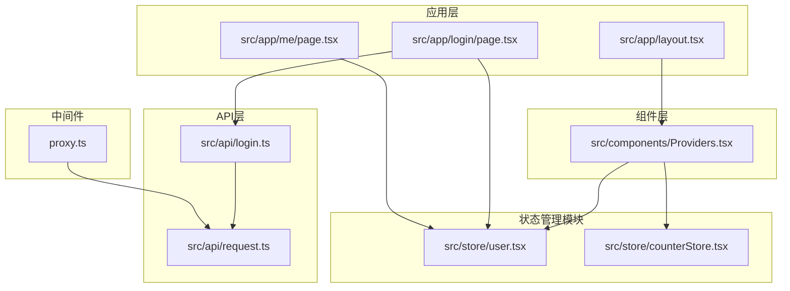

**图表来源**
- [src/store/user.tsx:1-56](file://src/store/user.tsx#L1-L56)
- [src/components/Providers.tsx:1-20](file://src/components/Providers.tsx#L1-L20)
- [src/app/login/page.tsx:1-119](file://src/app/login/page.tsx#L1-L119)

**章节来源**
- [src/store/user.tsx:1-56](file://src/store/user.tsx#L1-L56)
- [src/components/Providers.tsx:1-20](file://src/components/Providers.tsx#L1-L20)
- [src/app/layout.tsx:1-44](file://src/app/layout.tsx#L1-L44)

## 核心组件

### 用户状态存储设计

系统采用工厂函数模式创建用户状态存储，提供了高度可配置的状态管理能力：

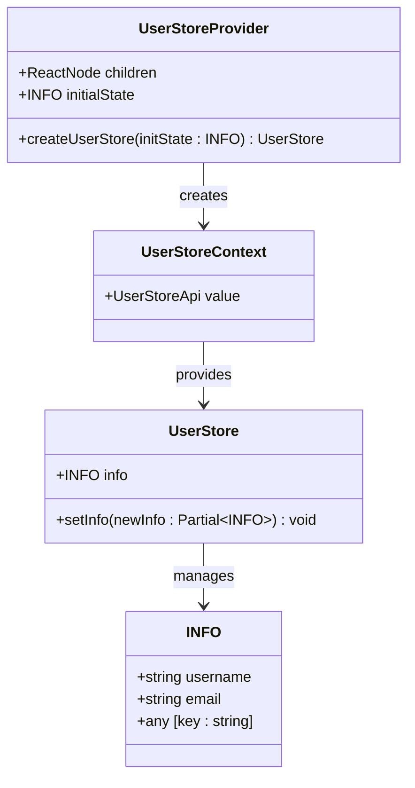

**图表来源**
- [src/store/user.tsx:7-25](file://src/store/user.tsx#L7-L25)
- [src/store/user.tsx:29-46](file://src/store/user.tsx#L29-L46)

### 状态结构定义

用户状态采用简洁的数据结构设计：

| 字段名 | 类型 | 描述 | 必填 |
|--------|------|------|------|
| info | INFO \| null | 用户信息对象，包含用户名和邮箱等属性 | 否 |
| setInfo | Function | 更新用户信息的方法 | 是 |

INFO接口支持动态扩展，允许添加任意额外的用户属性。

**章节来源**
- [src/store/user.tsx:7-16](file://src/store/user.tsx#L7-L16)
- [src/store/user.tsx:18-25](file://src/store/user.tsx#L18-L25)

## 架构概览

系统采用分层架构设计，确保各层职责清晰分离：

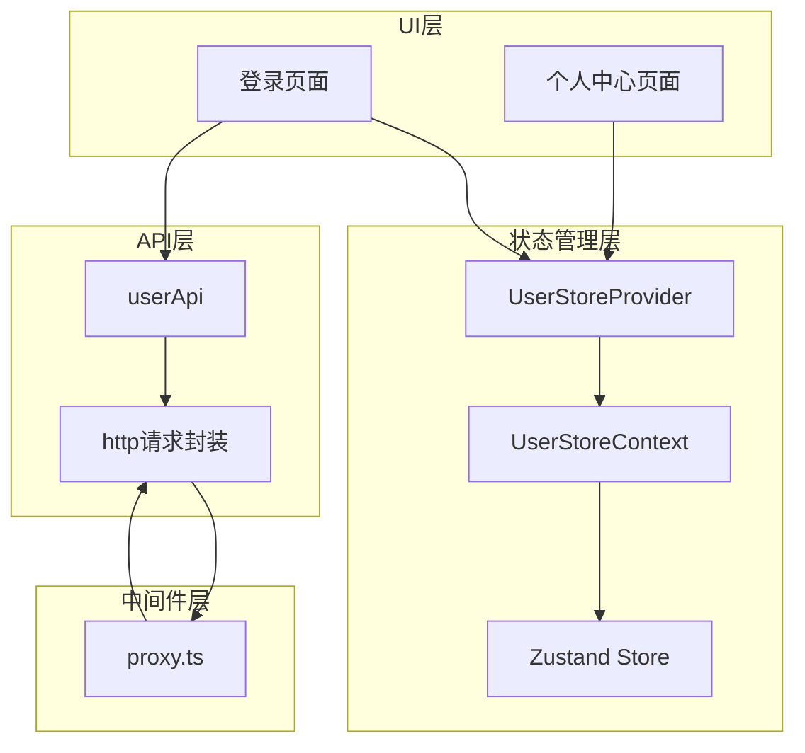

**图表来源**
- [src/app/login/page.tsx:8](file://src/app/login/page.tsx#L8)
- [src/components/Providers.tsx:5-6](file://src/components/Providers.tsx#L5-L6)
- [src/api/login.ts:37-60](file://src/api/login.ts#L37-L60)

## 详细组件分析

### 用户状态存储实现

#### 工厂函数模式

系统采用工厂函数模式创建独立的状态存储实例，每个实例都是完全隔离的：

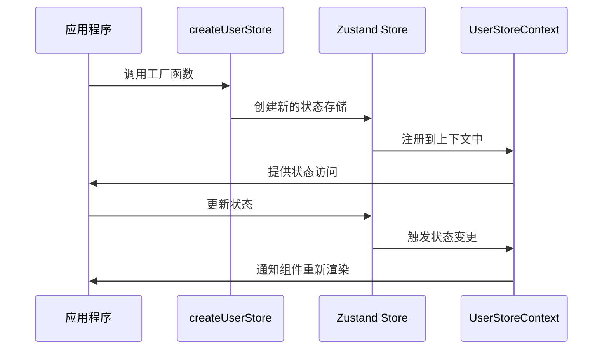

**图表来源**
- [src/store/user.tsx:18-25](file://src/store/user.tsx#L18-L25)
- [src/store/user.tsx:36-46](file://src/store/user.tsx#L36-L46)

#### 状态更新机制

状态更新采用不可变更新模式，确保状态的一致性和可预测性：

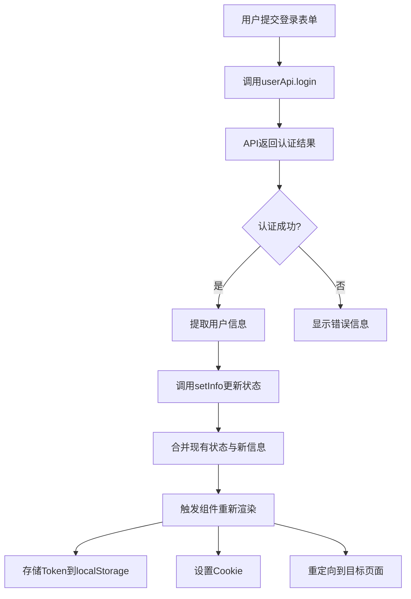

**图表来源**
- [src/app/login/page.tsx:20-58](file://src/app/login/page.tsx#L20-L58)
- [src/store/user.tsx:21-23](file://src/store/user.tsx#L21-L23)

**章节来源**
- [src/store/user.tsx:18-56](file://src/store/user.tsx#L18-L56)
- [src/app/login/page.tsx:20-58](file://src/app/login/page.tsx#L20-L58)

### 认证状态管理

#### Token管理策略

系统实现了客户端和服务器端的Token同步机制：

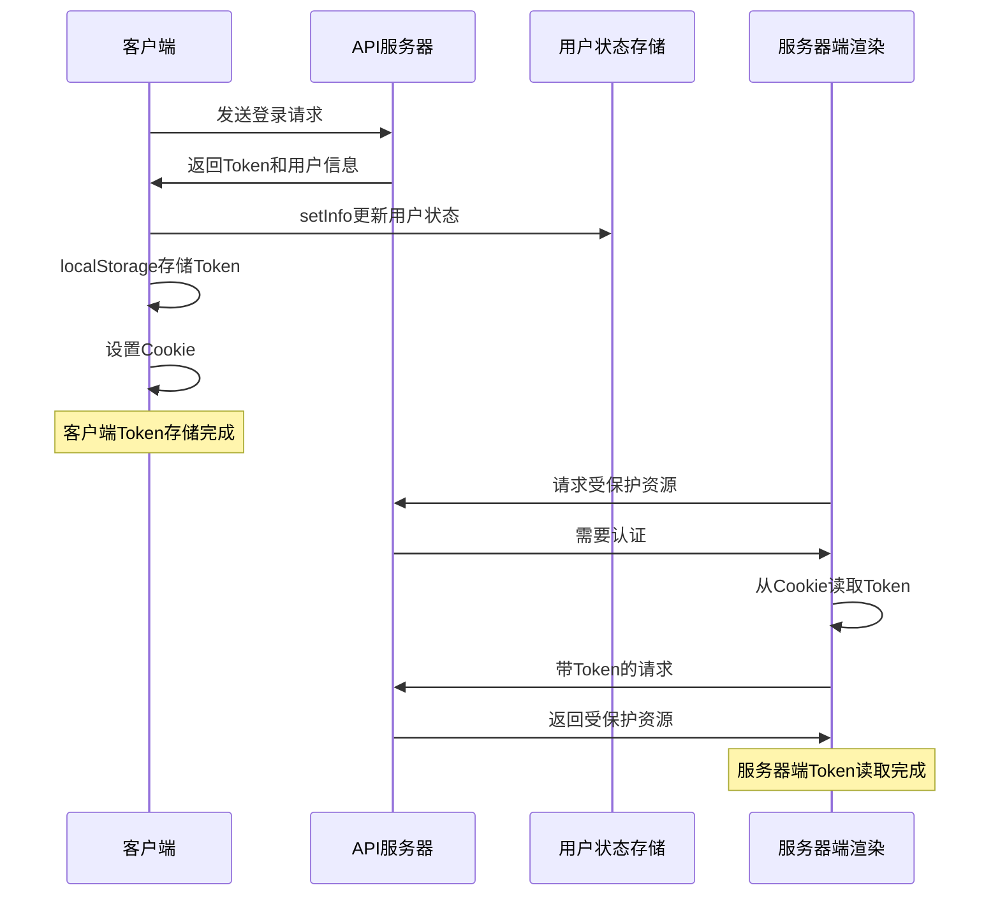

**图表来源**
- [src/app/login/page.tsx:32-36](file://src/app/login/page.tsx#L32-L36)
- [src/api/request.ts:94-112](file://src/api/request.ts#L94-L112)

#### 登录状态维护

登录状态的维护贯穿整个应用生命周期：

| 维护阶段 | 客户端操作 | 服务器端操作 | 状态检查 |
|----------|------------|--------------|----------|
| 登录成功 | localStorage存储Token | 设置Cookie | 无Token → 有Token |
| 页面刷新 | 从localStorage读取Token | 从Cookie读取Token | Token存在 |
| 服务器渲染 | 从Cookie读取Token | 从Cookie读取Token | Token存在 |
| 会话过期 | 清除localStorage和Cookie | 清除Cookie | 有Token → 无Token |
| 退出登录 | 清除localStorage和Cookie | 清除Cookie | 有Token → 无Token |

**章节来源**
- [src/app/login/page.tsx:32-36](file://src/app/login/page.tsx#L32-L36)
- [src/app/me/page.tsx:10-17](file://src/app/me/page.tsx#L10-L17)
- [src/api/request.ts:94-112](file://src/api/request.ts#L94-L112)

### 用户信息存储

#### 数据持久化策略

系统采用了多层次的数据持久化方案：

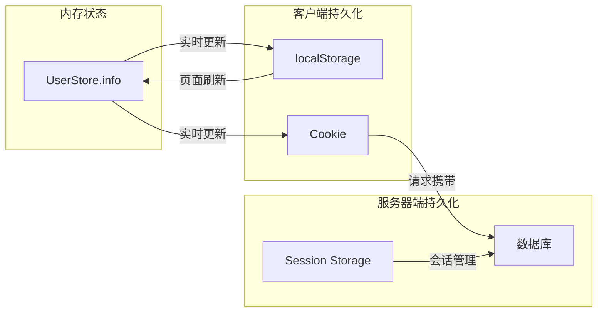

**图表来源**
- [src/store/user.tsx:21-23](file://src/store/user.tsx#L21-L23)
- [src/app/login/page.tsx:32-36](file://src/app/login/page.tsx#L32-L36)

#### 状态同步策略

状态同步采用事件驱动的方式，确保各层状态的一致性：

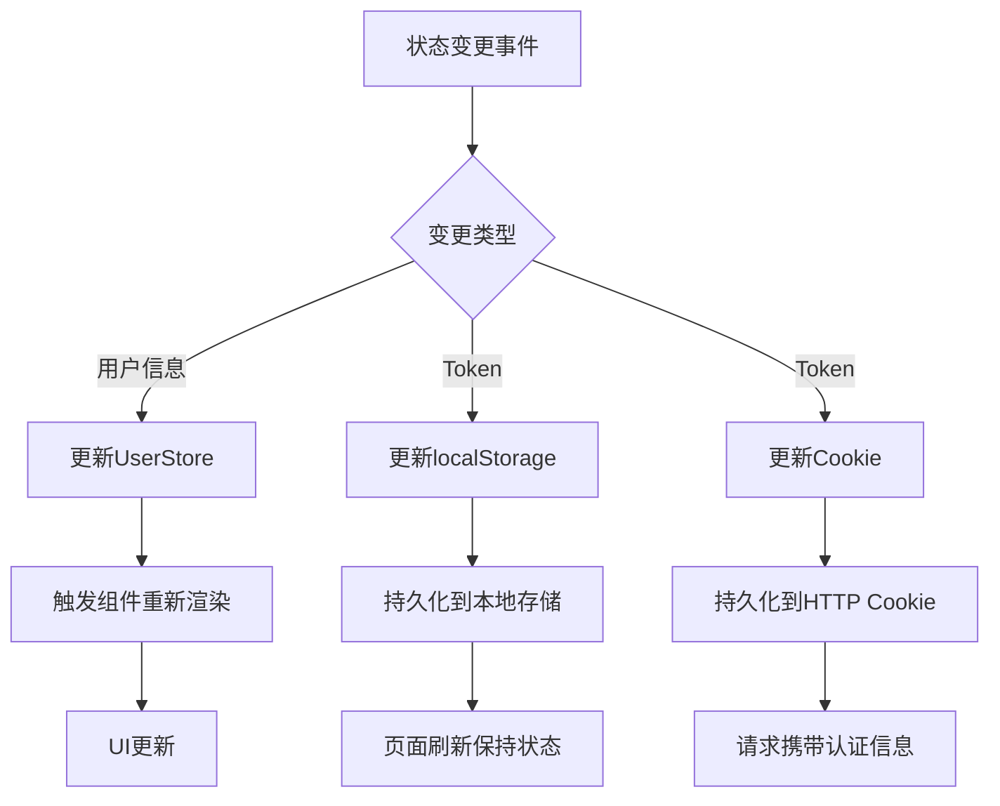

**章节来源**
- [src/store/user.tsx:21-23](file://src/store/user.tsx#L21-L23)
- [src/app/login/page.tsx:32-36](file://src/app/login/page.tsx#L32-L36)

### API集成

#### 用户认证API

系统提供了完整的用户认证API接口：

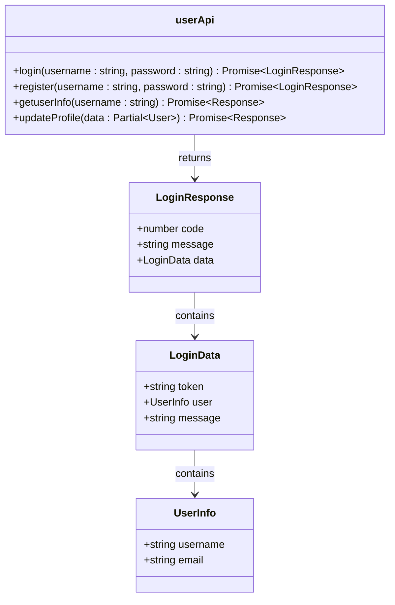

**图表来源**
- [src/api/login.ts:37-60](file://src/api/login.ts#L37-L60)
- [src/api/login.ts:16-27](file://src/api/login.ts#L16-L27)

#### 请求封装机制

HTTP请求封装提供了统一的错误处理和拦截器机制：

**章节来源**
- [src/api/login.ts:37-60](file://src/api/login.ts#L37-L60)
- [src/api/request.ts:57-235](file://src/api/request.ts#L57-L235)

## 依赖关系分析

### 核心依赖

系统的主要依赖关系如下：

```mermaid
graph TB
subgraph "运行时依赖"
A[zustand@^5.0.12]
B[next@16.2.0]
C[react@19.2.4]
end
subgraph "UI组件库"
D[@heroui/react@^3.0.1]
E[lucide-react@^1.7.0]
end
subgraph "开发依赖"
F[typescript@^5]
G[eslint@^9]
H[tailwindcss@^4]
end
A --> C
B --> C
D --> A
E --> C
```

**图表来源**
- [package.json:11-26](file://package.json#L11-L26)

### 组件依赖图

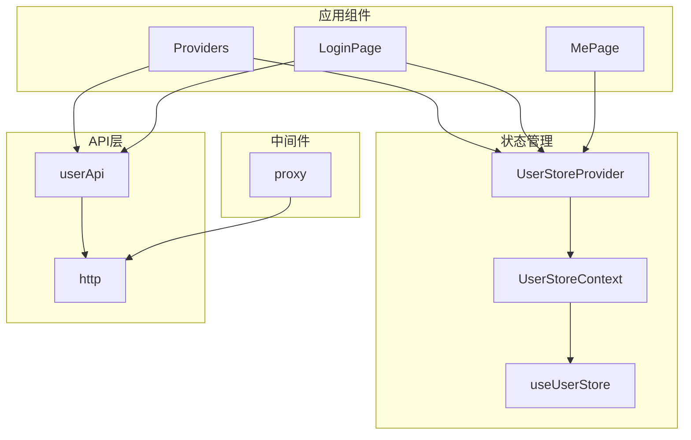

**图表来源**
- [src/components/Providers.tsx:5-6](file://src/components/Providers.tsx#L5-L6)
- [src/app/login/page.tsx:6-8](file://src/app/login/page.tsx#L6-L8)

**章节来源**
- [package.json:11-39](file://package.json#L11-L39)
- [src/components/Providers.tsx:5-6](file://src/components/Providers.tsx#L5-L6)

## 性能考虑

### 状态更新优化

系统采用了多种性能优化策略：

1. **选择性订阅**: 使用`useStore`的selector参数，只订阅需要的状态片段
2. **状态合并**: 采用不可变更新模式，避免不必要的状态重建
3. **上下文优化**: 使用`useRef`确保Provider实例的稳定性

### 内存管理

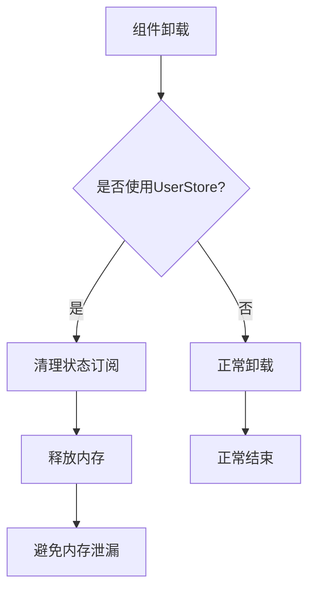

### 缓存策略

系统实现了多层次的缓存机制：

- **内存缓存**: Zustand状态存储
- **本地缓存**: localStorage和Cookie
- **服务器缓存**: SSR期间的缓存控制

## 故障排除指南

### 常见问题及解决方案

#### 1. 状态无法更新

**问题症状**: 用户登录后，页面显示未登录状态

**可能原因**:
- UserStoreProvider未正确包裹应用
- 状态更新函数调用错误
- Token存储位置不一致

**解决方案**:
- 确保在根布局中正确使用Providers组件
- 检查useUserStore的selector参数
- 统一Token存储方式

#### 2. 认证状态不同步

**问题症状**: 客户端和服务器端显示不同的认证状态

**可能原因**:
- Cookie设置不正确
- Token过期或格式错误
- 中间件配置问题

**解决方案**:
- 检查Cookie的domain和path设置
- 验证Token的有效性
- 确认中间件的匹配规则

#### 3. 状态丢失

**问题症状**: 页面刷新后用户状态丢失

**可能原因**:
- localStorage未正确设置
- Cookie过期
- 状态存储实例被重新创建

**解决方案**:
- 确保localStorage和Cookie同时设置
- 检查Cookie的过期时间
- 验证UserStoreProvider的实例稳定性

**章节来源**
- [src/store/user.tsx:48-56](file://src/store/user.tsx#L48-L56)
- [src/app/login/page.tsx:32-36](file://src/app/login/page.tsx#L32-L36)
- [proxy.ts:11-33](file://proxy.ts#L11-L33)

## 结论

本用户状态管理系统展现了现代React应用的最佳实践：

### 设计优势

1. **模块化设计**: 清晰的职责分离和可复用的组件
2. **类型安全**: 完整的TypeScript类型定义
3. **性能优化**: 高效的状态更新和内存管理
4. **兼容性强**: 同时支持CSR和SSR场景
5. **扩展性好**: 易于添加新的状态管理和认证功能

### 最佳实践建议

1. **状态管理**: 使用工厂函数模式创建独立的状态实例
2. **错误处理**: 实现统一的错误处理和重试机制
3. **安全性**: 确保Token的安全存储和传输
4. **性能监控**: 定期检查状态更新的性能影响
5. **测试覆盖**: 为关键状态逻辑编写单元测试

该系统为Next.js应用提供了坚实的状态管理基础，支持复杂的企业级应用场景，同时保持了良好的可维护性和扩展性。