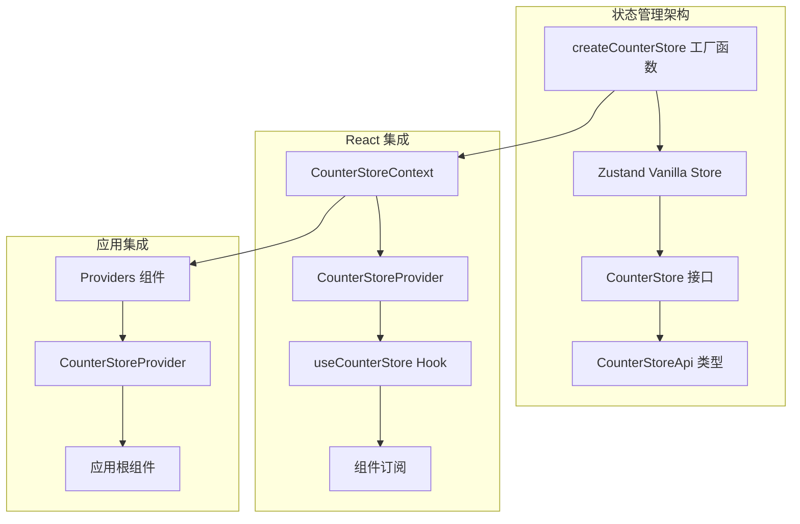
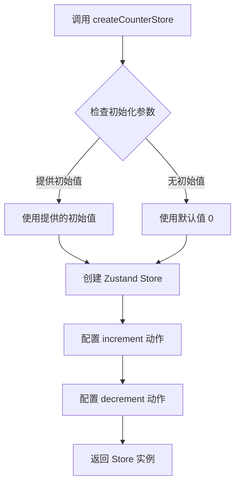
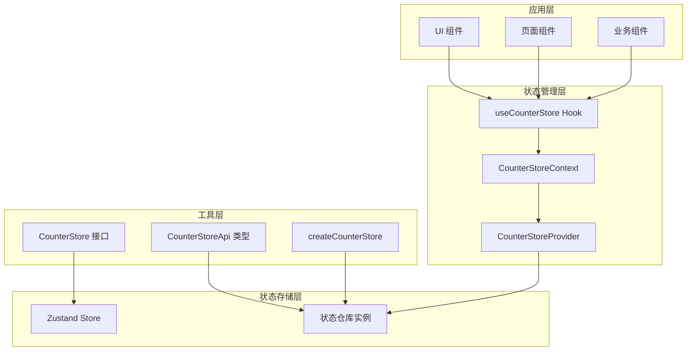
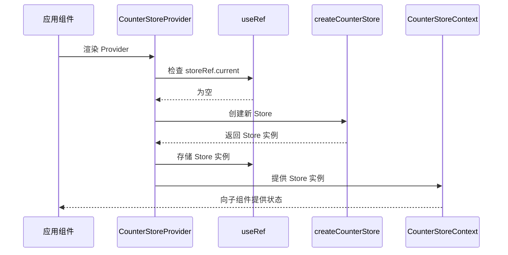
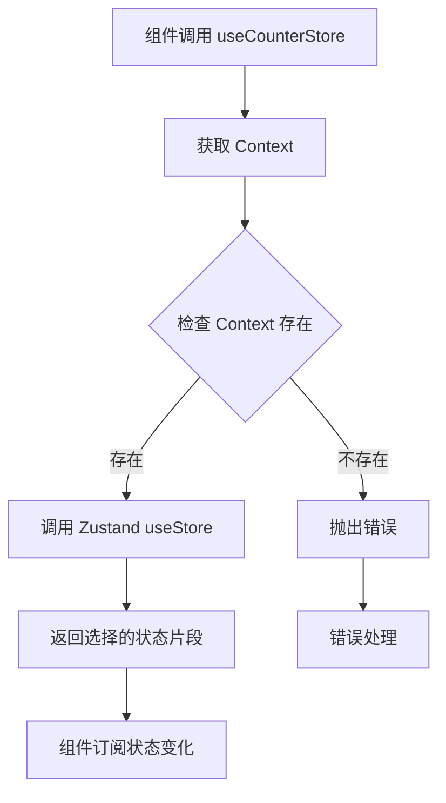
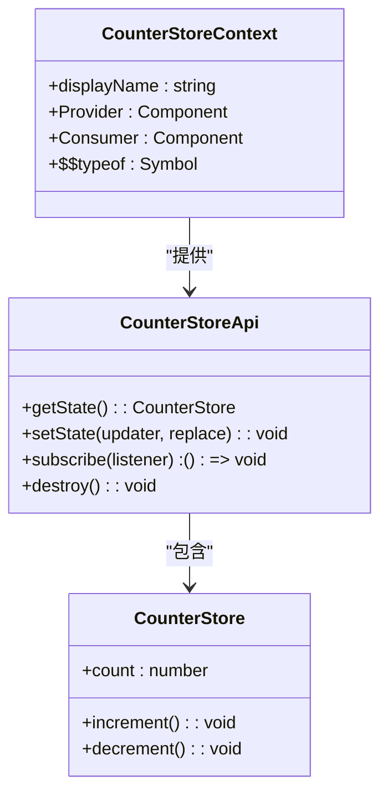
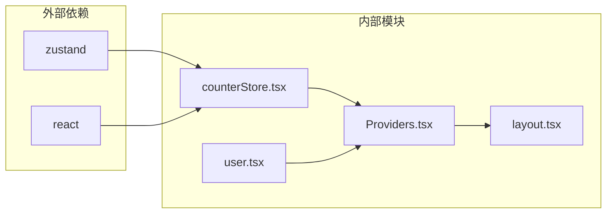
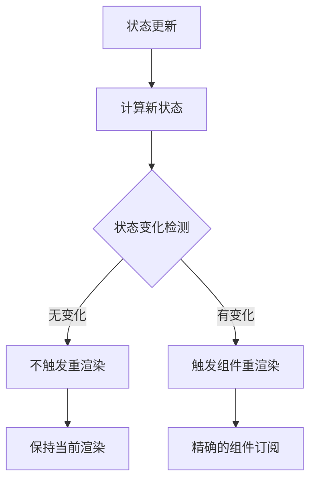

# 计数器状态管理

<cite>
**本文档引用的文件**
- [counterStore.tsx](file://src/store/counterStore.tsx)
- [Providers.tsx](file://src/components/Providers.tsx)
- [layout.tsx](file://src/app/layout.tsx)
- [user.tsx](file://src/store/user.tsx)
</cite>

## 目录
1. [简介](#简介)
2. [项目结构](#项目结构)
3. [核心组件](#核心组件)
4. [架构概览](#架构概览)
5. [详细组件分析](#详细组件分析)
6. [依赖分析](#依赖分析)
7. [性能考虑](#性能考虑)
8. [故障排除指南](#故障排除指南)
9. [结论](#结论)
10. [附录](#附录)

## 简介

本文档深入解析了基于 Zustand 的计数器状态管理系统，详细说明了 CounterStore 的设计模式、状态结构和 action 实现。该系统采用工厂函数模式创建独立的状态仓库，结合 React Context 提供全局状态访问，并通过自定义 Hook 实现组件订阅。

系统的核心优势在于：
- **单一职责**：每个状态仓库只管理特定领域的状态
- **类型安全**：完整的 TypeScript 类型定义确保编译时安全
- **性能优化**：精确的组件订阅机制避免不必要的重渲染
- **可扩展性**：模块化的架构便于添加新的状态域

## 项目结构

计数器状态管理位于 `src/store/counterStore.tsx` 文件中，采用标准的 Zustand 架构模式：



**图表来源**
- [counterStore.tsx:1-89](file://src/store/counterStore.tsx#L1-L89)
- [Providers.tsx:1-20](file://src/components/Providers.tsx#L1-L20)

**章节来源**
- [counterStore.tsx:1-89](file://src/store/counterStore.tsx#L1-L89)
- [Providers.tsx:1-20](file://src/components/Providers.tsx#L1-L20)

## 核心组件

### CounterStore 接口定义

CounterStore 接口定义了计数器状态的完整结构：

```typescript
export interface CounterStore {
  count: number;
  increment: () => void;
  decrement: () => void;
}
```

该接口包含：
- **状态属性**：`count` - 当前计数值
- **动作方法**：`increment()` - 增加计数
- **动作方法**：`decrement()` - 减少计数

### 状态工厂函数

`createCounterStore` 是核心的工厂函数，负责创建独立的状态仓库实例：



**图表来源**
- [counterStore.tsx:24-32](file://src/store/counterStore.tsx#L24-L32)

**章节来源**
- [counterStore.tsx:14-32](file://src/store/counterStore.tsx#L14-L32)

## 架构概览

系统采用分层架构设计，确保关注点分离和模块化：



**图表来源**
- [counterStore.tsx:36-88](file://src/store/counterStore.tsx#L36-L88)

### 设计模式分析

系统实现了以下设计模式：

1. **工厂模式**：`createCounterStore` 工厂函数创建独立的 Store 实例
2. **Provider 模式**：`CounterStoreProvider` 提供状态上下文
3. **Hook 模式**：`useCounterStore` 提供简洁的 API 接口
4. **Context 模式**：React Context 实现跨组件状态共享

## 详细组件分析

### CounterStoreProvider 组件

`CounterStoreProvider` 是状态管理系统的入口组件，负责：



**图表来源**
- [counterStore.tsx:53-71](file://src/store/counterStore.tsx#L53-L71)

#### 关键特性

1. **实例持久化**：使用 `useRef` 确保 Store 实例在组件重新渲染时不丢失
2. **惰性初始化**：只有在首次渲染时才创建 Store 实例
3. **类型安全**：完整的 TypeScript 类型定义

**章节来源**
- [counterStore.tsx:53-71](file://src/store/counterStore.tsx#L53-L71)

### useCounterStore 自定义 Hook

`useCounterStore` 是最常用的 API 接口，提供：



**图表来源**
- [counterStore.tsx:75-88](file://src/store/counterStore.tsx#L75-L88)

#### 使用模式

1. **状态选择**：`useCounterStore(state => state.count)`
2. **动作调用**：`useCounterStore(state => state.increment)`
3. **组合选择**：`useCounterStore(state => ({ count: state.count, increment: state.increment }))`

**章节来源**
- [counterStore.tsx:75-88](file://src/store/counterStore.tsx#L75-L88)

### CounterStoreContext 上下文

React Context 提供了跨组件的状态共享机制：



**图表来源**
- [counterStore.tsx:42-48](file://src/store/counterStore.tsx#L42-L48)

**章节来源**
- [counterStore.tsx:42-48](file://src/store/counterStore.tsx#L42-L48)

## 依赖分析

系统依赖关系清晰明确：



**图表来源**
- [counterStore.tsx:3-8](file://src/store/counterStore.tsx#L3-L8)
- [Providers.tsx:3-6](file://src/components/Providers.tsx#L3-L6)

### 外部依赖

1. **zustand**：核心状态管理库
2. **react**：React 核心库和 Hooks

### 内部依赖

1. **counterStore.tsx**：主要状态管理逻辑
2. **Providers.tsx**：应用级 Provider 组合
3. **layout.tsx**：应用布局集成
4. **user.tsx**：用户状态管理（对比参考）

**章节来源**
- [counterStore.tsx:3-8](file://src/store/counterStore.tsx#L3-L8)
- [Providers.tsx:3-6](file://src/components/Providers.tsx#L3-L6)

## 性能考虑

### 精确订阅机制

Zustand 的 `useStore` 实现了精确的组件订阅，只有当选择的状态发生变化时才会触发重渲染：



### 内存管理

1. **实例持久化**：`useRef` 确保存储实例不被销毁
2. **上下文清理**：React Context 自动处理组件卸载
3. **垃圾回收**：未使用的 Store 实例会被自动清理

### 最佳实践

1. **避免不必要的重渲染**：使用选择器函数只订阅需要的状态
2. **合理初始化**：根据应用需求设置合适的初始值
3. **类型安全**：充分利用 TypeScript 的类型推导能力

## 故障排除指南

### 常见问题及解决方案

#### 问题：`useCounterStore must be used within CounterStoreProvider`

**原因**：在没有 Provider 包裹的情况下使用了自定义 Hook

**解决方案**：
1. 确保应用根组件正确包装了 `CounterStoreProvider`
2. 检查 Providers 组件的导入和使用

#### 问题：状态不更新或更新异常

**原因**：可能使用了错误的更新方式或状态结构

**解决方案**：
1. 确认使用了正确的动作方法（`increment`/`decrement`）
2. 检查状态结构是否符合 CounterStore 接口定义

#### 问题：内存泄漏

**原因**：Store 实例未正确管理

**解决方案**：
1. 确保使用了 `useRef` 进行实例持久化
2. 避免在组件中重复创建新的 Store 实例

**章节来源**
- [counterStore.tsx:80-83](file://src/store/counterStore.tsx#L80-L83)

## 结论

计数器状态管理系统展现了现代前端状态管理的最佳实践：

1. **简洁性**：最小化的 API 表面，易于理解和使用
2. **性能**：精确的订阅机制确保最优的渲染性能
3. **类型安全**：完整的 TypeScript 支持提供编译时安全保障
4. **可扩展性**：模块化设计便于添加新的状态域和功能

该系统为复杂的前端应用提供了可靠的状态管理基础，其设计原则和实现模式可以作为其他状态管理方案的参考模板。

## 附录

### 使用示例

#### 基础使用

```typescript
// 获取计数值
const count = useCounterStore(state => state.count)

// 调用增加动作
const increment = useCounterStore(state => state.increment)

// 组合多个状态
const { count, increment, decrement } = useCounterStore(state => ({
  count: state.count,
  increment: state.increment,
  decrement: state.decrement
}))
```

#### 高级用法

```typescript
// 使用选择器进行复杂状态操作
const derivedState = useCounterStore(state => ({
  count: state.count,
  isPositive: state.count > 0,
  isEven: state.count % 2 === 0
}))

// 在 effects 中使用
useEffect(() => {
  if (count > 10) {
    // 执行某些逻辑
  }
}, [count])
```

### 状态持久化建议

虽然当前实现未包含持久化功能，但可以轻松扩展：

1. **本地存储集成**：在初始化时从 localStorage 读取状态
2. **服务器同步**：在状态变化时同步到服务器
3. **快照机制**：实现状态的快照和恢复功能

### 性能优化技巧

1. **选择器优化**：使用稳定的引用避免不必要的重渲染
2. **批量更新**：对于频繁的状态更新考虑批处理策略
3. **缓存策略**：对计算结果进行缓存以减少重复计算