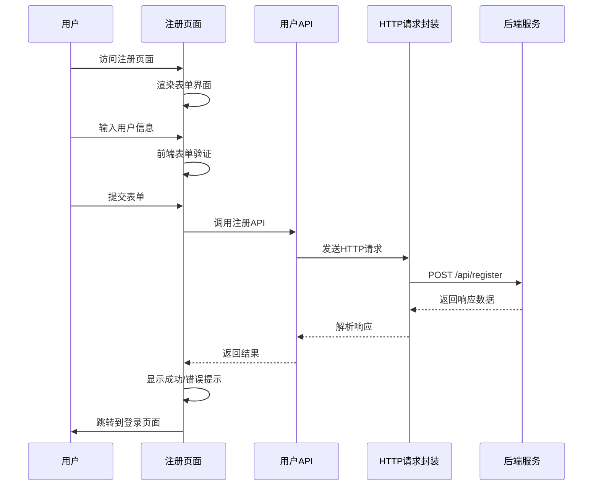
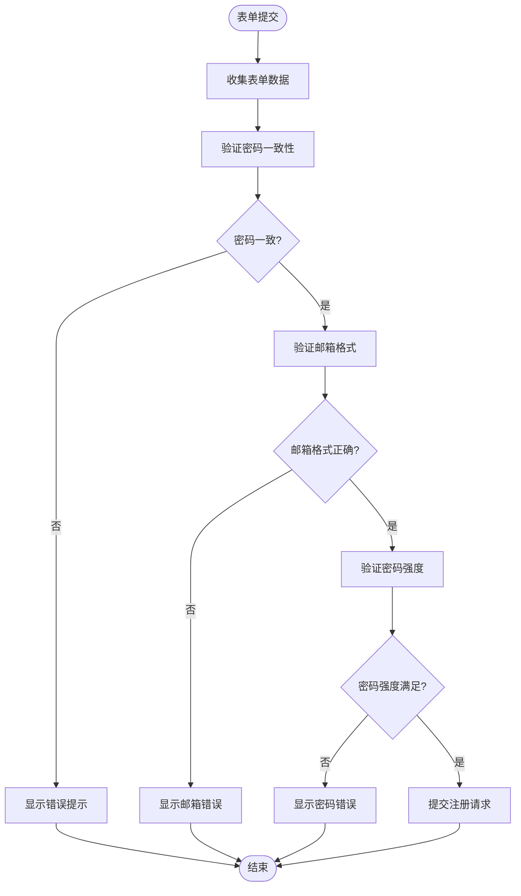
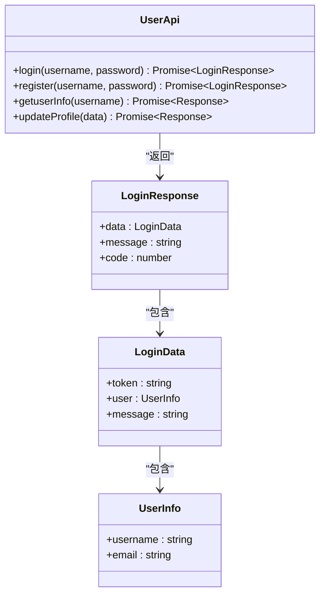
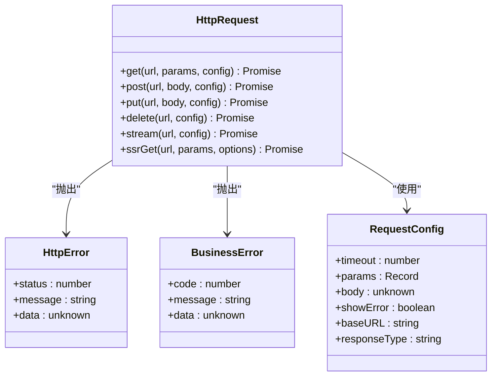
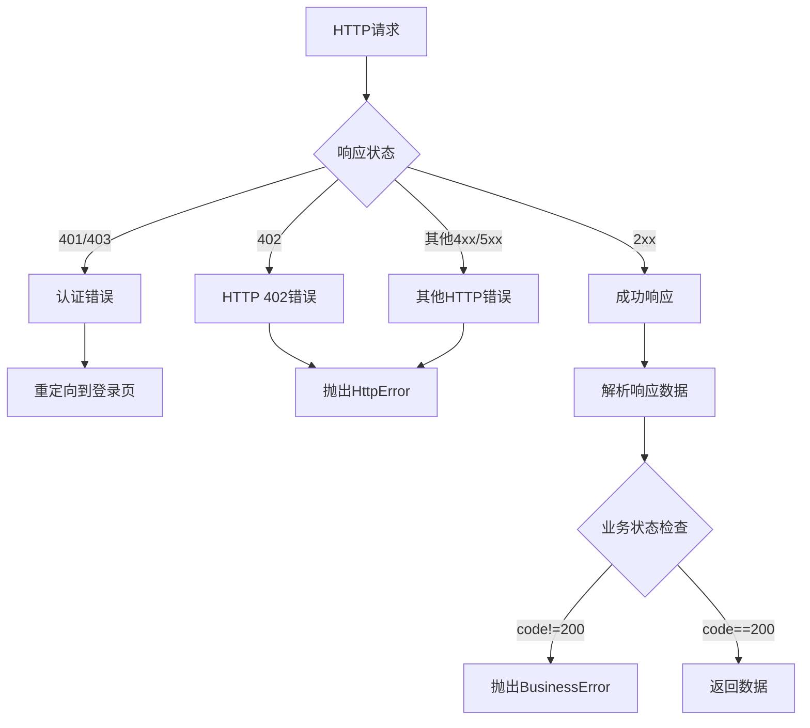
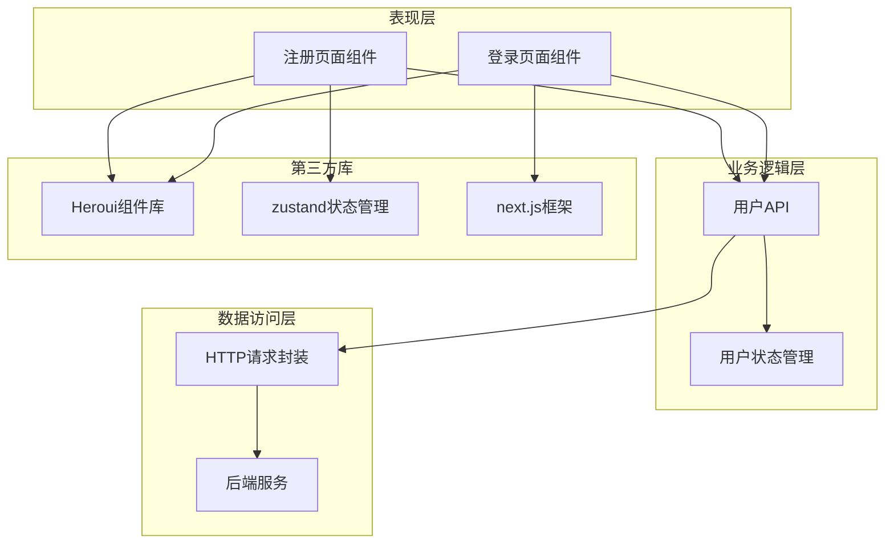

# 注册功能

<cite>
**本文档引用的文件**
- [src/app/register/page.tsx](file://src/app/register/page.tsx)
- [src/app/register/login.css](file://src/app/register/login.css)
- [src/app/login/page.tsx](file://src/app/login/page.tsx)
- [src/app/login/login.css](file://src/app/login/login.css)
- [src/api/login.ts](file://src/api/login.ts)
- [src/api/request.ts](file://src/api/request.ts)
- [src/store/user.tsx](file://src/store/user.tsx)
- [package.json](file://package.json)
</cite>

## 目录
1. [简介](#简介)
2. [项目结构](#项目结构)
3. [核心组件](#核心组件)
4. [架构概览](#架构概览)
5. [详细组件分析](#详细组件分析)
6. [依赖关系分析](#依赖关系分析)
7. [性能考虑](#性能考虑)
8. [故障排除指南](#故障排除指南)
9. [结论](#结论)

## 简介

本文件详细说明了用户注册功能的实现，包括注册页面的实现细节、表单验证规则、数据提交流程以及注册API的设计模式。该系统采用React + Next.js技术栈，使用Heroui组件库构建用户界面，并通过自定义HTTP请求封装层实现前后端通信。

## 项目结构

注册功能涉及以下关键文件和目录：

```mermaid
graph TB
subgraph "前端应用结构"
A[src/app/register/] --> A1[page.tsx]
A --> A2[login.css]
B[src/app/login/] --> B1[page.tsx]
B --> B2[login.css]
C[src/api/] --> C1[login.ts]
C --> C2[request.ts]
D[src/store/] --> D1[user.tsx]
end
subgraph "依赖库"
E[@heroui/react]
F[zustand]
G[next]
end
A1 --> C1
C1 --> C2
A1 --> E
D1 --> F
A1 --> G
```

**图表来源**
- [src/app/register/page.tsx:1-145](file://src/app/register/page.tsx#L1-L145)
- [src/api/login.ts:1-81](file://src/api/login.ts#L1-L81)
- [src/api/request.ts:1-455](file://src/api/request.ts#L1-L455)

**章节来源**
- [src/app/register/page.tsx:1-145](file://src/app/register/page.tsx#L1-L145)
- [src/app/login/page.tsx:1-119](file://src/app/login/page.tsx#L1-L119)
- [src/api/login.ts:1-81](file://src/api/login.ts#L1-L81)

## 核心组件

### 注册页面组件

注册页面采用函数式组件设计，使用React Hooks进行状态管理。主要特性包括：

- **表单状态管理**：使用useState钩子管理密码显示状态和密码值
- **表单数据收集**：通过FormData API收集用户输入
- **实时验证**：集成Heroui组件的验证机制
- **错误处理**：统一的错误提示和状态反馈

### API接口层

用户API接口层提供了标准化的HTTP请求封装：

- **userApi对象**：包含登录和注册等用户相关操作
- **类型安全**：使用TypeScript接口定义响应数据结构
- **错误处理**：统一的HTTP错误和业务错误处理机制

### 请求封装层

自定义HTTP请求封装提供了完整的网络请求解决方案：

- **环境适配**：自动区分客户端和服务器端环境
- **Token管理**：自动处理认证令牌的存储和传递
- **错误处理**：统一的错误类型和处理策略
- **拦截器支持**：支持请求和响应拦截器

**章节来源**
- [src/app/register/page.tsx:9-43](file://src/app/register/page.tsx#L9-L43)
- [src/api/login.ts:37-60](file://src/api/login.ts#L37-L60)
- [src/api/request.ts:57-235](file://src/api/request.ts#L57-L235)

## 架构概览

注册功能的整体架构采用分层设计，确保代码的可维护性和扩展性：



**图表来源**
- [src/app/register/page.tsx:13-43](file://src/app/register/page.tsx#L13-L43)
- [src/api/login.ts:57-59](file://src/api/login.ts#L57-L59)
- [src/api/request.ts:148-213](file://src/api/request.ts#L148-L213)

## 详细组件分析

### 注册页面实现

注册页面组件实现了完整的用户注册流程：

#### 表单验证逻辑

页面集成了多层次的表单验证机制：



**图表来源**
- [src/app/register/page.tsx:22-27](file://src/app/register/page.tsx#L22-L27)
- [src/app/register/page.tsx:55-61](file://src/app/register/page.tsx#L55-L61)
- [src/app/register/page.tsx:74-86](file://src/app/register/page.tsx#L74-L86)

#### 数据提交流程

注册数据的提交采用异步处理方式：

1. **表单数据收集**：使用FormData API收集用户输入
2. **前端验证**：执行密码一致性检查
3. **API调用**：通过userApi.register发送请求
4. **响应处理**：根据响应状态进行相应处理

#### 密码强度验证

密码验证规则包括：
- 最小长度8位
- 必须包含大写字母
- 必须包含数字
- 与确认密码保持一致

**章节来源**
- [src/app/register/page.tsx:13-43](file://src/app/register/page.tsx#L13-L43)
- [src/app/register/page.tsx:55-121](file://src/app/register/page.tsx#L55-L121)

### API设计模式

#### 用户API接口

用户API接口采用模块化设计，提供清晰的接口定义：



**图表来源**
- [src/api/login.ts:37-60](file://src/api/login.ts#L37-L60)
- [src/api/login.ts:16-27](file://src/api/login.ts#L16-L27)

#### HTTP请求封装

HTTP请求封装提供了完整的网络通信解决方案：



**图表来源**
- [src/api/request.ts:265-346](file://src/api/request.ts#L265-L346)
- [src/api/request.ts:240-261](file://src/api/request.ts#L240-L261)

**章节来源**
- [src/api/login.ts:37-60](file://src/api/login.ts#L37-L60)
- [src/api/request.ts:57-235](file://src/api/request.ts#L57-L235)

### 错误处理机制

系统实现了多层次的错误处理机制：

#### HTTP错误处理

HTTP错误处理遵循统一的错误类型体系：



**图表来源**
- [src/api/request.ts:157-187](file://src/api/request.ts#L157-L187)
- [src/api/request.ts:213-235](file://src/api/request.ts#L213-L235)

#### 前端错误处理

前端组件实现了友好的错误提示机制：

**章节来源**
- [src/api/request.ts:157-187](file://src/api/request.ts#L157-L187)
- [src/app/register/page.tsx:36-42](file://src/app/register/page.tsx#L36-L42)

## 依赖关系分析

注册功能的依赖关系体现了清晰的分层架构：



**图表来源**
- [src/app/register/page.tsx:5-8](file://src/app/register/page.tsx#L5-L8)
- [src/api/login.ts:6](file://src/api/login.ts#L6)
- [src/api/request.ts:40-47](file://src/api/request.ts#L40-L47)

**章节来源**
- [package.json:11-26](file://package.json#L11-L26)
- [src/app/register/page.tsx:5-8](file://src/app/register/page.tsx#L5-L8)

## 性能考虑

### 前端性能优化

1. **组件懒加载**：使用React.lazy和Suspense实现组件按需加载
2. **状态管理优化**：采用zustand提供轻量级状态管理
3. **渲染优化**：合理使用React.memo和useMemo避免不必要的重渲染

### 网络性能优化

1. **请求缓存**：支持HTTP缓存头和Next.js内置缓存机制
2. **超时控制**：默认10秒超时，可根据需求调整
3. **连接复用**：利用HTTP/1.1连接池减少连接建立开销

### 安全性能

1. **CSRF防护**：通过同源策略和CORS配置提供基本防护
2. **XSS防护**：前端渲染时自动转义HTML内容
3. **密码传输**：使用HTTPS加密传输敏感信息

## 故障排除指南

### 常见问题及解决方案

#### 注册失败问题

**问题描述**：用户注册后无法正常完成注册流程

**可能原因**：
1. 后端服务不可用或响应超时
2. 网络连接异常
3. 前端JavaScript错误

**解决步骤**：
1. 检查网络连接状态
2. 查看浏览器开发者工具中的网络面板
3. 确认后端服务运行状态
4. 检查控制台是否有JavaScript错误

#### 表单验证错误

**问题描述**：表单提交时出现验证错误提示

**常见验证错误**：
1. 邮箱格式不正确
2. 密码长度不足
3. 密码强度不够
4. 两次输入的密码不一致

**解决方法**：
1. 检查邮箱格式是否符合标准
2. 确保密码至少8位字符
3. 包含大写字母和数字
4. 确认两次输入的密码完全一致

#### 认证错误处理

**问题描述**：收到认证相关的错误提示

**错误类型及处理**：
1. **HTTP 402错误**：账号密码错误，检查用户名和密码
2. **401/403错误**：认证失效，重新登录
3. **网络错误**：检查网络连接和服务器状态

**章节来源**
- [src/app/register/page.tsx:36-42](file://src/app/register/page.tsx#L36-L42)
- [src/api/request.ts:174-180](file://src/api/request.ts#L174-L180)

## 结论

注册功能实现了完整的用户注册流程，具有以下特点：

1. **用户体验友好**：提供实时表单验证和友好的错误提示
2. **安全性保障**：采用多层验证和错误处理机制
3. **可维护性强**：采用分层架构和模块化设计
4. **扩展性良好**：支持拦截器和自定义配置

该实现为后续的功能扩展和维护奠定了良好的基础，建议在生产环境中进一步完善日志记录、监控告警和安全审计等功能。