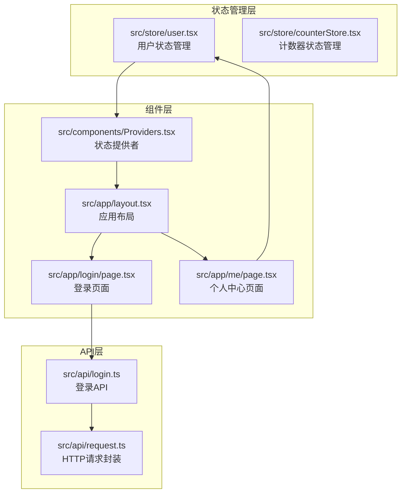
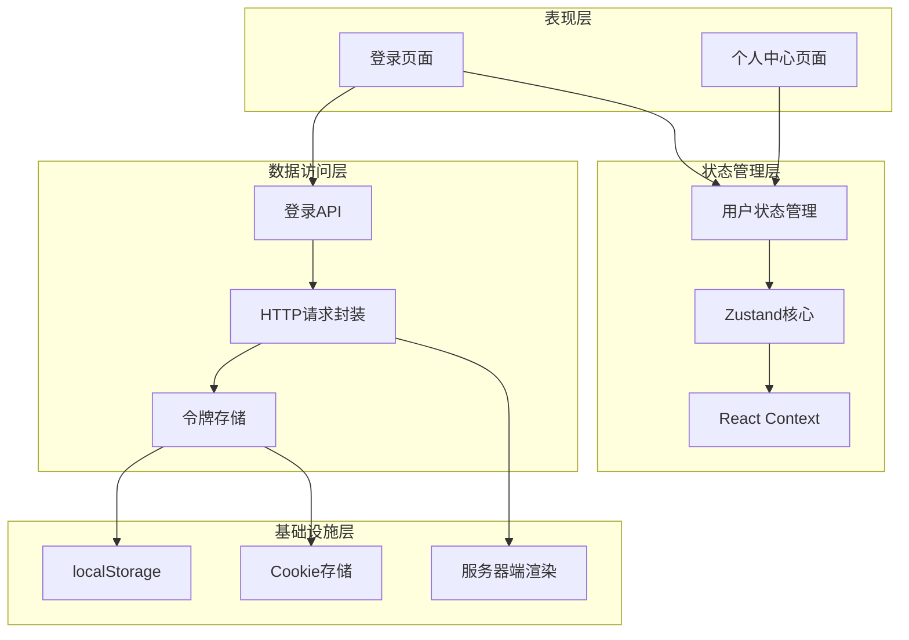
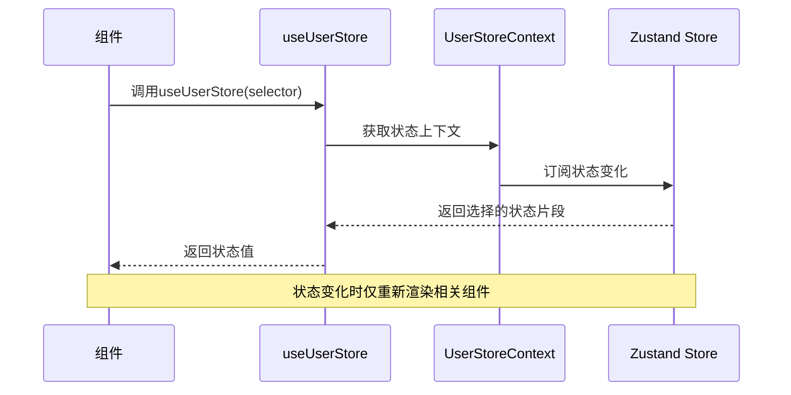
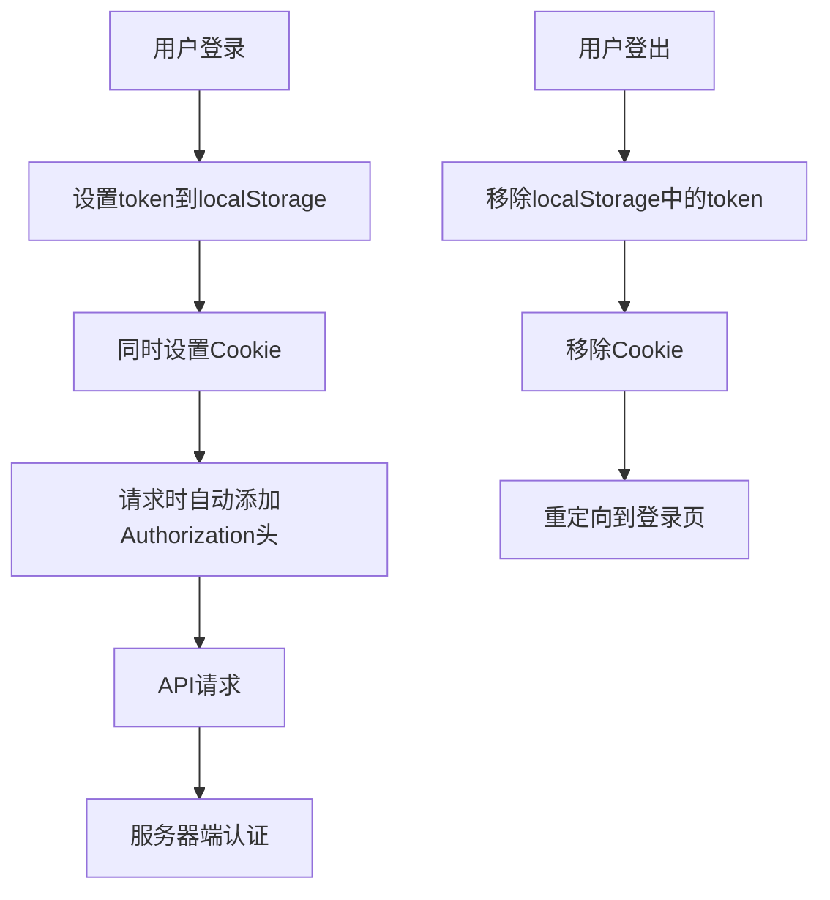
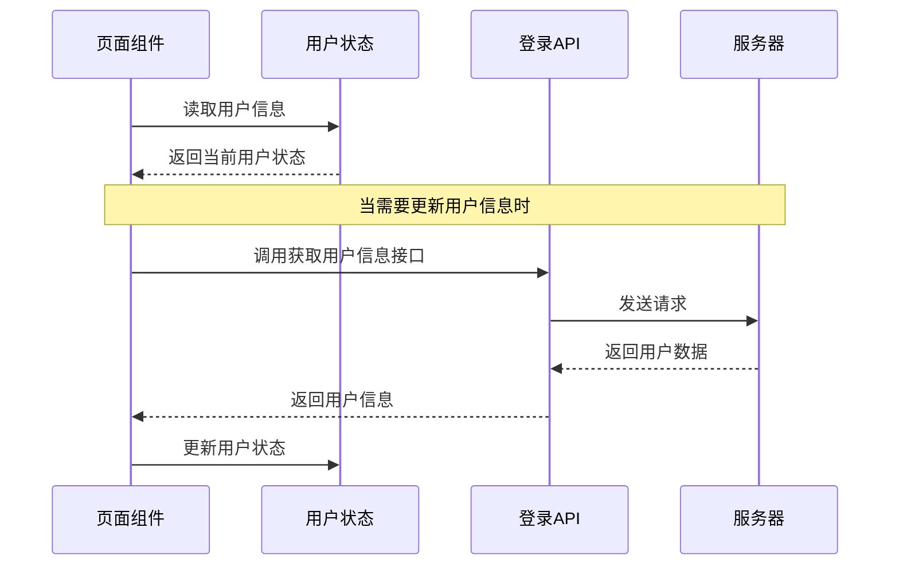
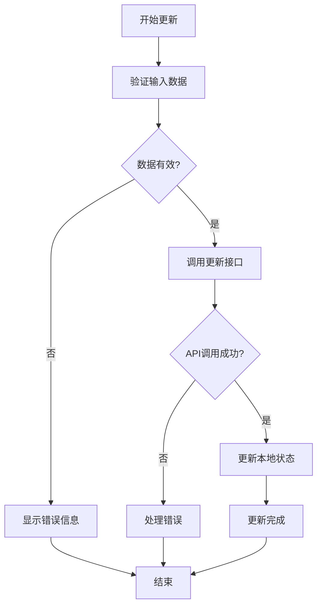
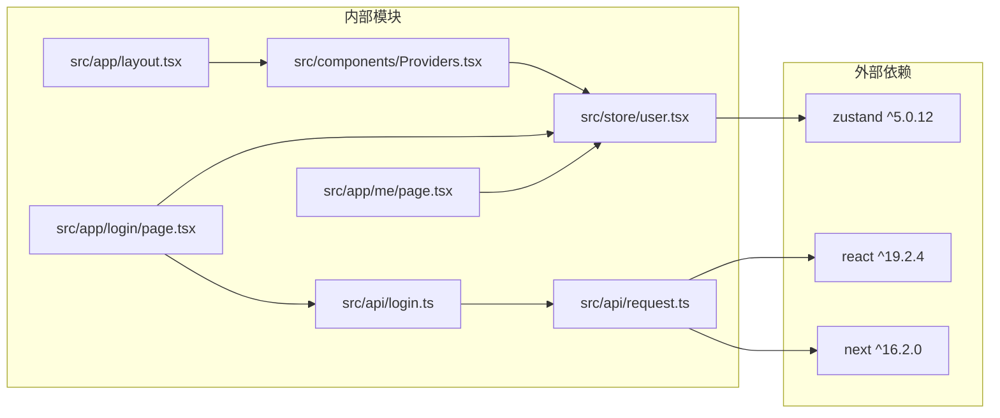

# 用户状态管理系统

<cite>
**本文档引用的文件**
- [src/store/user.tsx](file://src/store/user.tsx)
- [src/components/Providers.tsx](file://src/components/Providers.tsx)
- [src/app/layout.tsx](file://src/app/layout.tsx)
- [src/app/login/page.tsx](file://src/app/login/page.tsx)
- [src/app/me/page.tsx](file://src/app/me/page.tsx)
- [src/api/login.ts](file://src/api/login.ts)
- [src/api/request.ts](file://src/api/request.ts)
- [src/store/counterStore.tsx](file://src/store/counterStore.tsx)
- [package.json](file://package.json)
</cite>

## 目录
1. [简介](#简介)
2. [项目结构](#项目结构)
3. [核心组件](#核心组件)
4. [架构概览](#架构概览)
5. [详细组件分析](#详细组件分析)
6. [依赖关系分析](#依赖关系分析)
7. [性能考虑](#性能考虑)
8. [故障排除指南](#故障排除指南)
9. [最佳实践](#最佳实践)
10. [结论](#结论)

## 简介

本项目采用现代化的React状态管理模式，基于Zustand实现用户状态管理。系统通过客户端本地存储（localStorage）与服务器端会话管理相结合的方式，实现了完整的用户认证和状态同步机制。该系统支持客户端渲染（CSR）和服务器端渲染（SSR）两种模式，确保在不同环境下都能提供一致的用户体验。

## 项目结构

项目采用按功能模块组织的结构，用户状态管理相关的文件分布如下：

**图表来源**
- [src/store/user.tsx:1-56](file://src/store/user.tsx#L1-L56)
- [src/components/Providers.tsx:1-20](file://src/components/Providers.tsx#L1-L20)
- [src/app/layout.tsx:1-44](file://src/app/layout.tsx#L1-L44)

**章节来源**
- [src/store/user.tsx:1-56](file://src/store/user.tsx#L1-L56)
- [src/components/Providers.tsx:1-20](file://src/components/Providers.tsx#L1-L20)
- [src/app/layout.tsx:1-44](file://src/app/layout.tsx#L1-L44)

## 核心组件

### 用户状态存储机制

系统采用Zustand作为状态管理库，实现了轻量级但功能强大的状态存储机制。核心组件包括：

- **UserStore接口**：定义用户状态的数据结构和操作方法
- **createUserStore工厂函数**：创建独立的用户状态实例
- **UserStoreProvider**：提供状态上下文，支持客户端组件访问
- **useUserStore自定义Hook**：简化状态订阅和更新操作

### 状态更新策略

系统实现了多种状态更新策略以适应不同的使用场景：

1. **增量更新**：通过`setInfo`方法实现部分字段更新
2. **完全替换**：当需要清空现有状态时进行完全替换
3. **条件更新**：根据现有状态是否存在决定更新策略

**章节来源**
- [src/store/user.tsx:13-25](file://src/store/user.tsx#L13-L25)
- [src/store/user.tsx:48-56](file://src/store/user.tsx#L48-L56)

## 架构概览

系统采用分层架构设计，确保各层职责清晰分离：

**图表来源**
- [src/app/login/page.tsx:14-58](file://src/app/login/page.tsx#L14-L58)
- [src/app/me/page.tsx:6-17](file://src/app/me/page.tsx#L6-L17)
- [src/api/request.ts:94-112](file://src/api/request.ts#L94-L112)

## 详细组件分析

### useUserStore实现原理

`useUserStore`是系统的核心状态管理钩子，实现了以下关键功能：

#### 状态选择器模式

**图表来源**
- [src/store/user.tsx:48-56](file://src/store/user.tsx#L48-L56)

#### 状态同步机制
系统通过以下机制确保状态同步：

1. **上下文传播**：通过React Context在组件树中传播状态
2. **精确订阅**：使用选择器模式只订阅必要的状态片段
3. **自动重渲染**：状态变化时自动触发相关组件重渲染

**章节来源**
- [src/store/user.tsx:29-46](file://src/store/user.tsx#L29-L46)
- [src/store/user.tsx:48-56](file://src/store/user.tsx#L48-L56)

### 数据持久化方案

系统实现了多层次的数据持久化策略：

#### 客户端本地存储

**图表来源**
- [src/app/login/page.tsx:33-36](file://src/app/login/page.tsx#L33-L36)
- [src/app/me/page.tsx:11-14](file://src/app/me/page.tsx#L11-L14)
- [src/api/request.ts:94-112](file://src/api/request.ts#L94-L112)

#### 服务器端会话管理
系统通过以下方式处理服务器端会话：

1. **SSR环境处理**：在服务端环境中从Cookie读取token
2. **动态导入**：避免在客户端模块中直接导入服务器特定API
3. **统一认证流程**：确保客户端和服务器端使用相同的认证逻辑

**章节来源**
- [src/api/request.ts:100-112](file://src/api/request.ts#L100-L112)
- [src/app/login/page.tsx:35-36](file://src/app/login/page.tsx#L35-L36)

### 用户信息操作

系统提供了完整的用户信息操作接口：

#### 获取用户信息

#### 更新用户信息

#### 删除和清理操作
系统提供了完整的用户数据清理机制：

1. **本地清理**：移除localStorage中的token
2. **会话清理**：清除服务器端会话
3. **状态重置**：重置用户状态为初始状态
4. **导航重定向**：重定向到登录页面

**章节来源**
- [src/app/me/page.tsx:10-17](file://src/app/me/page.tsx#L10-L17)
- [src/api/request.ts:164-173](file://src/api/request.ts#L164-L173)

## 依赖关系分析

系统采用模块化设计，各组件之间的依赖关系清晰明确：

**图表来源**
- [package.json:11-26](file://package.json#L11-L26)
- [src/store/user.tsx:3](file://src/store/user.tsx#L3)
- [src/components/Providers.tsx:5](file://src/components/Providers.tsx#L5)

**章节来源**
- [package.json:11-26](file://package.json#L11-L26)
- [src/store/user.tsx:3](file://src/store/user.tsx#L3)

## 性能考虑

### 状态缓存策略

系统采用了多种性能优化策略：

1. **精确状态订阅**：使用选择器模式只订阅必要的状态片段，减少不必要的重渲染
2. **状态实例复用**：通过useRef确保状态实例在整个应用生命周期内保持不变
3. **条件更新优化**：根据现有状态是否存在决定更新策略，避免不必要的状态复制

### 内存管理

系统在内存管理方面采取了以下措施：

1. **状态实例管理**：使用useRef存储状态实例，避免重复创建导致的内存泄漏
2. **事件监听器清理**：在组件卸载时自动清理相关的事件监听器
3. **资源释放**：在用户登出时及时释放相关的内存资源

### 最佳实践建议

基于系统的实现，提出以下性能优化建议：

1. **状态分割**：将大型状态对象分割为更小的独立状态，提高更新效率
2. **批量更新**：对于频繁的状态更新，考虑使用批量更新策略
3. **防抖处理**：对于高频状态更新，添加防抖机制减少重渲染次数
4. **懒加载**：对于非关键状态，考虑延迟初始化以减少初始内存占用

## 故障排除指南

### 常见问题及解决方案

#### useUserStore使用错误
**问题**：在UserStoreProvider之外使用useUserStore
**解决方案**：确保在Providers组件内部使用useUserStore

#### 状态不更新
**问题**：状态更新后组件不重新渲染
**解决方案**：检查选择器函数是否正确返回状态片段

#### 认证失败
**问题**：登录后无法正常访问受保护资源
**解决方案**：
1. 检查localStorage中的token是否正确设置
2. 验证Cookie是否正确发送到服务器
3. 确认Authorization头是否正确添加

**章节来源**
- [src/store/user.tsx:51-53](file://src/store/user.tsx#L51-L53)
- [src/app/login/page.tsx:33-36](file://src/app/login/page.tsx#L33-L36)

### 调试技巧

1. **状态监控**：使用浏览器开发者工具监控状态变化
2. **日志记录**：在关键状态更新点添加日志输出
3. **错误边界**：实现错误边界捕获状态管理相关的异常

## 最佳实践

### 状态管理最佳实践

1. **单一职责原则**：每个状态容器只负责特定领域的状态管理
2. **不可变性**：在更新状态时保持数据的不可变性
3. **类型安全**：使用TypeScript确保状态类型的正确性
4. **异步处理**：合理处理异步状态更新，避免竞态条件

### 安全考虑

1. **令牌保护**：确保token不会被意外暴露到客户端日志中
2. **权限控制**：在客户端和服务器端都实施适当的权限检查
3. **数据验证**：对所有用户输入进行严格的验证和清理

### 可扩展性设计

1. **模块化架构**：保持状态管理模块的独立性和可重用性
2. **插件机制**：为状态管理添加插件支持，便于功能扩展
3. **配置驱动**：通过配置文件管理状态管理的行为和策略

## 结论

本用户状态管理系统通过精心设计的架构和实现，成功地解决了客户端和服务器端状态同步的问题。系统采用Zustand作为状态管理库，结合localStorage和Cookie实现了完整的认证和状态管理机制。

系统的主要优势包括：

1. **简洁高效**：基于Zustand的轻量级实现，减少了样板代码
2. **类型安全**：完整的TypeScript支持确保开发时的类型安全
3. **灵活扩展**：模块化设计便于功能扩展和维护
4. **性能优化**：精确的状态订阅和更新策略提高了应用性能

通过遵循本文档中提到的最佳实践和性能优化建议，开发者可以进一步提升系统的稳定性和性能表现。