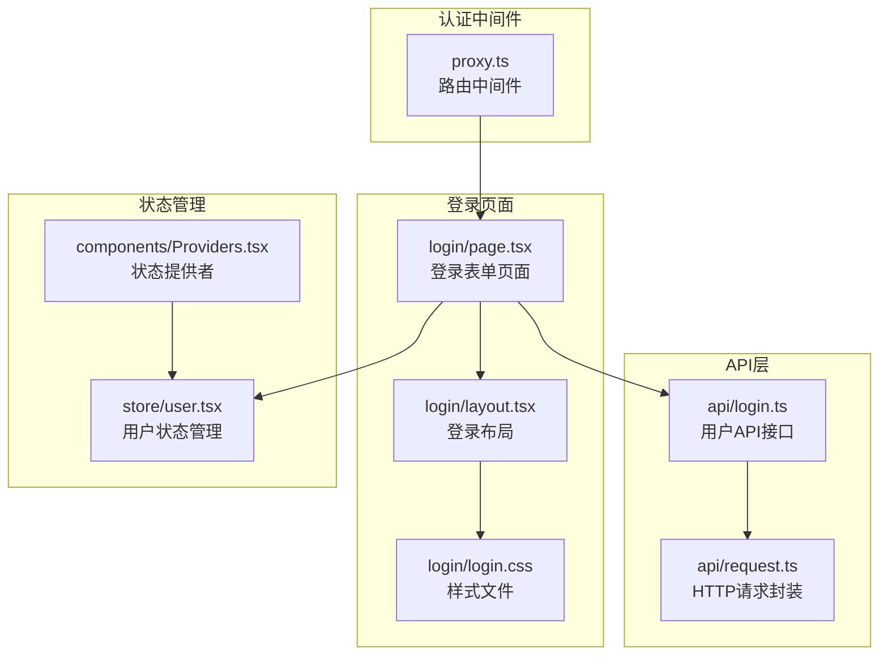
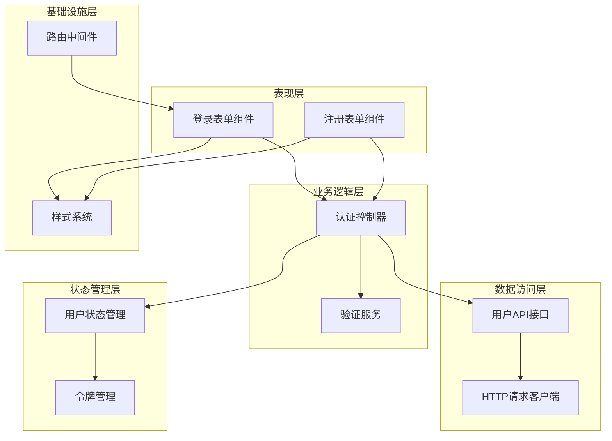
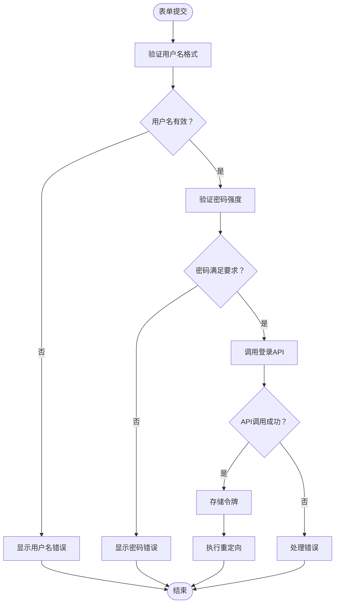
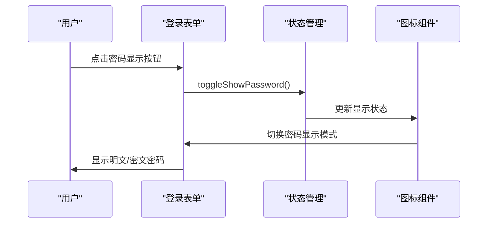
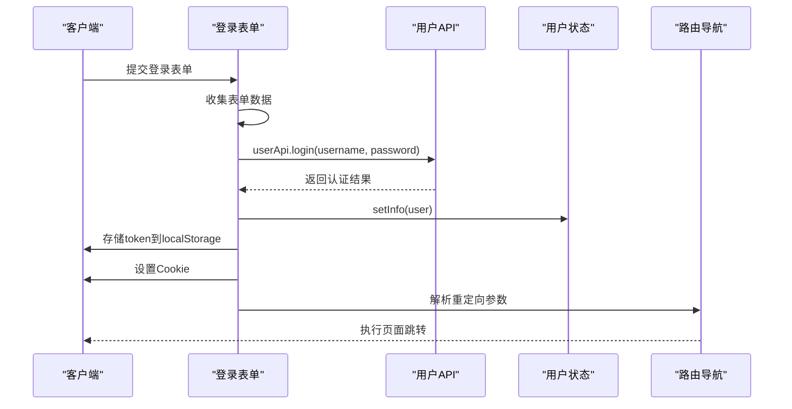
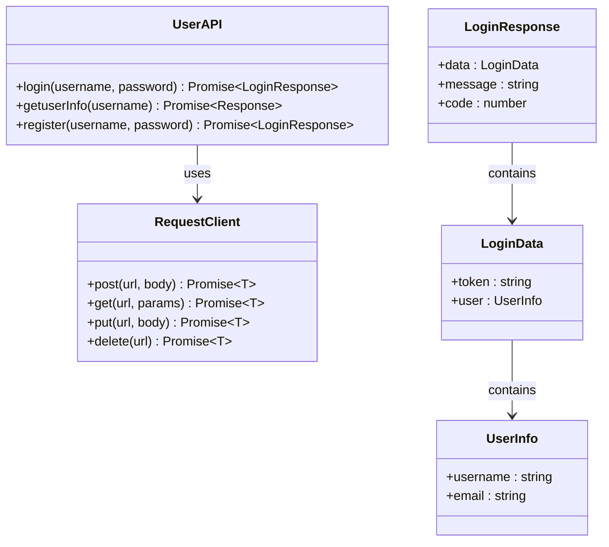
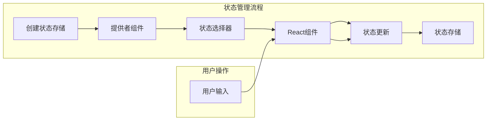
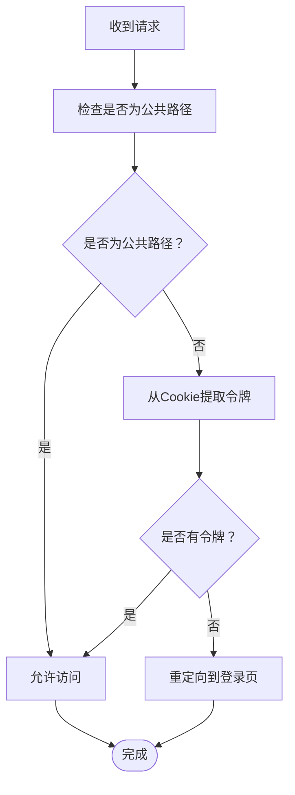
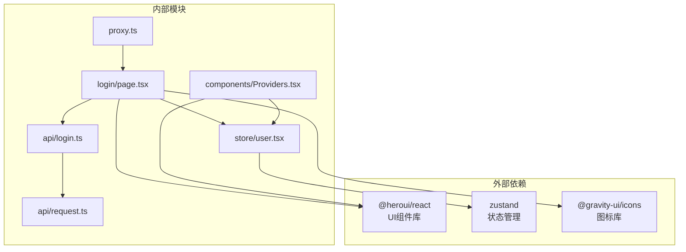

# 登录功能

<cite>
**本文档引用的文件**
- [src/app/login/page.tsx](file://src/app/login/page.tsx)
- [src/app/login/layout.tsx](file://src/app/login/layout.tsx)
- [src/app/login/login.css](file://src/app/login/login.css)
- [src/api/login.ts](file://src/api/login.ts)
- [src/api/request.ts](file://src/api/request.ts)
- [src/store/user.tsx](file://src/store/user.tsx)
- [src/components/Providers.tsx](file://src/components/Providers.tsx)
- [src/app/layout.tsx](file://src/app/layout.tsx)
- [src/app/register/page.tsx](file://src/app/register/page.tsx)
- [src/app/register/login.css](file://src/app/register/login.css)
- [proxy.ts](file://proxy.ts)
</cite>

## 目录
1. [简介](#简介)
2. [项目结构](#项目结构)
3. [核心组件](#核心组件)
4. [架构概览](#架构概览)
5. [详细组件分析](#详细组件分析)
6. [依赖关系分析](#依赖关系分析)
7. [性能考虑](#性能考虑)
8. [故障排除指南](#故障排除指南)
9. [结论](#结论)

## 简介

本项目实现了基于Next.js 16的现代化登录功能，采用客户端渲染（CSR）与服务端渲染（SSR）相结合的方式，提供了完整的用户认证解决方案。系统集成了表单验证、密码显示切换、错误处理和用户体验优化等功能，支持多种重定向参数和安全的令牌管理机制。

## 项目结构

登录功能相关的文件组织结构如下：

**图表来源**
- [src/app/login/page.tsx:1-119](file://src/app/login/page.tsx#L1-L119)
- [src/api/login.ts:1-81](file://src/api/login.ts#L1-L81)
- [src/store/user.tsx:1-56](file://src/store/user.tsx#L1-L56)
- [proxy.ts:1-51](file://proxy.ts#L1-L51)

**章节来源**
- [src/app/login/page.tsx:1-119](file://src/app/login/page.tsx#L1-L119)
- [src/app/login/layout.tsx:1-30](file://src/app/login/layout.tsx#L1-L30)
- [src/app/login/login.css:1-18](file://src/app/login/login.css#L1-L18)

## 核心组件

### 登录表单组件

登录表单组件位于 `src/app/login/page.tsx`，实现了完整的用户认证界面，包含以下核心功能：

- **表单验证**：实时用户名和密码格式验证
- **密码显示切换**：支持明文/密文切换显示
- **认证流程**：集成API调用和状态管理
- **重定向机制**：支持多种重定向参数

### API接口层

用户相关的API接口集中在 `src/api/login.ts`，提供了统一的接口封装：

- **登录接口**：`userApi.login(username, password)`
- **用户信息**：`userApi.getuserInfo(username)`
- **注册接口**：`userApi.register(username, password)`

### 状态管理系统

用户状态管理采用Zustand库实现，位于 `src/store/user.tsx`：

- **用户信息存储**：`info` 字段存储用户基本信息
- **状态更新**：`setInfo` 方法用于更新用户状态
- **全局状态提供**：通过React Context提供状态访问

**章节来源**
- [src/app/login/page.tsx:14-119](file://src/app/login/page.tsx#L14-L119)
- [src/api/login.ts:37-60](file://src/api/login.ts#L37-L60)
- [src/store/user.tsx:18-56](file://src/store/user.tsx#L18-L56)

## 架构概览

系统采用分层架构设计，实现了清晰的关注点分离：

**图表来源**
- [src/app/login/page.tsx:20-58](file://src/app/login/page.tsx#L20-L58)
- [src/api/login.ts:54-56](file://src/api/login.ts#L54-L56)
- [src/store/user.tsx:19-24](file://src/store/user.tsx#L19-L24)
- [proxy.ts:11-33](file://proxy.ts#L11-L33)

## 详细组件分析

### 登录表单组件分析

#### 表单验证机制

登录表单实现了多层次的验证机制：

**用户名验证规则：**
- 必填字段验证
- 邮箱格式验证（正则表达式：`/^[A-Z0-9._%+-]+@[A-Z0-9.-]+\.[A-Z]{2,}$/i`）
- 实时验证反馈

**密码验证规则：**
- 最小长度8位
- 必须包含大写字母
- 必须包含数字
- 实时验证反馈

**图表来源**
- [src/app/login/page.tsx:67-97](file://src/app/login/page.tsx#L67-L97)
- [src/app/login/page.tsx:20-58](file://src/app/login/page.tsx#L20-L58)

#### 密码显示切换功能

密码显示切换功能通过状态管理实现：

**图表来源**
- [src/app/login/page.tsx:16-107](file://src/app/login/page.tsx#L16-L107)

#### 认证流程

完整的认证流程包括以下步骤：

1. **表单数据收集**：使用FormData收集用户输入
2. **API调用**：调用`userApi.login()`进行身份验证
3. **令牌存储**：同时存储localStorage和Cookie
4. **状态更新**：更新用户状态信息
5. **重定向处理**：根据参数执行页面跳转

**图表来源**
- [src/app/login/page.tsx:20-58](file://src/app/login/page.tsx#L20-L58)
- [src/api/login.ts:54-56](file://src/api/login.ts#L54-L56)
- [src/store/user.tsx:19-24](file://src/store/user.tsx#L19-L24)

**章节来源**
- [src/app/login/page.tsx:60-119](file://src/app/login/page.tsx#L60-L119)

### API接口层分析

#### HTTP请求封装

`src/api/request.ts`提供了统一的HTTP请求封装，支持以下特性：

- **环境适配**：自动区分客户端和服务器端环境
- **令牌管理**：自动添加Authorization头
- **错误处理**：统一的错误类型和处理机制
- **超时控制**：可配置的请求超时时间

#### 用户API接口

用户相关的API接口定义：

**图表来源**
- [src/api/login.ts:37-60](file://src/api/login.ts#L37-L60)
- [src/api/request.ts:57-235](file://src/api/request.ts#L57-L235)

**章节来源**
- [src/api/login.ts:1-81](file://src/api/login.ts#L1-L81)
- [src/api/request.ts:1-455](file://src/api/request.ts#L1-L455)

### 状态管理系统分析

#### Zustand状态管理

用户状态管理采用Zustand库实现，提供了轻量级的状态管理方案：

- **创建状态**：`createUserStore()` 创建用户状态实例
- **状态选择器**：`useUserStore()` 提供状态选择功能
- **上下文提供**：`UserStoreProvider` 提供全局状态访问

**图表来源**
- [src/store/user.tsx:18-56](file://src/store/user.tsx#L18-L56)

**章节来源**
- [src/store/user.tsx:1-56](file://src/store/user.tsx#L1-L56)

### 认证中间件分析

#### 路由中间件

`proxy.ts`实现了全局路由中间件，提供认证保护：

- **白名单机制**：允许`/login`和`/register`路径直接访问
- **令牌验证**：从Cookie中提取认证令牌
- **自动重定向**：未认证用户自动跳转到登录页

**图表来源**
- [proxy.ts:11-33](file://proxy.ts#L11-L33)

**章节来源**
- [proxy.ts:1-51](file://proxy.ts#L1-L51)

## 依赖关系分析

系统各组件之间的依赖关系如下：

**图表来源**
- [src/app/login/page.tsx:3-8](file://src/app/login/page.tsx#L3-L8)
- [src/api/login.ts](file://src/api/login.ts#L6)
- [src/store/user.tsx:3-5](file://src/store/user.tsx#L3-L5)
- [src/components/Providers.tsx:3-6](file://src/components/Providers.tsx#L3-L6)

**章节来源**
- [package.json:11-25](file://package.json#L11-L25)

## 性能考虑

### 优化策略

1. **懒加载组件**：使用React.lazy和Suspense实现组件懒加载
2. **状态缓存**：合理使用Zustand的持久化存储
3. **请求缓存**：利用Next.js的内置缓存机制
4. **资源优化**：CDN加速和图片优化

### 错误处理机制

系统实现了多层次的错误处理：

- **表单验证错误**：实时显示验证结果
- **API调用错误**：统一的HttpError和BusinessError处理
- **网络错误**：超时和连接错误的优雅降级
- **认证错误**：401状态码的自动重定向处理

## 故障排除指南

### 常见问题及解决方案

**问题1：登录后无法跳转**
- 检查重定向参数是否正确传递
- 确认Cookie设置是否成功
- 验证路由导航配置

**问题2：令牌过期**
- 检查令牌存储位置（localStorage vs Cookie）
- 验证中间件的令牌提取逻辑
- 确认服务端的Cookie配置

**问题3：表单验证不生效**
- 检查验证函数的正则表达式
- 确认表单组件的validate属性
- 验证FieldError组件的显示逻辑

**章节来源**
- [src/app/login/page.tsx:40-48](file://src/app/login/page.tsx#L40-L48)
- [src/api/request.ts:161-173](file://src/api/request.ts#L161-L173)

## 结论

本登录功能实现了现代化的用户认证解决方案，具有以下特点：

1. **完整的认证流程**：从表单验证到令牌管理的全流程覆盖
2. **良好的用户体验**：实时验证反馈和友好的错误提示
3. **安全的令牌管理**：同时支持localStorage和Cookie存储
4. **灵活的重定向机制**：支持多种重定向参数和防御性跳转
5. **可扩展的架构**：清晰的分层设计便于功能扩展

该实现为Next.js应用提供了可靠的登录基础，可以根据具体需求进一步定制和扩展。