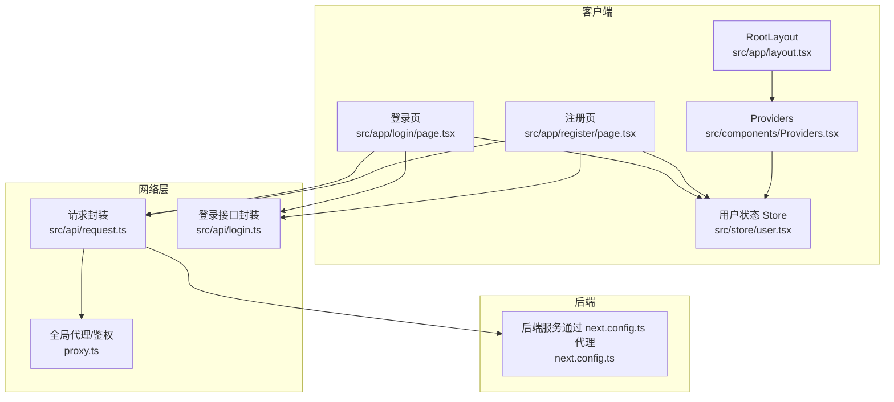
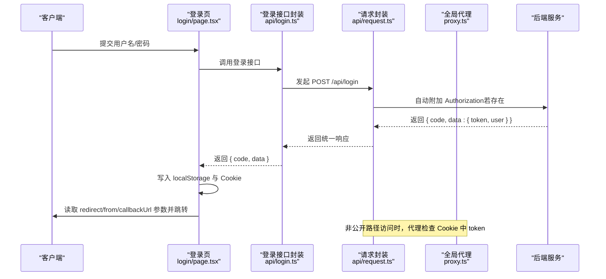
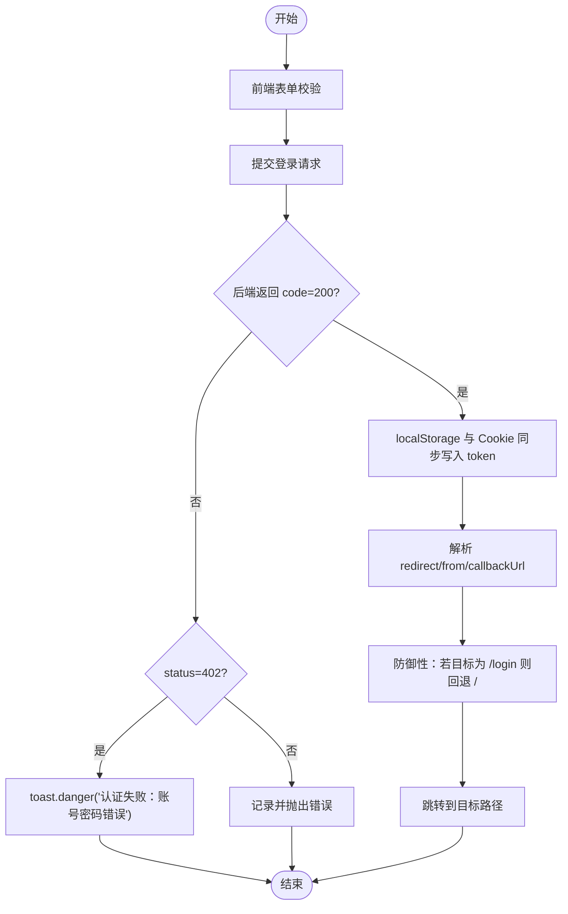
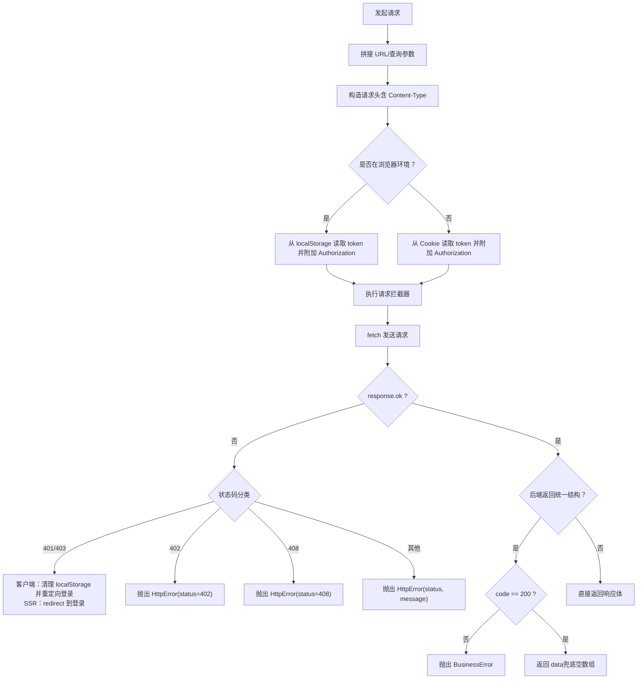
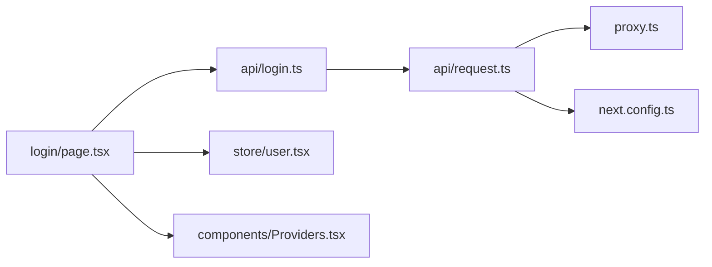

# 认证安全机制

<cite>
**本文引用的文件**
- [src/app/login/page.tsx](file://src/app/login/page.tsx)
- [src/app/register/page.tsx](file://src/app/register/page.tsx)
- [src/api/login.ts](file://src/api/login.ts)
- [src/api/request.ts](file://src/api/request.ts)
- [src/store/user.tsx](file://src/store/user.tsx)
- [src/components/Providers.tsx](file://src/components/Providers.tsx)
- [src/app/layout.tsx](file://src/app/layout.tsx)
- [proxy.ts](file://proxy.ts)
- [next.config.ts](file://next.config.ts)
- [package.json](file://package.json)
</cite>

## 目录
1. [引言](#引言)
2. [项目结构](#项目结构)
3. [核心组件](#核心组件)
4. [架构总览](#架构总览)
5. [详细组件分析](#详细组件分析)
6. [依赖关系分析](#依赖关系分析)
7. [性能考量](#性能考量)
8. [故障排查指南](#故障排查指南)
9. [结论](#结论)
10. [附录](#附录)

## 引言
本文件围绕该 Next.js 项目的认证安全机制进行系统化梳理，重点覆盖以下方面：
- 认证流程与安全策略：登录、注册、令牌发放与校验
- 令牌管理与会话安全：本地存储、Cookie 设置与跨端同步
- HTTP 错误处理与状态码语义：401/402/403/408/0 等
- 安全头部与 CSRF 防护现状与改进建议
- 认证失败处理流程、错误码定义与用户反馈
- 安全审计清单与常见漏洞（XSS、SQL 注入、敏感信息泄露）的防范要点

## 项目结构
该项目采用 App Router 架构，认证相关的关键文件分布如下：
- 登录与注册页面：src/app/login、src/app/register
- API 封装与请求拦截：src/api/request.ts、src/api/login.ts
- 全局状态与 Provider：src/store/user.tsx、src/components/Providers.tsx、src/app/layout.tsx
- 全局中间件（代理/鉴权）：proxy.ts
- 构建与代理配置：next.config.ts、package.json

图表来源
- [src/app/login/page.tsx:1-119](file://src/app/login/page.tsx#L1-L119)
- [src/app/register/page.tsx:1-145](file://src/app/register/page.tsx#L1-L145)
- [src/api/login.ts:1-81](file://src/api/login.ts#L1-L81)
- [src/api/request.ts:1-235](file://src/api/request.ts#L1-L235)
- [src/store/user.tsx:1-56](file://src/store/user.tsx#L1-L56)
- [src/components/Providers.tsx:1-20](file://src/components/Providers.tsx#L1-L20)
- [src/app/layout.tsx:1-44](file://src/app/layout.tsx#L1-L44)
- [proxy.ts:1-52](file://proxy.ts#L1-L52)
- [next.config.ts:1-76](file://next.config.ts#L1-L76)

章节来源
- [src/app/login/page.tsx:1-119](file://src/app/login/page.tsx#L1-L119)
- [src/app/register/page.tsx:1-145](file://src/app/register/page.tsx#L1-L145)
- [src/api/login.ts:1-81](file://src/api/login.ts#L1-L81)
- [src/api/request.ts:1-235](file://src/api/request.ts#L1-L235)
- [src/store/user.tsx:1-56](file://src/store/user.tsx#L1-L56)
- [src/components/Providers.tsx:1-20](file://src/components/Providers.tsx#L1-L20)
- [src/app/layout.tsx:1-44](file://src/app/layout.tsx#L1-L44)
- [proxy.ts:1-52](file://proxy.ts#L1-L52)
- [next.config.ts:1-76](file://next.config.ts#L1-L76)

## 核心组件
- 登录页组件：负责表单校验、提交、接收后端返回的 token、同时写入 localStorage 与 Cookie，并根据查询参数进行重定向。
- 注册页组件：负责表单校验与注册提交，注册成功后跳转至登录页。
- 请求封装与拦截：统一处理 Authorization 头、超时、401/402/403/408/0 等错误、业务错误码、SSR/CSR 的差异化处理。
- 用户状态 Store：提供 setInfo 方法用于更新当前用户信息。
- 全局 Provider：挂载 Toast、UserStore、CounterStore，为应用提供统一的状态与通知能力。
- 全局代理/鉴权：对非公开路径进行 token 校验，缺失 token 则重定向至登录页。

章节来源
- [src/app/login/page.tsx:1-119](file://src/app/login/page.tsx#L1-L119)
- [src/app/register/page.tsx:1-145](file://src/app/register/page.tsx#L1-L145)
- [src/api/request.ts:1-235](file://src/api/request.ts#L1-L235)
- [src/store/user.tsx:1-56](file://src/store/user.tsx#L1-L56)
- [src/components/Providers.tsx:1-20](file://src/components/Providers.tsx#L1-L20)
- [proxy.ts:1-52](file://proxy.ts#L1-L52)

## 架构总览
认证安全架构由“前端表单层 -> 请求封装层 -> 全局代理层 -> 后端服务”构成，贯穿 CSR/SSR 场景，统一处理令牌注入、错误分发与重定向。

图表来源
- [src/app/login/page.tsx:20-58](file://src/app/login/page.tsx#L20-L58)
- [src/api/login.ts:54-59](file://src/api/login.ts#L54-L59)
- [src/api/request.ts:94-112](file://src/api/request.ts#L94-L112)
- [proxy.ts:11-33](file://proxy.ts#L11-L33)

## 详细组件分析

### 登录流程与安全策略
- 表单校验：用户名邮箱格式、密码长度与字符要求在前端完成，减少无效请求。
- 令牌写入：登录成功后同时写入 localStorage 与 Cookie，确保 CSR/SSR 场景均可用。
- 重定向策略：支持 redirect/from/callbackUrl 等常见参数名；若目标为登录页则回退至根路径，防止死循环。
- 错误处理：捕获 HttpError，当 status=402 时弹出“认证失败：账号密码错误”。

图表来源
- [src/app/login/page.tsx:20-58](file://src/app/login/page.tsx#L20-L58)

章节来源
- [src/app/login/page.tsx:1-119](file://src/app/login/page.tsx#L1-L119)

### 注册流程与安全策略
- 密码一致性校验：前后两次密码不一致时提示错误。
- 成功后提示并延时跳转至登录页，避免重复提交。
- 错误处理：捕获 HttpError，当 status=402 时提示“认证失败：账号密码错误”。

章节来源
- [src/app/register/page.tsx:1-145](file://src/app/register/page.tsx#L1-L145)

### 请求封装与错误处理
- 统一注入 Authorization：CSR 从 localStorage 读取，SSR 从 Cookie 读取。
- 错误分类与处理：
  - 401/403：清理无效 token，客户端重定向至登录页，携带错误消息与来源路径；SSR 通过 redirect 重定向。
  - 402：抛出 HttpError，供上层 UI 层处理（如登录页）。
  - 408：请求超时错误。
  - 0：网络错误。
  - 业务错误：当后端返回统一结构且 code≠200 时抛出 BusinessError。
- 响应拦截器示例：可在拦截器中处理 401 自动跳转登录。

图表来源
- [src/api/request.ts:57-235](file://src/api/request.ts#L57-L235)

章节来源
- [src/api/request.ts:1-235](file://src/api/request.ts#L1-L235)

### 令牌管理与会话安全
- 令牌来源：登录成功后后端返回 token，前端写入 localStorage 与 Cookie。
- 令牌注入：请求封装自动在 CSR/SSR 场景注入 Authorization。
- 会话失效：401/403 时清理 localStorage 并重定向登录。
- Cookie 设置：登录页写入 Cookie，代理读取；未见 HttpOnly/Secure/SameSite 等安全属性设置。

章节来源
- [src/app/login/page.tsx:30-48](file://src/app/login/page.tsx#L30-L48)
- [src/api/request.ts:94-112](file://src/api/request.ts#L94-L112)
- [src/api/request.ts:161-173](file://src/api/request.ts#L161-L173)

### 全局代理与路由拦截
- 白名单：/login 与 /register 直接放行。
- 鉴权：对非公开路径从 Cookie 读取 token，无 token 则重定向至登录页并附带 redirect 参数。
- 匹配规则：排除静态资源、API 路由与 images 目录。

章节来源
- [proxy.ts:1-52](file://proxy.ts#L1-L52)

### 用户状态与 Provider
- UserStore：提供 setInfo 方法用于更新用户信息。
- Providers：挂载 Toast、UserStore、CounterStore，为应用提供统一的状态与通知能力。
- Layout：根布局包裹 Providers，确保全局可用。

章节来源
- [src/store/user.tsx:1-56](file://src/store/user.tsx#L1-L56)
- [src/components/Providers.tsx:1-20](file://src/components/Providers.tsx#L1-L20)
- [src/app/layout.tsx:1-44](file://src/app/layout.tsx#L1-L44)

### API 接口封装
- userApi：封装 /api/login 与 /api/register 等接口，统一返回结构 { code, data, message }。
- 与请求封装协作：通过 http.post/http.get 调用后端接口。

章节来源
- [src/api/login.ts:1-81](file://src/api/login.ts#L1-L81)

### 构建与代理配置
- next.config.ts：配置 /api/* 代理到 BACKEND_URL，便于前端直连后端。
- package.json：声明依赖与脚本。

章节来源
- [next.config.ts:27-45](file://next.config.ts#L27-L45)
- [package.json:1-39](file://package.json#L1-L39)

## 依赖关系分析
- 登录页依赖 userApi 与请求封装，同时依赖 UserStore 与 Providers。
- 请求封装依赖 next/headers（SSR）读取 Cookie，依赖 localStorage（CSR）读取 token。
- 全局代理依赖 Cookie 读取 token，对非公开路径进行重定向。
- 构建配置通过 rewrites 将 /api/* 代理到后端服务。

图表来源
- [src/app/login/page.tsx:1-119](file://src/app/login/page.tsx#L1-L119)
- [src/api/login.ts:1-81](file://src/api/login.ts#L1-L81)
- [src/store/user.tsx:1-56](file://src/store/user.tsx#L1-L56)
- [src/components/Providers.tsx:1-20](file://src/components/Providers.tsx#L1-L20)
- [src/api/request.ts:1-235](file://src/api/request.ts#L1-L235)
- [proxy.ts:1-52](file://proxy.ts#L1-L52)
- [next.config.ts:1-76](file://next.config.ts#L1-L76)

章节来源
- [src/app/login/page.tsx:1-119](file://src/app/login/page.tsx#L1-L119)
- [src/api/login.ts:1-81](file://src/api/login.ts#L1-L81)
- [src/api/request.ts:1-235](file://src/api/request.ts#L1-L235)
- [src/store/user.tsx:1-56](file://src/store/user.tsx#L1-L56)
- [src/components/Providers.tsx:1-20](file://src/components/Providers.tsx#L1-L20)
- [proxy.ts:1-52](file://proxy.ts#L1-L52)
- [next.config.ts:1-76](file://next.config.ts#L1-L76)

## 性能考量
- 请求超时控制：统一超时时间，避免长时间阻塞。
- 响应拦截器：可在拦截器中做统一处理（如自动刷新 token、日志上报）。
- SSR 渲染：通过 revalidate 控制缓存策略，减少不必要的请求。
- 本地存储与 Cookie 同步：降低重复请求与鉴权失败带来的往返成本。

## 故障排查指南
- 登录失败（402）：检查用户名/密码格式与后端返回的错误消息，确认 UI 层正确捕获并提示。
- 401/403：确认请求是否正确附加 Authorization；检查 localStorage 与 Cookie 是否存在 token；确认代理是否正确重定向。
- 408：检查网络状况与后端响应时间，适当调整超时配置。
- 0：检查网络连通性与代理配置（next.config.ts 重写）。
- 业务错误（非 200）：检查后端返回的统一结构与 code 字段。

章节来源
- [src/api/request.ts:157-235](file://src/api/request.ts#L157-L235)
- [src/app/login/page.tsx:51-57](file://src/app/login/page.tsx#L51-L57)

## 结论
本项目在认证链路中实现了基本的令牌注入、错误分类与重定向机制，覆盖了 CSR/SSR 场景。为进一步提升安全性，建议补充 Cookie 安全属性（HttpOnly/Secure/SameSite）、CSRF 防护、安全头部设置与更完善的审计与监控。

## 附录

### 安全审计清单
- [ ] Cookie 安全属性：是否设置 HttpOnly、Secure、SameSite
- [ ] CSRF 防护：是否启用 SameSite=Lax/Strict、CSRF Token
- [ ] 安全头部：CSP、X-Frame-Options、X-Content-Type-Options、Referrer-Policy
- [ ] 令牌生命周期：是否限制有效期、支持刷新与吊销
- [ ] 输入校验：前后端双重校验，最小权限原则
- [ ] 日志与监控：异常捕获、审计日志、告警机制
- [ ] 传输安全：HTTPS 强制、HSTS
- [ ] XSS 防护：内容转义、CSP、Sanitization
- [ ] SQL 注入预防：ORM/参数化查询、最小权限数据库账户
- [ ] 敏感信息保护：避免在前端暴露密钥、日志脱敏

### 常见安全漏洞与防范
- XSS
  - 前端：避免 innerHTML，使用安全的渲染库；CSP 限制内联脚本
  - 后端：输入过滤与输出编码
- SQL 注入
  - 使用 ORM 或参数化查询；最小权限数据库账户
- 敏感信息泄露
  - 环境变量使用 NEXT_PUBLIC_ 前缀需谨慎；避免在前端打印敏感日志
- CSRF
  - 使用 SameSite Cookie、CSRF Token、Referer 校验
- 令牌滥用
  - 限制 token 有效期、支持刷新与吊销；服务端校验签名与来源