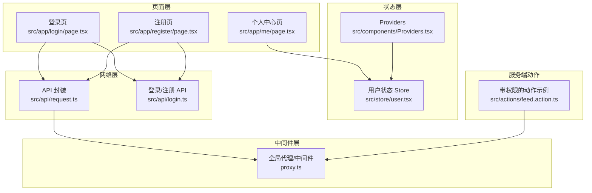
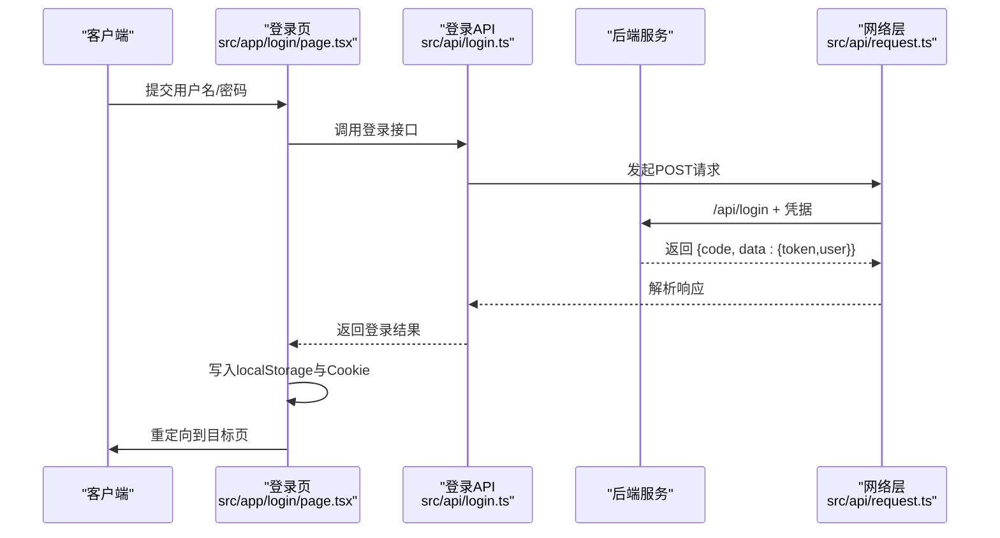
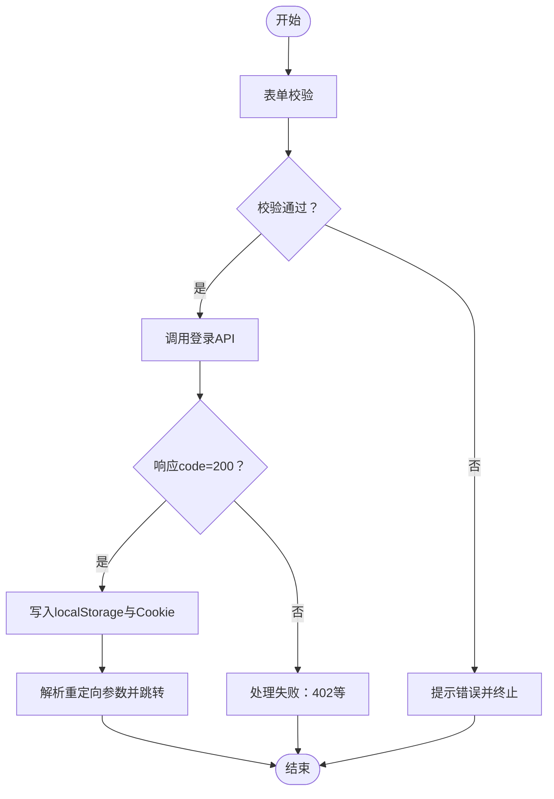
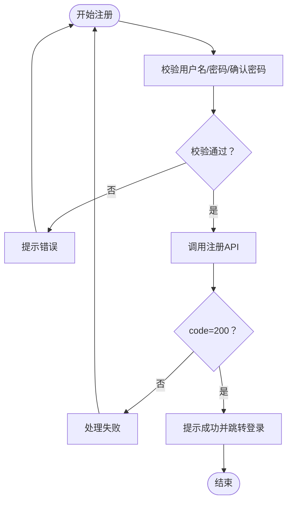
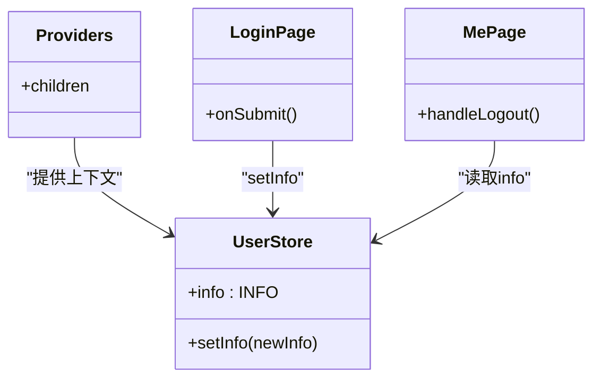
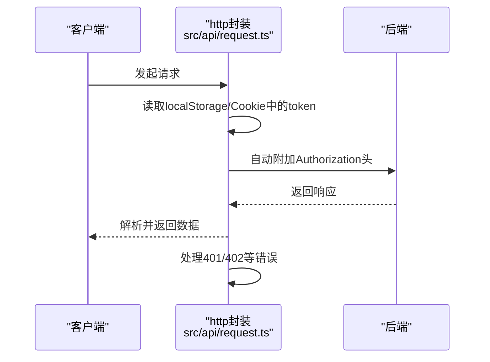
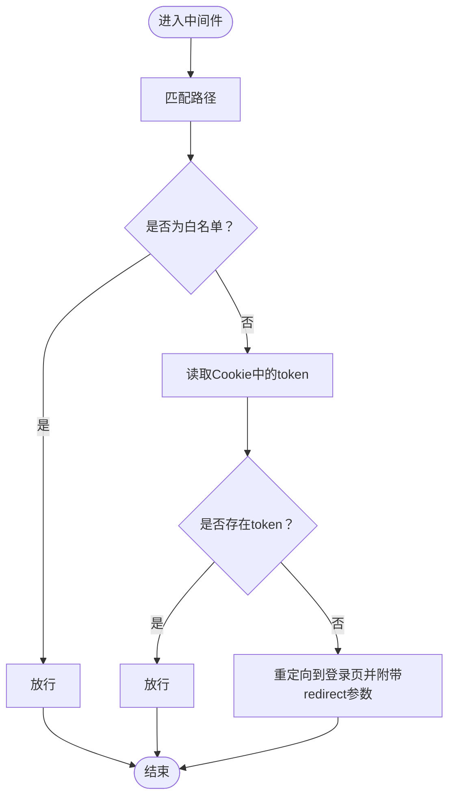
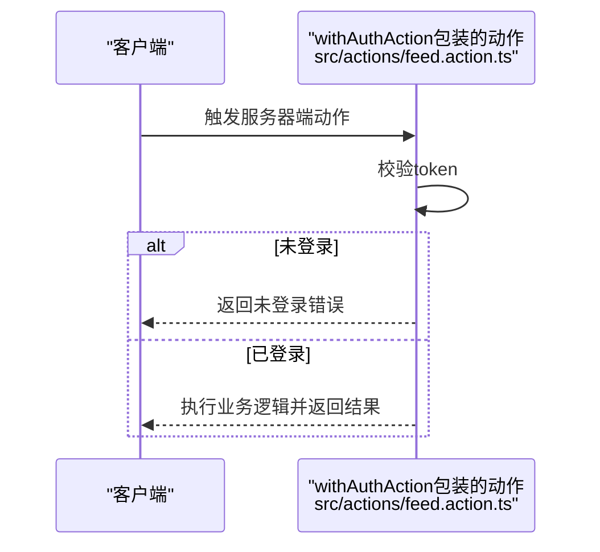
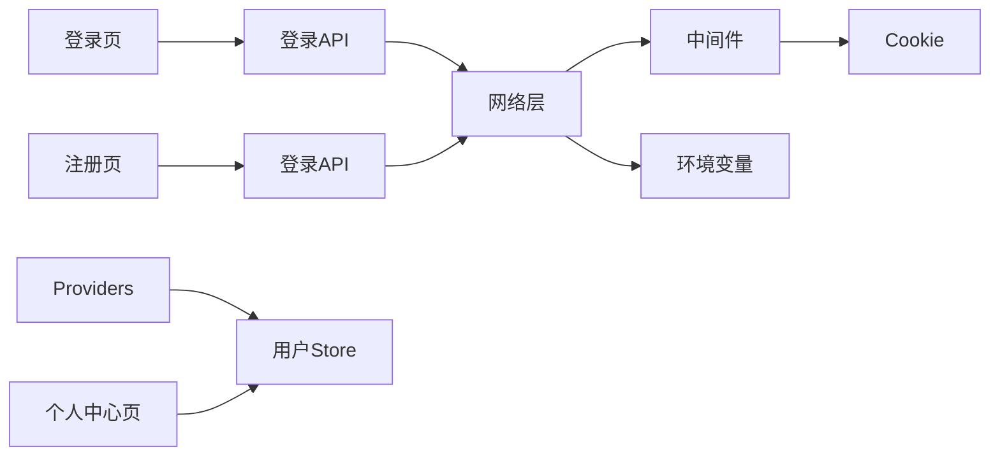

# 认证系统

<cite>
**本文引用的文件**
- [src/app/login/page.tsx](file://src/app/login/page.tsx)
- [src/app/register/page.tsx](file://src/app/register/page.tsx)
- [src/store/user.tsx](file://src/store/user.tsx)
- [src/components/Providers.tsx](file://src/components/Providers.tsx)
- [src/api/login.ts](file://src/api/login.ts)
- [src/api/request.ts](file://src/api/request.ts)
- [proxy.ts](file://proxy.ts)
- [src/app/me/page.tsx](file://src/app/me/page.tsx)
- [src/actions/feed.action.ts](file://src/actions/feed.action.ts)
- [src/app/layout.tsx](file://src/app/layout.tsx)
</cite>

## 目录
1. [简介](#简介)
2. [项目结构](#项目结构)
3. [核心组件](#核心组件)
4. [架构总览](#架构总览)
5. [详细组件分析](#详细组件分析)
6. [依赖关系分析](#依赖关系分析)
7. [性能考虑](#性能考虑)
8. [故障排查指南](#故障排查指南)
9. [结论](#结论)
10. [附录](#附录)

## 简介
本文件为本项目的用户认证系统综合文档，覆盖登录、注册、会话管理与权限控制机制。文档解释认证流程、状态管理、安全策略与错误处理，并提供完整的认证API接口说明与客户端集成要点。同时给出安全最佳实践与常见攻击防护建议。

## 项目结构
认证相关的关键文件分布如下：
- 页面层：登录页、注册页、个人中心页
- 状态层：用户状态存储（Zustand）
- 网络层：HTTP请求封装与拦截器
- 中间件层：全局路由拦截与鉴权
- 服务端动作：带权限校验的服务器端动作示例

**图表来源**
- [src/app/login/page.tsx:1-119](file://src/app/login/page.tsx#L1-L119)
- [src/app/register/page.tsx:1-145](file://src/app/register/page.tsx#L1-L145)
- [src/app/me/page.tsx:1-67](file://src/app/me/page.tsx#L1-L67)
- [src/components/Providers.tsx:1-20](file://src/components/Providers.tsx#L1-L20)
- [src/store/user.tsx:1-56](file://src/store/user.tsx#L1-L56)
- [src/api/request.ts:1-455](file://src/api/request.ts#L1-L455)
- [src/api/login.ts:1-81](file://src/api/login.ts#L1-L81)
- [proxy.ts:1-52](file://proxy.ts#L1-L52)
- [src/actions/feed.action.ts:35-51](file://src/actions/feed.action.ts#L35-L51)

**章节来源**
- [src/app/login/page.tsx:1-119](file://src/app/login/page.tsx#L1-L119)
- [src/app/register/page.tsx:1-145](file://src/app/register/page.tsx#L1-L145)
- [src/app/me/page.tsx:1-67](file://src/app/me/page.tsx#L1-L67)
- [src/components/Providers.tsx:1-20](file://src/components/Providers.tsx#L1-L20)
- [src/store/user.tsx:1-56](file://src/store/user.tsx#L1-L56)
- [src/api/request.ts:1-455](file://src/api/request.ts#L1-L455)
- [src/api/login.ts:1-81](file://src/api/login.ts#L1-L81)
- [proxy.ts:1-52](file://proxy.ts#L1-L52)
- [src/actions/feed.action.ts:35-51](file://src/actions/feed.action.ts#L35-L51)

## 核心组件
- 登录页：负责表单校验、提交、接收后端返回的token与用户信息，持久化到本地并进行重定向。
- 注册页：负责表单校验、提交注册请求，提示注册成功并跳转登录页。
- 用户状态 Store：提供全局用户信息的读写能力，供页面消费。
- HTTP请求封装：统一封装GET/POST等方法，自动注入Authorization头，处理401/402等错误，支持SSR场景。
- 全局代理/中间件：对非公开路径进行token校验，缺失token则重定向至登录页。
- 服务端动作：提供带权限校验的服务器端动作模板。

**章节来源**
- [src/app/login/page.tsx:1-119](file://src/app/login/page.tsx#L1-L119)
- [src/app/register/page.tsx:1-145](file://src/app/register/page.tsx#L1-L145)
- [src/store/user.tsx:1-56](file://src/store/user.tsx#L1-L56)
- [src/api/request.ts:1-455](file://src/api/request.ts#L1-L455)
- [proxy.ts:1-52](file://proxy.ts#L1-L52)
- [src/actions/feed.action.ts:35-51](file://src/actions/feed.action.ts#L35-L51)

## 架构总览
认证系统采用“前端表单 + 网络层 + 中间件 + 服务端动作”的分层设计。登录成功后，前端同时写入localStorage与Cookie，保证CSR与SSR均能读取token；网络层自动附加Authorization头；中间件对受保护路径进行统一鉴权。

**图表来源**
- [src/app/login/page.tsx:20-58](file://src/app/login/page.tsx#L20-L58)
- [src/api/login.ts:54-56](file://src/api/login.ts#L54-L56)
- [src/api/request.ts:148-235](file://src/api/request.ts#L148-L235)

## 详细组件分析

### 登录流程与状态管理
- 表单校验：用户名邮箱格式、密码长度与复杂度要求。
- 登录提交：收集表单数据，调用登录API。
- 成功处理：保存用户信息到Zustand Store，同时写入localStorage与Cookie；解析redirect/from/callbackUrl等重定向参数，防御性地避免跳转回登录页。
- 失败处理：捕获HTTP错误，402提示账号密码错误；其他异常打印日志。

**图表来源**
- [src/app/login/page.tsx:20-58](file://src/app/login/page.tsx#L20-L58)

**章节来源**
- [src/app/login/page.tsx:1-119](file://src/app/login/page.tsx#L1-L119)

### 注册流程
- 表单校验：邮箱格式、密码长度与复杂度、二次确认密码一致性。
- 注册提交：调用注册API。
- 成功处理：提示注册成功，延时跳转到登录页。
- 失败处理：捕获HTTP错误并提示。

**图表来源**
- [src/app/register/page.tsx:13-43](file://src/app/register/page.tsx#L13-L43)

**章节来源**
- [src/app/register/page.tsx:1-145](file://src/app/register/page.tsx#L1-L145)

### 用户状态持久化与共享
- Zustand Store：提供info字段与setInfo方法，支持初始状态注入与跨组件共享。
- Provider：在根布局中注入UserStoreProvider，使子组件可通过useUserStore(selector)读取或更新用户信息。
- 退出登录：移除localStorage与Cookie中的token并跳转登录页。

**图表来源**
- [src/store/user.tsx:18-56](file://src/store/user.tsx#L18-L56)
- [src/components/Providers.tsx:8-19](file://src/components/Providers.tsx#L8-L19)
- [src/app/login/page.tsx:18-34](file://src/app/login/page.tsx#L18-L34)
- [src/app/me/page.tsx:10-17](file://src/app/me/page.tsx#L10-L17)

**章节来源**
- [src/store/user.tsx:1-56](file://src/store/user.tsx#L1-L56)
- [src/components/Providers.tsx:1-20](file://src/components/Providers.tsx#L1-L20)
- [src/app/me/page.tsx:1-67](file://src/app/me/page.tsx#L1-L67)

### 网络层与Token管理
- 自动注入Authorization头：浏览器端从localStorage读取token，服务端从Cookie读取token。
- 统一错误处理：401/403跳转登录页；402抛出业务错误；其他HTTP错误与超时错误统一处理。
- SSR支持：在服务端组件中通过headers.cookies读取token，适配SSR渲染。
- 响应拦截器：可扩展实现token过期刷新等策略。

**图表来源**
- [src/api/request.ts:94-112](file://src/api/request.ts#L94-L112)
- [src/api/request.ts:158-187](file://src/api/request.ts#L158-L187)

**章节来源**
- [src/api/request.ts:1-455](file://src/api/request.ts#L1-L455)

### 全局代理/中间件与权限控制
- 白名单：登录与注册路径无需鉴权。
- 鉴权逻辑：从Cookie读取token，无token则重定向至登录页并携带redirect参数。
- 匹配规则：排除静态资源与API路由，仅对应用路由生效。

**图表来源**
- [proxy.ts:11-33](file://proxy.ts#L11-L33)

**章节来源**
- [proxy.ts:1-52](file://proxy.ts#L1-L52)

### 服务端动作与权限校验
- withAuthAction：提供一个高阶函数模板，用于包裹服务器端动作，先检查token再执行业务逻辑。
- 当前示例中使用“mock-token-check”演示，实际项目中应替换为真实token校验逻辑。

**图表来源**
- [src/actions/feed.action.ts:37-50](file://src/actions/feed.action.ts#L37-L50)

**章节来源**
- [src/actions/feed.action.ts:35-51](file://src/actions/feed.action.ts#L35-L51)

## 依赖关系分析
- 登录/注册页面依赖API模块与网络层，间接依赖中间件与Cookie。
- 用户状态Store通过Provider注入，被页面与组件消费。
- 网络层依赖环境变量与headers.cookies以适配SSR。
- 中间件依赖Cookie读取token，对受保护路径进行重定向。

**图表来源**
- [src/app/login/page.tsx:6-8](file://src/app/login/page.tsx#L6-L8)
- [src/app/register/page.tsx:6-7](file://src/app/register/page.tsx#L6-L7)
- [src/api/login.ts](file://src/api/login.ts#L6)
- [src/api/request.ts:40-47](file://src/api/request.ts#L40-L47)
- [proxy.ts:19-20](file://proxy.ts#L19-L20)
- [src/components/Providers.tsx:10-16](file://src/components/Providers.tsx#L10-L16)
- [src/store/user.tsx:36-45](file://src/store/user.tsx#L36-L45)
- [src/app/me/page.tsx](file://src/app/me/page.tsx#L3)

**章节来源**
- [src/app/login/page.tsx:1-119](file://src/app/login/page.tsx#L1-L119)
- [src/app/register/page.tsx:1-145](file://src/app/register/page.tsx#L1-L145)
- [src/api/login.ts:1-81](file://src/api/login.ts#L1-L81)
- [src/api/request.ts:1-455](file://src/api/request.ts#L1-L455)
- [proxy.ts:1-52](file://proxy.ts#L1-L52)
- [src/components/Providers.tsx:1-20](file://src/components/Providers.tsx#L1-L20)
- [src/store/user.tsx:1-56](file://src/store/user.tsx#L1-L56)
- [src/app/me/page.tsx:1-67](file://src/app/me/page.tsx#L1-L67)

## 性能考虑
- 请求超时控制：统一的超时AbortController，避免长时间挂起。
- 缓存策略：SSR场景可结合revalidate策略减少重复请求。
- 重定向优化：登录成功后使用push跳转，必要时使用location.href确保服务端中间件读取最新Cookie。
- 本地存储：localStorage与Cookie双写，兼顾CSR与SSR，注意同步更新与清理。

[本节为通用指导，不直接分析具体文件]

## 故障排查指南
- 登录失败（402）：检查用户名/密码格式与强度要求，确认后端返回的错误信息。
- 401/403：网络层会自动清除localStorage中的token并重定向登录页；检查Cookie是否正确写入与读取。
- 跳转死循环：登录页会防御性地避免跳转回自身，确认redirect参数是否正确传递。
- SSR无法读取token：确认服务端通过headers.cookies读取Cookie，且代理中间件未过滤该路径。
- 退出登录无效：确认同时清除了localStorage与Cookie，并刷新页面。

**章节来源**
- [src/api/request.ts:158-187](file://src/api/request.ts#L158-L187)
- [src/app/login/page.tsx:38-50](file://src/app/login/page.tsx#L38-L50)
- [src/app/me/page.tsx:10-17](file://src/app/me/page.tsx#L10-L17)

## 结论
本认证系统通过清晰的分层设计实现了登录、注册、会话与权限控制的闭环：前端表单与状态管理、统一网络层与中间件、以及服务端动作的权限校验。系统具备良好的可扩展性，可在现有基础上完善后端接口、增强安全策略与错误处理。

[本节为总结性内容，不直接分析具体文件]

## 附录

### 认证API接口文档
- 登录
  - 方法：POST
  - 路径：/api/login
  - 请求体：{ username, password }
  - 成功响应：{ code: 200, data: { token, user:{ username, email } }, message }
  - 失败响应：{ code: 402, message:"账号密码错误" }

- 注册
  - 方法：POST
  - 路径：/api/register
  - 请求体：{ username, password }
  - 成功响应：{ code: 200, message:"注册成功" }
  - 失败响应：{ code: 402, message:"账号密码错误" }

- 获取用户信息
  - 方法：GET
  - 路径：/api/user/info
  - 查询参数：{ username }
  - 成功响应：{ code: 200, data:{}, message }

- 更新用户资料
  - 方法：PUT
  - 路径：/api/user/profile
  - 请求体：{ id, name, avatar }
  - 成功响应：{ code: 200, data:{}, message }

- 退出登录
  - 方法：GET/POST
  - 路径：/api/logout
  - 成功响应：{ code: 200, message:"已退出登录" }

说明：
- 所有接口均通过网络层自动附加Authorization头（若存在token）。
- 401/403将触发自动重定向登录页；402为业务错误，需前端提示。

**章节来源**
- [src/api/login.ts:54-60](file://src/api/login.ts#L54-L60)
- [src/api/login.ts:44-51](file://src/api/login.ts#L44-L51)
- [src/api/request.ts:94-112](file://src/api/request.ts#L94-L112)
- [src/api/request.ts:158-187](file://src/api/request.ts#L158-L187)

### 客户端集成要点
- 登录成功后同时写入localStorage与Cookie，确保CSR与SSR均可用。
- 使用useUserStore读取用户信息，setInfo更新用户状态。
- 退出登录时同步清除localStorage与Cookie，并跳转登录页。
- 中间件对受保护路径进行统一鉴权，避免重复校验逻辑。

**章节来源**
- [src/app/login/page.tsx:30-48](file://src/app/login/page.tsx#L30-L48)
- [src/store/user.tsx:48-56](file://src/store/user.tsx#L48-L56)
- [src/app/me/page.tsx:10-17](file://src/app/me/page.tsx#L10-L17)
- [proxy.ts:11-33](file://proxy.ts#L11-L33)

### 安全最佳实践与常见攻击防护
- 输入校验：前端与后端均进行严格的输入校验与长度限制。
- Token管理：同时使用localStorage与Cookie，确保SSR可用；退出登录时同步清除。
- 中间件鉴权：对受保护路径进行统一鉴权，缺失token时重定向登录页。
- 错误处理：区分HTTP错误与业务错误，避免泄露敏感信息。
- CSRF防护：建议在后端启用SameSite Cookie策略与CSRF Token。
- XSS防护：对输出内容进行HTML转义，避免内联事件与危险标签。
- 传输安全：生产环境使用HTTPS，避免明文传输。
- 速率限制：对登录接口实施频率限制，降低暴力破解风险。

[本节为通用指导，不直接分析具体文件]