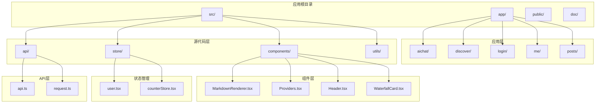
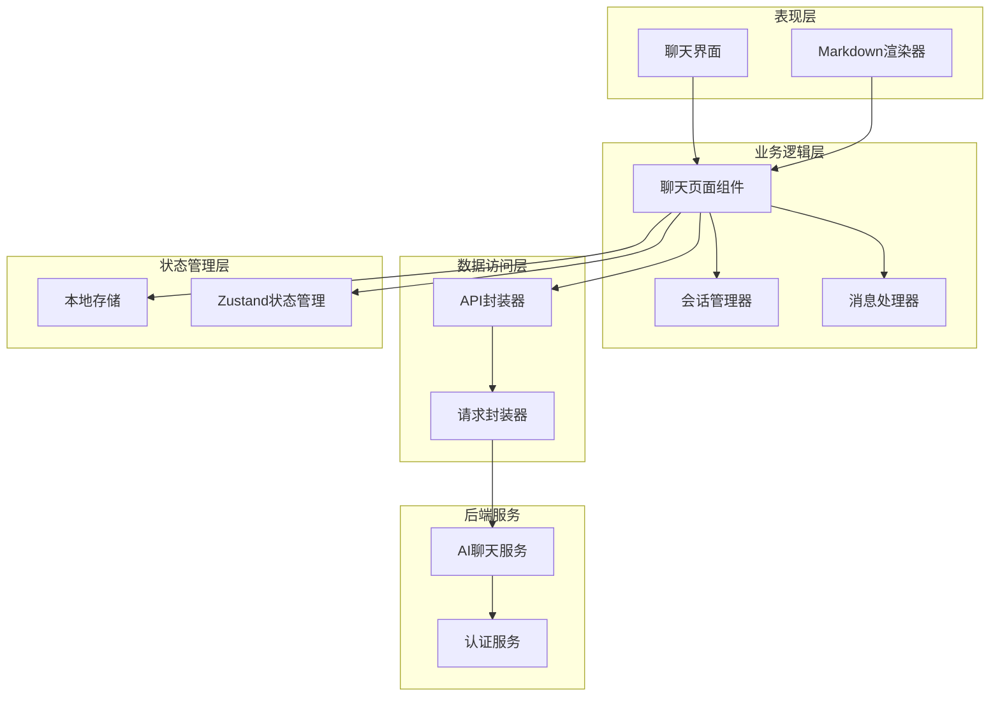
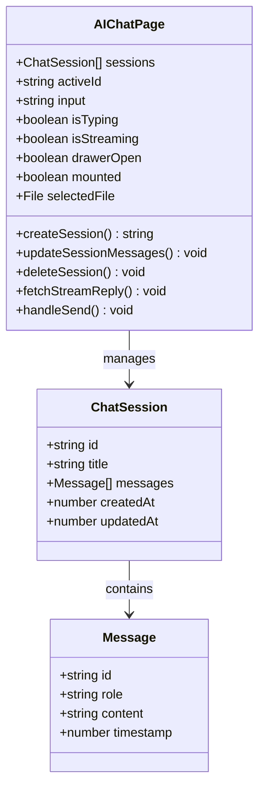
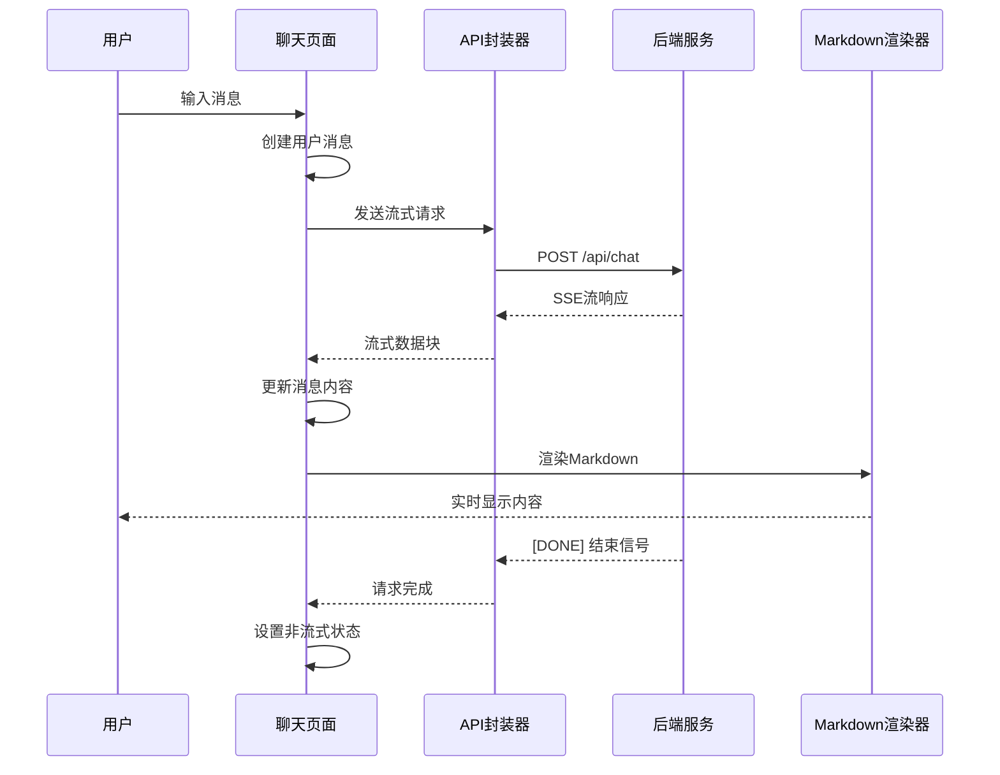
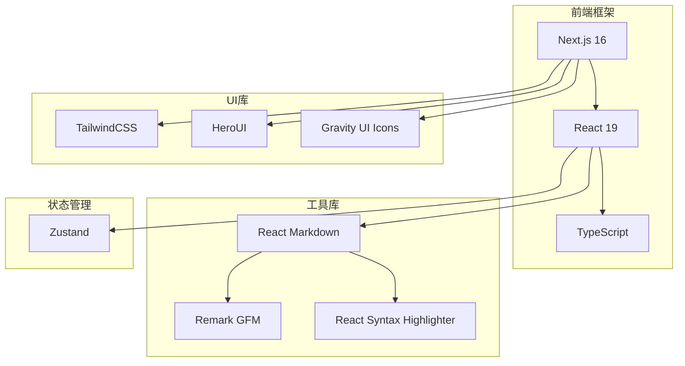
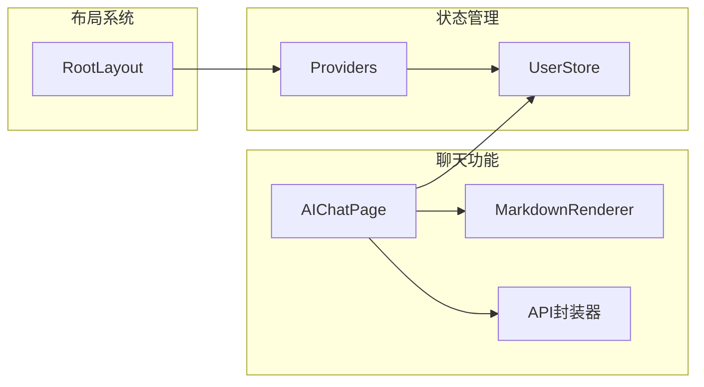

# AI聊天路由

<cite>
**本文档引用的文件**
- [src/app/aichat/page.tsx](file://src/app/aichat/page.tsx)
- [src/components/MarkdownRenderer.tsx](file://src/components/MarkdownRenderer.tsx)
- [src/api/api.ts](file://src/api/api.ts)
- [src/api/request.ts](file://src/api/request.ts)
- [src/store/user.tsx](file://src/store/user.tsx)
- [src/components/Providers.tsx](file://src/components/Providers.tsx)
- [src/app/layout.tsx](file://src/app/layout.tsx)
- [package.json](file://package.json)
</cite>

## 目录
1. [简介](#简介)
2. [项目结构](#项目结构)
3. [核心组件](#核心组件)
4. [架构概览](#架构概览)
5. [详细组件分析](#详细组件分析)
6. [依赖关系分析](#依赖关系分析)
7. [性能考虑](#性能考虑)
8. [故障排除指南](#故障排除指南)
9. [结论](#结论)

## 简介

本项目是一个基于Next.js 16的AI聊天应用，实现了完整的聊天路由功能。该系统提供了实时的AI对话体验，支持消息历史存储、文件上传、流式响应处理和多种交互功能。系统采用现代化的前端技术栈，包括React 19、TypeScript、TailwindCSS和Zustand状态管理。

## 项目结构

项目采用基于功能的模块化组织方式，主要目录结构如下：



**图表来源**
- [src/app/aichat/page.tsx:1-50](file://src/app/aichat/page.tsx#L1-L50)
- [src/components/MarkdownRenderer.tsx:1-20](file://src/components/MarkdownRenderer.tsx#L1-L20)
- [src/api/api.ts:1-20](file://src/api/api.ts#L1-L20)

**章节来源**
- [src/app/aichat/page.tsx:1-100](file://src/app/aichat/page.tsx#L1-L100)
- [src/components/MarkdownRenderer.tsx:1-30](file://src/components/MarkdownRenderer.tsx#L1-L30)
- [src/api/api.ts:1-30](file://src/api/api.ts#L1-L30)

## 核心组件

### 聊天页面主组件

AI聊天页面是整个应用的核心组件，实现了完整的聊天功能。该组件包含了以下关键特性：

- **会话管理**：支持多个聊天会话的创建、切换和删除
- **消息处理**：实时消息显示、Markdown渲染和流式响应处理
- **用户交互**：输入框自动调整高度、文件上传、快捷提问等功能
- **状态持久化**：本地存储会话历史和活跃会话状态

### Markdown渲染器

专门用于渲染AI生成的Markdown内容，支持：
- 代码高亮显示
- 表格渲染
- 链接处理
- 一键复制代码功能
- 流式输出光标效果

### API请求封装

提供统一的API请求处理机制：
- **流式请求支持**：专门处理SSE格式的流式响应
- **错误处理**：统一的HTTP错误和业务错误处理
- **认证集成**：自动处理Token认证
- **超时控制**：内置请求超时机制

**章节来源**
- [src/app/aichat/page.tsx:79-184](file://src/app/aichat/page.tsx#L79-L184)
- [src/components/MarkdownRenderer.tsx:72-139](file://src/components/MarkdownRenderer.tsx#L72-L139)
- [src/api/request.ts:57-235](file://src/api/request.ts#L57-L235)

## 架构概览

系统采用分层架构设计，确保各层职责清晰分离：



**图表来源**
- [src/app/aichat/page.tsx:217-409](file://src/app/aichat/page.tsx#L217-L409)
- [src/api/api.ts:73-79](file://src/api/api.ts#L73-L79)
- [src/api/request.ts:57-235](file://src/api/request.ts#L57-L235)

## 详细组件分析

### 聊天页面组件分析

#### 数据结构设计

系统使用标准化的数据结构来管理聊天会话：



**图表来源**
- [src/app/aichat/page.tsx:10-23](file://src/app/aichat/page.tsx#L10-L23)
- [src/app/aichat/page.tsx:145-184](file://src/app/aichat/page.tsx#L145-L184)

#### 消息处理流程

消息处理采用流式架构，支持实时响应：



**图表来源**
- [src/app/aichat/page.tsx:412-451](file://src/app/aichat/page.tsx#L412-L451)
- [src/api/api.ts:73-79](file://src/api/api.ts#L73-L79)
- [src/api/request.ts:291-301](file://src/api/request.ts#L291-L301)

#### WebSocket连接管理

虽然当前实现使用SSE而非WebSocket，但系统具备扩展为WebSocket的能力：

```mermaid
flowchart TD
START[建立连接] --> CHECK_TOKEN{检查Token}
CHECK_TOKEN --> |有效| CONNECT[建立连接]
CHECK_TOKEN --> |无效| REAUTH[重新认证]
REAUTH --> CHECK_TOKEN
CONNECT --> HANDLE_EVENTS{处理事件}
HANDLE_EVENTS --> MESSAGE[接收消息]
HANDLE_EVENTS --> ERROR[处理错误]
HANDLE_EVENTS --> CLOSE[连接关闭]
MESSAGE --> UPDATE_UI[更新UI]
UPDATE_UI --> HANDLE_EVENTS
ERROR --> HANDLE_ERROR{错误类型}
HANDLE_ERROR --> |网络错误| RETRY[重试连接]
HANDLE_ERROR --> |认证失败| REAUTH
HANDLE_ERROR --> |其他错误| NOTIFY[通知用户]
RETRY --> CONNECT
CLOSE --> CLEANUP[清理资源]
NOTIFY --> CLEANUP
CLEANUP --> END[结束]
```



**图表来源**
- [src/app/aichat/page.tsx:236-409](file://src/app/aichat/page.tsx#L236-L409)
- [src/api/request.ts:148-235](file://src/api/request.ts#L148-L235)

### Markdown渲染器组件

Markdown渲染器提供了丰富的文本渲染能力：

```mermaid
classDiagram
class MarkdownRenderer {
+string content
+boolean isStreaming
+render() JSX.Element
}
class CodeBlock {
+string language
+string children
+boolean copied
+handleCopy() void
}
class ReactMarkdown {
+remarkPlugins[]
+components{}
+children
}
MarkdownRenderer --> CodeBlock : contains
MarkdownRenderer --> ReactMarkdown : uses
CodeBlock --> SyntaxHighlighter : uses
```

**图表来源**
- [src/components/MarkdownRenderer.tsx:72-139](file://src/components/MarkdownRenderer.tsx#L72-L139)
- [src/components/MarkdownRenderer.tsx:18-60](file://src/components/MarkdownRenderer.tsx#L18-L60)

**章节来源**
- [src/app/aichat/page.tsx:79-946](file://src/app/aichat/page.tsx#L79-L946)
- [src/components/MarkdownRenderer.tsx:1-139](file://src/components/MarkdownRenderer.tsx#L1-L139)

## 依赖关系分析

### 技术栈依赖

项目采用现代化的技术栈组合：



**图表来源**
- [package.json:11-26](file://package.json#L11-L26)

### 组件间依赖关系



**图表来源**
- [src/app/aichat/page.tsx:1-10](file://src/app/aichat/page.tsx#L1-L10)
- [src/components/Providers.tsx:8-19](file://src/components/Providers.tsx#L8-L19)
- [src/app/layout.tsx:28-43](file://src/app/layout.tsx#L28-L43)

**章节来源**
- [package.json:1-39](file://package.json#L1-L39)
- [src/components/Providers.tsx:1-20](file://src/components/Providers.tsx#L1-L20)

## 性能考虑

### 内存管理

系统采用了多项内存优化策略：

- **虚拟滚动**：对于大量消息的场景，建议实现虚拟滚动以减少DOM节点数量
- **消息缓存**：使用React.memo优化消息组件渲染
- **资源清理**：及时清理AbortController和事件监听器

### 网络优化

- **请求合并**：将多个小请求合并为批量请求
- **缓存策略**：实现智能缓存机制，避免重复请求相同内容
- **连接池**：对于WebSocket连接，实现连接池管理

### 渲染优化

- **懒加载**：图片和长内容采用懒加载
- **防抖节流**：输入框和滚动事件使用防抖节流
- **增量渲染**：流式响应采用增量渲染策略

## 故障排除指南

### 常见问题及解决方案

#### Token认证问题

**问题症状**：用户登录后仍显示未认证状态

**解决步骤**：
1. 检查localStorage中的token是否存在
2. 验证token格式和有效期
3. 确认后端认证服务正常运行

#### 流式响应中断

**问题症状**：AI响应在中途停止或显示错误

**解决步骤**：
1. 检查网络连接稳定性
2. 验证后端SSE服务状态
3. 查看浏览器控制台错误信息
4. 实现自动重连机制

#### 消息历史丢失

**问题症状**：刷新页面后聊天记录消失

**解决步骤**：
1. 确认localStorage权限设置
2. 检查浏览器隐私设置
3. 验证数据序列化/反序列化逻辑

**章节来源**
- [src/app/aichat/page.tsx:248-409](file://src/app/aichat/page.tsx#L248-L409)
- [src/api/request.ts:158-235](file://src/api/request.ts#L158-L235)

## 结论

本AI聊天路由系统展现了现代Web应用的最佳实践，具有以下特点：

**技术优势**：
- 完整的流式响应处理机制
- 优雅的错误处理和恢复策略
- 灵活的状态管理和持久化方案
- 丰富的用户体验设计

**架构优势**：
- 分层清晰的架构设计
- 模块化的组件组织
- 统一的API请求处理
- 可扩展的插件机制

**未来改进方向**：
- 集成WebSocket实现真正的实时通信
- 添加消息队列和重试机制
- 实现离线消息同步
- 增强AI模型的配置和管理功能

该系统为构建企业级AI聊天应用提供了坚实的基础，开发者可以根据具体需求进行定制和扩展。