# 个人中心路由

<cite>
**本文档引用的文件**
- [src/app/me/page.tsx](file://src/app/me/page.tsx)
- [src/store/user.tsx](file://src/store/user.tsx)
- [src/components/BottomNav.tsx](file://src/components/BottomNav.tsx)
- [src/components/Providers.tsx](file://src/components/Providers.tsx)
- [src/components/Header.tsx](file://src/components/Header.tsx)
- [src/app/layout.tsx](file://src/app/layout.tsx)
- [src/app/login/page.tsx](file://src/app/login/page.tsx)
- [src/api/login.ts](file://src/api/login.ts)
- [src/api/request.ts](file://src/api/request.ts)
- [proxy.ts](file://proxy.ts)
- [next.config.ts](file://next.config.ts)
- [package.json](file://package.json)
</cite>

## 目录
1. [简介](#简介)
2. [项目结构](#项目结构)
3. [核心组件](#核心组件)
4. [架构概览](#架构概览)
5. [详细组件分析](#详细组件分析)
6. [依赖关系分析](#依赖关系分析)
7. [性能考虑](#性能考虑)
8. [故障排除指南](#故障排除指南)
9. [结论](#结论)

## 简介

个人中心路由是基于 Next.js App Router 构建的用户个人信息展示和管理系统。该系统实现了完整的用户认证流程、个人信息管理、以及安全的用户数据存储机制。本文档将深入分析个人中心路由的实现细节，包括组件结构、数据绑定、表单处理、认证状态检查、个人信息编辑和设置管理功能，并提供用户数据安全和隐私保护措施。

## 项目结构

该项目采用现代化的 Next.js 16 App Router 架构，采用文件系统路由的方式组织应用结构。个人中心路由位于 `src/app/me/page.tsx`，与全局布局和状态管理紧密集成。

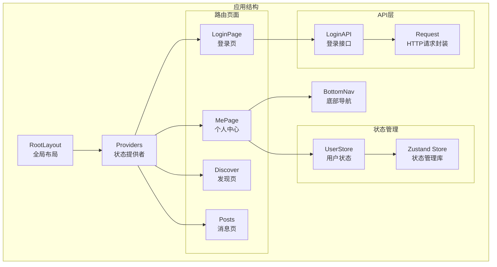

**图表来源**
- [src/app/layout.tsx:28-42](file://src/app/layout.tsx#L28-L42)
- [src/components/Providers.tsx:8-18](file://src/components/Providers.tsx#L8-L18)
- [src/app/me/page.tsx:1-67](file://src/app/me/page.tsx#L1-L67)

**章节来源**
- [src/app/layout.tsx:1-44](file://src/app/layout.tsx#L1-L44)
- [src/components/Providers.tsx:1-20](file://src/components/Providers.tsx#L1-L20)

## 核心组件

个人中心路由的核心组件包括个人中心页面、用户状态管理、底部导航和全局布局。这些组件协同工作，为用户提供完整的个人信息管理和操作界面。

### 用户状态管理

系统使用 Zustand 作为状态管理解决方案，提供了轻量级且易于使用的状态管理方案。用户状态包括用户名、邮箱等个人信息，以及状态更新方法。

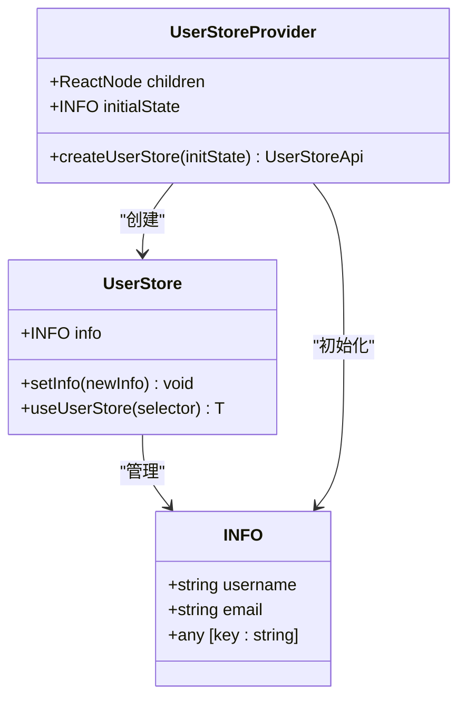

**图表来源**
- [src/store/user.tsx:7-25](file://src/store/user.tsx#L7-L25)
- [src/store/user.tsx:36-46](file://src/store/user.tsx#L36-L46)

### 认证状态检查

系统实现了多层次的认证状态检查机制，确保用户访问的安全性。认证状态检查贯穿客户端和服务器端，提供了完整的安全防护。

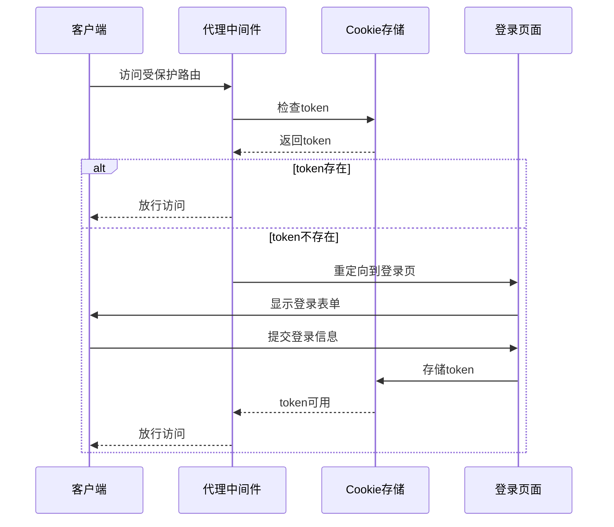

**图表来源**
- [proxy.ts:11-33](file://proxy.ts#L11-L33)
- [src/app/login/page.tsx:14-58](file://src/app/login/page.tsx#L14-L58)

**章节来源**
- [src/store/user.tsx:1-56](file://src/store/user.tsx#L1-L56)
- [proxy.ts:1-52](file://proxy.ts#L1-L52)

## 架构概览

个人中心路由采用了分层架构设计，从底层的数据访问层到顶层的用户界面层，每一层都有明确的职责分工。

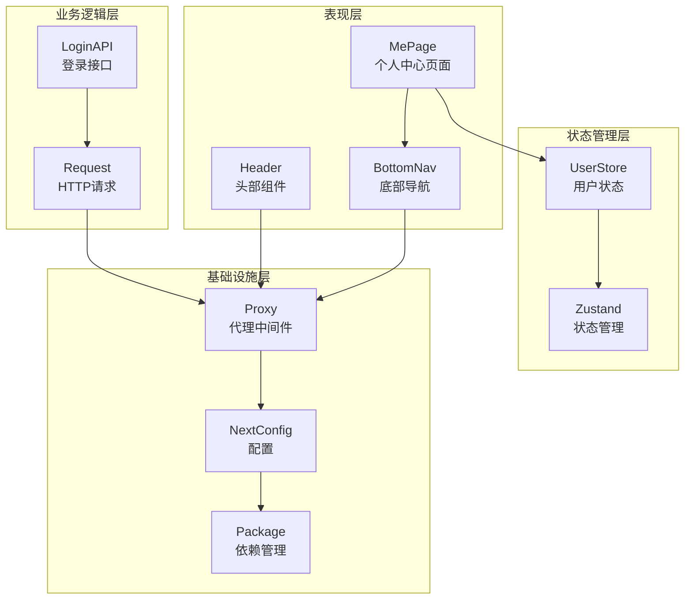

**图表来源**
- [src/app/me/page.tsx:1-67](file://src/app/me/page.tsx#L1-L67)
- [src/components/BottomNav.tsx:1-103](file://src/components/BottomNav.tsx#L1-L103)
- [src/components/Header.tsx:1-55](file://src/components/Header.tsx#L1-L55)
- [src/store/user.tsx:1-56](file://src/store/user.tsx#L1-L56)

## 详细组件分析

### 个人中心页面组件分析

个人中心页面是用户信息展示和管理的核心界面，采用了卡片式布局设计，提供了清晰的信息层次结构。

#### 页面结构设计

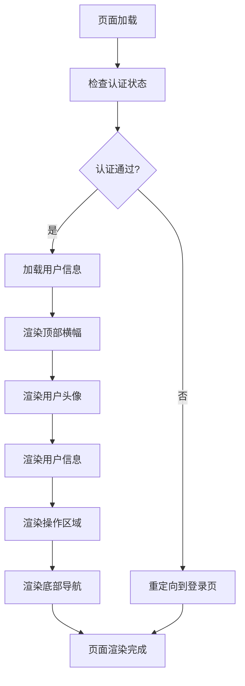

**图表来源**
- [src/app/me/page.tsx:6-67](file://src/app/me/page.tsx#L6-L67)

#### 组件数据绑定机制

个人中心页面实现了双向数据绑定，用户信息通过 Zustand 状态管理进行实时更新。

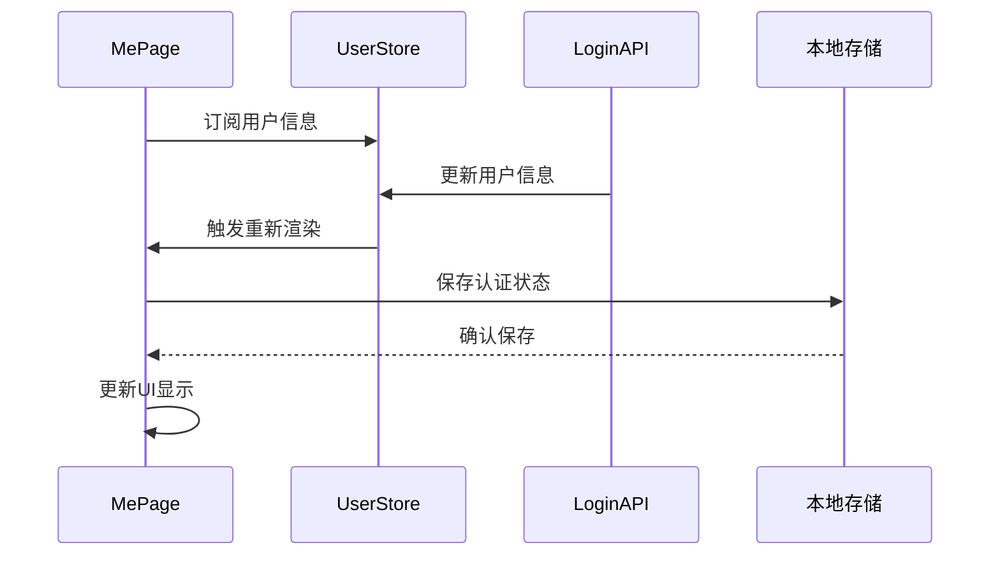

**图表来源**
- [src/app/me/page.tsx:9-17](file://src/app/me/page.tsx#L9-L17)
- [src/store/user.tsx:18-25](file://src/store/user.tsx#L18-L25)

**章节来源**
- [src/app/me/page.tsx:1-67](file://src/app/me/page.tsx#L1-L67)

### 用户认证状态检查

系统实现了多层次的认证状态检查机制，确保用户访问的安全性和连续性。

#### 客户端认证检查

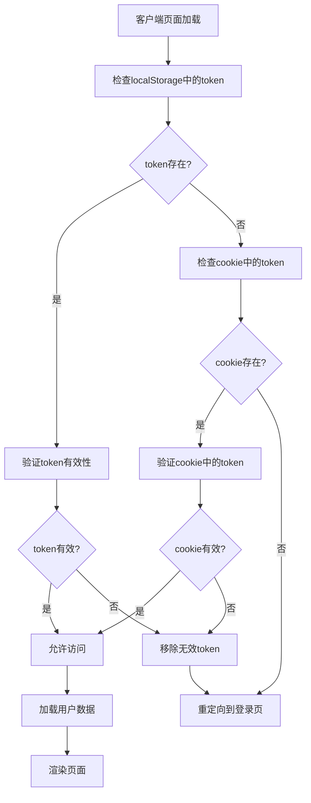

**图表来源**
- [src/app/login/page.tsx:30-48](file://src/app/login/page.tsx#L30-L48)
- [src/api/request.ts:94-112](file://src/api/request.ts#L94-L112)

#### 服务器端认证检查

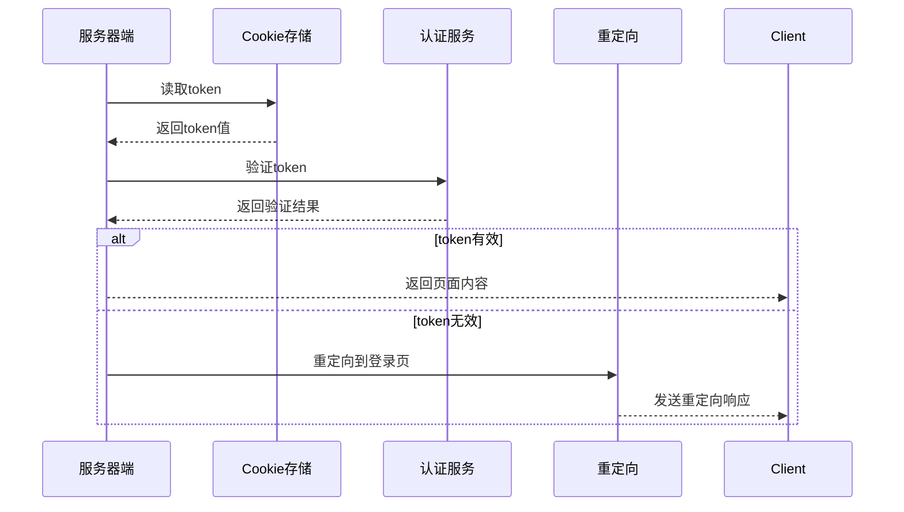

**图表来源**
- [proxy.ts:19-32](file://proxy.ts#L19-L32)
- [src/api/request.ts:161-173](file://src/api/request.ts#L161-L173)

**章节来源**
- [src/app/login/page.tsx:1-119](file://src/app/login/page.tsx#L1-L119)
- [proxy.ts:1-52](file://proxy.ts#L1-L52)

### 个人信息编辑功能

虽然当前版本的个人中心页面主要展示用户信息，但系统已经为个人信息编辑功能预留了扩展点。

#### 表单处理机制

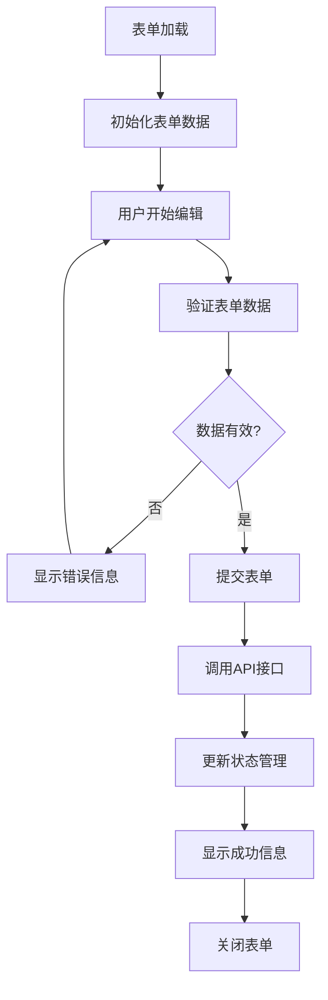

**图表来源**
- [src/app/login/page.tsx:20-58](file://src/app/login/page.tsx#L20-L58)
- [src/api/login.ts:48-51](file://src/api/login.ts#L48-L51)

**章节来源**
- [src/api/login.ts:1-81](file://src/api/login.ts#L1-L81)

### 设置管理功能

个人中心页面提供了设置管理入口，用户可以通过设置界面管理应用的各种配置选项。

#### 设置界面设计

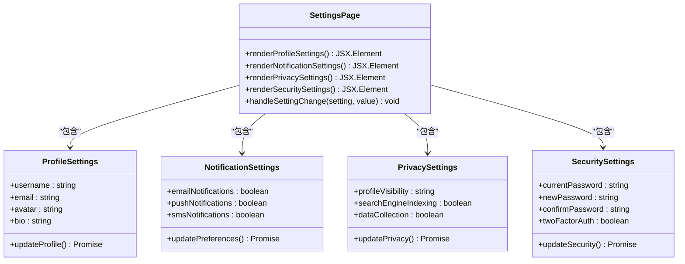

**图表来源**
- [src/app/me/page.tsx:44-53](file://src/app/me/page.tsx#L44-L53)

## 依赖关系分析

个人中心路由的依赖关系体现了清晰的分层架构和模块化设计原则。

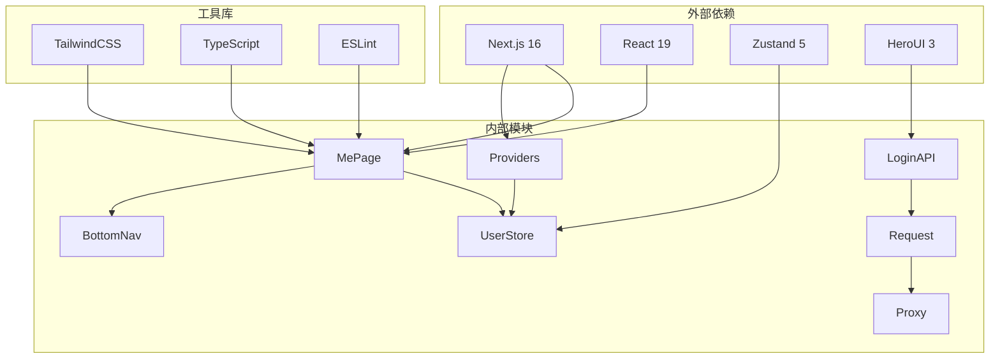

**图表来源**
- [package.json:11-25](file://package.json#L11-L25)
- [src/app/me/page.tsx:1-67](file://src/app/me/page.tsx#L1-L67)
- [src/store/user.tsx:1-56](file://src/store/user.tsx#L1-L56)

**章节来源**
- [package.json:1-39](file://package.json#L1-L39)
- [next.config.ts:1-76](file://next.config.ts#L1-L76)

## 性能考虑

系统在设计时充分考虑了性能优化，采用了多种策略来提升用户体验和应用性能。

### 渲染优化

- **客户端组件标记**: 使用 `"use client"` 指令确保组件在客户端渲染，提高交互性能
- **状态局部化**: 用户状态通过 Zustand 进行局部管理，避免全局状态污染
- **懒加载**: 图片资源使用 Next.js 的 Image 组件进行懒加载优化

### 缓存策略

- **组件缓存**: 启用了 Next.js 16 的 Cache Components 特性，提升渲染性能
- **路由缓存**: 利用 Next.js 的路由缓存机制，减少重复渲染
- **静态资源缓存**: 配置了合理的静态资源缓存策略

### 网络优化

- **请求拦截**: 通过 HTTP 请求拦截器统一处理认证和错误处理
- **超时控制**: 实现了请求超时机制，提升用户体验
- **错误恢复**: 提供了完善的错误处理和恢复机制

## 故障排除指南

### 常见问题及解决方案

#### 认证相关问题

**问题**: 用户登录后无法访问个人中心页面
**原因**: token 存储或验证出现问题
**解决方案**:
1. 检查 localStorage 中的 token 是否正确存储
2. 验证 cookie 中的 token 是否同步更新
3. 确认代理中间件的认证逻辑正常工作

#### 状态管理问题

**问题**: 用户信息无法正确显示或更新
**原因**: Zustand 状态管理异常
**解决方案**:
1. 检查 UserStore 的初始化状态
2. 验证 setInfo 方法的调用时机
3. 确认组件订阅状态的正确性

#### API 调用问题

**问题**: 登录请求失败或响应异常
**原因**: 网络请求或后端服务问题
**解决方案**:
1. 检查网络连接状态
2. 验证 API 端点的可达性
3. 查看请求拦截器的日志输出

**章节来源**
- [src/api/request.ts:157-235](file://src/api/request.ts#L157-L235)
- [src/store/user.tsx:48-56](file://src/store/user.tsx#L48-L56)

## 结论

个人中心路由系统展现了现代 React 应用开发的最佳实践，通过合理的架构设计、完善的状态管理和严格的安全措施，为用户提供了可靠的个人信息管理体验。

### 主要优势

1. **安全性**: 实现了多层次的认证检查机制，确保用户数据安全
2. **可扩展性**: 采用模块化设计，便于功能扩展和维护
3. **性能优化**: 运用了多种性能优化策略，提升了用户体验
4. **开发效率**: 使用现代化的开发工具和框架，提高了开发效率

### 技术亮点

- **Zustand 状态管理**: 轻量级且易于使用的状态管理方案
- **Next.js App Router**: 最新的路由架构，支持更好的性能和开发体验
- **TypeScript 支持**: 提供完整的类型安全保障
- **TailwindCSS**: 现代化的样式解决方案

### 未来发展方向

1. **功能扩展**: 增强个人信息编辑功能，支持更丰富的用户配置
2. **性能优化**: 进一步优化渲染性能和网络请求效率
3. **安全加固**: 实施更严格的安全措施，保护用户隐私数据
4. **用户体验**: 改进界面设计和交互体验，提升用户满意度

该个人中心路由系统为构建企业级应用提供了坚实的技术基础，其设计理念和实现方式值得在类似项目中借鉴和参考。