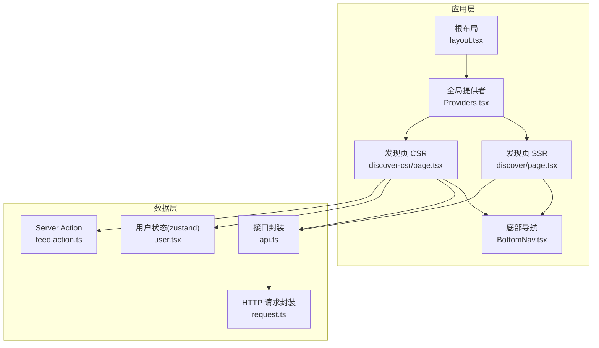
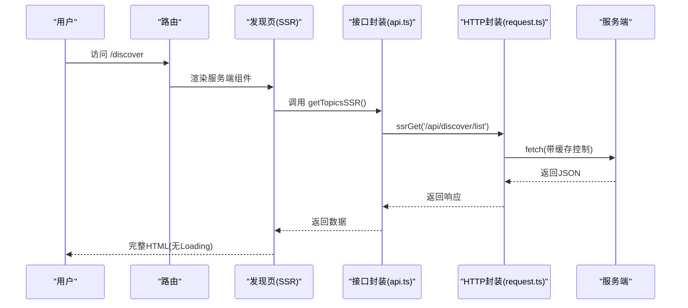
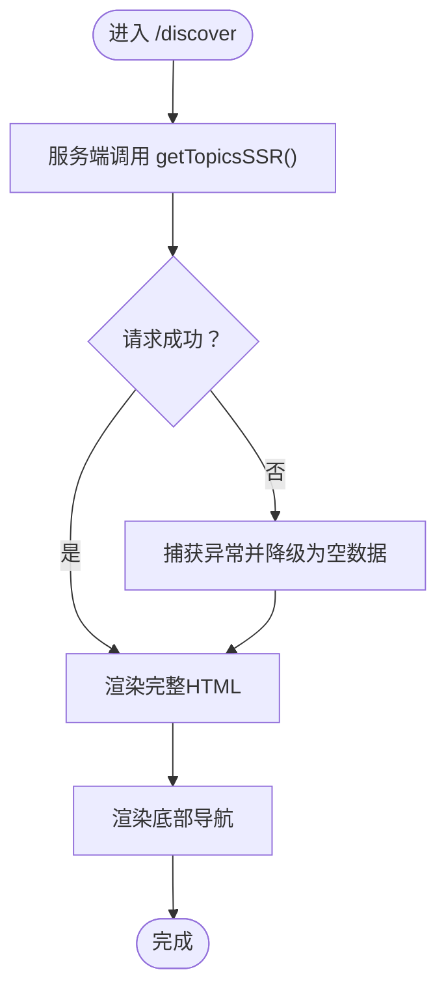
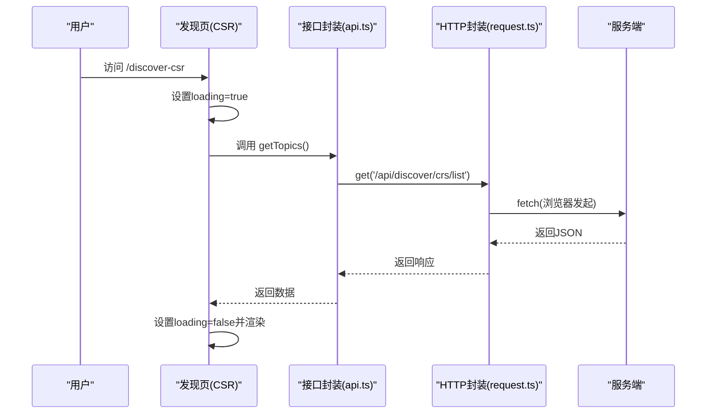
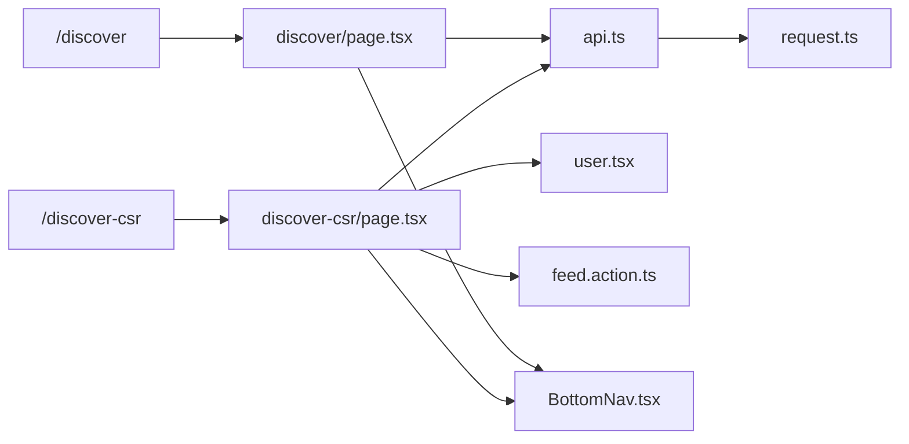

# 发现页路由

<cite>
**本文引用的文件**
- [discover/page.tsx](file://src/app/discover/page.tsx)
- [discover-csr/page.tsx](file://src/app/discover-csr/page.tsx)
- [api.ts](file://src/api/api.ts)
- [request.ts](file://src/api/request.ts)
- [feed.action.ts](file://src/actions/feed.action.ts)
- [user.tsx](file://src/store/user.tsx)
- [BottomNav.tsx](file://src/components/BottomNav.tsx)
- [WaterfallCard.tsx](file://src/components/WaterfallCard.tsx)
- [layout.tsx](file://src/app/layout.tsx)
- [Providers.tsx](file://src/components/Providers.tsx)
- [package.json](file://package.json)
</cite>

## 目录
1. [简介](#简介)
2. [项目结构](#项目结构)
3. [核心组件](#核心组件)
4. [架构总览](#架构总览)
5. [详细组件分析](#详细组件分析)
6. [依赖关系分析](#依赖关系分析)
7. [性能考量](#性能考量)
8. [故障排查指南](#故障排查指南)
9. [结论](#结论)
10. [附录](#附录)

## 简介
本文件系统化梳理“发现页”路由的实现与最佳实践，涵盖：
- 静态发现页（SSR）与客户端渲染发现页（CSR）的差异与适用场景
- 路由配置、页面组件结构与数据获取策略
- CSR 版本的客户端交互模式与 SSR 版本的服务端渲染差异
- 路由跳转与状态管理的最佳实践

## 项目结构
发现页路由位于应用的 App Router 路径下，分别提供 SSR 与 CSR 两种版本，并共享通用的 UI 组件与数据层。

图表来源
- [layout.tsx:28-43](file://src/app/layout.tsx#L28-L43)
- [Providers.tsx:8-19](file://src/components/Providers.tsx#L8-L19)
- [discover/page.tsx:13-182](file://src/app/discover/page.tsx#L13-L182)
- [discover-csr/page.tsx:16-251](file://src/app/discover-csr/page.tsx#L16-L251)
- [api.ts:44-81](file://src/api/api.ts#L44-L81)
- [request.ts:309-333](file://src/api/request.ts#L309-L333)
- [feed.action.ts:14-30](file://src/actions/feed.action.ts#L14-L30)
- [user.tsx:18-25](file://src/store/user.tsx#L18-L25)

章节来源
- [layout.tsx:1-44](file://src/app/layout.tsx#L1-L44)
- [Providers.tsx:1-20](file://src/components/Providers.tsx#L1-L20)

## 核心组件
- 发现页 SSR：服务端组件，使用服务端 API 获取数据，首屏即完整 HTML，无闪烁与二次请求。
- 发现页 CSR：客户端组件，首次返回骨架屏，随后在浏览器发起请求获取数据，展示 Loading 状态。
- 底部导航：跨页面通用，提供“发现SSR/发现CSR”等导航项。
- 接口封装：统一管理热搜列表、主页瀑布流、聊天等接口；支持 SSR/CSR 两种调用方式。
- HTTP 请求封装：自动处理基础路径、鉴权头、超时、拦截器、错误处理与 SSR 缓存控制。
- Server Action：封装写操作（如点赞），利用 revalidatePath 触发缓存失效与页面更新。
- 用户状态：基于 Zustand 的用户信息存储，提供 Provider 包裹与 Hook 选择器。

章节来源
- [discover/page.tsx:13-182](file://src/app/discover/page.tsx#L13-L182)
- [discover-csr/page.tsx:16-251](file://src/app/discover-csr/page.tsx#L16-L251)
- [BottomNav.tsx:67-102](file://src/components/BottomNav.tsx#L67-L102)
- [api.ts:44-81](file://src/api/api.ts#L44-L81)
- [request.ts:309-333](file://src/api/request.ts#L309-L333)
- [feed.action.ts:14-30](file://src/actions/feed.action.ts#L14-L30)
- [user.tsx:18-25](file://src/store/user.tsx#L18-L25)

## 架构总览
SSR 与 CSR 的关键差异体现在数据获取时机与渲染位置：
- SSR：在 Node.js 服务端发起请求，将完整 HTML 返回给浏览器，首屏无 Loading。
- CSR：浏览器先收到骨架 HTML，JS 初始化后发起请求，展示 Loading，再填充数据。

图表来源
- [discover/page.tsx:21-50](file://src/app/discover/page.tsx#L21-L50)
- [api.ts:50-55](file://src/api/api.ts#L50-L55)
- [request.ts:309-333](file://src/api/request.ts#L309-L333)

章节来源
- [discover/page.tsx:13-182](file://src/app/discover/page.tsx#L13-L182)
- [api.ts:44-81](file://src/api/api.ts#L44-L81)
- [request.ts:309-333](file://src/api/request.ts#L309-L333)

## 详细组件分析

### SSR 发现页（discover/page.tsx）
- 组件类型：服务端组件（无 "use client" 指令）
- 数据获取：在服务端调用接口封装的 SSR 方法，确保每次请求获取最新数据
- 错误处理：对重定向错误进行特殊处理，保证跳转生效
- 页面结构：包含信息面板、Tab 栏、热榜列表、底部导航
- 交互对比：通过链接跳转到 CSR 版本，直观感受差异

图表来源
- [discover/page.tsx:13-182](file://src/app/discover/page.tsx#L13-L182)
- [api.ts:50-55](file://src/api/api.ts#L50-L55)

章节来源
- [discover/page.tsx:13-182](file://src/app/discover/page.tsx#L13-L182)
- [api.ts:44-81](file://src/api/api.ts#L44-L81)

### CSR 发现页（discover-csr/page.tsx）
- 组件类型：客户端组件（含 "use client" 指令）
- 数据获取：在浏览器端发起请求，首次渲染骨架屏，随后填充数据
- 状态管理：使用 useState/ useEffect 管理 loading、时间戳与数据
- 交互特性：提供“重新加载数据”按钮，便于观察 Loading 效果
- 页面结构：信息面板、Tab 栏、热榜列表（骨架屏/数据）、底部导航

图表来源
- [discover-csr/page.tsx:16-79](file://src/app/discover-csr/page.tsx#L16-L79)
- [api.ts:46-48](file://src/api/api.ts#L46-L48)
- [request.ts:266-289](file://src/api/request.ts#L266-L289)

章节来源
- [discover-csr/page.tsx:16-251](file://src/app/discover-csr/page.tsx#L16-L251)
- [api.ts:44-81](file://src/api/api.ts#L44-L81)
- [request.ts:266-289](file://src/api/request.ts#L266-L289)

### 底部导航（BottomNav.tsx）
- 提供跨页面导航，包含“发现SSR/发现CSR”等入口
- 基于当前路径高亮，支持中心按钮与图标样式
- 通过 Link 组件实现预取与无刷新跳转

章节来源
- [BottomNav.tsx:67-102](file://src/components/BottomNav.tsx#L67-L102)

### 接口封装（api.ts）
- 热搜接口：提供客户端调用与 SSR 调用两个方法
- 主页瀑布流：提供 SSR 获取与点赞接口
- 统一响应结构：约定 { code, data, message }，便于统一处理

章节来源
- [api.ts:44-81](file://src/api/api.ts#L44-L81)

### HTTP 请求封装（request.ts）
- 自动区分 SSR/CSR 环境的基础路径
- 自动注入鉴权头（localStorage/cookies）
- 支持超时控制、拦截器、流式响应与 SSR 缓存控制
- 统一错误处理与重定向逻辑

章节来源
- [request.ts:40-47](file://src/api/request.ts#L40-L47)
- [request.ts:94-112](file://src/api/request.ts#L94-L112)
- [request.ts:309-333](file://src/api/request.ts#L309-L333)

### Server Action（feed.action.ts）
- 封装点赞等写操作，避免暴露后端细节
- 利用 revalidatePath 触发页面缓存失效与更新
- 可扩展鉴权包装器，统一前置校验

章节来源
- [feed.action.ts:14-30](file://src/actions/feed.action.ts#L14-L30)

### 用户状态（user.tsx）
- 基于 Zustand 的用户信息存储与 Provider
- 提供选择器 Hook，按需订阅状态变化
- 与全局提供者组合，贯穿应用层

章节来源
- [user.tsx:18-25](file://src/store/user.tsx#L18-L25)
- [Providers.tsx:8-19](file://src/components/Providers.tsx#L8-L19)

## 依赖关系分析
- 路由层：/discover 与 /discover-csr 分别映射至 SSR 与 CSR 页面
- 组件层：两个发现页共享 UI 组件（如 BottomNav），但数据来源不同
- 数据层：接口封装与 HTTP 封装解耦，分别负责业务接口与网络细节
- 状态层：Zustand 用户状态与全局提供者组合，支持跨组件状态共享

图表来源
- [discover/page.tsx:13-182](file://src/app/discover/page.tsx#L13-L182)
- [discover-csr/page.tsx:16-251](file://src/app/discover-csr/page.tsx#L16-L251)
- [api.ts:44-81](file://src/api/api.ts#L44-L81)
- [request.ts:309-333](file://src/api/request.ts#L309-L333)
- [user.tsx:18-25](file://src/store/user.tsx#L18-L25)
- [feed.action.ts:14-30](file://src/actions/feed.action.ts#L14-L30)
- [BottomNav.tsx:67-102](file://src/components/BottomNav.tsx#L67-L102)

章节来源
- [discover/page.tsx:13-182](file://src/app/discover/page.tsx#L13-L182)
- [discover-csr/page.tsx:16-251](file://src/app/discover-csr/page.tsx#L16-L251)
- [api.ts:44-81](file://src/api/api.ts#L44-L81)
- [request.ts:309-333](file://src/api/request.ts#L309-L333)
- [user.tsx:18-25](file://src/store/user.tsx#L18-L25)
- [feed.action.ts:14-30](file://src/actions/feed.action.ts#L14-L30)
- [BottomNav.tsx:67-102](file://src/components/BottomNav.tsx#L67-L102)

## 性能考量
- SSR 优势
  - 首屏即完整 HTML，无 Loading，有利于 SEO 与首屏性能
  - 服务端直连后端，避免跨域与鉴权泄露风险
- CSR 优势
  - 交互更灵活，可按需加载与增量更新
  - 骨架屏提升感知性能，适合频繁交互场景
- 缓存策略
  - SSR 支持 no-store（每次动态）、force-cache（构建时静态）、ISR（定时刷新）
  - CSR 可结合本地缓存与状态管理优化重复访问体验
- 网络与错误
  - 统一超时与错误处理，避免阻塞主线程
  - 流式响应适用于长连接或实时场景

[本节为通用性能建议，不直接分析具体文件]

## 故障排查指南
- SSR 无法获取数据
  - 检查服务端基础路径与鉴权头是否正确注入
  - 确认 SSR 缓存配置是否符合预期
- CSR 请求失败
  - 查看 Network 面板确认请求是否发出
  - 检查鉴权头是否正确设置（localStorage）
- 重定向问题
  - SSR 中的重定向需抛出特定错误以生效
- 点赞功能异常
  - 确认 Server Action 是否正确触发 revalidatePath
  - 检查后端接口返回的统一结构

章节来源
- [discover/page.tsx:42-50](file://src/app/discover/page.tsx#L42-L50)
- [request.ts:161-173](file://src/api/request.ts#L161-L173)
- [feed.action.ts:23-30](file://src/actions/feed.action.ts#L23-L30)

## 结论
- SSR 发现页适合强调首屏性能与 SEO 的场景，数据在服务端获取，首屏即完整 HTML
- CSR 发现页适合强调交互灵活性与增量更新的场景，首次骨架屏后按需加载数据
- 通过统一的接口封装与 HTTP 封装，两种模式在数据获取与错误处理上保持一致
- 结合 Server Action 与状态管理，可实现安全、可控的写操作与页面更新

[本节为总结性内容，不直接分析具体文件]

## 附录

### 路由与页面映射
- /discover → SSR 发现页
- /discover-csr → CSR 发现页

章节来源
- [discover/page.tsx:13-182](file://src/app/discover/page.tsx#L13-L182)
- [discover-csr/page.tsx:16-251](file://src/app/discover-csr/page.tsx#L16-L251)

### 技术栈与版本
- Next.js 版本：16.2.0
- React 版本：19.2.4
- 状态管理：Zustand 5.0.12
- UI 框架：Heroui React

章节来源
- [package.json:11-26](file://package.json#L11-L26)