# 文章详情路由

<cite>
**本文档引用的文件**
- [src/app/posts/[id]/page.tsx](file://src/app/posts/[id]/page.tsx)
- [src/app/posts/layout.tsx](file://src/app/posts/layout.tsx)
- [src/app/posts/page.tsx](file://src/app/posts/page.tsx)
- [src/app/layout.tsx](file://src/app/layout.tsx)
- [src/components/MarkdownRenderer.tsx](file://src/components/MarkdownRenderer.tsx)
- [src/components/Providers.tsx](file://src/components/Providers.tsx)
- [src/store/counterStore.tsx](file://src/store/counterStore.tsx)
- [src/store/user.tsx](file://src/store/user.tsx)
- [next.config.ts](file://next.config.ts)
- [package.json](file://package.json)
</cite>

## 目录
1. [简介](#简介)
2. [项目结构概览](#项目结构概览)
3. [核心组件分析](#核心组件分析)
4. [架构总览](#架构总览)
5. [详细组件分析](#详细组件分析)
6. [依赖关系分析](#依赖关系分析)
7. [性能考虑](#性能考虑)
8. [故障排除指南](#故障排除指南)
9. [结论](#结论)

## 简介

本文档深入解析了基于 Next.js App Router 的文章详情路由系统，重点涵盖动态路由参数处理、嵌套路由配置、文章数据获取与页面渲染逻辑。该系统采用现代 React Server Components 架构，实现了 SEO 友好的 URL 结构和高效的预加载策略，同时提供了完整的组件组合和状态管理方案。

## 项目结构概览

该项目采用 Next.js 16.2.0 的 App Router 结构，专门针对文章详情路由进行了精心设计：

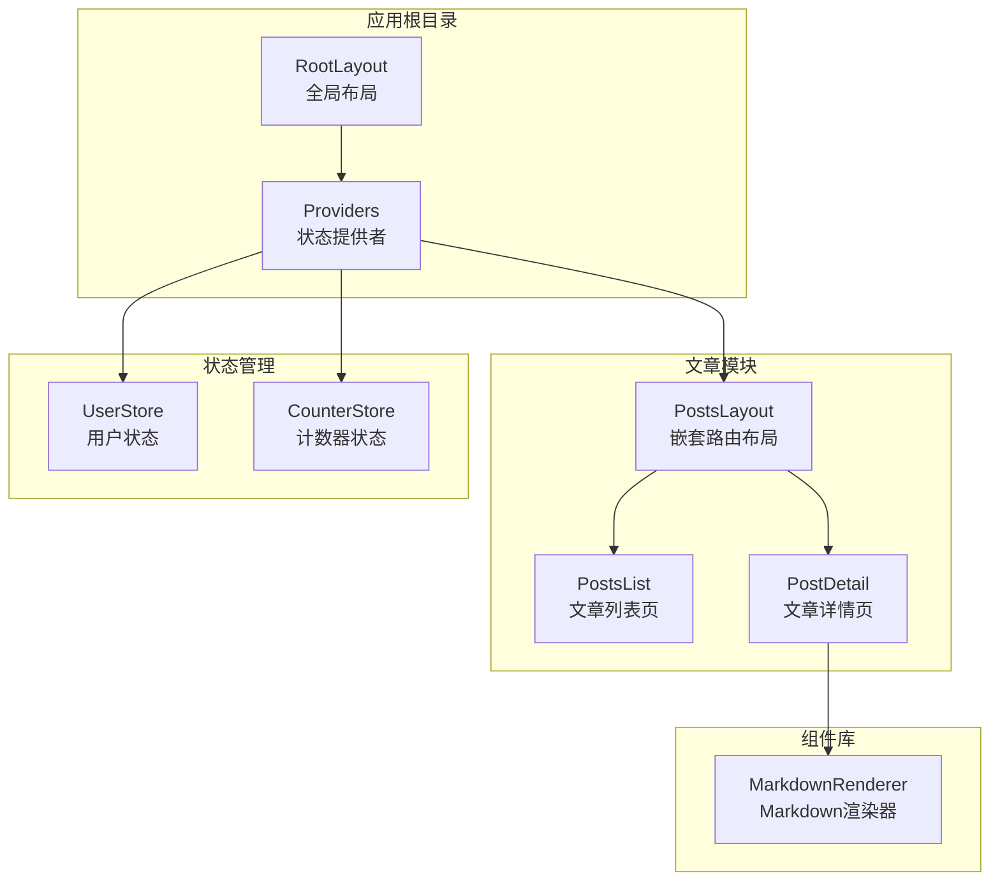

**图表来源**
- [src/app/layout.tsx:28-43](file://src/app/layout.tsx#L28-L43)
- [src/components/Providers.tsx:8-19](file://src/components/Providers.tsx#L8-L19)
- [src/app/posts/layout.tsx:26-30](file://src/app/posts/layout.tsx#L26-L30)

**章节来源**
- [src/app/layout.tsx:1-44](file://src/app/layout.tsx#L1-L44)
- [src/components/Providers.tsx:1-20](file://src/components/Providers.tsx#L1-L20)

## 核心组件分析

### 动态路由参数处理

文章详情路由的核心实现位于 `src/app/posts/[id]/page.tsx`，该文件展示了 Next.js 动态路由的强大功能：

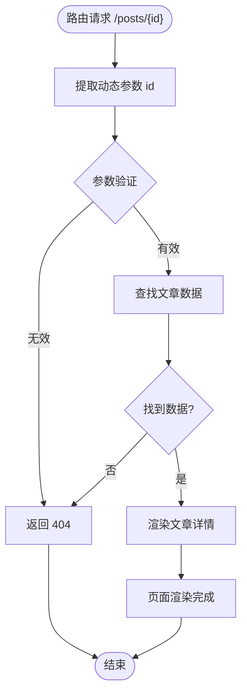

**图表来源**
- [src/app/posts/[id]/page.tsx:71-85](file://src/app/posts/[id]/page.tsx#L71-L85)

该实现采用了以下关键特性：
- **异步参数解析**：使用 `await params` 获取动态路由参数
- **数据验证**：检查文章是否存在，不存在则调用 `notFound()`
- **颜色主题映射**：根据文章 ID 动态选择颜色方案
- **SEO 友好 URL**：生成语义化的 `/posts/{id}` 结构

**章节来源**
- [src/app/posts/[id]/page.tsx:10-69](file://src/app/posts/[id]/page.tsx#L10-L69)

### 嵌套路由配置

嵌套路由系统通过 `src/app/posts/layout.tsx` 实现，提供了共享的侧边栏和导航功能：

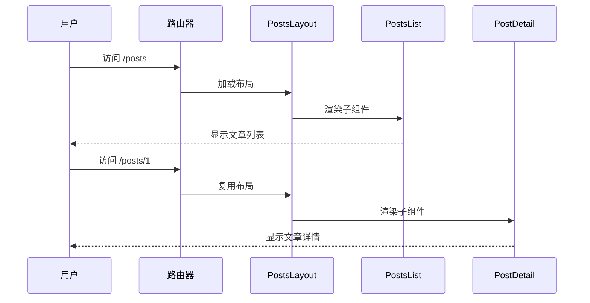

**图表来源**
- [src/app/posts/layout.tsx:26-30](file://src/app/posts/layout.tsx#L26-L30)
- [src/app/posts/page.tsx:16-96](file://src/app/posts/page.tsx#L16-L96)

**章节来源**
- [src/app/posts/layout.tsx:1-119](file://src/app/posts/layout.tsx#L1-L119)

## 架构总览

整个文章详情路由系统采用分层架构设计，确保了良好的可维护性和扩展性：

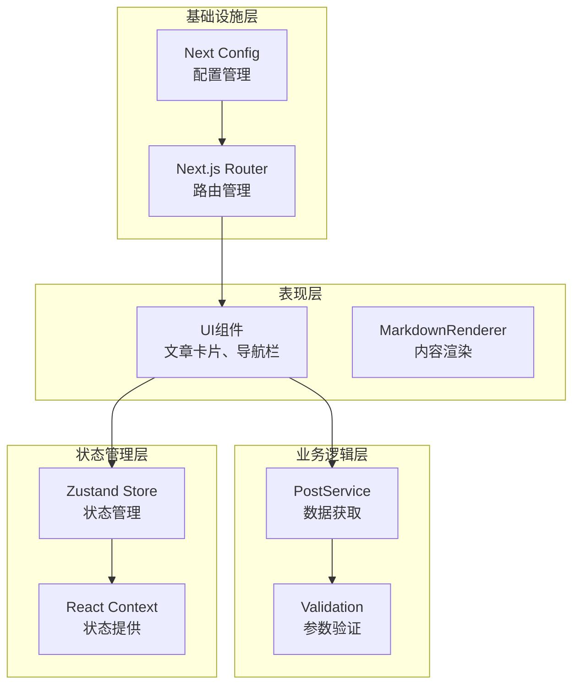

**图表来源**
- [src/app/posts/[id]/page.tsx:71-199](file://src/app/posts/[id]/page.tsx#L71-L199)
- [src/store/counterStore.tsx:24-32](file://src/store/counterStore.tsx#L24-L32)

## 详细组件分析

### 文章详情页面组件

文章详情页面 `PostPage` 是整个路由系统的核心组件，实现了完整的 SSR 功能：

#### 组件结构分析

```mermaid
classDiagram
class PostPage {
+params : Promise~{id : string}~
-postsData : Record~string, Article~
-colorSchemes : Record~string, ColorScheme~
+render() : JSX.Element
-findArticle(id : string) : Article
-getColorScheme(id : string) : ColorScheme
}
class Article {
+title : string
+content : string
+author : string
+date : string
+tags : string[]
+emoji : string
}
class ColorScheme {
+bg : string
+border : string
+text : string
+tagBg : string
+tagText : string
}
PostPage --> Article : 使用
PostPage --> ColorScheme : 映射
```

**图表来源**
- [src/app/posts/[id]/page.tsx:11-69](file://src/app/posts/[id]/page.tsx#L11-L69)

#### 数据流处理

文章详情页面的数据流处理遵循以下流程：

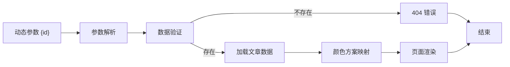

**图表来源**
- [src/app/posts/[id]/page.tsx:71-85](file://src/app/posts/[id]/page.tsx#L71-L85)

**章节来源**
- [src/app/posts/[id]/page.tsx:71-199](file://src/app/posts/[id]/page.tsx#L71-L199)

### 嵌套路由布局组件

`PostsLayout` 组件实现了 React Router 中 `<Outlet />` 的等效功能，提供了共享的侧边栏和导航功能：

#### 布局结构设计

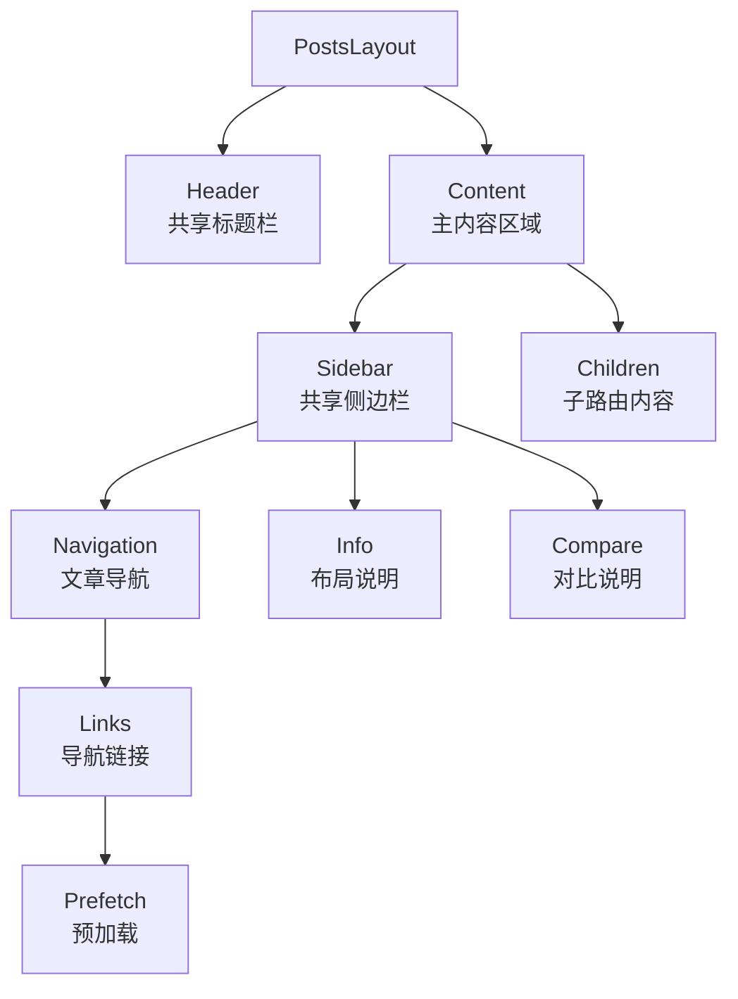

**图表来源**
- [src/app/posts/layout.tsx:32-118](file://src/app/posts/layout.tsx#L32-L118)

**章节来源**
- [src/app/posts/layout.tsx:26-119](file://src/app/posts/layout.tsx#L26-L119)

### 状态管理系统

项目采用了 Zustand 作为状态管理解决方案，提供了轻量级但功能强大的状态管理能力：

#### 状态存储架构

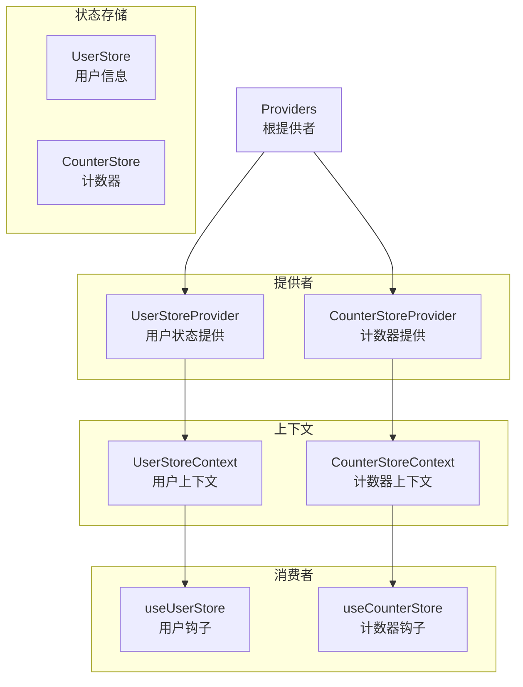

**图表来源**
- [src/components/Providers.tsx:8-19](file://src/components/Providers.tsx#L8-L19)
- [src/store/user.tsx:36-46](file://src/store/user.tsx#L36-L46)

**章节来源**
- [src/store/counterStore.tsx:1-89](file://src/store/counterStore.tsx#L1-L89)
- [src/store/user.tsx:1-56](file://src/store/user.tsx#L1-L56)

### Markdown 内容渲染

`MarkdownRenderer` 组件提供了丰富的 Markdown 内容渲染能力，支持代码高亮和交互功能：

#### 渲染组件架构

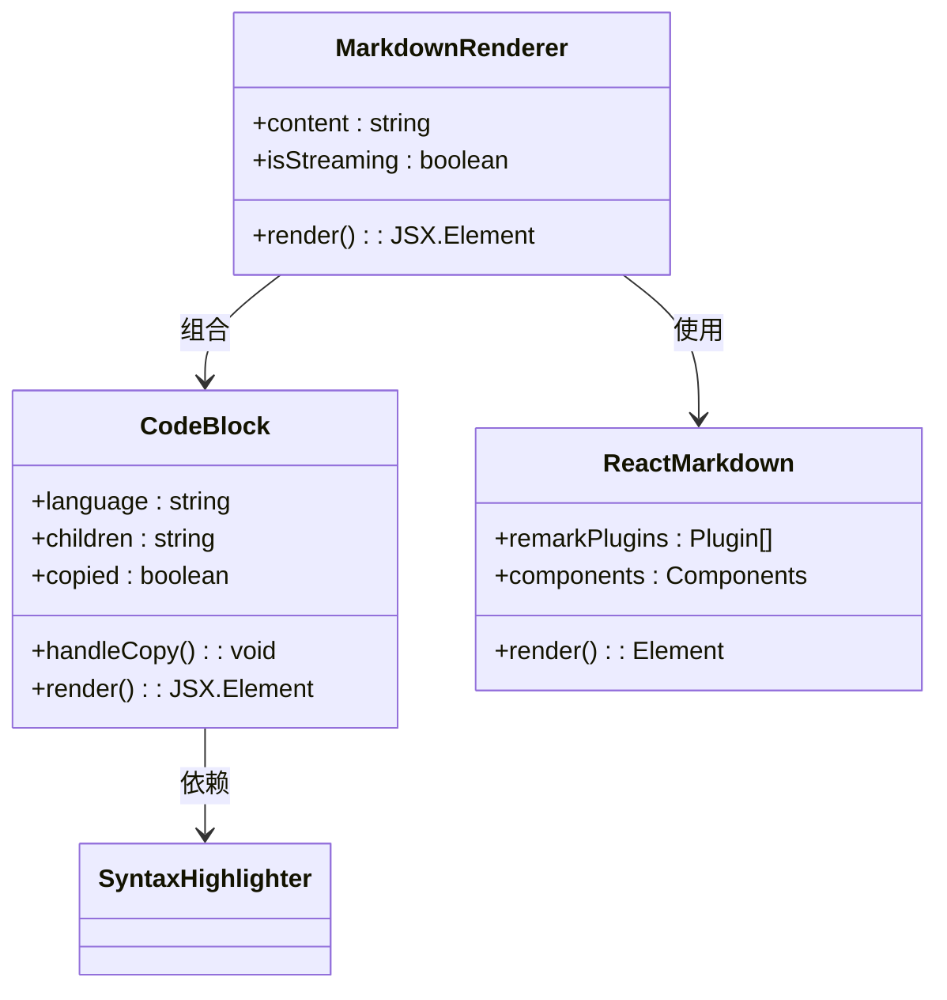

**图表来源**
- [src/components/MarkdownRenderer.tsx:72-136](file://src/components/MarkdownRenderer.tsx#L72-L136)

**章节来源**
- [src/components/MarkdownRenderer.tsx:1-139](file://src/components/MarkdownRenderer.tsx#L1-L139)

## 依赖关系分析

### 外部依赖关系

项目的主要依赖关系如下所示：

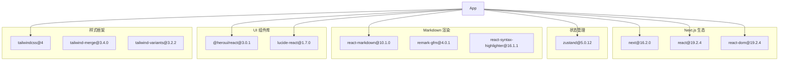

**图表来源**
- [package.json:11-26](file://package.json#L11-L26)

### 内部模块依赖

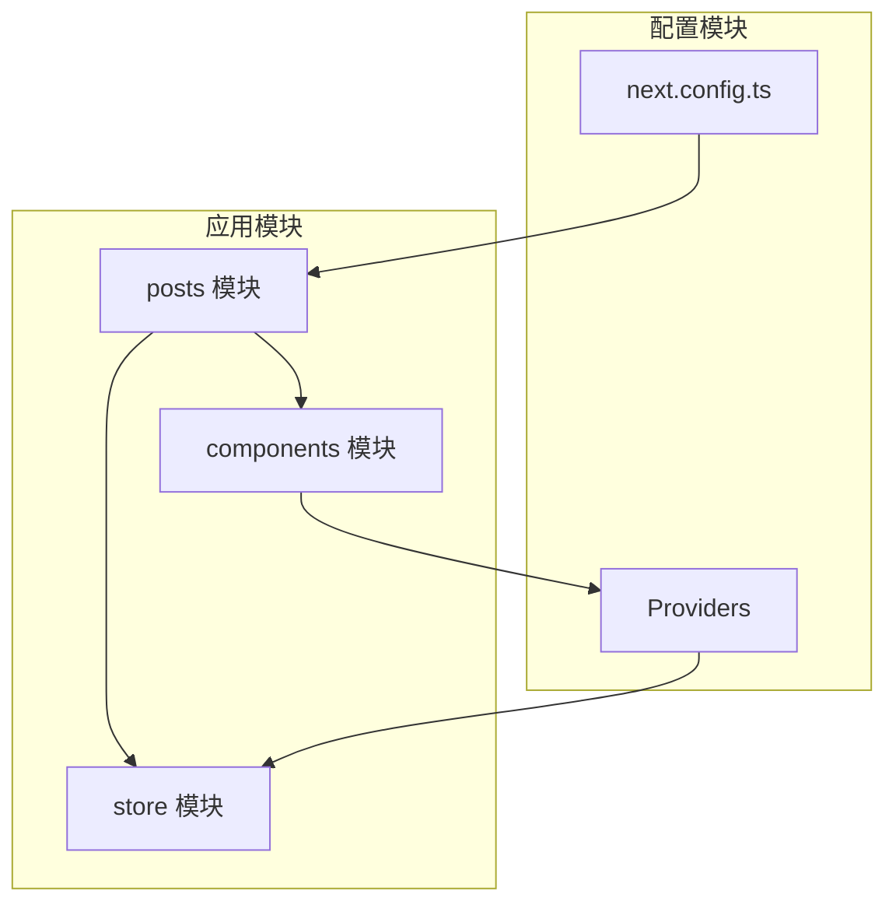

**图表来源**
- [src/app/posts/[id]/page.tsx:1-8](file://src/app/posts/[id]/page.tsx#L1-L8)
- [src/components/Providers.tsx:3-6](file://src/components/Providers.tsx#L3-L6)

**章节来源**
- [package.json:1-39](file://package.json#L1-L39)
- [next.config.ts:1-76](file://next.config.ts#L1-L76)

## 性能考虑

### 预加载策略

项目实现了多层次的预加载策略以提升用户体验：

1. **路由预加载**：在侧边栏导航中使用 `prefetch` 属性
2. **组件缓存**：启用 Next.js 16.20 的 Cache Components 功能
3. **图片优化**：使用 Next.js 图片优化功能
4. **代码分割**：按需加载客户端组件

### 渲染优化

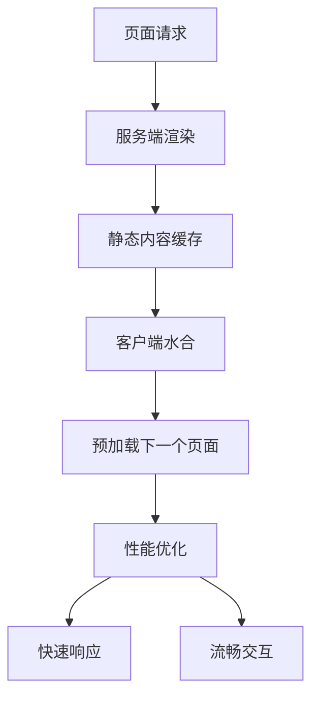

**图表来源**
- [src/app/posts/layout.tsx:80-87](file://src/app/posts/layout.tsx#L80-L87)
- [next.config.ts:47-63](file://next.config.ts#L47-L63)

### SEO 优化

项目实现了全面的 SEO 优化措施：

1. **语义化 URL**：`/posts/{id}` 结构清晰表达内容
2. **元数据管理**：全局 `metadata` 配置
3. **响应式设计**：移动端友好的布局
4. **无障碍访问**：符合 WCAG 标准的组件设计

## 故障排除指南

### 常见问题及解决方案

#### 动态路由参数错误

当访问不存在的文章 ID 时，系统会正确处理并返回 404 页面：

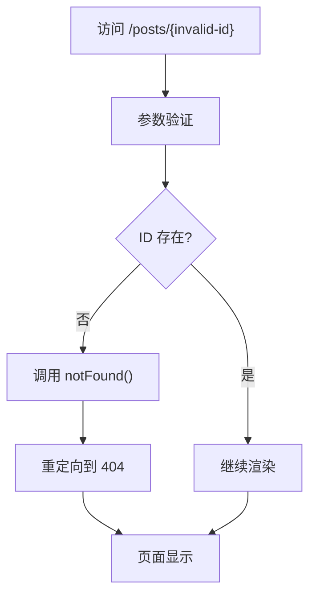

**图表来源**
- [src/app/posts/[id]/page.tsx:83-85](file://src/app/posts/[id]/page.tsx#L83-L85)

#### 状态管理问题

如果遇到状态管理相关的问题，检查以下要点：

1. **Provider 包裹**：确保所有需要状态的组件都被正确的 Provider 包裹
2. **Context 初始化**：确认 Store 已正确初始化
3. **Hook 使用**：使用 `useUserStore` 和 `useCounterStore` 钩子时传入正确的 selector 函数

**章节来源**
- [src/app/posts/[id]/page.tsx:83-85](file://src/app/posts/[id]/page.tsx#L83-L85)
- [src/store/user.tsx:48-56](file://src/store/user.tsx#L48-L56)

## 结论

本文档详细解析了基于 Next.js App Router 的文章详情路由系统。该系统通过精心设计的动态路由参数处理、嵌套路由配置和状态管理方案，实现了高性能、SEO 友好且用户体验优秀的文章详情页面。

### 主要优势

1. **现代化架构**：采用 React Server Components 和 App Router
2. **性能优化**：实现了多层预加载和缓存策略
3. **可维护性**：清晰的模块化结构和类型安全
4. **扩展性**：易于添加新功能和组件

### 最佳实践建议

1. **数据验证**：始终验证动态路由参数的有效性
2. **错误处理**：合理处理 404 和其他异常情况
3. **性能监控**：定期检查页面加载性能和用户体验
4. **SEO 优化**：持续优化元数据和内容结构

该系统为构建复杂的企业级应用提供了坚实的基础，可以根据具体需求进行进一步的功能扩展和定制。