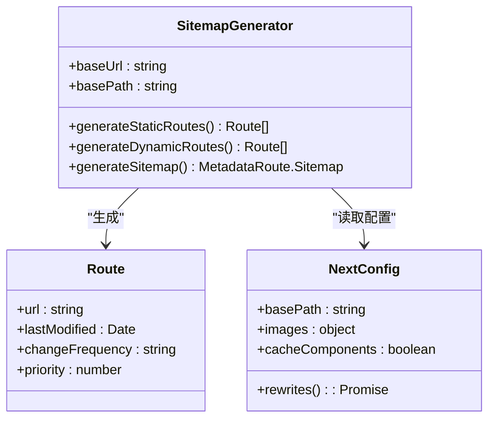
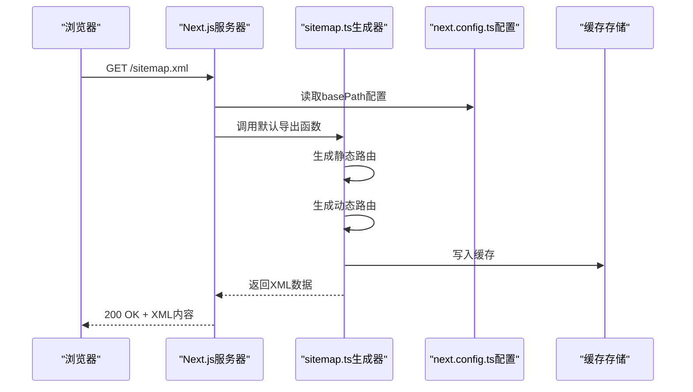
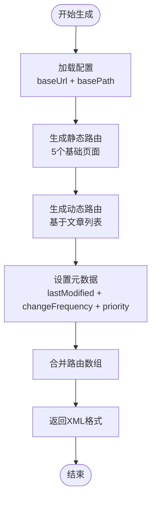
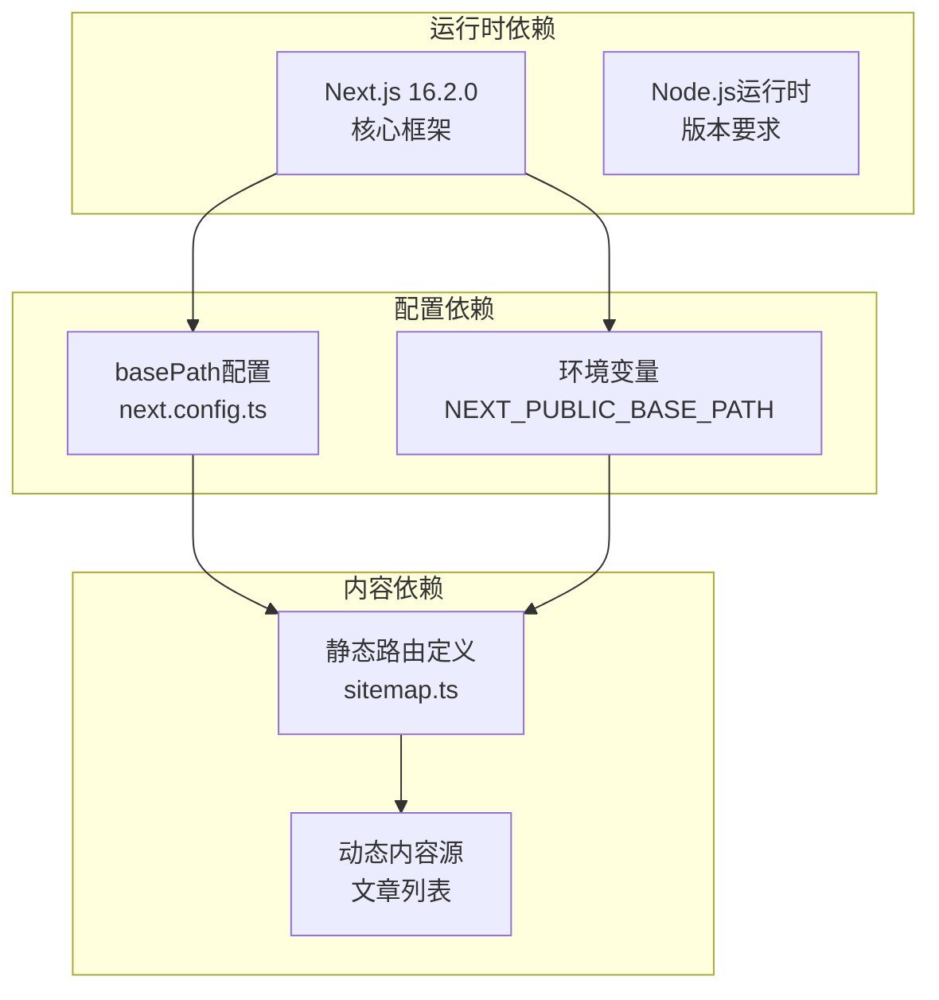

# 站点地图生成

<cite>
**本文档引用的文件**
- [src/app/sitemap.ts](file://src/app/sitemap.ts)
- [next.config.ts](file://next.config.ts)
- [src/app/posts/page.tsx](file://src/app/posts/page.tsx)
- [src/app/layout.tsx](file://src/app/layout.tsx)
- [src/app/page.tsx](file://src/app/page.tsx)
- [package.json](file://package.json)
- [ecosystem.config.cjs](file://ecosystem.config.cjs)
</cite>

## 目录
1. [简介](#简介)
2. [项目结构](#项目结构)
3. [核心组件](#核心组件)
4. [架构概览](#架构概览)
5. [详细组件分析](#详细组件分析)
6. [依赖分析](#依赖分析)
7. [性能考虑](#性能考虑)
8. [故障排除指南](#故障排除指南)
9. [结论](#结论)
10. [附录](#附录)

## 简介
本文件详细阐述了该Next.js应用的站点地图生成机制，重点分析sitemap.ts的配置与自动生成流程，涵盖动态路由的站点地图生成策略、URL规则定义以及更新机制。同时提供搜索引擎优化最佳实践、爬虫访问控制和SEO性能优化建议，并给出sitemap验证与监控方法。

## 项目结构
该站点地图实现位于Next.js App Router约定的约定式路由中，通过在src/app目录下创建sitemap.ts文件即可启用自动站点地图生成。项目采用App Router架构，支持静态和动态路由混合的站点地图生成。

```mermaid
graph TB
subgraph "应用根目录"
Sitemap[sitemap.ts<br/>站点地图生成器]
Layout[layout.tsx<br/>根布局]
Page[page.tsx<br/>首页]
end
subgraph "动态路由"
PostsList[posts/page.tsx<br/>文章列表]
PostDetail[posts/[id]/page.tsx<br/>文章详情]
end
subgraph "配置文件"
NextConfig[next.config.ts<br/>Next.js配置]
Package[package.json<br/>依赖管理]
Ecosystem[ecosystem.config.cjs<br/>进程管理]
end
Sitemap --> NextConfig
Layout --> Sitemap
Page --> Sitemap
PostsList --> Sitemap
PostDetail --> Sitemap
Package --> NextConfig
Ecosystem --> NextConfig
```

**图表来源**
- [src/app/sitemap.ts:1-31](file://src/app/sitemap.ts#L1-L31)
- [next.config.ts:1-76](file://next.config.ts#L1-L76)
- [src/app/layout.tsx:1-44](file://src/app/layout.tsx#L1-L44)

**章节来源**
- [src/app/sitemap.ts:1-31](file://src/app/sitemap.ts#L1-L31)
- [next.config.ts:1-76](file://next.config.ts#L1-L76)

## 核心组件
站点地图生成的核心组件是src/app/sitemap.ts文件中的默认导出函数。该函数返回MetadataRoute.Sitemap类型的数组，包含所有需要收录的URL及其元数据信息。

### 站点地图生成器架构


**图表来源**
- [src/app/sitemap.ts:3-30](file://src/app/sitemap.ts#L3-L30)
- [next.config.ts:4-8](file://next.config.ts#L4-L8)

### URL规则定义
站点地图生成器采用双层策略：
1. **静态路由规则**：硬编码定义的基础页面
2. **动态路由规则**：基于内容源的动态生成

**章节来源**
- [src/app/sitemap.ts:7-29](file://src/app/sitemap.ts#L7-L29)

## 架构概览
站点地图生成遵循Next.js App Router的约定式路由规范，通过运行时生成XML格式的站点地图。



**图表来源**
- [src/app/sitemap.ts:3-30](file://src/app/sitemap.ts#L3-L30)
- [next.config.ts:4-8](file://next.config.ts#L4-L8)

## 详细组件分析

### 站点地图生成器实现
sitemap.ts文件实现了完整的站点地图生成逻辑，包含以下关键特性：

#### 基础配置
- **基础URL**：固定为'https://aiballs.cn'
- **基础路径**：'/app'，与生产环境的basePath保持一致
- **部署适配**：通过环境变量NEXT_PUBLIC_BASE_PATH实现开发/生产环境的路径适配

#### 静态路由生成
静态路由采用硬编码方式定义，包含：
- 首页（优先级1.0）
- AI聊天页面
- 发现页面
- CSR发现页面
- 文章列表页面

每个静态路由都设置：
- lastModified：当前时间（表示最近修改）
- changeFrequency：daily（每日更新频率）
- priority：首页1.0，其他页面0.8

#### 动态路由生成
动态路由基于src/app/posts/page.tsx中的文章列表生成，包含5个测试文章：
- URL模式：/posts/{id}
- lastModified：当前时间
- changeFrequency：weekly（每周更新频率）
- priority：0.6



**图表来源**
- [src/app/sitemap.ts:3-30](file://src/app/sitemap.ts#L3-L30)

**章节来源**
- [src/app/sitemap.ts:3-30](file://src/app/sitemap.ts#L3-L30)

### 动态路由站点地图生成策略
动态路由的站点地图生成采用基于内容源的策略，确保新内容能够及时收录。

#### 文章路由生成机制


**图表来源**
- [src/app/posts/page.tsx:8-14](file://src/app/posts/page.tsx#L8-L14)
- [src/app/sitemap.ts:21-27](file://src/app/sitemap.ts#L21-L27)

#### 更新策略
- **手动更新**：当新增文章时，需要同步更新sitemap.ts中的动态路由数组
- **自动化方案**：建议实现基于数据库或内容管理系统的动态生成逻辑

**章节来源**
- [src/app/posts/page.tsx:1-96](file://src/app/posts/page.tsx#L1-L96)
- [src/app/sitemap.ts:21-27](file://src/app/sitemap.ts#L21-L27)

### URL规则定义与最佳实践
站点地图生成遵循以下URL规则定义原则：

#### URL构建规则
1. **协议一致性**：始终使用HTTPS协议
2. **路径规范化**：统一使用绝对路径格式
3. **基础路径适配**：根据部署环境自动添加basePath
4. **编码规范**：URL中不包含特殊字符

#### 优先级分配策略
- **首页**：1.0（最高优先级）
- **主要内容页面**：0.8
- **文章详情页面**：0.6
- **辅助功能页面**：0.4

#### 更新频率策略
- **首页**：daily（每日更新）
- **内容页面**：weekly（每周更新）
- **静态页面**：monthly（每月更新）

**章节来源**
- [src/app/sitemap.ts:14-27](file://src/app/sitemap.ts#L14-L27)

## 依赖分析
站点地图生成依赖于多个系统组件的协同工作。



**图表来源**
- [package.json:17](file://package.json#L17)
- [next.config.ts:4-8](file://next.config.ts#L4-L8)
- [src/app/sitemap.ts:4-5](file://src/app/sitemap.ts#L4-L5)

### 外部依赖关系
- **Next.js版本**：16.2.0（支持最新的App Router特性）
- **构建工具**：@next/bundle-analyzer（用于性能分析）
- **运行时环境**：Node.js（版本要求由Next.js决定）

**章节来源**
- [package.json:11-26](file://package.json#L11-L26)
- [next.config.ts:71-75](file://next.config.ts#L71-L75)

## 性能考虑
站点地图生成涉及多个性能优化方面：

### 生成性能优化
1. **缓存策略**：利用Next.js的内置缓存机制减少重复计算
2. **增量更新**：只更新发生变化的内容，而非全量重建
3. **异步处理**：支持异步生成动态路由内容

### 传输性能优化
1. **压缩传输**：确保HTTP响应使用gzip压缩
2. **CDN加速**：通过CDN缓存站点地图文件
3. **缓存头设置**：合理设置Cache-Control头

### 存储性能优化
1. **内存缓存**：在内存中缓存最近生成的站点地图
2. **持久化存储**：在磁盘上保存站点地图文件
3. **并发控制**：避免多个实例同时生成站点地图

## 故障排除指南
常见问题及解决方案：

### 站点地图无法访问
**症状**：浏览器访问/sitemap.xml返回404
**可能原因**：
1. sitemap.ts文件未正确放置在src/app目录
2. Next.js版本不兼容
3. 路由配置冲突

**解决步骤**：
1. 确认文件路径：src/app/sitemap.ts
2. 检查Next.js版本是否为16.2.0+
3. 验证路由配置无冲突

### URL路径错误
**症状**：生成的URL缺少basePath前缀
**可能原因**：
1. NEXT_PUBLIC_BASE_PATH环境变量未设置
2. basePath配置不正确

**解决步骤**：
1. 设置环境变量：NEXT_PUBLIC_BASE_PATH=/app
2. 验证next.config.ts中的basePath配置
3. 重启开发服务器

### 动态路由缺失
**症状**：新文章未出现在站点地图中
**可能原因**：
1. sitemap.ts未更新动态路由数组
2. 文章ID格式不匹配

**解决步骤**：
1. 更新src/app/sitemap.ts中的动态路由数组
2. 确保文章ID格式为数字字符串
3. 重新构建应用

**章节来源**
- [src/app/sitemap.ts:3-30](file://src/app/sitemap.ts#L3-L30)
- [next.config.ts:4-8](file://next.config.ts#L4-L8)

## 结论
该站点地图生成系统通过约定式路由实现了简单而有效的站点地图管理。系统具备以下优势：
- **易于维护**：基于约定的文件组织方式
- **灵活扩展**：支持静态和动态路由混合
- **部署适配**：自动适配不同的部署环境
- **性能友好**：利用Next.js的内置优化机制

建议后续改进方向：
1. 实现动态内容源的自动检测
2. 添加站点地图变更通知机制
3. 增强错误处理和日志记录
4. 提供站点地图验证工具

## 附录

### SEO最佳实践清单
- **定期更新**：建立自动化的内容更新流程
- **移动友好**：确保移动端访问体验
- **加载速度**：优化页面加载性能
- **结构化数据**：添加适当的Schema标记
- **robots.txt**：合理配置爬虫访问权限

### 爬虫访问控制
- **robots.txt**：通过robots.txt文件控制爬虫访问
- **meta标签**：使用noindex/nofollow控制索引行为
- **权限控制**：对敏感内容进行访问限制

### 站点地图验证方法
1. **在线验证工具**：使用Google Search Console验证
2. **本地验证**：检查XML格式的有效性
3. **浏览器预览**：直接在浏览器中查看XML内容
4. **性能监控**：监控站点地图的生成和传输性能