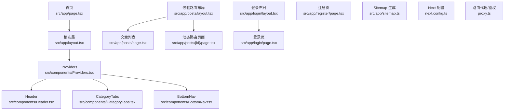
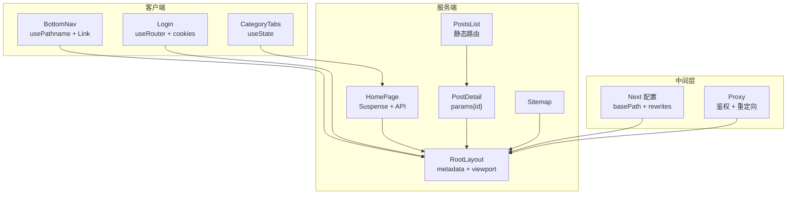
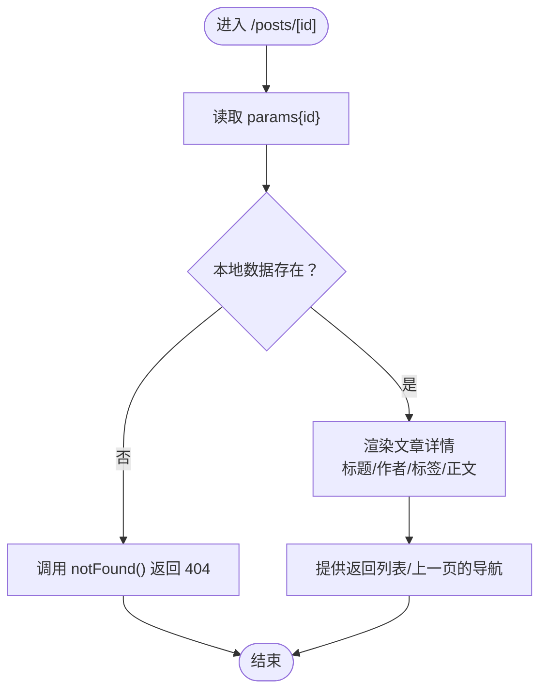
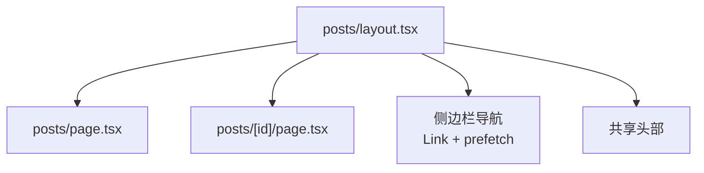
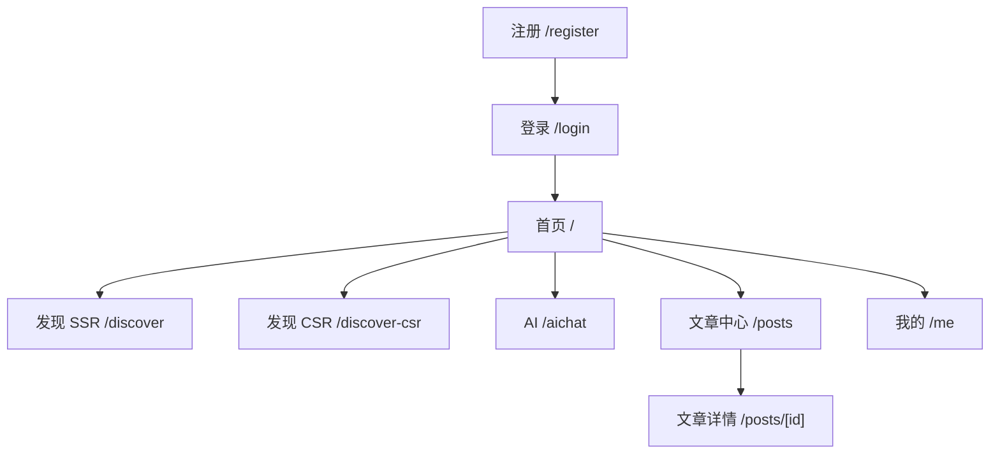
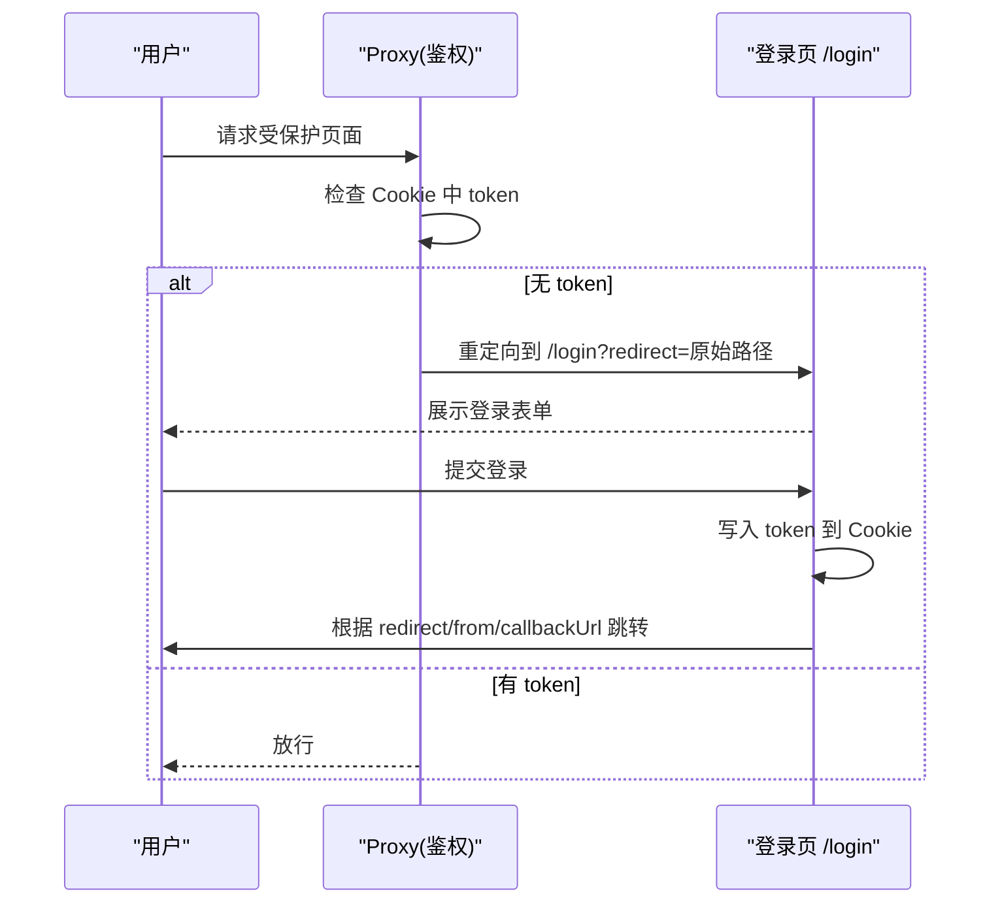
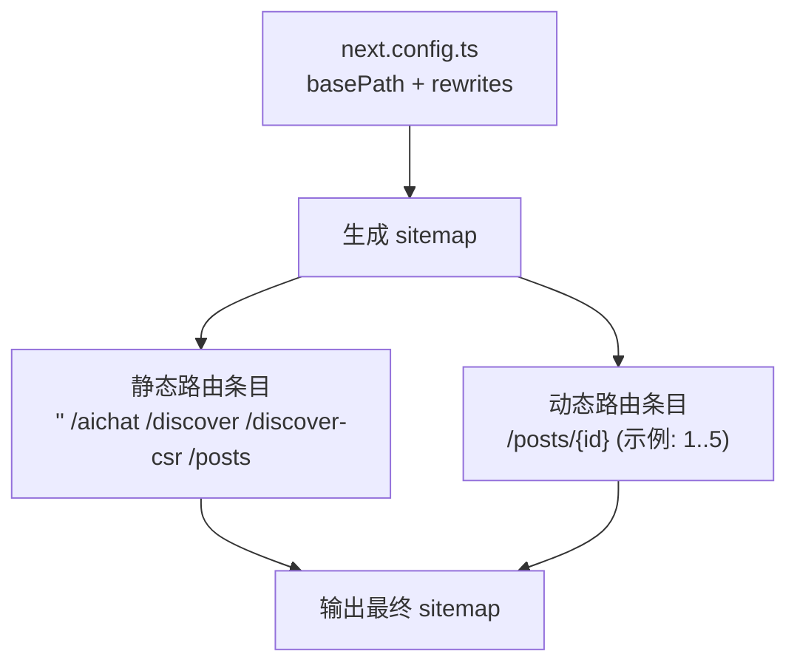
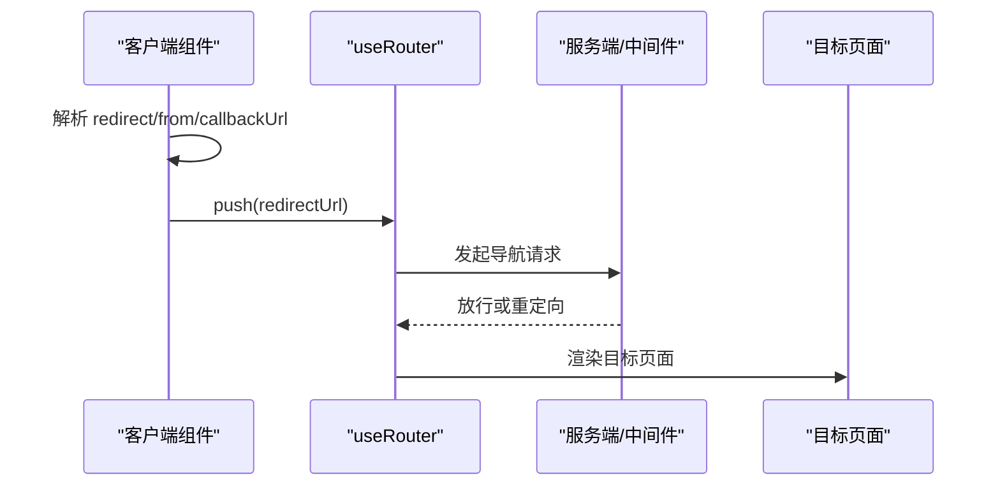
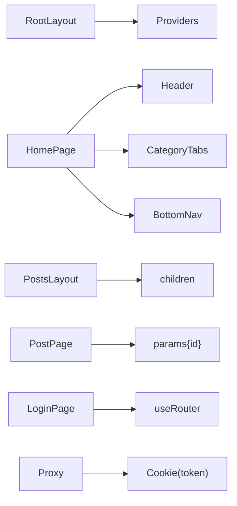

# 路由系统

<cite>
**本文引用的文件**
- [src/app/layout.tsx](file://src/app/layout.tsx)
- [src/app/page.tsx](file://src/app/page.tsx)
- [src/app/sitemap.ts](file://src/app/sitemap.ts)
- [next.config.ts](file://next.config.ts)
- [src/app/posts/layout.tsx](file://src/app/posts/layout.tsx)
- [src/app/posts/page.tsx](file://src/app/posts/page.tsx)
- [src/app/posts/[id]/page.tsx](file://src/app/posts/[id]/page.tsx)
- [src/components/BottomNav.tsx](file://src/components/BottomNav.tsx)
- [src/components/CategoryTabs.tsx](file://src/components/CategoryTabs.tsx)
- [src/components/Header.tsx](file://src/components/Header.tsx)
- [src/components/Providers.tsx](file://src/components/Providers.tsx)
- [src/app/login/layout.tsx](file://src/app/login/layout.tsx)
- [src/app/login/page.tsx](file://src/app/login/page.tsx)
- [src/app/register/page.tsx](file://src/app/register/page.tsx)
- [src/actions/feed.action.ts](file://src/actions/feed.action.ts)
- [proxy.ts](file://proxy.ts)
</cite>

## 目录
1. [简介](#简介)
2. [项目结构](#项目结构)
3. [核心组件](#核心组件)
4. [架构总览](#架构总览)
5. [详细组件分析](#详细组件分析)
6. [依赖分析](#依赖分析)
7. [性能考虑](#性能考虑)
8. [故障排查指南](#故障排查指南)
9. [结论](#结论)
10. [附录](#附录)

## 简介
本文件系统化梳理基于 App Router 的路由体系，覆盖动态路由、嵌套路由、路由参数处理、页面组织结构与导航逻辑，并补充路由守卫、权限控制、SEO 优化（含 sitemap）、实际跳转示例与性能优化建议。读者无需深入源码即可理解各页面的功能定位与路由配置。

## 项目结构
- 根布局与全局元数据：根布局负责注入字体、全局样式与 Provider，顶层页面承载首页内容与骨架屏流式加载。
- 页面组织：采用按功能域分层的文件夹结构，如 posts、login、register 等，每个域内包含 layout.tsx 与 page.tsx。
- 嵌套路由：posts 域通过 layout.tsx 将子路由包裹，实现共享头部与侧边栏、切换子路由时不重新渲染父布局。
- 动态路由：posts/[id] 通过方括号参数接收任意 id 值，页面组件从 params 获取参数并渲染对应内容。
- 导航组件：底部导航与分类标签均为客户端组件，使用 next/navigation 的 usePathname 与 Link 组件进行导航。
- 权限控制：通过自定义代理（原中间件）对非公开路径进行鉴权拦截，白名单路径放行。
- SEO 优化：根布局与页面导出元数据，sitemap 动态生成静态与动态路由条目，next.config.ts 配置 basePath 与 rewrites。

图表来源
- [src/app/layout.tsx:1-44](file://src/app/layout.tsx#L1-L44)
- [src/components/Providers.tsx:1-20](file://src/components/Providers.tsx#L1-L20)
- [src/components/Header.tsx:1-55](file://src/components/Header.tsx#L1-L55)
- [src/components/CategoryTabs.tsx:1-37](file://src/components/CategoryTabs.tsx#L1-L37)
- [src/components/BottomNav.tsx:1-103](file://src/components/BottomNav.tsx#L1-L103)
- [src/app/page.tsx:1-75](file://src/app/page.tsx#L1-L75)
- [src/app/posts/layout.tsx:1-119](file://src/app/posts/layout.tsx#L1-L119)
- [src/app/posts/page.tsx:1-96](file://src/app/posts/page.tsx#L1-L96)
- [src/app/posts/[id]/page.tsx:1-199](file://src/app/posts/[id]/page.tsx#L1-L199)
- [src/app/login/layout.tsx:1-30](file://src/app/login/layout.tsx#L1-L30)
- [src/app/login/page.tsx:1-119](file://src/app/login/page.tsx#L1-L119)
- [src/app/register/page.tsx:1-145](file://src/app/register/page.tsx#L1-L145)
- [src/app/sitemap.ts:1-31](file://src/app/sitemap.ts#L1-L31)
- [next.config.ts:1-76](file://next.config.ts#L1-L76)
- [proxy.ts:1-51](file://proxy.ts#L1-L51)

章节来源
- [src/app/layout.tsx:1-44](file://src/app/layout.tsx#L1-L44)
- [src/app/page.tsx:1-75](file://src/app/page.tsx#L1-L75)
- [src/app/sitemap.ts:1-31](file://src/app/sitemap.ts#L1-L31)
- [next.config.ts:1-76](file://next.config.ts#L1-L76)
- [src/app/posts/layout.tsx:1-119](file://src/app/posts/layout.tsx#L1-L119)
- [src/app/posts/page.tsx:1-96](file://src/app/posts/page.tsx#L1-L96)
- [src/app/posts/[id]/page.tsx:1-199](file://src/app/posts/[id]/page.tsx#L1-L199)
- [src/components/BottomNav.tsx:1-103](file://src/components/BottomNav.tsx#L1-L103)
- [src/components/CategoryTabs.tsx:1-37](file://src/components/CategoryTabs.tsx#L1-L37)
- [src/app/login/layout.tsx:1-30](file://src/app/login/layout.tsx#L1-L30)
- [src/app/login/page.tsx:1-119](file://src/app/login/page.tsx#L1-L119)
- [src/app/register/page.tsx:1-145](file://src/app/register/page.tsx#L1-L145)
- [proxy.ts:1-51](file://proxy.ts#L1-L51)

## 核心组件
- 根布局与全局元数据：定义站点标题、视口、字体变量与全局样式容器，统一注入 Providers。
- 首页：聚合 Header、CategoryTabs、水瀑布流内容与 BottomNav，使用 Suspense 实现流式加载。
- 嵌套路由布局：posts 域的父布局，提供共享头部与侧边栏，子路由切换时仅更新 children。
- 动态路由页面：接收 [id] 参数，查表渲染对应文章详情，不存在则返回 404。
- 登录/注册：客户端表单提交，登录成功后解析 redirect/from/callbackUrl 参数跳转。
- 底部导航：基于 usePathname 的客户端导航，支持中心按钮与图标状态切换。
- 分类标签：客户端状态管理，用于首页内容筛选。
- Sitemap：生成静态路由与动态文章路由条目，配合 basePath 输出正确链接。
- Next 配置：设置 basePath、API 代理、组件缓存等，影响路由与构建行为。
- 代理/鉴权：拦截非公开路径，校验 Cookie 中 token，未登录重定向至登录页并携带 redirect 参数。

章节来源
- [src/app/layout.tsx:1-44](file://src/app/layout.tsx#L1-L44)
- [src/app/page.tsx:1-75](file://src/app/page.tsx#L1-L75)
- [src/app/posts/layout.tsx:1-119](file://src/app/posts/layout.tsx#L1-L119)
- [src/app/posts/[id]/page.tsx:1-199](file://src/app/posts/[id]/page.tsx#L1-L199)
- [src/app/login/page.tsx:1-119](file://src/app/login/page.tsx#L1-L119)
- [src/app/register/page.tsx:1-145](file://src/app/register/page.tsx#L1-L145)
- [src/components/BottomNav.tsx:1-103](file://src/components/BottomNav.tsx#L1-L103)
- [src/components/CategoryTabs.tsx:1-37](file://src/components/CategoryTabs.tsx#L1-L37)
- [src/app/sitemap.ts:1-31](file://src/app/sitemap.ts#L1-L31)
- [next.config.ts:1-76](file://next.config.ts#L1-L76)
- [proxy.ts:1-51](file://proxy.ts#L1-L51)

## 架构总览
App Router 采用“文件系统即路由”的约定，页面通过文件夹层级与命名（如 [id]）表达路由结构与参数。嵌套路由通过 layout.tsx 的 children 插槽实现共享 UI。客户端组件通过 Link 与 useRouter 实现导航与跳转，服务端组件负责 SSR 与 SEO 元数据。

图表来源
- [src/components/BottomNav.tsx:1-103](file://src/components/BottomNav.tsx#L1-L103)
- [src/components/CategoryTabs.tsx:1-37](file://src/components/CategoryTabs.tsx#L1-L37)
- [src/app/login/page.tsx:1-119](file://src/app/login/page.tsx#L1-L119)
- [src/app/layout.tsx:1-44](file://src/app/layout.tsx#L1-L44)
- [src/app/page.tsx:1-75](file://src/app/page.tsx#L1-L75)
- [src/app/posts/page.tsx:1-96](file://src/app/posts/page.tsx#L1-L96)
- [src/app/posts/[id]/page.tsx:1-199](file://src/app/posts/[id]/page.tsx#L1-L199)
- [src/app/sitemap.ts:1-31](file://src/app/sitemap.ts#L1-L31)
- [next.config.ts:1-76](file://next.config.ts#L1-L76)
- [proxy.ts:1-51](file://proxy.ts#L1-L51)

## 详细组件分析

### 动态路由与参数处理（posts/[id]）
- 路由定义：文件夹 [id] 表示动态参数，访问 /posts/1、/posts/abc 等均命中该页面。
- 参数获取：页面组件接收 params，解构得到 id 字符串。
- 数据查找：以 id 为键在本地数据表中查找文章，不存在则调用 notFound() 返回 404。
- 导航回退：提供返回列表与返回上一页的 Link，便于用户继续浏览。
- 颜色方案：根据 id 映射不同主题色系，增强视觉一致性。

图表来源
- [src/app/posts/[id]/page.tsx:71-199](file://src/app/posts/[id]/page.tsx#L71-L199)

章节来源
- [src/app/posts/[id]/page.tsx:1-199](file://src/app/posts/[id]/page.tsx#L1-L199)

### 嵌套路由与页面组织（posts 域）
- 布局职责：posts/layout.tsx 作为父布局，提供共享头部、侧边栏与面包屑，children 区域渲染子路由。
- 子路由渲染：/posts 渲染 posts/page.tsx；/posts/1 渲染 posts/[id]/page.tsx。
- 性能优势：切换子路由时父布局不重新渲染，仅 children 更新，提升交互流畅度。
- 导航结构：侧边栏列出文章列表与导航链接，统一使用 Link 与 prefetch。

图表来源
- [src/app/posts/layout.tsx:1-119](file://src/app/posts/layout.tsx#L1-L119)
- [src/app/posts/page.tsx:1-96](file://src/app/posts/page.tsx#L1-L96)
- [src/app/posts/[id]/page.tsx:1-199](file://src/app/posts/[id]/page.tsx#L1-L199)

章节来源
- [src/app/posts/layout.tsx:1-119](file://src/app/posts/layout.tsx#L1-L119)
- [src/app/posts/page.tsx:1-96](file://src/app/posts/page.tsx#L1-L96)

### 页面功能定位与导航逻辑
- 首页（/）：展示 Header、CategoryTabs、瀑布流内容与 BottomNav，使用 Suspense 提升首屏体验。
- 发现（/discover、/discover-csr）：示例页面，分别体现 SSR 与 CSR 场景（具体实现位于对应页面文件）。
- AI（/aichat）：AI 聊天入口。
- 我的（/me）：个人中心入口。
- 文章中心（/posts、/posts/[id]）：文章列表与详情页，支持嵌套路由与动态参数。
- 登录（/login）：客户端表单，登录成功后根据 redirect/from/callbackUrl 参数跳转。
- 注册（/register）：客户端表单，注册成功后跳转到登录页。

图表来源
- [src/app/page.tsx:1-75](file://src/app/page.tsx#L1-L75)
- [src/components/BottomNav.tsx:1-103](file://src/components/BottomNav.tsx#L1-L103)
- [src/app/posts/page.tsx:1-96](file://src/app/posts/page.tsx#L1-L96)
- [src/app/posts/[id]/page.tsx:1-199](file://src/app/posts/[id]/page.tsx#L1-L199)
- [src/app/login/page.tsx:1-119](file://src/app/login/page.tsx#L1-L119)
- [src/app/register/page.tsx:1-145](file://src/app/register/page.tsx#L1-L145)

章节来源
- [src/app/page.tsx:1-75](file://src/app/page.tsx#L1-L75)
- [src/components/BottomNav.tsx:1-103](file://src/components/BottomNav.tsx#L1-L103)
- [src/app/login/page.tsx:1-119](file://src/app/login/page.tsx#L1-L119)
- [src/app/register/page.tsx:1-145](file://src/app/register/page.tsx#L1-L145)

### 路由守卫与权限控制
- 白名单：/login、/register 直接放行。
- 鉴权流程：从 Cookie 读取 token，若缺失则重定向至 /login，并附加 redirect 参数记录目标路径。
- 匹配规则：排除静态资源与 API 路由，仅对应用路由生效。
- 与登录页协作：登录成功后解析 redirect/from/callbackUrl，避免跳转到自身导致死循环。

图表来源
- [proxy.ts:11-33](file://proxy.ts#L11-L33)
- [src/app/login/page.tsx:20-58](file://src/app/login/page.tsx#L20-L58)

章节来源
- [proxy.ts:1-51](file://proxy.ts#L1-L51)
- [src/app/login/page.tsx:1-119](file://src/app/login/page.tsx#L1-L119)

### SEO 优化与 sitemap
- 元数据：根布局与页面导出 metadata，包含标题、描述与关键词，提升搜索可见性。
- Sitemap：生成静态路由与动态文章路由条目，设置 lastModified、changeFrequency 与 priority，适配 basePath。
- 配置：next.config.ts 设置 basePath，确保 sitemap 与链接在多路径部署场景下正确。

图表来源
- [src/app/sitemap.ts:3-31](file://src/app/sitemap.ts#L3-L31)
- [next.config.ts:8](file://next.config.ts#L8)

章节来源
- [src/app/sitemap.ts:1-31](file://src/app/sitemap.ts#L1-L31)
- [next.config.ts:1-76](file://next.config.ts#L1-L76)

### 路由跳转示例与最佳实践
- 静态跳转：使用 Link 组件，自动预取与渲染 children。
- 动态跳转：在客户端组件中使用 useRouter().push()，结合 URLSearchParams 解析 redirect/from/callbackUrl。
- 强制刷新：登录成功后可使用 window.location.href 确保服务端中间件读取最新 Cookie 并丢弃旧路由缓存。
- 动作权限封装：使用高阶函数包装业务动作，统一校验登录状态后再执行。

图表来源
- [src/app/login/page.tsx:38-48](file://src/app/login/page.tsx#L38-L48)
- [src/actions/feed.action.ts:37-51](file://src/actions/feed.action.ts#L37-L51)

章节来源
- [src/app/login/page.tsx:1-119](file://src/app/login/page.tsx#L1-L119)
- [src/actions/feed.action.ts:1-60](file://src/actions/feed.action.ts#L1-L60)

## 依赖分析
- 组件耦合：根布局依赖 Providers，首页依赖 Header、CategoryTabs、BottomNav；文章域通过 posts/layout.tsx 统一组织。
- 外部依赖：next.config.ts 提供 basePath、rewrites、cacheComponents 等能力；proxy.ts 提供全局鉴权。
- 路由依赖：动态路由依赖 params；嵌套路由依赖 children 插槽；登录页依赖 cookies 与 useRouter。

图表来源
- [src/app/layout.tsx:28-43](file://src/app/layout.tsx#L28-L43)
- [src/components/Providers.tsx:8-19](file://src/components/Providers.tsx#L8-L19)
- [src/app/page.tsx:54-74](file://src/app/page.tsx#L54-L74)
- [src/app/posts/layout.tsx:26-30](file://src/app/posts/layout.tsx#L26-L30)
- [src/app/posts/[id]/page.tsx:71-78](file://src/app/posts/[id]/page.tsx#L71-L78)
- [src/app/login/page.tsx:14-15](file://src/app/login/page.tsx#L14-L15)
- [proxy.ts:20](file://proxy.ts#L20)

章节来源
- [src/app/layout.tsx:1-44](file://src/app/layout.tsx#L1-L44)
- [src/app/page.tsx:1-75](file://src/app/page.tsx#L1-L75)
- [src/app/posts/layout.tsx:1-119](file://src/app/posts/layout.tsx#L1-L119)
- [src/app/posts/[id]/page.tsx:1-199](file://src/app/posts/[id]/page.tsx#L1-L199)
- [src/app/login/page.tsx:1-119](file://src/app/login/page.tsx#L1-L119)
- [proxy.ts:1-51](file://proxy.ts#L1-L51)

## 性能考虑
- 组件缓存：启用 cacheComponents，减少重复渲染成本。
- 流式加载：首页使用 Suspense 与骨架屏，缩短感知等待时间。
- 预取与懒加载：Link 组件支持 prefetch，减少首次交互延迟。
- 路由缓存：静态路由默认缓存，动态路由按需控制，避免过度缓存导致陈旧数据。
- 代理与重写：next.config.ts 的 rewrites 将 /api/* 代理到后端，减少跨域与额外网络往返。
- 基础路径：在多路径部署场景下设置 basePath，确保资源与链接正确解析。

章节来源
- [next.config.ts:58](file://next.config.ts#L58)
- [src/app/page.tsx:65-67](file://src/app/page.tsx#L65-L67)
- [src/app/posts/layout.tsx:80-83](file://src/app/posts/layout.tsx#L80-L83)
- [next.config.ts:30-45](file://next.config.ts#L30-L45)
- [next.config.ts:8](file://next.config.ts#L8)

## 故障排查指南
- 动态路由 404：确认 params.id 是否存在于数据表；若不存在，应返回 notFound()。
- 登录后仍被重定向：检查 Cookie 中 token 是否写入；确认 redirect 参数是否指向 /login 导致死循环。
- 链接与 basePath：多路径部署时，确保 basePath 与 sitemap 输出一致，避免链接失效。
- 预取与导航：Link 组件的 prefetch 仅在客户端生效，服务端渲染时需注意差异。
- 代理匹配：确认 proxy 的 matcher 是否排除了静态资源与 API 路由，避免误拦截。

章节来源
- [src/app/posts/[id]/page.tsx:83-85](file://src/app/posts/[id]/page.tsx#L83-L85)
- [src/app/login/page.tsx:42-48](file://src/app/login/page.tsx#L42-L48)
- [next.config.ts:8](file://next.config.ts#L8)
- [proxy.ts:39-51](file://proxy.ts#L39-L51)

## 结论
本项目基于 App Router 构建了清晰的路由体系：静态路由、动态路由与嵌套路由协同工作；通过布局与 children 插槽实现共享 UI；借助 Link、useRouter 与代理中间件完成导航与鉴权；结合 Suspense、cacheComponents 与 sitemap 提升性能与 SEO。遵循本文档的配置与实践，可在复杂业务场景中保持路由结构清晰、性能稳定与体验流畅。

## 附录
- 路由清单
  - 首页：/
  - 发现（SSR）：/discover
  - 发现（CSR）：/discover-csr
  - AI：/aichat
  - 我的：/me
  - 文章中心：/posts
  - 文章详情：/posts/[id]
  - 登录：/login
  - 注册：/register
- SEO 与 sitemap
  - 元数据：根布局与页面导出 metadata
  - sitemap：静态与动态路由条目，适配 basePath
- 配置要点
  - basePath：多路径部署时设置
  - rewrites：/api/* 代理到后端
  - cacheComponents：启用组件缓存
- 鉴权与跳转
  - 白名单：/login、/register
  - 重定向：/login?redirect=原始路径
  - 强制刷新：window.location.href 确保服务端中间件读取最新 Cookie