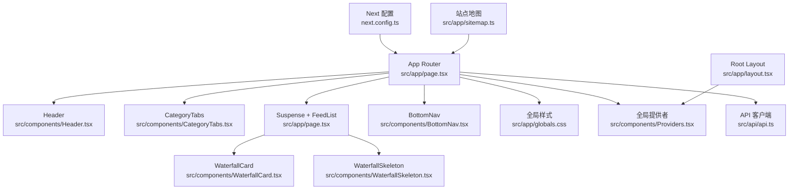
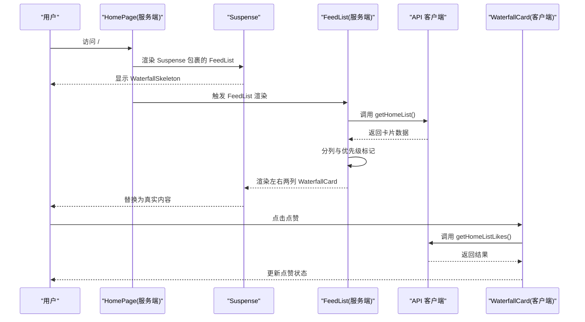
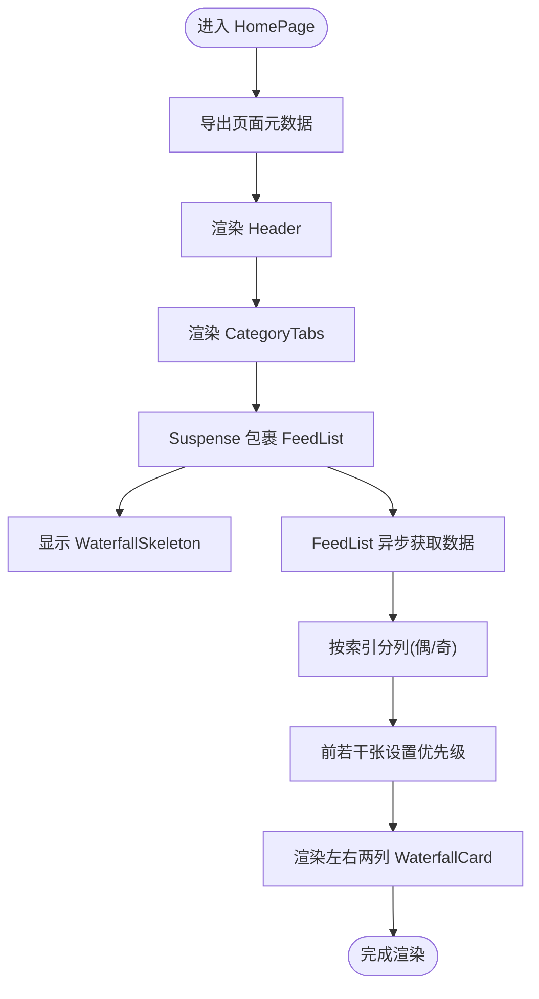
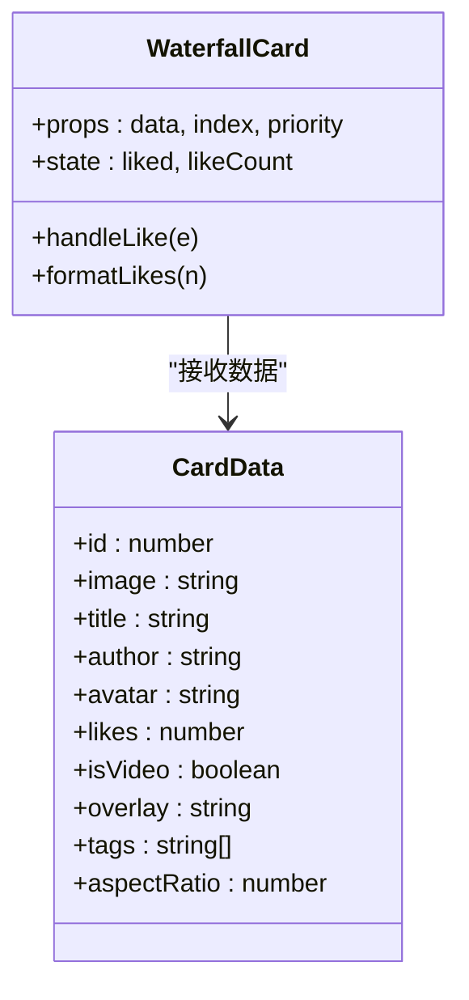
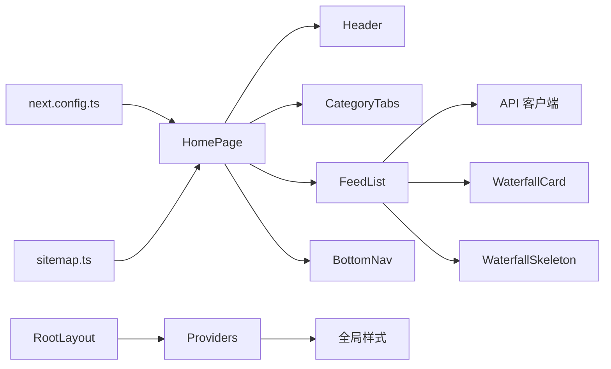

# 首页路由

<cite>
**本文引用的文件**
- [src/app/page.tsx](file://src/app/page.tsx)
- [src/components/Header.tsx](file://src/components/Header.tsx)
- [src/components/CategoryTabs.tsx](file://src/components/CategoryTabs.tsx)
- [src/components/WaterfallCard.tsx](file://src/components/WaterfallCard.tsx)
- [src/components/WaterfallSkeleton.tsx](file://src/components/WaterfallSkeleton.tsx)
- [src/components/BottomNav.tsx](file://src/components/BottomNav.tsx)
- [src/components/Providers.tsx](file://src/components/Providers.tsx)
- [src/api/api.ts](file://src/api/api.ts)
- [src/app/layout.tsx](file://src/app/layout.tsx)
- [src/app/globals.css](file://src/app/globals.css)
- [next.config.ts](file://next.config.ts)
- [src/app/sitemap.ts](file://src/app/sitemap.ts)
- [package.json](file://package.json)
</cite>

## 目录
1. [简介](#简介)
2. [项目结构](#项目结构)
3. [核心组件](#核心组件)
4. [架构总览](#架构总览)
5. [详细组件分析](#详细组件分析)
6. [依赖分析](#依赖分析)
7. [性能考虑](#性能考虑)
8. [故障排查指南](#故障排查指南)
9. [结论](#结论)
10. [附录](#附录)

## 简介
本文件聚焦于首页路由（src/app/page.tsx），系统性阐述其作为应用入口点的路由配置、页面组件结构与数据流。重点解析 Header、CategoryTabs、WaterfallCard 等组件的集成方式，涵盖元数据配置、Suspense 流式渲染实现、瀑布流布局的动态数据处理，并提供 SEO 优化策略与性能优化建议。目标是帮助开发者快速理解首页的实现细节与最佳实践。

## 项目结构
首页路由位于 App Router 的约定式页面目录中，采用“服务端组件 + 客户端组件”混合架构：
- 页面组件：src/app/page.tsx
- 全局布局与字体：src/app/layout.tsx、src/app/globals.css
- 全局提供者：src/components/Providers.tsx
- 组件库与主题：src/components/Header.tsx、CategoryTabs.tsx、WaterfallCard.tsx、BottomNav.tsx
- 数据与网络层：src/api/api.ts
- 构建与部署配置：next.config.ts、package.json
- SEO：src/app/sitemap.ts

图表来源
- [src/app/page.tsx:1-75](file://src/app/page.tsx#L1-L75)
- [src/components/Header.tsx:1-55](file://src/components/Header.tsx#L1-L55)
- [src/components/CategoryTabs.tsx:1-37](file://src/components/CategoryTabs.tsx#L1-L37)
- [src/components/WaterfallCard.tsx:1-155](file://src/components/WaterfallCard.tsx#L1-L155)
- [src/components/WaterfallSkeleton.tsx:1-40](file://src/components/WaterfallSkeleton.tsx#L1-L40)
- [src/components/BottomNav.tsx:1-103](file://src/components/BottomNav.tsx#L1-L103)
- [src/components/Providers.tsx:1-20](file://src/components/Providers.tsx#L1-L20)
- [src/api/api.ts:1-128](file://src/api/api.ts#L1-L128)
- [src/app/layout.tsx:1-44](file://src/app/layout.tsx#L1-L44)
- [src/app/globals.css:1-288](file://src/app/globals.css#L1-L288)
- [next.config.ts:1-76](file://next.config.ts#L1-L76)
- [src/app/sitemap.ts:1-31](file://src/app/sitemap.ts#L1-L31)

章节来源
- [src/app/page.tsx:1-75](file://src/app/page.tsx#L1-L75)
- [src/app/layout.tsx:1-44](file://src/app/layout.tsx#L1-L44)
- [src/app/globals.css:1-288](file://src/app/globals.css#L1-L288)
- [src/components/Providers.tsx:1-20](file://src/components/Providers.tsx#L1-L20)
- [next.config.ts:1-76](file://next.config.ts#L1-L76)
- [src/app/sitemap.ts:1-31](file://src/app/sitemap.ts#L1-L31)

## 核心组件
- Header：固定顶部的导航头，包含品牌标识与操作按钮，使用服务端组件以减少首屏 JS。
- CategoryTabs：客户端组件，提供分类标签切换，使用 useState 管理激活状态。
- WaterfallCard：客户端组件，展示卡片内容（图片、标题、作者、点赞等），支持点赞交互与图片懒加载。
- BottomNav：底部导航，提供移动端友好的导航入口，使用 usePathname 判断当前激活项。
- WaterfallSkeleton：骨架屏组件，用于 Suspense 回退，模拟瀑布流布局的加载状态。
- FeedList：服务端异步组件，负责从 API 获取数据并进行瀑布流分列与优先级标记。
- Providers：全局提供者，注入 Toast、用户状态与计数器状态等上下文。

章节来源
- [src/components/Header.tsx:1-55](file://src/components/Header.tsx#L1-L55)
- [src/components/CategoryTabs.tsx:1-37](file://src/components/CategoryTabs.tsx#L1-L37)
- [src/components/WaterfallCard.tsx:1-155](file://src/components/WaterfallCard.tsx#L1-L155)
- [src/components/BottomNav.tsx:1-103](file://src/components/BottomNav.tsx#L1-L103)
- [src/components/WaterfallSkeleton.tsx:1-40](file://src/components/WaterfallSkeleton.tsx#L1-L40)
- [src/app/page.tsx:18-52](file://src/app/page.ts#L18-L52)
- [src/components/Providers.tsx:1-20](file://src/components/Providers.tsx#L1-L20)

## 架构总览
首页路由采用“服务端组件 + 客户端组件”的混合模式：
- 顶层页面组件（服务端）负责：
  - 定义页面元数据（SEO）
  - 渲染 Header、CategoryTabs、BottomNav 等静态或服务端组件
  - 使用 Suspense 包裹异步数据组件 FeedList，实现流式渲染
- 异步数据组件（服务端）负责：
  - 通过 API 客户端获取首页数据
  - 将数据按左右两列进行瀑布流布局
  - 为前若干张卡片设置优先级，提升首屏渲染体验
- 客户端组件负责：
  - 处理用户交互（如点赞、导航）
  - 状态管理（如激活分类、用户状态）

图表来源
- [src/app/page.tsx:54-74](file://src/app/page.tsx#L54-L74)
- [src/app/page.tsx:18-52](file://src/app/page.tsx#L18-L52)
- [src/api/api.ts:64-71](file://src/api/api.ts#L64-L71)
- [src/components/WaterfallCard.tsx:30-41](file://src/components/WaterfallCard.tsx#L30-L41)

## 详细组件分析

### 首页页面组件（HomePage）
- 元数据导出：通过 export const metadata 提供标题、描述与关键词，便于 SEO。
- 结构组成：
  - Header：固定顶部，渲染品牌与操作按钮
  - CategoryTabs：分类标签，客户端交互
  - 主体内容：Suspense 包裹的 FeedList，使用 WaterfallSkeleton 作为回退
  - BottomNav：底部导航，移动端入口
- 数据流：
  - FeedList 为异步函数组件，内部调用 API 获取数据
  - 对数据进行偶数/奇数索引分列，形成左右两列瀑布流
  - 为前若干张卡片设置优先级，提升首屏可见性

图表来源
- [src/app/page.tsx:11-16](file://src/app/page.tsx#L11-L16)
- [src/app/page.tsx:54-74](file://src/app/page.tsx#L54-L74)
- [src/app/page.tsx:18-52](file://src/app/page.tsx#L18-L52)

章节来源
- [src/app/page.tsx:11-16](file://src/app/page.tsx#L11-L16)
- [src/app/page.tsx:54-74](file://src/app/page.tsx#L54-L74)
- [src/app/page.tsx:18-52](file://src/app/page.tsx#L18-L52)

### Header 组件
- 固定定位与模糊背景，确保内容可读性
- 包含品牌标识与搜索、菜单按钮，使用 SVG 图标
- 作为服务端组件，减少首屏 JS，提升性能

章节来源
- [src/components/Header.tsx:1-55](file://src/components/Header.tsx#L1-L55)

### CategoryTabs 组件
- 客户端组件，使用 useState 维护激活索引
- 默认激活“彩妆”，提供横向滚动与视觉反馈
- 支持点击切换，动态高亮当前分类

章节来源
- [src/components/CategoryTabs.tsx:1-37](file://src/components/CategoryTabs.tsx#L1-L37)

### WaterfallCard 组件
- 展示卡片内容，包括图片、标题、作者、点赞等
- 图片使用 Next.js Image，支持 sizes/priority 与悬停缩放
- 点赞交互：本地状态更新 + 调用点赞接口
- 数值格式化：支持 k/w 单位展示

图表来源
- [src/components/WaterfallCard.tsx:20-47](file://src/components/WaterfallCard.tsx#L20-L47)
- [src/components/WaterfallCard.tsx:7-18](file://src/components/WaterfallCard.tsx#L7-L18)

章节来源
- [src/components/WaterfallCard.tsx:1-155](file://src/components/WaterfallCard.tsx#L1-L155)

### BottomNav 组件
- 底部导航，移动端友好
- 使用 usePathname 判断当前激活项，支持中心按钮样式
- 通过 Link 进行导航，prefetch 提升交互体验

章节来源
- [src/components/BottomNav.tsx:1-103](file://src/components/BottomNav.tsx#L1-L103)

### WaterfallSkeleton 组件
- 骨架屏，模拟瀑布流布局的加载状态
- 左右两列结构，随机高度图片占位与文本占位
- 使用动画 shimmer 提升加载感知

章节来源
- [src/components/WaterfallSkeleton.tsx:1-40](file://src/components/WaterfallSkeleton.tsx#L1-L40)

### Providers 与全局样式
- Providers 注入 ToastProvider、用户状态与计数器状态，统一管理全局上下文
- 全局样式定义主题色、动画与自定义组件样式

章节来源
- [src/components/Providers.tsx:1-20](file://src/components/Providers.tsx#L1-L20)
- [src/app/globals.css:1-288](file://src/app/globals.css#L1-L288)

### API 客户端
- 集中管理接口调用，包括首页数据与点赞接口
- 使用 ssrGet/post/stream 等方法，支持 SSR/CSR/流式响应

章节来源
- [src/api/api.ts:64-71](file://src/api/api.ts#L64-L71)

## 依赖分析
- 组件耦合关系：
  - HomePage 依赖 Header、CategoryTabs、BottomNav、FeedList、WaterfallCard、WaterfallSkeleton
  - FeedList 依赖 API 客户端与类型定义
  - WaterfallCard 依赖 API 客户端与样式
- 外部依赖：
  - Next.js 16、React 19、TailwindCSS 4、@heroui/react
  - 图片优化与远程模式配置
- 配置依赖：
  - next.config.ts 中的 rewrites、images、cacheComponents 等影响构建与运行时行为

图表来源
- [src/app/page.tsx:1-75](file://src/app/page.tsx#L1-L75)
- [src/api/api.ts:1-128](file://src/api/api.ts#L1-L128)
- [src/components/Providers.tsx:1-20](file://src/components/Providers.tsx#L1-L20)
- [next.config.ts:1-76](file://next.config.ts#L1-L76)
- [src/app/sitemap.ts:1-31](file://src/app/sitemap.ts#L1-L31)

章节来源
- [src/app/page.tsx:1-75](file://src/app/page.tsx#L1-L75)
- [src/api/api.ts:1-128](file://src/api/api.ts#L1-L128)
- [src/components/Providers.tsx:1-20](file://src/components/Providers.tsx#L1-L20)
- [next.config.ts:1-76](file://next.config.ts#L1-L76)
- [src/app/sitemap.ts:1-31](file://src/app/sitemap.ts#L1-L31)

## 性能考虑
- 服务端渲染与流式渲染：
  - FeedList 为异步函数组件，结合 Suspense 实现流式渲染，先显示骨架屏再替换真实内容，缩短感知等待时间
- 图片优化：
  - WaterfallCard 中使用 Next.js Image，配合 sizes/priority 与 aspectRatio，提升首屏加载与避免布局抖动
- 首屏优先级：
  - 为前若干张卡片设置优先级，确保关键内容优先加载
- 组件缓存：
  - next.config.ts 启用 cacheComponents，减少重复渲染开销
- 构建与体积：
  - 使用 @next/bundle-analyzer 可选分析，结合 removeConsole 在生产环境移除日志
- 移动端体验：
  - BottomNav 使用 active 状态与缩放动画，提升交互反馈

章节来源
- [src/app/page.tsx:18-52](file://src/app/page.tsx#L18-L52)
- [src/components/WaterfallCard.tsx:62-69](file://src/components/WaterfallCard.tsx#L62-L69)
- [next.config.ts:58-68](file://next.config.ts#L58-L68)

## 故障排查指南
- 首屏空白或长时间无响应：
  - 检查 FeedList 是否抛错导致 Suspense 未切换；确认 API 返回格式与异常处理逻辑
  - 确认 WaterfallSkeleton 是否正确显示
- 图片加载异常：
  - 检查 images.remotePatterns 配置是否允许目标域名
  - 确认 Image 的 sizes/priority 设置与设备宽度匹配
- 点赞功能无效：
  - 检查点赞接口返回与 handleLike 的状态更新逻辑
  - 确认网络层代理配置（rewrites）是否正确
- 导航高亮不生效：
  - 检查 usePathname 的路径匹配与 BottomNav 的 isActive 判断
- SEO 问题：
  - 确认 metadata 与 sitemap 的 URL 基础路径一致，特别是 basePath 与生产环境部署路径

章节来源
- [src/app/page.tsx:18-30](file://src/app/page.tsx#L18-L30)
- [src/api/api.ts:64-71](file://src/api/api.ts#L64-L71)
- [next.config.ts:13-18](file://next.config.ts#L13-L18)
- [src/components/BottomNav.tsx:67-98](file://src/components/BottomNav.tsx#L67-L98)
- [src/app/sitemap.ts:3-19](file://src/app/sitemap.ts#L3-L19)

## 结论
首页路由通过服务端组件与 Suspense 的组合，实现了高效的流式渲染与良好的用户体验。Header、CategoryTabs、WaterfallCard、BottomNav 等组件职责清晰、耦合度低，配合全局样式与提供者，形成了完整的页面骨架。结合 API 客户端与 next.config.ts 的配置，能够满足性能与 SEO 的多方面需求。后续可在数据缓存策略、骨架屏动画与移动端交互细节上进一步优化。

## 附录
- SEO 优化要点：
  - 使用页面级 metadata 提供标题、描述与关键词
  - 生成站点地图，覆盖静态与动态路由
  - 确保 basePath 与部署路径一致，避免链接失效
- 性能优化建议：
  - 保持 cacheComponents 开启，合理利用组件缓存
  - 为关键内容设置优先级，减少首屏阻塞
  - 使用 Image 的 sizes/priority 与合理的 aspectRatio
  - 在生产环境启用 removeConsole 减少体积与日志开销

章节来源
- [src/app/page.tsx:11-16](file://src/app/page.tsx#L11-L16)
- [src/app/sitemap.ts:3-31](file://src/app/sitemap.ts#L3-L31)
- [next.config.ts:58-68](file://next.config.ts#L58-L68)