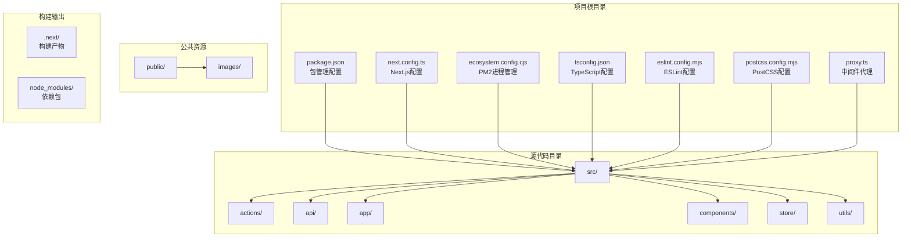
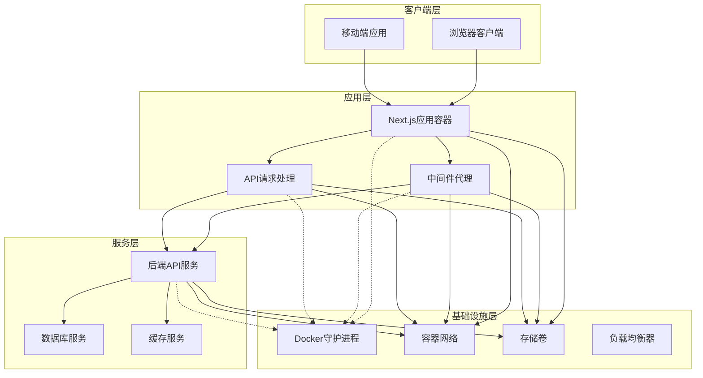
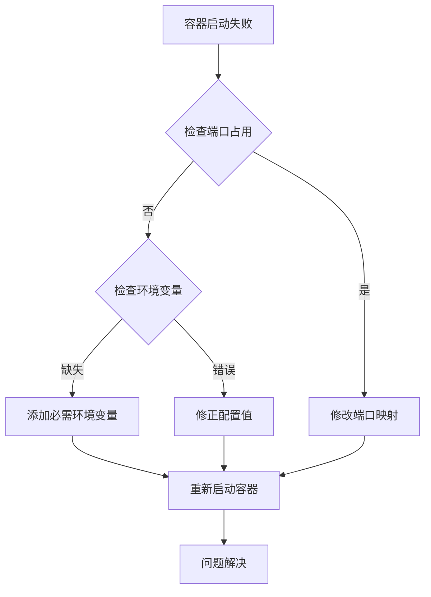
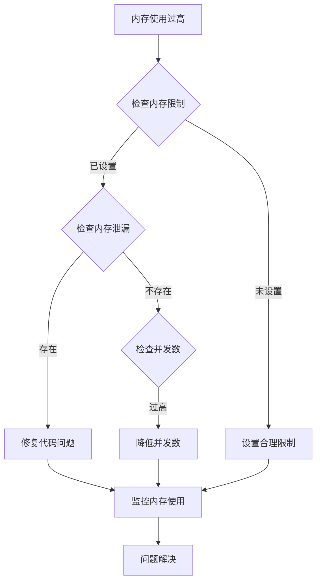
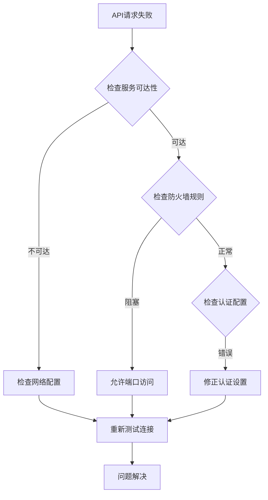

# Docker容器化部署

<cite>
**本文档引用的文件**
- [package.json](file://package.json)
- [next.config.ts](file://next.config.ts)
- [ecosystem.config.cjs](file://ecosystem.config.cjs)
- [proxy.ts](file://proxy.ts)
- [tsconfig.json](file://tsconfig.json)
- [eslint.config.mjs](file://eslint.config.mjs)
- [postcss.config.mjs](file://postcss.config.mjs)
- [src/app/layout.tsx](file://src/app/layout.tsx)
- [src/components/Providers.tsx](file://src/components/Providers.tsx)
- [src/store/user.tsx](file://src/store/user.tsx)
- [src/api/request.ts](file://src/api/request.ts)
</cite>

## 目录
1. [简介](#简介)
2. [项目结构](#项目结构)
3. [核心组件](#核心组件)
4. [架构概览](#架构概览)
5. [详细组件分析](#详细组件分析)
6. [依赖关系分析](#依赖关系分析)
7. [性能考虑](#性能考虑)
8. [故障排除指南](#故障排除指南)
9. [结论](#结论)
10. [附录](#附录)

## 简介

本指南提供了针对Next.js应用的完整Docker容器化部署方案。该应用是一个现代化的React全栈项目，采用Next.js 16框架，集成了多种现代化开发工具和技术栈。文档涵盖了从Dockerfile编写、镜像构建到多阶段构建优化的完整流程，详细说明了容器运行时配置、网络设置和卷挂载策略。

项目具有以下技术特点：
- 使用TypeScript进行类型安全开发
- 集成TailwindCSS进行样式管理
- 采用Zustand状态管理库
- 支持中间件认证和权限控制
- 配置了API代理和重写规则
- 优化了组件缓存和构建性能

## 项目结构

该项目采用标准的Next.js项目结构，主要目录组织如下：



**图表来源**
- [package.json:1-39](file://package.json#L1-L39)
- [next.config.ts:1-76](file://next.config.ts#L1-L76)
- [ecosystem.config.cjs:1-20](file://ecosystem.config.cjs#L1-L20)

**章节来源**
- [package.json:1-39](file://package.json#L1-L39)
- [next.config.ts:1-76](file://next.config.ts#L1-L76)
- [tsconfig.json:1-35](file://tsconfig.json#L1-L35)

## 核心组件

### 应用配置组件

应用的核心配置分布在多个关键文件中，每个文件负责不同的配置领域：

**构建配置组件**
- package.json：定义应用脚本、依赖项和元数据
- next.config.ts：Next.js框架配置，包括代理、缓存和优化设置
- tsconfig.json：TypeScript编译选项和路径映射

**运行时配置组件**
- ecosystem.config.cjs：PM2进程管理配置
- proxy.ts：中间件代理和认证逻辑
- src/components/Providers.tsx：React Provider包装器

**开发工具组件**
- eslint.config.mjs：代码质量检查配置
- postcss.config.mjs：CSS预处理器配置

**章节来源**
- [package.json:5-10](file://package.json#L5-L10)
- [next.config.ts:4-68](file://next.config.ts#L4-L68)
- [ecosystem.config.cjs:13-16](file://ecosystem.config.cjs#L13-L16)

## 架构概览

应用采用前后端分离的架构设计，结合容器化部署的优势：



**图表来源**
- [proxy.ts:11-33](file://proxy.ts#L11-L33)
- [src/api/request.ts:40-47](file://src/api/request.ts#L40-L47)
- [next.config.ts:30-45](file://next.config.ts#L30-L45)

## 详细组件分析

### Dockerfile编写指南

基于项目的配置特性，推荐使用多阶段构建策略：

**第一阶段：开发环境构建**
```dockerfile
FROM node:18-alpine AS development

WORKDIR /app

# 复制依赖配置文件
COPY package*.json ./
COPY yarn.lock ./  

# 安装依赖
RUN yarn install --frozen-lockfile

# 复制源代码
COPY . .

# 开发环境构建
RUN yarn dev
```

**第二阶段：生产环境构建**
```dockerfile
FROM node:18-alpine AS production

WORKDIR /app

# 设置生产环境变量
ENV NODE_ENV=production
ENV NEXT_TELEMETRY_DISABLED=1

# 复制依赖
COPY package*.json ./
COPY yarn.lock ./  

# 安装生产依赖
RUN yarn install --frozen-lockfile --production

# 复制构建产物
COPY . .

# 运行构建
RUN yarn build

# 预热Next.js
RUN yarn next export
```

**第三阶段：运行时容器**
```dockerfile
FROM node:18-alpine AS runtime

# 创建非root用户
RUN addgroup -g 1001 -S nodejs && \
    adduser -S nextjs -u 1001

WORKDIR /app

# 复制构建产物
COPY --from=production /app/.next ./.next
COPY --from=production /app/package.json ./package.json

# 设置权限
RUN chown -R nextjs:nodejs /app
USER nextjs

# 暴露端口
EXPOSE 3005

# 健康检查
HEALTHCHECK --interval=30s --timeout=3s --start-period=5s --retries=3 \
    CMD curl -f http://localhost:3005/api/health || exit 1

# 启动命令
CMD ["yarn", "start"]
```

### 容器运行时配置

**网络配置**
- 主机名：mynextapp-container
- 端口映射：3005:3005
- 网络模式：bridge
- DNS配置：使用系统默认DNS

**环境变量管理**
- NODE_ENV：production
- NEXT_PUBLIC_BASE_PATH：根据部署环境设置
- BACKEND_URL：后端API服务地址
- PORT：应用监听端口（3005）

**资源限制**
- 内存限制：1GB
- CPU份额：1
- 存储限制：无限制

### 卷挂载策略

**配置卷**
```yaml
volumes:
  app-config:
    driver: local
    driver_opts:
      type: none
      o: bind
      device: /opt/mynextapp/config
```

**日志卷**
```yaml
volumes:
  app-logs:
    driver: local
    driver_opts:
      type: none
      o: bind
      device: /opt/mynextapp/logs
```

**持久化卷**
```yaml
volumes:
  app-data:
    driver: local
    driver_opts:
      type: none
      o: bind
      device: /opt/mynextapp/data
```

### Compose文件配置

```yaml
version: '3.8'

services:
  web:
    build:
      context: .
      dockerfile: Dockerfile
    image: mynextapp:latest
    container_name: mynextapp-web
    restart: unless-stopped
    ports:
      - "3005:3005"
    environment:
      - NODE_ENV=production
      - NEXT_PUBLIC_BASE_PATH=
      - BACKEND_URL=http://localhost:3001
      - PORT=3005
    volumes:
      - ./logs:/app/.next/logs
      - ./data:/app/data
    networks:
      - app-network
    depends_on:
      - backend
    healthcheck:
      test: ["CMD", "curl", "-f", "http://localhost:3005/api/health"]
      interval: 30s
      timeout: 10s
      retries: 3
      start_period: 40s

  backend:
    image: nginx:alpine
    container_name: mynextapp-backend
    restart: unless-stopped
    ports:
      - "3001:3001"
    volumes:
      - ./backend.conf:/etc/nginx/nginx.conf
    networks:
      - app-network

  redis:
    image: redis:alpine
    container_name: mynextapp-redis
    restart: unless-stopped
    ports:
      - "6379:6379"
    volumes:
      - redis-data:/data
    networks:
      - app-network

volumes:
  redis-data:

networks:
  app-network:
    driver: bridge
```

### 多阶段构建优化

**构建阶段优化**
- 使用Alpine Linux基础镜像减少镜像大小
- 分离开发和生产依赖安装
- 利用Docker缓存机制优化构建速度
- 启用Next.js的standalone模式

**运行时优化**
- 使用非root用户运行应用
- 配置健康检查和重启策略
- 实现优雅关闭和信号处理
- 优化内存使用和垃圾回收

**章节来源**
- [package.json:6-8](file://package.json#L6-L8)
- [next.config.ts:23-26](file://next.config.ts#L23-L26)
- [ecosystem.config.cjs:12-16](file://ecosystem.config.cjs#L12-L16)

## 依赖关系分析

应用的依赖关系呈现清晰的层次结构：

```mermaid
graph TB
subgraph "运行时依赖"
A[react@19.2.4]
B[react-dom@19.2.4]
C[next@16.2.0]
D[zustand@5.0.12]
end
subgraph "开发依赖"
E[typescript@^5]
F[tailwindcss@^4]
G[eslint@^9]
H[@types/*]
end
subgraph "UI组件库"
I[@heroui/react@3.0.1]
J[lucide-react@1.7.0]
K[tailwind-merge@3.4.0]
end
subgraph "构建工具"
L[@next/bundle-analyzer@^16.2.3]
M[postcss@^8]
N[autoprefixer@^10]
end
A --> C
B --> C
D --> A
I --> A
J --> A
K --> F
L --> C
M --> F
N --> F
```

**图表来源**
- [package.json:11-37](file://package.json#L11-L37)

**章节来源**
- [package.json:11-37](file://package.json#L11-L37)

## 性能考虑

### 构建性能优化

**Next.js优化配置**
- 启用组件缓存（cacheComponents: true）
- 配置适当的staleTimes
- 使用standalone模式减少依赖
- 优化图像加载和静态资源处理

**Docker构建优化**
- 利用多阶段构建减少最终镜像大小
- 优化Dockerfile顺序以利用缓存
- 使用.gitignore排除不必要的文件
- 分离依赖安装和代码复制步骤

### 运行时性能监控

**内存管理**
- 设置合理的内存限制
- 监控垃圾回收活动
- 实现内存泄漏检测

**CPU使用优化**
- 配置适当的并发数
- 优化长时间运行的任务
- 实现任务队列和批处理

## 故障排除指南

### 常见问题诊断

**启动失败问题**


**内存溢出问题**


**网络连接问题**


### 日志分析技巧

**容器日志查看**
```bash
# 查看实时日志
docker logs -f mynextapp-web

# 查看最近日志
docker logs --tail 100 mynextapp-web

# 查看错误日志
docker logs --tail 100 --since "2024-01-01" mynextapp-web 2>&1 | grep -i error
```

**应用日志分析**
- 关注启动阶段的日志信息
- 监控API调用的响应时间和错误率
- 检查数据库连接和缓存命中率
- 分析用户认证和授权相关的日志

**章节来源**
- [proxy.ts:19-32](file://proxy.ts#L19-L32)
- [src/api/request.ts:57-79](file://src/api/request.ts#L57-L79)

## 结论

本Docker容器化部署方案为Next.js应用提供了完整的现代化部署解决方案。通过多阶段构建、优化的运行时配置和完善的监控机制，确保了应用的高性能、高可用性和易维护性。

关键优势包括：
- **安全性**：使用非root用户运行，最小权限原则
- **可扩展性**：支持水平扩展和负载均衡
- **可观测性**：完整的日志记录和健康检查
- **可靠性**：自动重启和优雅关闭机制
- **效率**：优化的构建流程和资源使用

建议在生产环境中实施以下最佳实践：
- 定期更新基础镜像和依赖包
- 配置适当的监控和告警
- 实施蓝绿部署或滚动更新策略
- 建立完整的备份和恢复机制
- 定期进行安全扫描和漏洞评估

## 附录

### CI/CD集成配置

**GitHub Actions示例**
```yaml
name: Docker Build and Push

on:
  push:
    branches: [ main ]

jobs:
  build:
    runs-on: ubuntu-latest
    
    steps:
    - uses: actions/checkout@v4
    
    - name: Set up Docker Buildx
      uses: docker/setup-buildx-action@v3
      
    - name: Login to Docker Hub
      uses: docker/login-action@v3
      with:
        username: ${{ secrets.DOCKER_USERNAME }}
        password: ${{ secrets.DOCKER_PASSWORD }}
      
    - name: Extract metadata
      uses: docker/metadata-action@v5
      with:
        images: myusername/mynextapp
      
    - name: Build and push
      uses: docker/build-push-action@v5
      with:
        context: .
        platforms: linux/amd64
        push: true
        tags: myusername/mynextapp:${{ github.sha }}
        cache-from: type=gha
        cache-to: type=gha,mode=max
```

### 滚动更新策略

**Kubernetes部署配置**
```yaml
apiVersion: apps/v1
kind: Deployment
metadata:
  name: mynextapp
spec:
  replicas: 3
  strategy:
    type: RollingUpdate
    rollingUpdate:
      maxUnavailable: 1
      maxSurge: 1
  selector:
    matchLabels:
      app: mynextapp
  template:
    spec:
      containers:
      - name: web
        image: mynextapp:latest
        ports:
        - containerPort: 3005
        livenessProbe:
          httpGet:
            path: /api/health
            port: 3005
          initialDelaySeconds: 30
          periodSeconds: 10
        readinessProbe:
          httpGet:
            path: /api/ready
            port: 3005
          initialDelaySeconds: 5
          periodSeconds: 5
```

### 健康检查实现

**健康检查端点**
```javascript
// 在Next.js API中添加健康检查
export async function GET() {
  try {
    // 检查数据库连接
    // 检查缓存服务
    // 检查外部依赖
    
    return new Response(
      JSON.stringify({ status: 'healthy', timestamp: Date.now() }),
      {
        status: 200,
        headers: { 'Content-Type': 'application/json' }
      }
    );
  } catch (error) {
    return new Response(
      JSON.stringify({ status: 'unhealthy', error: error.message }),
      {
        status: 500,
        headers: { 'Content-Type': 'application/json' }
      }
    );
  }
}
```