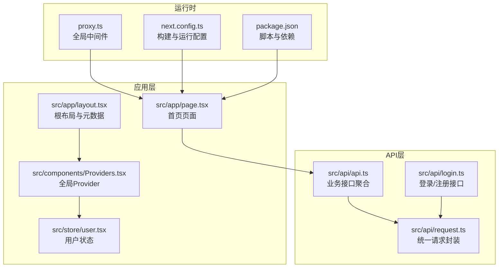
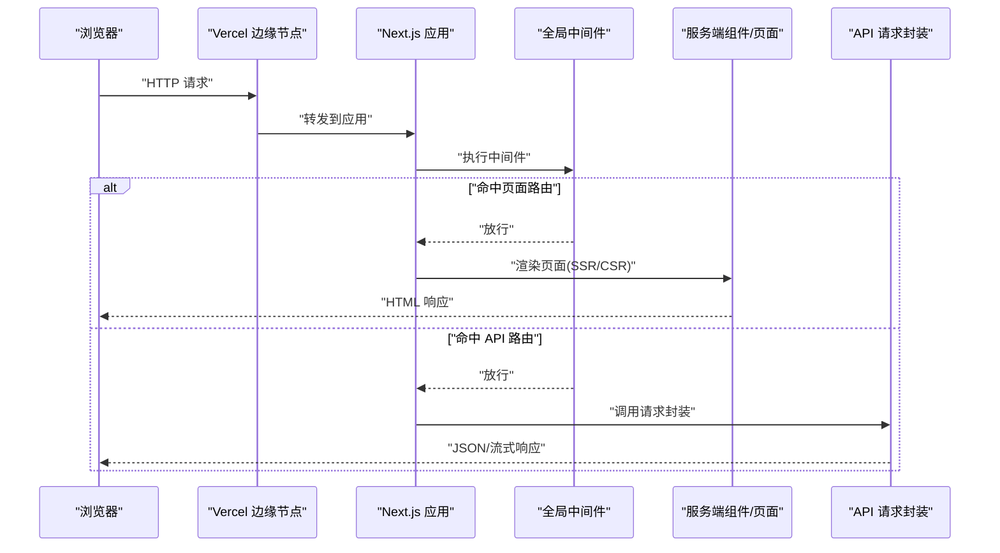
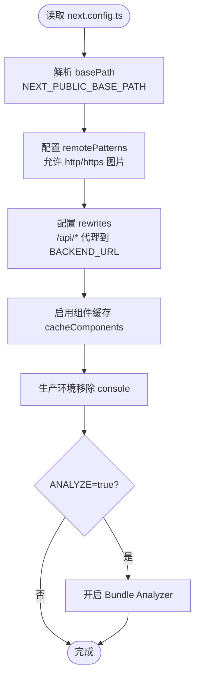
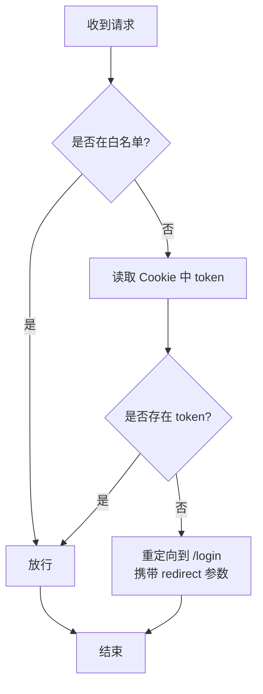
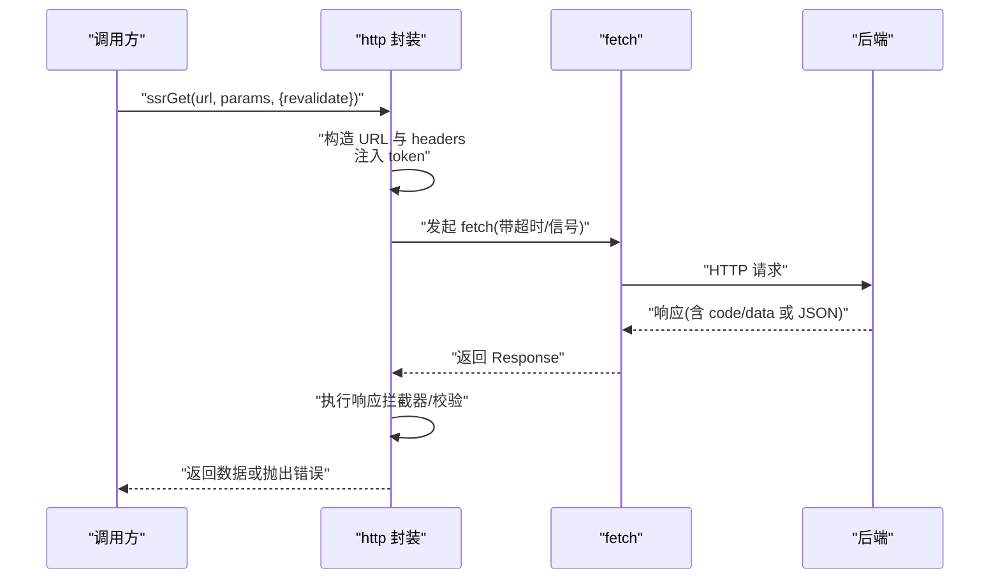
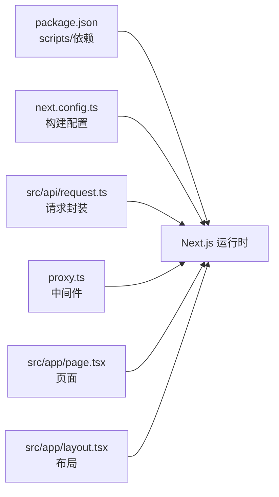

# Vercel部署

<cite>
**本文引用的文件**
- [package.json](file://package.json)
- [next.config.ts](file://next.config.ts)
- [ecosystem.config.cjs](file://ecosystem.config.cjs)
- [README.md](file://README.md)
- [proxy.ts](file://proxy.ts)
- [src/api/request.ts](file://src/api/request.ts)
- [src/api/api.ts](file://src/api/api.ts)
- [src/api/login.ts](file://src/api/login.ts)
- [src/app/layout.tsx](file://src/app/layout.tsx)
- [src/app/page.tsx](file://src/app/page.tsx)
- [src/components/Providers.tsx](file://src/components/Providers.tsx)
- [src/store/user.tsx](file://src/store/user.tsx)
</cite>

## 目录
1. [简介](#简介)
2. [项目结构](#项目结构)
3. [核心组件](#核心组件)
4. [架构总览](#架构总览)
5. [详细组件分析](#详细组件分析)
6. [依赖分析](#依赖分析)
7. [性能考虑](#性能考虑)
8. [故障排查指南](#故障排查指南)
9. [结论](#结论)
10. [附录](#附录)

## 简介
本指南面向在 Vercel 平台上部署 Next.js 应用的工程团队与个人开发者，结合仓库中的实际配置与代码，系统讲解以下主题：
- Vercel 自动部署机制、预览部署与生产部署的区别
- 环境变量配置与构建设置
- 域名绑定与 HTTPS
- 数据库连接与 API 路由处理最佳实践
- 静态资源优化、缓存策略与 CDN 配置
- 性能优化建议与常见问题排查

## 项目结构
该仓库采用 Next.js App Router 的目录结构，核心特性包括：
- 应用根布局与元数据配置
- 页面组件与 Suspense 流式渲染
- API 请求封装与 SSR/CSR 适配
- 全局中间件用于鉴权与路径匹配
- 状态管理与 Provider 组织

**图表来源**
- [src/app/layout.tsx:1-44](file://src/app/layout.tsx#L1-L44)
- [src/app/page.tsx:1-75](file://src/app/page.tsx#L1-L75)
- [src/components/Providers.tsx:1-20](file://src/components/Providers.tsx#L1-L20)
- [src/store/user.tsx:1-56](file://src/store/user.tsx#L1-L56)
- [src/api/request.ts:1-455](file://src/api/request.ts#L1-L455)
- [src/api/api.ts:1-128](file://src/api/api.ts#L1-L128)
- [src/api/login.ts:1-81](file://src/api/login.ts#L1-L81)
- [proxy.ts:1-52](file://proxy.ts#L1-L52)
- [next.config.ts:1-76](file://next.config.ts#L1-L76)
- [package.json:1-39](file://package.json#L1-L39)

**章节来源**
- [package.json:1-39](file://package.json#L1-L39)
- [next.config.ts:1-76](file://next.config.ts#L1-L76)
- [README.md:1-37](file://README.md#L1-L37)

## 核心组件
- 构建与运行配置：通过 next.config.ts 控制 basePath、图片远端来源、API 代理（rewrites）、组件缓存等；同时集成 Bundle Analyzer。
- 请求封装：统一处理 baseURL、Token 注入、超时、拦截器、SSR/CSR 适配与错误处理。
- 全局中间件：基于 Cookie 的鉴权拦截，排除静态资源与 API 路由。
- 页面与布局：根布局设置元数据与视口，首页使用 Suspense 进行流式渲染。

**章节来源**
- [next.config.ts:1-76](file://next.config.ts#L1-L76)
- [src/api/request.ts:1-455](file://src/api/request.ts#L1-L455)
- [proxy.ts:1-52](file://proxy.ts#L1-L52)
- [src/app/layout.tsx:1-44](file://src/app/layout.tsx#L1-L44)
- [src/app/page.tsx:1-75](file://src/app/page.tsx#L1-L75)

## 架构总览
下图展示 Vercel 部署下的请求链路：浏览器发起请求，经过 Vercel CDN 与边缘节点，命中 Next.js App Router 路由，再根据是否为 API 请求或页面渲染进行不同处理；API 请求可能通过 rewrites 代理到外部后端。

**图表来源**
- [proxy.ts:11-33](file://proxy.ts#L11-L33)
- [src/api/request.ts:57-235](file://src/api/request.ts#L57-L235)
- [src/app/page.tsx:18-52](file://src/app/page.tsx#L18-L52)

## 详细组件分析

### 构建与运行配置（next.config.ts）
- basePath：通过 NEXT_PUBLIC_BASE_PATH 控制部署路径，开发与生产可分别设置。
- 图片优化：允许 https/http 任意主机，便于跨域图片加载。
- API 代理（rewrites）：将 /api/* 代理到 BACKEND_URL 指定的后端，实现前端无感知的反向代理。
- 组件缓存：启用 Cache Components，提升组件级缓存效率。
- 编译优化：生产环境移除 console，减少体积与噪音。
- Bundle 分析：可选开启，便于分析包体积构成。

**图表来源**
- [next.config.ts:4-76](file://next.config.ts#L4-L76)

**章节来源**
- [next.config.ts:1-76](file://next.config.ts#L1-L76)

### 全局中间件（proxy.ts）
- 白名单路径：对 /login、/register 直接放行。
- 鉴权逻辑：从 Cookie 读取 token，无 token 则重定向至登录页并携带 redirect 参数。
- 匹配规则：排除静态资源、API 路由与 public/images，避免对静态资源进行鉴权。

**图表来源**
- [proxy.ts:11-33](file://proxy.ts#L11-L33)

**章节来源**
- [proxy.ts:1-52](file://proxy.ts#L1-L52)

### API 请求封装（src/api/request.ts）
- 基础 URL：服务端使用完整 URL（BACKEND_URL），客户端使用相对路径。
- Token 注入：客户端从 localStorage 读取，服务端从 cookies 读取。
- 超时控制：内置 AbortController，支持与外部 signal 合并。
- 错误处理：统一捕获 HTTP 错误、超时与网络错误；401/403 触发登录重定向。
- SSR 适配：提供 ssrGet 方法，支持 no-store、force-cache、revalidate（秒）三种缓存策略。
- 流式响应：支持 SSE/流式响应，返回原生 Response 供业务侧读取。

**图表来源**
- [src/api/request.ts:57-346](file://src/api/request.ts#L57-L346)

**章节来源**
- [src/api/request.ts:1-455](file://src/api/request.ts#L1-L455)

### 业务接口聚合（src/api/api.ts 与 src/api/login.ts）
- 接口分层：将不同模块的 API 聚合，便于维护与复用。
- SSR/CSR 适配：通过 http.ssrGet 提供 SSR 场景的缓存策略选择。
- 代理示例：与 next.config.ts 的 rewrites 协作，隐藏真实后端地址。

**章节来源**
- [src/api/api.ts:1-128](file://src/api/api.ts#L1-L128)
- [src/api/login.ts:1-81](file://src/api/login.ts#L1-L81)

### 页面与布局（src/app/layout.tsx 与 src/app/page.tsx）
- 根布局：设置站点元数据、视口与字体，提供 Providers 容器。
- 首页：使用 Suspense 包裹数据获取组件，实现流式渲染与骨架屏体验。
- 全局状态：通过 Providers 注入 Toast、用户状态与计数器状态。

**章节来源**
- [src/app/layout.tsx:1-44](file://src/app/layout.tsx#L1-L44)
- [src/app/page.tsx:1-75](file://src/app/page.tsx#L1-L75)
- [src/components/Providers.tsx:1-20](file://src/components/Providers.tsx#L1-L20)
- [src/store/user.tsx:1-56](file://src/store/user.tsx#L1-L56)

## 依赖分析
- 项目脚本：dev/build/start 由 Next.js 提供，支持自定义端口。
- 运行时配置：ecosystem.config.cjs 用于 PM2 管理（非 Vercel 必要，但可参考生产环境进程管理）。
- 依赖版本：Next.js 16.x、React 19、TailwindCSS 4、Zustand 状态管理等。

**图表来源**
- [package.json:5-10](file://package.json#L5-L10)
- [next.config.ts:1-76](file://next.config.ts#L1-L76)
- [src/api/request.ts:1-455](file://src/api/request.ts#L1-L455)
- [proxy.ts:1-52](file://proxy.ts#L1-L52)
- [src/app/page.tsx:1-75](file://src/app/page.tsx#L1-L75)
- [src/app/layout.tsx:1-44](file://src/app/layout.tsx#L1-L44)

**章节来源**
- [package.json:1-39](file://package.json#L1-L39)
- [ecosystem.config.cjs:1-20](file://ecosystem.config.cjs#L1-L20)

## 性能考虑
- 组件缓存：启用 Cache Components，减少重复渲染开销。
- SSR 缓存策略：根据页面动态性选择 revalidate 秒数、no-store 或 force-cache。
- 图片优化：remotePatterns 支持跨域图片，结合 Vercel 图片优化能力进一步压缩与懒加载。
- 构建体积：生产移除 console，按需引入第三方库，必要时开启 Bundle Analyzer 分析。
- CDN 与边缘：Vercel 边缘节点就近分发，结合 App Router 的流式渲染与 Suspense，缩短首屏时间。
- 流式响应：SSE/流式接口直接返回 Response，降低内存占用与首包延迟。

[本节为通用性能建议，无需特定文件引用]

## 故障排查指南
- 401/403 未授权：请求封装会自动清除本地 token 并重定向登录；检查 Cookie 中 token 是否存在与有效。
- 跨域图片加载失败：确认 next.config.ts 中 remotePatterns 已包含对应协议与主机。
- API 代理未生效：核对 next.config.ts 的 rewrites 配置与 BACKEND_URL 环境变量。
- 中间件未生效：确认 proxy.ts 的 matcher 是否排除了静态资源与 API 路由。
- SSR 缓存异常：检查 http.ssrGet 的 revalidate 参数与页面是否为 Server Component。

**章节来源**
- [src/api/request.ts:157-235](file://src/api/request.ts#L157-L235)
- [next.config.ts:27-45](file://next.config.ts#L27-L45)
- [proxy.ts:38-51](file://proxy.ts#L38-L51)

## 结论
本指南基于仓库现有配置与代码，梳理了在 Vercel 上部署 Next.js 应用的关键点：通过 next.config.ts 的 rewrites 与 basePath 实现灵活部署与代理；借助全局中间件与请求封装保障鉴权与错误处理；利用 SSR/CSR 的缓存策略与组件缓存提升性能。结合 Vercel 的 CDN 与边缘节点能力，可在保证开发体验的同时获得稳定的线上表现。

[本节为总结性内容，无需特定文件引用]

## 附录

### Vercel 部署步骤与要点
- 自动部署：在 Vercel 控制台关联 Git 仓库，开启自动部署后，主分支推送即触发构建与部署。
- 预览部署：分支推送将生成预览链接，便于联调与评审。
- 生产部署：主分支合并后自动发布，确保构建命令与输出目录正确。
- 环境变量：在 Vercel 仪表板配置环境变量（如 NEXT_PUBLIC_BASE_PATH、BACKEND_URL），与本地 .env 保持一致。
- 构建设置：构建命令使用 package.json 中的 build 脚本；输出目录默认 .next，若修改需同步调整。
- 域名绑定：在 Vercel 添加自定义域名并配置 DNS，启用 HTTPS 证书自动签发。
- CDN 与缓存：Vercel 默认提供全球 CDN 与缓存，结合 next.config.ts 的 revalidate 与组件缓存策略，可进一步优化静态资源与页面缓存。

**章节来源**
- [package.json:5-10](file://package.json#L5-L10)
- [next.config.ts:4-18](file://next.config.ts#L4-L18)
- [README.md:32-37](file://README.md#L32-L37)

### 数据库连接与 API 路由最佳实践
- 数据库连接：在 Vercel 上推荐使用连接池与只读连接，避免在边缘函数中建立长连接；敏感信息通过环境变量注入。
- API 路由：优先使用 App Router 的路由约定，结合 rewrites 代理到外部服务；内部 API 可直接在 app/api 下实现。
- 安全：在中间件中进行鉴权与权限校验，避免敏感数据泄露；对输入参数进行严格校验与限流。

[本节为通用最佳实践，无需特定文件引用]