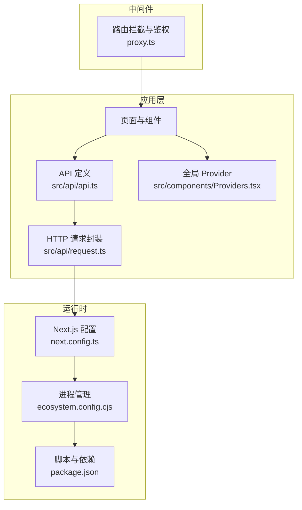
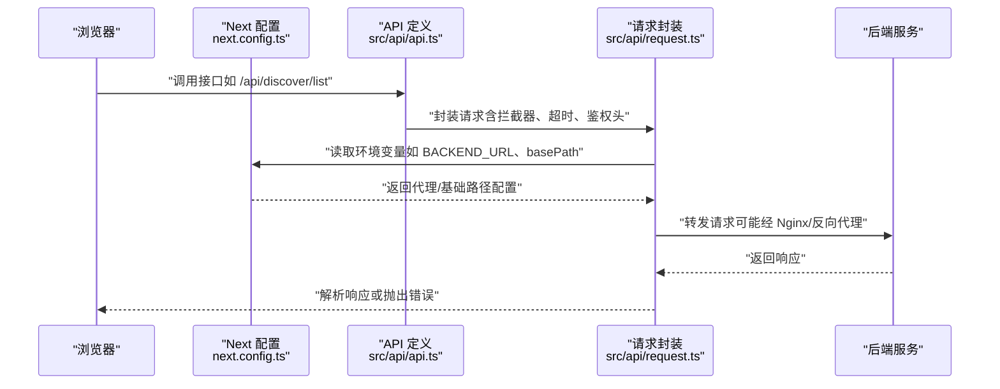
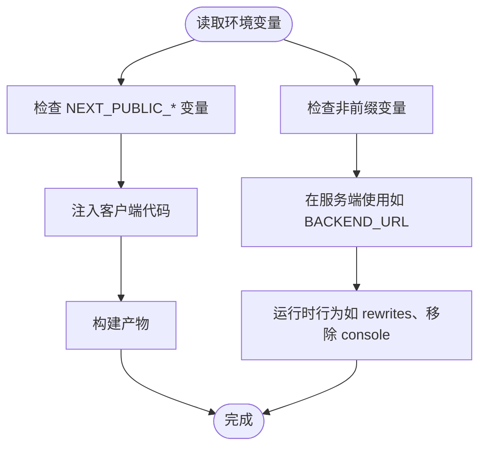
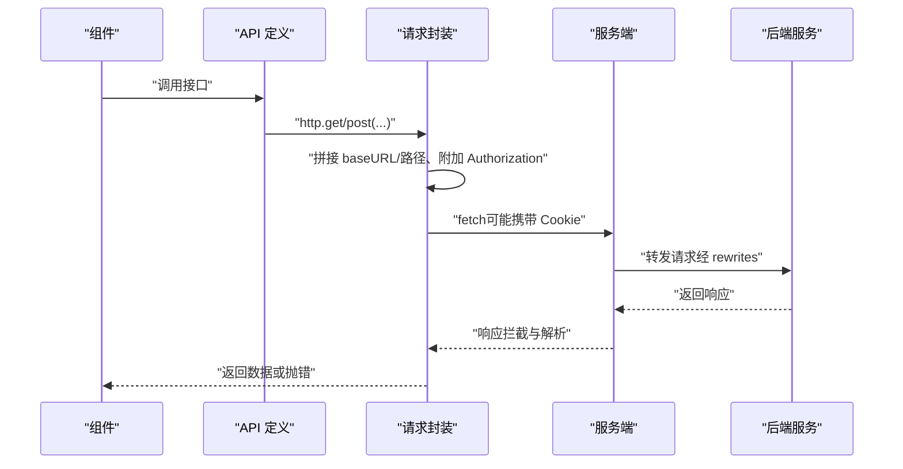
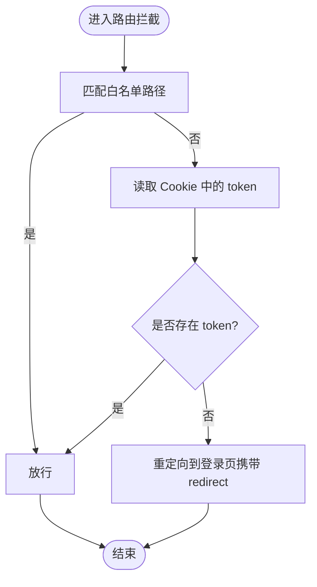
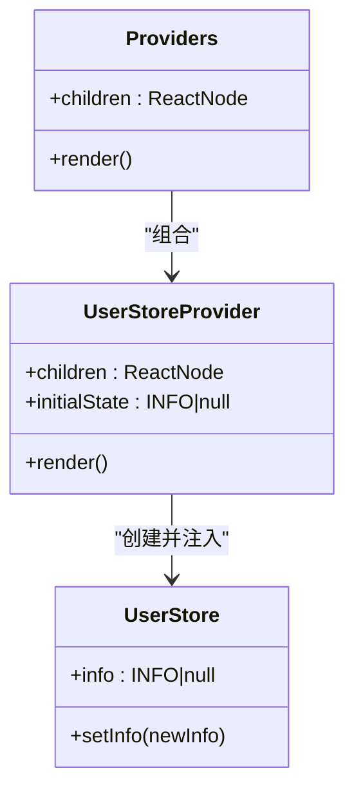
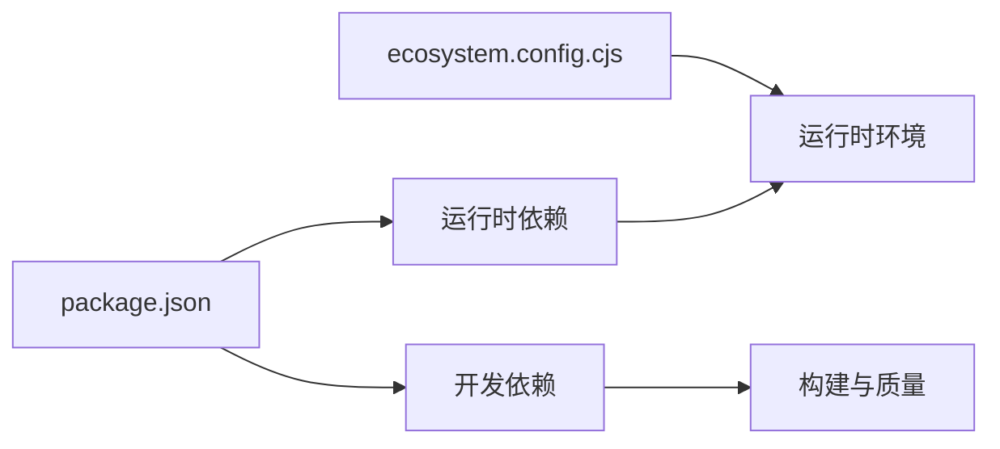

# 环境配置

<cite>
**本文引用的文件**
- [package.json](file://package.json)
- [next.config.ts](file://next.config.ts)
- [ecosystem.config.cjs](file://ecosystem.config.cjs)
- [proxy.ts](file://proxy.ts)
- [src/api/request.ts](file://src/api/request.ts)
- [src/api/api.ts](file://src/api/api.ts)
- [src/components/Providers.tsx](file://src/components/Providers.tsx)
- [src/store/user.tsx](file://src/store/user.tsx)
</cite>

## 目录
1. [简介](#简介)
2. [项目结构](#项目结构)
3. [核心组件](#核心组件)
4. [架构总览](#架构总览)
5. [详细组件分析](#详细组件分析)
6. [依赖分析](#依赖分析)
7. [性能考虑](#性能考虑)
8. [故障排查指南](#故障排查指南)
9. [结论](#结论)
10. [附录](#附录)

## 简介
本指南围绕多环境配置管理展开，结合仓库中的实际实现，系统阐述开发、测试、生产三类环境的配置差异与最佳实践。重点包括：
- 环境变量定义与作用域划分（公共与私有）
- 敏感信息管理策略（令牌、后端地址等）
- 配置文件组织与加载顺序
- 数据库连接字符串、API 密钥与第三方服务配置
- 配置验证、环境检测与动态加载
- 配置热更新、A/B 测试配置与灰度发布的落地方式

## 项目结构
该项目采用 Next.js App Router 架构，配置与运行相关的关键位置如下：
- 应用启动与进程管理：package.json、ecosystem.config.cjs
- 构建与运行时行为：next.config.ts
- 前端请求与代理：src/api/request.ts、src/api/api.ts
- 中间件与路由拦截：proxy.ts
- 全局 Provider 注入：src/components/Providers.tsx
- 状态存储：src/store/user.tsx

**图表来源**
- [next.config.ts:1-76](file://next.config.ts#L1-L76)
- [ecosystem.config.cjs:1-20](file://ecosystem.config.cjs#L1-L20)
- [package.json:1-39](file://package.json#L1-L39)
- [src/api/request.ts:1-455](file://src/api/request.ts#L1-L455)
- [src/api/api.ts:1-128](file://src/api/api.ts#L1-L128)
- [src/components/Providers.tsx:1-20](file://src/components/Providers.tsx#L1-L20)
- [proxy.ts:1-52](file://proxy.ts#L1-L52)

**章节来源**
- [package.json:1-39](file://package.json#L1-L39)
- [next.config.ts:1-76](file://next.config.ts#L1-L76)
- [ecosystem.config.cjs:1-20](file://ecosystem.config.cjs#L1-L20)
- [proxy.ts:1-52](file://proxy.ts#L1-L52)
- [src/api/request.ts:1-455](file://src/api/request.ts#L1-L455)
- [src/api/api.ts:1-128](file://src/api/api.ts#L1-L128)
- [src/components/Providers.tsx:1-20](file://src/components/Providers.tsx#L1-L20)
- [src/store/user.tsx:1-56](file://src/store/user.tsx#L1-L56)

## 核心组件
- 环境变量与运行时配置
  - NEXT_PUBLIC_*：客户端可见的公共变量，如 basePath；用于构建期注入与运行时读取。
  - 非前缀变量：仅在服务端可用，如 BACKEND_URL、NODE_ENV、ANALYZE 等。
- 构建与运行配置
  - next.config.ts：控制 basePath、图片远程模式、API 代理（rewrites）、编译器选项（如移除 console）等。
  - ecosystem.config.cjs：PM2 进程管理，设置 NODE_ENV、端口等。
  - package.json：脚本命令（dev/build/start/lint）与依赖版本。
- 请求与代理
  - src/api/request.ts：统一请求封装，支持 SSR/CSR、拦截器、超时控制、错误处理、流式响应等。
  - src/api/api.ts：按模块组织的接口定义，统一调用 http 封装。
- 中间件与鉴权
  - proxy.ts：基于 Cookie 的全局鉴权与路由拦截，白名单路径放行。

**章节来源**
- [next.config.ts:1-76](file://next.config.ts#L1-L76)
- [ecosystem.config.cjs:1-20](file://ecosystem.config.cjs#L1-L20)
- [package.json:1-39](file://package.json#L1-L39)
- [src/api/request.ts:1-455](file://src/api/request.ts#L1-L455)
- [src/api/api.ts:1-128](file://src/api/api.ts#L1-L128)
- [proxy.ts:1-52](file://proxy.ts#L1-L52)

## 架构总览
下图展示从浏览器到后端服务的请求链路，以及环境变量在不同阶段的作用：

**图表来源**
- [next.config.ts:27-45](file://next.config.ts#L27-L45)
- [src/api/api.ts:42-81](file://src/api/api.ts#L42-L81)
- [src/api/request.ts:35-47](file://src/api/request.ts#L35-L47)
- [src/api/request.ts:57-235](file://src/api/request.ts#L57-L235)

## 详细组件分析

### 组件一：环境变量与运行时配置
- 变量分类与作用域
  - NEXT_PUBLIC_BASE_PATH：影响 basePath，用于生产环境通过 Nginx 代理时的子路径。
  - BACKEND_URL：后端服务地址，用于服务端直连或 API 代理目标。
  - NODE_ENV：控制是否移除 console、构建产物等行为。
  - ANALYZE：开启 Bundle Analyzer 分析。
- 加载顺序与优先级
  - 构建期：NEXT_PUBLIC_* 注入到客户端代码；非前缀变量仅在服务端可用。
  - 运行期：process.env.* 在 Node.js 环境中生效；浏览器端仅能访问 NEXT_PUBLIC_*。
- 环境差异建议
  - 开发：本地 BACKEND_URL 指向本地后端；BASE_PATH 留空；ANALYZE=false。
  - 测试：指向测试后端；开启必要的日志与分析开关。
  - 生产：通过 Nginx 设置 basePath；设置 ANALYZE=false；严格限制日志输出。

**图表来源**
- [next.config.ts](file://next.config.ts#L8)
- [next.config.ts:30-45](file://next.config.ts#L30-L45)
- [next.config.ts:65-68](file://next.config.ts#L65-L68)
- [src/api/request.ts:40-47](file://src/api/request.ts#L40-L47)

**章节来源**
- [next.config.ts:1-76](file://next.config.ts#L1-L76)
- [src/api/request.ts:1-455](file://src/api/request.ts#L1-L455)

### 组件二：API 请求封装与代理
- 统一请求封装
  - 支持 GET/POST/PUT/PATCH/DELETE、查询参数、请求体、超时、拦截器、流式响应。
  - 自动注入 Authorization 头（客户端从 localStorage、服务端从 Cookie）。
  - 统一错误处理：HTTP 错误、超时、网络错误、业务错误。
- 代理与基础路径
  - getBaseURL：服务端使用完整 URL，客户端使用相对路径。
  - rewrites：将 /api/* 代理至 BACKEND_URL，便于前后端分离部署。
- SSR 支持
  - ssrGet：支持 no-store、force-cache、ISR（revalidate）三种缓存策略。

**图表来源**
- [src/api/api.ts:42-81](file://src/api/api.ts#L42-L81)
- [src/api/request.ts:57-235](file://src/api/request.ts#L57-L235)
- [next.config.ts:30-45](file://next.config.ts#L30-L45)

**章节来源**
- [src/api/request.ts:1-455](file://src/api/request.ts#L1-L455)
- [src/api/api.ts:1-128](file://src/api/api.ts#L1-L128)
- [next.config.ts:1-76](file://next.config.ts#L1-L76)

### 组件三：中间件与路由拦截
- 白名单路径：无需登录即可访问。
- 鉴权逻辑：从 Cookie 读取 token，无 token 则重定向至登录页并附带 redirect 参数。
- 匹配规则：排除静态资源、API 路由、public 图片等，避免对静态资源进行鉴权。

**图表来源**
- [proxy.ts:11-33](file://proxy.ts#L11-L33)
- [proxy.ts:39-51](file://proxy.ts#L39-L51)

**章节来源**
- [proxy.ts:1-52](file://proxy.ts#L1-L52)

### 组件四：状态与 Provider
- Providers：在根布局注入全局 Provider，确保 Toast、用户状态、计数器等在整站生效。
- 用户状态：Zustand Store 提供轻量状态管理，支持初始化与选择器读取。

**图表来源**
- [src/components/Providers.tsx:1-20](file://src/components/Providers.tsx#L1-L20)
- [src/store/user.tsx:1-56](file://src/store/user.tsx#L1-L56)

**章节来源**
- [src/components/Providers.tsx:1-20](file://src/components/Providers.tsx#L1-L20)
- [src/store/user.tsx:1-56](file://src/store/user.tsx#L1-L56)

## 依赖分析
- 运行时依赖
  - next、react、react-dom：框架与运行时。
  - @heroui/react、lucide-react、tailwind-*：UI 与样式。
  - zustand：状态管理。
- 开发依赖
  - @next/bundle-analyzer：构建体积分析。
  - tailwindcss、typescript、eslint：构建与质量保障。
- 进程管理
  - ecosystem.config.cjs：PM2 配置，设置 NODE_ENV、端口、自动重启等。

**图表来源**
- [package.json:11-37](file://package.json#L11-L37)
- [ecosystem.config.cjs:1-20](file://ecosystem.config.cjs#L1-L20)

**章节来源**
- [package.json:1-39](file://package.json#L1-L39)
- [ecosystem.config.cjs:1-20](file://ecosystem.config.cjs#L1-L20)

## 性能考虑
- 组件缓存与路由缓存
  - next.config.ts 中启用组件缓存与缓存策略（如 cacheComponents），有助于减少重复渲染与提升首屏性能。
- 构建与打包
  - 使用 Bundle Analyzer（ANALYZE=true）定位大体积模块，优化依赖与拆分。
- 日志与调试
  - 仅在生产环境移除 console，降低运行时开销与敏感信息泄露风险。

**章节来源**
- [next.config.ts:48-68](file://next.config.ts#L48-L68)
- [next.config.ts:71-75](file://next.config.ts#L71-L75)

## 故障排查指南
- 代理与后端地址问题
  - 症状：请求 404 或跨域。
  - 排查：确认 BACKEND_URL 与 rewrites 配置一致；确认 basePath 与 Nginx 代理路径一致。
- 鉴权失败
  - 症状：频繁跳转登录页。
  - 排查：确认 Cookie 中 token 存在且有效；检查中间件白名单与匹配规则。
- 超时与网络错误
  - 症状：请求超时或网络异常。
  - 排查：调整超时时间；检查后端可达性与防火墙；查看拦截器是否正确附加 Authorization。
- 构建体积过大
  - 症状：构建时间长、产物体积大。
  - 排查：开启 ANALYZE=true 分析依赖；按需引入 UI 组件与第三方库。

**章节来源**
- [next.config.ts:27-45](file://next.config.ts#L27-L45)
- [src/api/request.ts:130-235](file://src/api/request.ts#L130-L235)
- [proxy.ts:11-33](file://proxy.ts#L11-L33)

## 结论
本项目通过明确的环境变量分层、严格的前后端分离代理、统一的请求封装与中间件鉴权，形成了可扩展、可维护的多环境配置体系。建议在实际落地中补充：
- 明确的 .env 文件模板与校验流程
- 配置热更新与灰度发布方案（如基于 Cookie/Header 的实验标识）
- A/B 测试配置的集中化管理与回滚策略

## 附录

### 环境变量清单与用途
- NEXT_PUBLIC_BASE_PATH：控制 basePath，生产环境通过 Nginx 代理时使用。
- BACKEND_URL：后端服务地址，用于服务端直连或 API 代理目标。
- NODE_ENV：控制构建与运行行为（如移除 console）。
- ANALYZE：开启 Bundle Analyzer 分析。
- PORT：进程监听端口（PM2 配置）。

**章节来源**
- [next.config.ts](file://next.config.ts#L8)
- [next.config.ts:30-45](file://next.config.ts#L30-L45)
- [next.config.ts:65-68](file://next.config.ts#L65-L68)
- [ecosystem.config.cjs:13-16](file://ecosystem.config.cjs#L13-L16)

### 配置验证与环境检测建议
- 构建期校验：在 next.config.ts 中对关键变量进行断言与默认值处理。
- 运行期校验：在请求封装中对 BACKEND_URL、BASE_PATH 进行有效性检查。
- 环境检测：通过 NODE_ENV 与 ANALYZE 判断当前环境与分析开关。

**章节来源**
- [src/api/request.ts:40-47](file://src/api/request.ts#L40-L47)
- [next.config.ts:65-68](file://next.config.ts#L65-L68)

### 动态配置加载与热更新
- 动态加载：在服务端组件中通过 ssrGet 的 revalidate 参数实现动态/缓存策略切换。
- 热更新：通过 PM2 的自动重启与环境变量变更实现平滑更新。

**章节来源**
- [src/api/request.ts:309-333](file://src/api/request.ts#L309-L333)
- [ecosystem.config.cjs:10-12](file://ecosystem.config.cjs#L10-L12)

### A/B 测试与灰度发布
- A/B 标识：通过 Cookie/Header 注入实验标识，后端据此返回不同配置或功能开关。
- 灰度发布：结合 Nginx 的流量切分与后端的实验标识，逐步扩大流量比例。

[本节为概念性指导，不直接对应具体源文件]