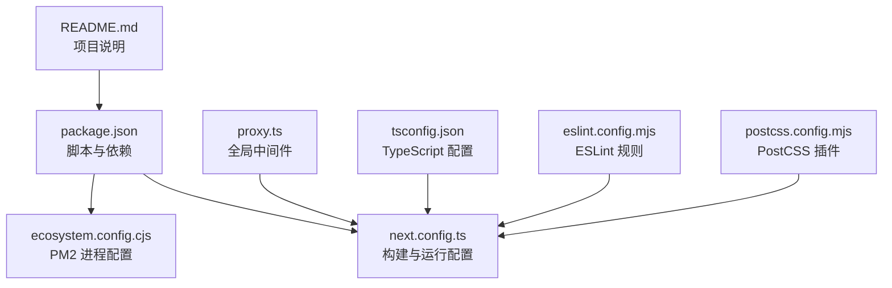
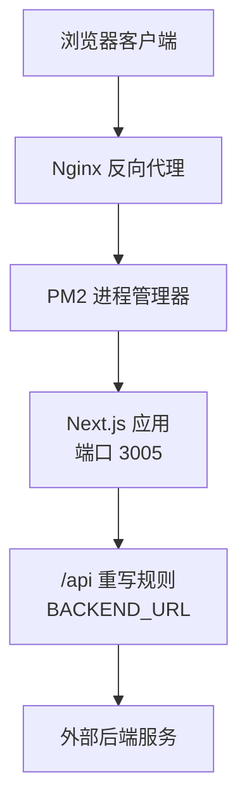
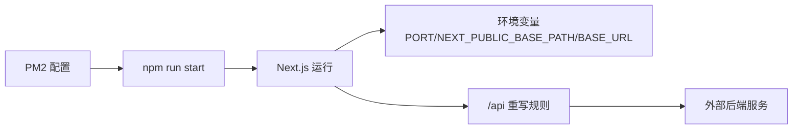

# 自托管部署

<cite>
**本文引用的文件**
- [package.json](file://package.json)
- [ecosystem.config.cjs](file://ecosystem.config.cjs)
- [next.config.ts](file://next.config.ts)
- [proxy.ts](file://proxy.ts)
- [README.md](file://README.md)
- [tsconfig.json](file://tsconfig.json)
- [eslint.config.mjs](file://eslint.config.mjs)
- [postcss.config.mjs](file://postcss.config.mjs)
</cite>

## 目录
1. [简介](#简介)
2. [项目结构](#项目结构)
3. [核心组件](#核心组件)
4. [架构总览](#架构总览)
5. [详细组件分析](#详细组件分析)
6. [依赖关系分析](#依赖关系分析)
7. [性能考虑](#性能考虑)
8. [故障排查指南](#故障排查指南)
9. [结论](#结论)
10. [附录](#附录)

## 简介
本指南面向希望将该 Next.js 应用部署到自托管服务器的工程师与运维人员。内容覆盖 PM2 进程管理器配置、Node.js 应用启动与环境变量设置、服务器环境准备、依赖安装与端口配置、Nginx 反向代理与 SSL 证书配置、负载均衡策略、进程监控与日志管理、自动重启机制、安全配置、防火墙设置以及备份策略等。文档基于仓库中的现有配置文件进行梳理与扩展，帮助读者快速完成生产级部署。

## 项目结构
该项目采用 Next.js 16 App Router 结构，核心运行脚本与配置集中在以下文件中：
- 应用启动与构建脚本：package.json
- PM2 进程管理配置：ecosystem.config.cjs
- Next.js 构建与运行配置：next.config.ts
- 全局中间件（路由拦截与鉴权示例）：proxy.ts
- TypeScript、ESLint、PostCSS 配置：tsconfig.json、eslint.config.mjs、postcss.config.mjs
- 项目说明：README.md

图表来源
- [package.json:1-39](file://package.json#L1-L39)
- [next.config.ts:1-76](file://next.config.ts#L1-L76)
- [ecosystem.config.cjs:1-20](file://ecosystem.config.cjs#L1-L20)
- [proxy.ts:1-52](file://proxy.ts#L1-L52)
- [tsconfig.json:1-35](file://tsconfig.json#L1-L35)
- [eslint.config.mjs:1-19](file://eslint.config.mjs#L1-L19)
- [postcss.config.mjs:1-8](file://postcss.config.mjs#L1-L8)
- [README.md:1-37](file://README.md#L1-L37)

章节来源
- [package.json:1-39](file://package.json#L1-L39)
- [next.config.ts:1-76](file://next.config.ts#L1-L76)
- [ecosystem.config.cjs:1-20](file://ecosystem.config.cjs#L1-L20)
- [proxy.ts:1-52](file://proxy.ts#L1-L52)
- [tsconfig.json:1-35](file://tsconfig.json#L1-L35)
- [eslint.config.mjs:1-19](file://eslint.config.mjs#L1-L19)
- [postcss.config.mjs:1-8](file://postcss.config.mjs#L1-L8)
- [README.md:1-37](file://README.md#L1-L37)

## 核心组件
- 应用启动与构建脚本
  - 开发模式：通过 scripts.dev 指定端口并启动开发服务器
  - 生产模式：通过 scripts.build 执行构建，scripts.start 以指定端口启动生产服务器
- PM2 进程管理
  - 使用 ecosystem.config.cjs 定义应用名称、执行脚本、工作目录、执行模式、自动重启、内存重启阈值及环境变量（NODE_ENV、PORT）
- Next.js 配置
  - basePath 支持通过 NEXT_PUBLIC_BASE_PATH 控制部署路径
  - rewrites 提供 /api 前缀代理至 BACKEND_URL 指定的外部后端
  - 编译器选项支持生产环境移除 console 输出
  - Bundle Analyzer 可通过 ANALYZE=true 启用
- 全局中间件
  - proxy.ts 提供基础的路由拦截与鉴权逻辑（白名单路径、Cookie Token 校验、重定向到登录页）

章节来源
- [package.json:5-10](file://package.json#L5-L10)
- [ecosystem.config.cjs:1-20](file://ecosystem.config.cjs#L1-L20)
- [next.config.ts:4-68](file://next.config.ts#L4-L68)
- [proxy.ts:11-33](file://proxy.ts#L11-L33)

## 架构总览
下图展示了从浏览器到应用、再到外部后端服务的典型请求链路，以及 PM2 管理进程的角色。

图表来源
- [ecosystem.config.cjs:4-16](file://ecosystem.config.cjs#L4-L16)
- [next.config.ts:30-44](file://next.config.ts#L30-L44)

## 详细组件分析

### PM2 进程管理器配置
- 应用名称与脚本
  - name：应用标识
  - script：进程入口（此处为 npm）
  - args：启动参数（run start）
  - cwd：工作目录
- 执行模式与重启策略
  - exec_mode：fork 模式（适合 ESM 项目或通过 npm 启动）
  - autorestart：启用自动重启
  - watch：关闭文件监听（生产环境建议关闭）
  - max_memory_restart：内存阈值触发重启
- 环境变量
  - NODE_ENV：生产环境
  - PORT：应用监听端口 3005

章节来源
- [ecosystem.config.cjs:1-20](file://ecosystem.config.cjs#L1-L20)

### Node.js 应用启动与环境变量
- 启动脚本
  - 开发：scripts.dev 指定端口启动
  - 生产：scripts.start 以指定端口启动
- 环境变量
  - NEXT_PUBLIC_BASE_PATH：控制 basePath（用于 Nginx 代理场景）
  - BACKEND_URL：控制 /api 重写目标地址
  - NODE_ENV：控制编译器行为（生产环境移除 console）
  - ANALYZE：控制是否启用 Bundle Analyzer
  - PORT：应用监听端口（PM2 中已设置）

章节来源
- [package.json:5-10](file://package.json#L5-L10)
- [next.config.ts:7-8](file://next.config.ts#L7-L8)
- [next.config.ts:35-36](file://next.config.ts#L35-L36)
- [next.config.ts:66-67](file://next.config.ts#L66-L67)
- [next.config.ts:71-73](file://next.config.ts#L71-L73)
- [ecosystem.config.cjs:13-16](file://ecosystem.config.cjs#L13-L16)

### 服务器环境准备与依赖安装
- 系统要求
  - Node.js 版本与包管理器（npm/yarn/pnpm/bun）
  - PM2 全局安装（用于进程管理）
- 依赖安装
  - 使用包管理器安装项目依赖
  - 构建生产包：执行 scripts.build
- 端口配置
  - 应用默认监听端口 3005（PM2 中已设置）
  - 如需变更，可在 PM2 配置中调整 PORT 并确保防火墙放行

章节来源
- [package.json:5-10](file://package.json#L5-L10)
- [ecosystem.config.cjs:13-16](file://ecosystem.config.cjs#L13-L16)
- [README.md:5-15](file://README.md#L5-L15)

### Nginx 反向代理与 SSL 证书配置
- 反向代理
  - 将域名流量转发至 PM2 管理的应用进程（端口 3005）
  - 支持 basePath 场景（如 /app/），需在 next.config.ts 中设置 NEXT_PUBLIC_BASE_PATH
- SSL 证书
  - 建议使用 Let’s Encrypt 获取免费证书
  - 配置 HTTPS 监听与证书路径
- 负载均衡策略
  - 单实例：直接代理到单一应用进程
  - 多实例：在同一主机上多进程监听不同端口，或跨主机部署多个实例并通过上游组聚合

章节来源
- [next.config.ts:6-8](file://next.config.ts#L6-L8)

### 日志管理与自动重启机制
- 日志管理
  - PM2 提供内置日志轮转与查看能力
  - 可结合系统日志服务（如 systemd journald、rsyslog）集中收集
- 自动重启
  - PM2 配置中已启用 autorestart
  - max_memory_restart 设置内存阈值触发重启，避免内存泄漏导致的服务不可用

章节来源
- [ecosystem.config.cjs:10-12](file://ecosystem.config.cjs#L10-L12)

### 安全配置与防火墙设置
- 环境变量安全
  - 严格区分 NEXT_PUBLIC_*（前端可见）与非前缀环境变量（服务端私密）
  - 避免在客户端组件中导入或使用未带前缀的敏感变量
- 中间件与鉴权
  - proxy.ts 提供基础的白名单路径与 Cookie Token 校验
  - 建议结合更完善的认证体系（如 JWT、OAuth）与权限控制
- 防火墙
  - 仅开放 Nginx（80/443）与 SSH（22）端口
  - 应用端口 3005 仅对本地或内网访问，必要时通过 Nginx 代理

章节来源
- [proxy.ts:4-33](file://proxy.ts#L4-L33)
- [doc\next16-面试重难点.md:38-44](file://doc\next16-面试重难点.md#L38-L44)

### 备份策略
- 应用代码与配置
  - 版本控制（Git）+ 备份分支策略
- 数据备份
  - 如应用涉及数据库或持久化存储，制定定期备份计划与异地容灾
- 配置备份
  - PM2 配置、Nginx 配置、SSL 证书等重要文件单独归档

章节来源
- [README.md:32-37](file://README.md#L32-L37)

## 依赖关系分析
- 应用启动链路
  - PM2 启动 npm run start → Next.js 读取环境变量 → 构建与运行
- 配置耦合点
  - PORT 在 PM2 与 package.json 中均需保持一致
  - basePath 与 Nginx 代理路径需匹配
  - /api 重写依赖 BACKEND_URL

图表来源
- [ecosystem.config.cjs:4-16](file://ecosystem.config.cjs#L4-L16)
- [package.json:8](file://package.json#L8)
- [next.config.ts:7-8](file://next.config.ts#L7-L8)
- [next.config.ts:35-36](file://next.config.ts#L35-L36)

章节来源
- [ecosystem.config.cjs:1-20](file://ecosystem.config.cjs#L1-L20)
- [package.json:5-10](file://package.json#L5-L10)
- [next.config.ts:4-68](file://next.config.ts#L4-L68)

## 性能考虑
- 组件缓存
  - 启用 cacheComponents 以提升渲染性能
- 构建优化
  - 生产环境移除 console 输出，减少包体积
  - 可选启用 Bundle Analyzer 分析包体构成
- 运行时优化
  - 合理设置 max_memory_restart 防止内存泄漏
  - 使用 Nginx 压缩与缓存静态资源

章节来源
- [next.config.ts:58](file://next.config.ts#L58)
- [next.config.ts:66-67](file://next.config.ts#L66-L67)
- [next.config.ts:71-73](file://next.config.ts#L71-L73)

## 故障排查指南
- 应用无法启动
  - 检查 PM2 配置中的 PORT 是否与 package.json 中的 start 端口一致
  - 确认依赖安装与构建成功
- 访问 404 或路径异常
  - 检查 basePath 与 Nginx 代理路径是否一致
  - 确认 /api 重写规则与 BACKEND_URL 配置
- 登录鉴权问题
  - 检查 proxy.ts 中白名单路径与 Cookie Token 是否正确
- 性能问题
  - 查看 PM2 日志与内存使用情况，调整 max_memory_restart
  - 使用 Bundle Analyzer 分析包体

章节来源
- [ecosystem.config.cjs:13-16](file://ecosystem.config.cjs#L13-L16)
- [next.config.ts:6-8](file://next.config.ts#L6-L8)
- [next.config.ts:35-36](file://next.config.ts#L35-L36)
- [proxy.ts:4-33](file://proxy.ts#L4-L33)

## 结论
本指南基于仓库现有配置，给出了自托管部署的完整流程与最佳实践。通过 PM2 管理进程、合理设置环境变量、配置 Nginx 反向代理与 SSL 证书、实施安全与防火墙策略以及建立日志与备份机制，可以实现稳定可靠的生产部署。建议在上线前完成充分测试与演练，确保各组件协同工作。

## 附录
- 快速检查清单
  - 安装 Node.js 与 PM2
  - 安装项目依赖并执行构建
  - 配置 PM2 环境变量（NODE_ENV、PORT）
  - 配置 Nginx 反向代理与 SSL 证书
  - 设置防火墙与安全策略
  - 启动 PM2 并验证访问
  - 配置日志与备份策略