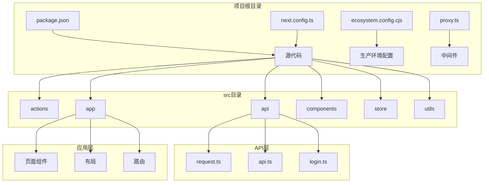
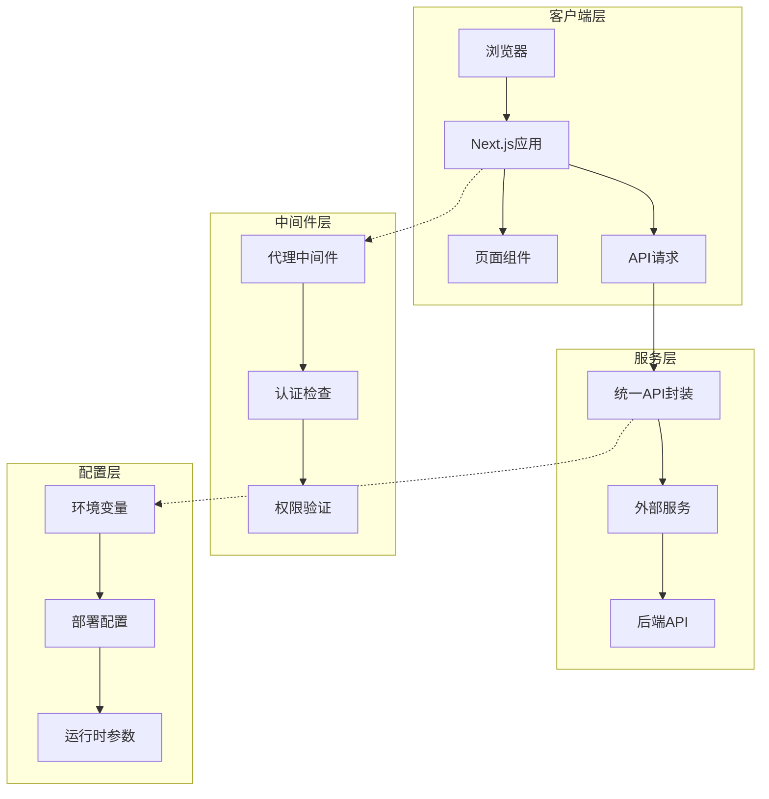
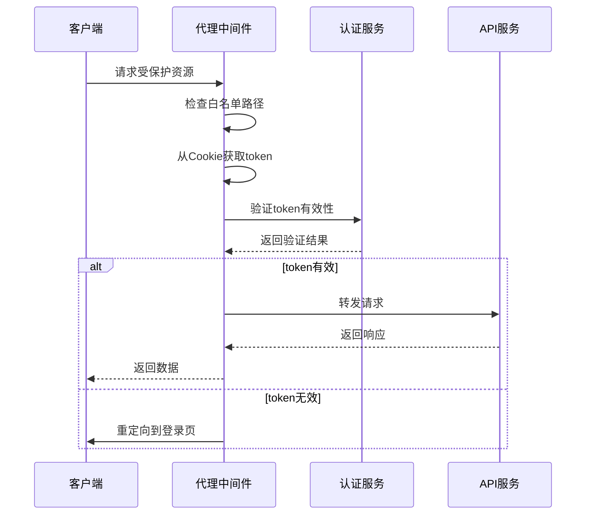
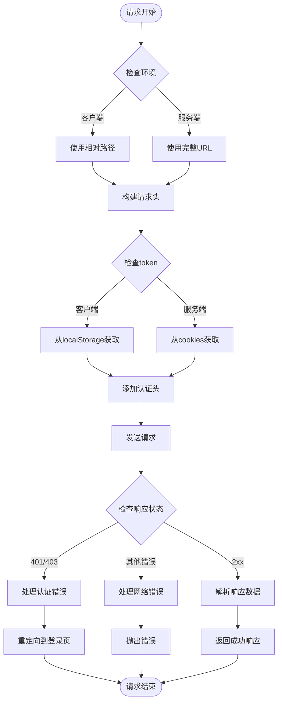
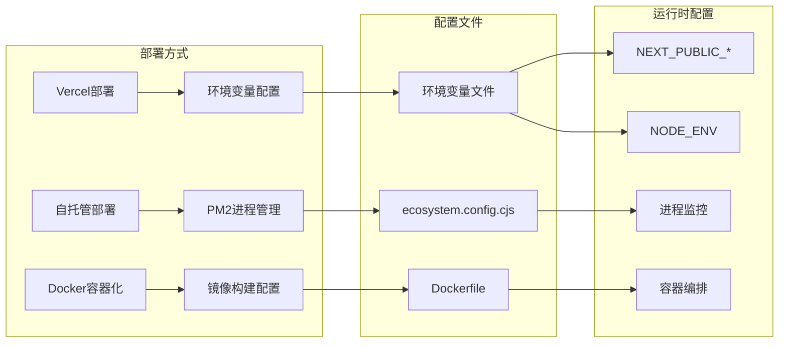
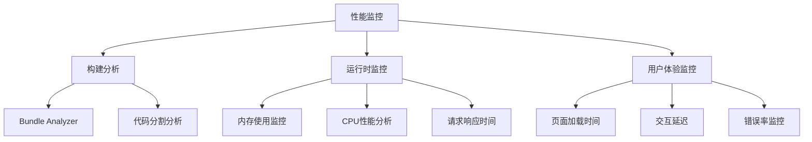

# 部署指南

<cite>
**本文档引用的文件**
- [package.json](file://package.json)
- [next.config.ts](file://next.config.ts)
- [ecosystem.config.cjs](file://ecosystem.config.cjs)
- [proxy.ts](file://proxy.ts)
- [src/api/request.ts](file://src/api/request.ts)
- [src/api/api.ts](file://src/api/api.ts)
- [src/api/login.ts](file://src/api/login.ts)
- [README.md](file://README.md)
</cite>

## 目录
1. [简介](#简介)
2. [项目结构](#项目结构)
3. [核心组件](#核心组件)
4. [架构概览](#架构概览)
5. [详细组件分析](#详细组件分析)
6. [依赖关系分析](#依赖关系分析)
7. [性能考虑](#性能考虑)
8. [故障排除指南](#故障排除指南)
9. [结论](#结论)

## 简介

本指南提供了完整的应用部署解决方案，涵盖Vercel云部署、自托管服务器配置和Docker容器化部署三种方式。项目基于Next.js 16框架构建，采用TypeScript开发，具有现代化的前端架构和灵活的部署选项。

## 项目结构

项目采用标准的Next.js 16应用结构，主要目录包括：



**图表来源**
- [package.json:1-39](file://package.json#L1-L39)
- [next.config.ts:1-76](file://next.config.ts#L1-L76)

**章节来源**
- [package.json:1-39](file://package.json#L1-L39)
- [next.config.ts:1-76](file://next.config.ts#L1-L76)

## 核心组件

### 构建配置系统

项目使用Next.js 16的现代化配置系统，支持多种部署场景：

- **基础路径配置**: 支持通过环境变量控制basePath，便于反向代理部署
- **图像优化**: 配置远程图像源，支持HTTPS和HTTP协议
- **缓存优化**: 启用Cache Components功能，提升组件渲染性能
- **API代理**: 内置rewrites配置，支持外部后端服务代理

### 请求处理系统

统一的API请求封装提供了完整的HTTP通信能力：

- **类型安全**: 完整的TypeScript类型定义
- **环境适配**: 自动区分客户端和服务端环境
- **认证支持**: 自动处理token注入和认证头
- **错误处理**: 统一的错误处理和业务逻辑分离

**章节来源**
- [next.config.ts:4-69](file://next.config.ts#L4-L69)
- [src/api/request.ts:11-261](file://src/api/request.ts#L11-L261)

## 架构概览

应用采用分层架构设计，确保了良好的可维护性和扩展性：



**图表来源**
- [proxy.ts:11-33](file://proxy.ts#L11-L33)
- [src/api/request.ts:40-146](file://src/api/request.ts#L40-L146)

## 详细组件分析

### 代理中间件组件

代理中间件实现了全局路由拦截和鉴权功能：



**图表来源**
- [proxy.ts:11-33](file://proxy.ts#L11-L33)

#### 关键特性

- **白名单机制**: 支持配置无需认证的公共路径
- **Cookie认证**: 自动从Cookie中提取和验证token
- **智能重定向**: 记录原始请求路径，登录后自动跳转
- **路径匹配**: 精确的路由匹配规则，排除静态资源

**章节来源**
- [proxy.ts:1-52](file://proxy.ts#L1-L52)

### API请求封装组件

统一的API请求封装提供了完整的HTTP通信能力：



**图表来源**
- [src/api/request.ts:57-235](file://src/api/request.ts#L57-L235)

#### 核心功能

- **环境适配**: 自动区分客户端和服务端环境
- **类型安全**: 完整的TypeScript类型定义
- **错误处理**: 统一的错误处理机制
- **超时控制**: 内置请求超时机制
- **拦截器**: 支持请求和响应拦截器

**章节来源**
- [src/api/request.ts:1-455](file://src/api/request.ts#L1-L455)

### 部署配置组件

项目支持多种部署方式，每种方式都有相应的配置文件：



**图表来源**
- [ecosystem.config.cjs:1-20](file://ecosystem.config.cjs#L1-L20)
- [package.json:5-10](file://package.json#L5-L10)

**章节来源**
- [ecosystem.config.cjs:1-20](file://ecosystem.config.cjs#L1-L20)
- [package.json:1-39](file://package.json#L1-L39)

## 依赖关系分析

项目的核心依赖关系如下：

```mermaid
graph TB
subgraph "运行时依赖"
A[next] --> B[React 19]
A --> C[React DOM 19]
D[heroui-react] --> B
E[zustand] --> B
end
subgraph "开发依赖"
F[@next/bundle-analyzer] --> A
G[typescript] --> H[类型定义]
I[tailwindcss] --> J[样式处理]
end
subgraph "UI组件"
D --> K[Gravity UI Icons]
D --> L[Heroui Native]
end
subgraph "构建工具"
G --> M[ESLint]
I --> N[PostCSS]
end
```

**图表来源**
- [package.json:11-37](file://package.json#L11-L37)

**章节来源**
- [package.json:1-39](file://package.json#L1-L39)

## 性能考虑

### 缓存策略

项目采用了多层次的缓存优化策略：

- **组件缓存**: 启用Cache Components功能，提升组件渲染性能
- **路由缓存**: 支持静态和动态路由的不同缓存策略
- **图像优化**: 自动优化和懒加载图像资源
- **构建优化**: 使用Bundle Analyzer监控包大小

### 性能监控



**章节来源**
- [next.config.ts:47-69](file://next.config.ts#L47-L69)

## 故障排除指南

### 常见部署问题

#### Vercel部署问题

1. **构建失败**
   - 检查环境变量配置
   - 验证package.json中的脚本命令
   - 确认Node.js版本兼容性

2. **运行时错误**
   - 检查NEXT_PUBLIC_*环境变量
   - 验证API端点可达性
   - 确认数据库连接配置

#### 自托管部署问题

1. **进程管理问题**
   - 检查PM2配置文件
   - 验证端口占用情况
   - 确认进程重启策略

2. **环境变量问题**
   - 验证.env文件配置
   - 检查权限设置
   - 确认变量格式正确

#### Docker部署问题

1. **镜像构建问题**
   - 检查Dockerfile语法
   - 验证依赖安装过程
   - 确认工作目录设置

2. **容器运行问题**
   - 检查端口映射配置
   - 验证卷挂载设置
   - 确认健康检查配置

**章节来源**
- [ecosystem.config.cjs:13-16](file://ecosystem.config.cjs#L13-L16)
- [README.md:32-37](file://README.md#L32-L37)

## 结论

本部署指南提供了完整的应用部署解决方案，涵盖了现代Web应用的各种部署需求。通过合理配置环境变量、API连接和第三方服务集成，可以实现稳定可靠的生产环境部署。

关键要点包括：
- 灵活的部署选项支持Vercel、自托管和Docker
- 完善的认证和授权机制
- 优化的性能配置和监控
- 全面的故障排除指导

建议根据具体业务需求选择合适的部署方式，并结合监控和日志管理建立完善的运维体系。